# SPIQA test-A (Part 1 of 4)
Papers in this part: 30

---
## Paper: 1603.00286v5
Semantic Scholar ID: 1603.00286v5

### Figures/Tables (6)
**1603.00286v5-Figure1-1.png**

- Caption: Fig. 1 With geometric constraints, an efficient allocation might leave some cake unallocated. All figures were made with GeoGebra 5 (Hohenwarter et al., 2013).
- Content type: figure
- Figure type: ** Schematic

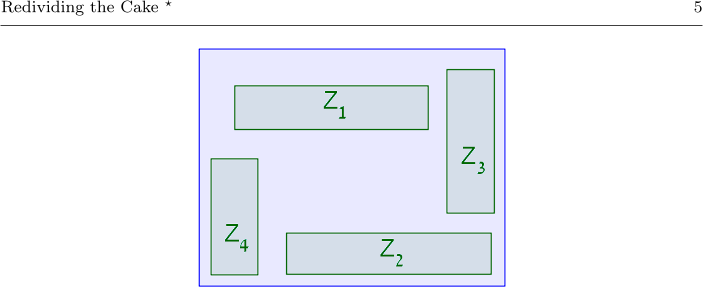

**1603.00286v5-Figure2-1.png**

- Caption: Fig. 2 A rectilinear polygon with T = 4 reflex vertices (circled).
- Content type: figure
- Figure type: schematic

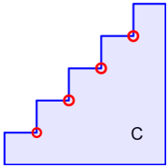

**1603.00286v5-Figure3-1.png**

- Caption: Fig. 3 Solid boxes represent the value-density of agent j within Zj ; each dotted box represents a value-density of some other agent in the same group as agent j. In this example, dn d e = 5.
- Content type: figure
- Figure type: schematic

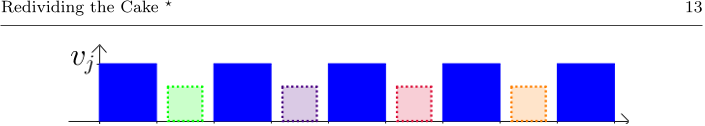

**1603.00286v5-Figure4-1.png**

- Caption: Fig. 4 Allocation-completion with n = 4 original pieces and b = 1 blank, denoted Z′5.
- Content type: figure
- Figure type: schematic

**1603.00286v5-Figure5-1.png**

- Caption: Fig. 5 The points in the blue trapezoid are mapped to the points on the blue interval at the bottom side of the polygon; each point in the trapezoid is mapped to the point just below it, which is the point nearest to it on the polygon perimeter.
- Content type: figure
- Figure type: schematic

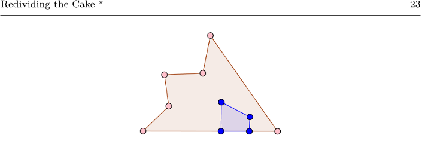

**1603.00286v5-Table1-1.png**

- Caption: Table 1 Worst-case number of blanks in a maximal arrangement of pairwise-disjoint Spieces contained in a cake C. From Akopyan and Segal-Halevi (2018).
- Content type: table
- Figure type: N/A

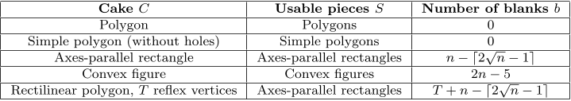

### QAs (5)
**QA 1**

- Question: Which agent values the entire share $Z_j$?
- Answer: Agent $j$.
- Rationale: The passage states that agent $j$ values $Z_j$ at $\lceil{n\over d}\rceil$, and the rest of the cake at $0$. This means that agent $j$ values the entire share $Z_j$. The figure shows that the value-density of agent $j$ is positive within the entire share $Z_j$, which is consistent with the passage.
- References: 1603.00286v5-Figure3-1.png

Referenced images:

**QA 2**

- Question: What is the purpose of the blank space labeled Z'5?
- Answer: The blank space labeled Z'5 is used to complete the allocation of the original pieces.
- Rationale: The figure shows how the original pieces (labeled Z1-Z4) can be allocated to the blank space (labeled Z'5) in order to complete the puzzle.
- References: 1603.00286v5-Figure4-1.png

Referenced images:

**QA 3**

- Question: What can you say about the relationship between the complexity of a cake shape and the minimum number of blanks required for a complete partition into smaller pieces?
- Answer: The complexity of the cake shape generally leads to a higher minimum number of blanks required for a complete partition.
- Rationale: Table 1 shows that simple shapes like polygons and simple polygons (without holes) require no blanks for a complete partition. However, as the complexity increases, like in axes-parallel rectangles, convex figures, and rectilinear polygons with reflex vertices, the minimum number of blanks also increases. This suggests that more complex shapes necessitate more blanks to achieve a complete partition into smaller pieces.
- References: 1603.00286v5-Table1-1.png

Referenced images:

**QA 4**

- Question: Why does the author state that there is a qualitative difference between 2-D and 1-D division?
- Answer: In 2-D division, there may be unallocated cake even when there are geometric constraints on the pieces, as shown in Figure 1. This is not the case in 1-D division, where the entire cake can always be allocated.
- Rationale: Figure 1 shows an example of a 2-D cake where there is unallocated cake even though the pieces must be rectangles. This is because the geometric constraints on the pieces prevent them from being placed in such a way that the entire cake is allocated. This qualitative difference between 2-D and 1-D division is important to note, as it can lead to paradoxes that are not present in 1-D division.
- References: 1603.00286v5-Figure1-1.png

Referenced images:

**QA 5**

- Question: What is the minimum number of sides that a rectilinear polygon with four reflex vertices must have?
- Answer: Six.
- Rationale: A reflex vertex is a vertex with an interior angle greater than 180 degrees. In a rectilinear polygon, each vertex is either a right angle or a reflex angle. Therefore, the minimum number of sides that a rectilinear polygon with four reflex vertices must have is six, as shown in the figure.
- References: 1603.00286v5-Figure2-1.png

Referenced images:

---
## Paper: 1608.02784v2
Semantic Scholar ID: 1608.02784v2

### Figures/Tables (9)
**1608.02784v2-Figure1-1.png**

- Caption: The CCA learning algorithm.
- Content type: figure
- Figure type: Schematic

**1608.02784v2-Figure2-1.png**

- Caption: Figure 2: Demonstration of CCA inference. An object from the input space X (the image on the left x) is mapped to a unit vector. Then, we find the closest unit vector which has an embodiment in the output space, Y . That embodiment is the text on the right, y. It also also holds that ρ(u(x), v(y)) = cos θ.
- Content type: figure
- Figure type: schematic

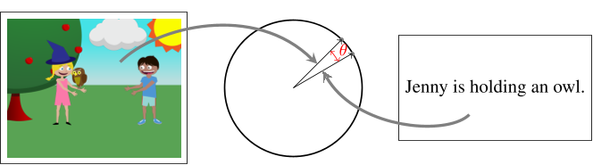

**1608.02784v2-Figure3-1.png**

- Caption: The CCA decoding algorithm.
- Content type: figure
- Figure type: schematic

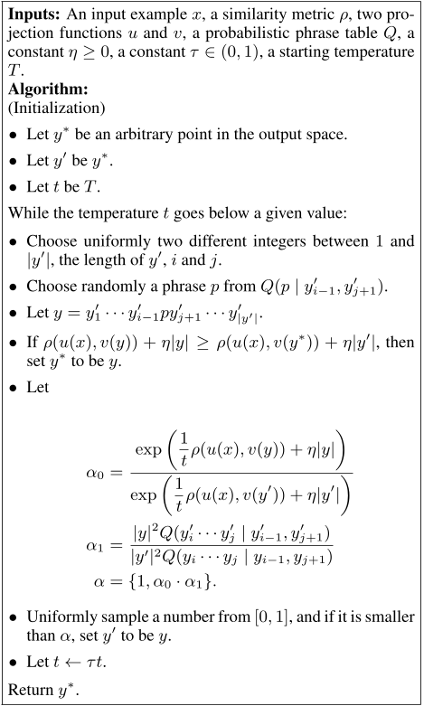

**1608.02784v2-Figure4-1.png**

- Caption: Figure 4: Scatter plot of SMT (statistical machine translation) and CCA BLEU scores versus human ratings.
- Content type: figure
- Figure type: plot

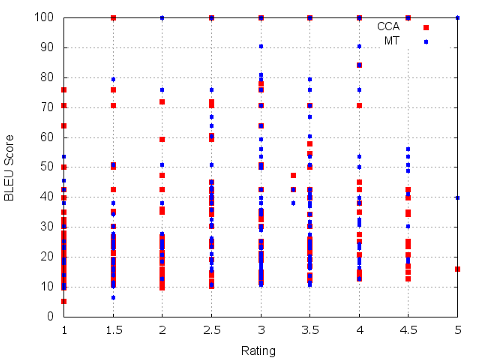

**1608.02784v2-Figure5-1.png**

- Caption: Figure 5: An image with the following descriptions in the dataset: (1) mike is kicking the soccer ball; (2) mike is sitting on the cat; (3) jenny is standing next to the dog; (4) jenny is kicking the soccer ball; (5) the sun is behind jenny; (6) the soccer ball is under the sun.
- Content type: figure
- Figure type: "schematic"

**1608.02784v2-Figure6-1.png**

- Caption: Examples of outputs from the machine translation system and from CCA inference. The top three images give examples where the CCA inference outputs were rated highly by human evaluations (4 or 5), and the SMT ones were rated poorly (1 or 2). The bottom three pictures give the reverse case.
- Content type: figure
- Figure type: photograph(s)

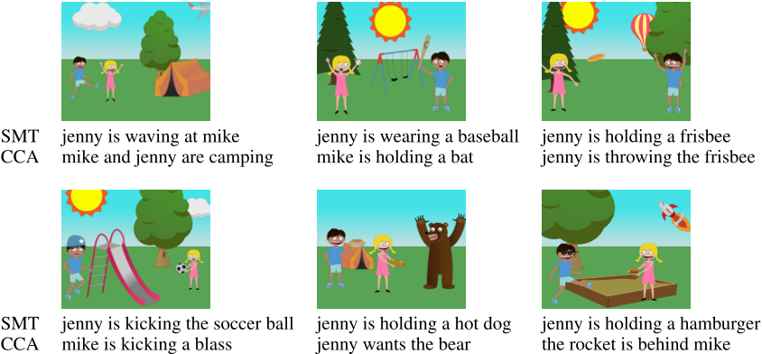

**1608.02784v2-Table1-1.png**

- Caption: Table 1: Example of phrases and their probabilities learned for the function Q(p | y, y′). The marker 〈begin〉 marks the beginning of a sentence.
- Content type: table
- Figure type: N/A

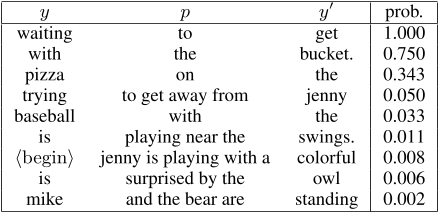

**1608.02784v2-Table2-1.png**

- Caption: Table 2: Scene description evaluation results on the test set, comparing the systems from Ortiz et al. to our CCA inference algorithm (the first six results are reported from the Ortiz et al. paper). The CCA result uses m = 120 and η = 0.05, tuned on the development set. See text for details about each of the first six baselines.
- Content type: table
- Figure type: N/A

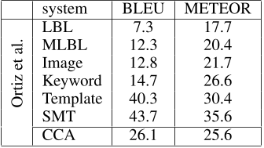

**1608.02784v2-Table3-1.png**

- Caption: Table 3: Average ranking by human judges for cases in which the caption has an average rank of 3 or higher (for both CCA and SMT) and when its average rank is lower than 3. “M” stands for SMT average rank and “C” stands for CCA average rank.
- Content type: table
- Figure type: N/A

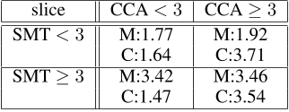

### QAs (7)
**QA 1**

- Question: Which system from Ortiz et al. achieved the highest BLEU and METEOR scores, and how does it compare to the CCA inference algorithm in terms of performance?
- Answer: The SMT system from Ortiz et al. achieved the highest BLEU score (43.7) and METEOR score (35.6) among their tested systems. While the SMT system outperforms the CCA inference algorithm in terms of BLEU score, the CCA algorithm achieves a slightly higher METEOR score (25.6 vs 25.5).
- Rationale: Table 1 presents the BLEU and METEOR scores for various scene description systems, including several baselines from Ortiz et al. and the CCA inference algorithm. By examining the table, we can identify that the SMT system has the highest values for both metrics among the Ortiz et al. systems. Comparing these scores to the CCA algorithm's scores reveals that the SMT system leads in BLEU score, while the CCA algorithm has a slight edge in METEOR score.
- References: 1608.02784v2-Table2-1.png

Referenced images:

**QA 2**

- Question: What is the difference between the outputs of the machine translation system (SMT) and the CCA inference?
- Answer: The SMT outputs are literal translations of the images, while the CCA outputs take into account the context of the images and generate more natural-sounding descriptions.
- Rationale: The figure shows examples of outputs from both systems, side-by-side. The SMT outputs are often grammatically incorrect or awkward, while the CCA outputs are more fluent and natural. For example, in the first image, the SMT output is "jenny is waving at mike," while the CCA output is "mike and jenny are camping." The CCA output is more informative and natural-sounding because it takes into account the context of the image, which shows two people camping.
- References: 1608.02784v2-Figure6-1.png

Referenced images:

**QA 3**

- Question: Which system, CCA or SMT, generally performs better when the caption is of low quality (average rank less than 3)?
- Answer: It is difficult to definitively say which system performs better for low-quality captions based solely on the provided data. However, we can observe some trends:

1. When the SMT average rank is below 3, the CCA average rank is also lower (1.64 vs. 1.77).
2. When the SMT average rank is 3 or higher, the CCA average rank is significantly higher (3.54 vs. 3.46).

This suggests that CCA might perform relatively better for low-quality captions, but more data and analysis are needed for a conclusive answer.
- Rationale: Table 1 presents the average ranking by human judges for both CCA and SMT systems, categorized by whether the caption has an average rank above or below 3. By comparing the average ranks within each category, we can gain insights into the relative performance of the two systems for different caption quality levels. However, due to the limited data points and potential variations within each category, a definitive conclusion about which system performs better for low-quality captions requires further investigation.
- References: 1608.02784v2-Table3-1.png

Referenced images:

**QA 4**

- Question: What is the purpose of the singular value decomposition step in the CCA algorithm?
- Answer: The singular value decomposition step is used to find the projection matrices U and V.
- Rationale: The figure shows that the singular value decomposition step is performed on the matrix D^(-1/2) * Ω * D^(-1/2). This step results in two projection matrices, U and V, which are used to project the data into a lower-dimensional space.
- References: 1608.02784v2-Figure1-1.png

Referenced images:

**QA 5**

- Question: What is the relationship between the input space and the output space in CCA inference?
- Answer: The input space and the output space are related by a cosine similarity measure.
- Rationale: The figure shows that an object from the input space (the image on the left) is mapped to a unit vector. Then, the closest unit vector which has an embodiment in the output space is found. The cosine similarity between the two unit vectors is used to measure the relationship between the input and output spaces.
- References: 1608.02784v2-Figure2-1.png

Referenced images:

**QA 6**

- Question: What is the role of the temperature variable t in the CCA decoding algorithm?
- Answer: The temperature variable t controls the probability of accepting a new candidate solution y. As t decreases, the probability of accepting a worse solution decreases.
- Rationale: The algorithm uses a simulated annealing approach, where the temperature variable t gradually decreases. The acceptance probability of a new solution y is determined by comparing the similarity scores of y and the current best solution y*. If the score of y is higher, it is always accepted. Otherwise, it is accepted with a probability that depends on the difference in scores and the current temperature t. As t decreases, the probability of accepting a worse solution decreases, ensuring that the algorithm converges to a good solution.
- References: 1608.02784v2-Figure3-1.png

Referenced images:

**QA 7**

- Question: What is the relationship between BLEU score and human ranking for CCA and SMT systems?
- Answer: The correlation between BLEU scores and human ranking is not high for either CCA or SMT systems.
- Rationale: The passage states that the correlation between the $x$-axis (ranking) and $y$-axis (BLEU scores) for CCA is $0.3$ and for the SMT system $0.31$. This indicates a weak positive correlation, meaning that higher BLEU scores are not necessarily associated with higher human rankings.
- References: 1608.02784v2-Figure4-1.png

Referenced images:

---
## Paper: 1611.04684v1
Semantic Scholar ID: 1611.04684v1

### Figures/Tables (7)
**1611.04684v1-Figure1-1.png**

- Caption: Architecture of KEHNN
- Content type: figure
- Figure type: schematic

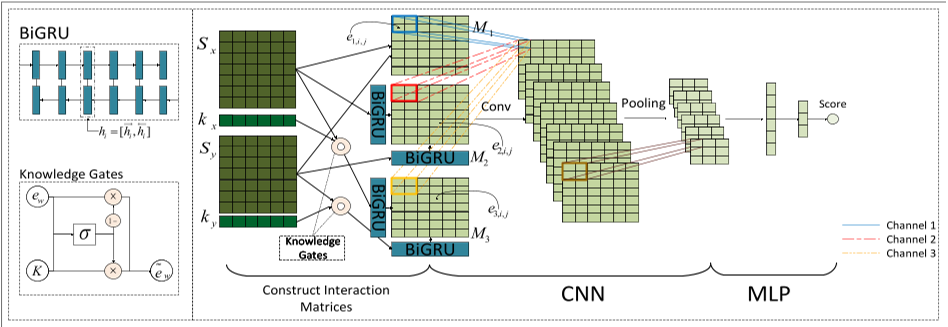

**1611.04684v1-Table1-1.png**

- Caption: A difficult example from QA
- Content type: table
- Figure type: other

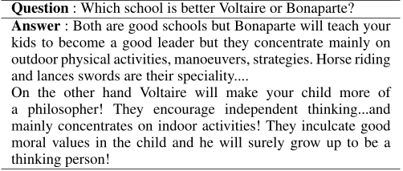

**1611.04684v1-Table2-1.png**

- Caption: Table 2: Statistics of the answer selection data set
- Content type: table
- Figure type: N/A

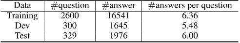

**1611.04684v1-Table3-1.png**

- Caption: Table 3: Evaluation results on answer selection
- Content type: table
- Figure type: N/A

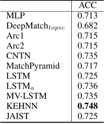

**1611.04684v1-Table4-1.png**

- Caption: Table 4: Evaluation results on response selection
- Content type: table
- Figure type: N/A

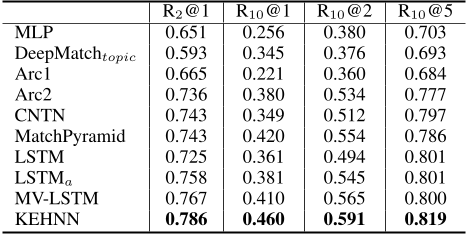

**1611.04684v1-Table5-1.png**

- Caption: Accuracy on different length of text
- Content type: table
- Figure type: table

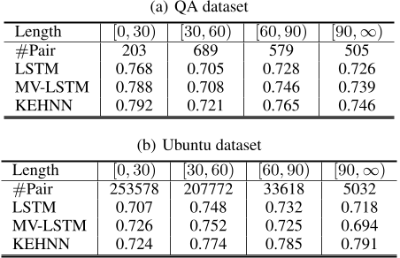

**1611.04684v1-Table6-1.png**

- Caption: Comparison of different channels
- Content type: table
- Figure type: table

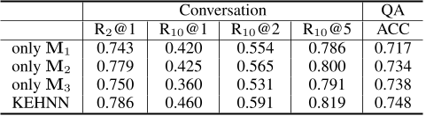

### QAs (5)
**QA 1**

- Question: What are the main differences between the educational philosophies of the Bonaparte and Voltaire schools?
- Answer: The Bonaparte school focuses on outdoor physical activities, maneuvers, and strategies, with a specialization in horse riding, lances, and swords. They aim to develop students into good leaders. The Voltaire school, on the other hand, encourages independent thinking and focuses on indoor activities. They aim to instill good moral values and develop students into philosophical thinkers.
- Rationale: The figure presents a question and answer format, where the answer explicitly describes the contrasting educational approaches of the two schools.
- References: 1611.04684v1-Table1-1.png

Referenced images:

**QA 2**

- Question: Which model performs the best for response selection, and how can we tell?
- Answer: The KEHNN model performs the best for response selection. This is evident because it achieves the highest scores across all metrics (R$2$@1, R${10}$@1, R${10}$@2, and R${10}$@5) compared to all other models in the table.
- Rationale: Table 1 presents the performance of different models on the task of response selection. Each column represents a specific evaluation metric, and each row represents a different model. By comparing the values in each column, we can identify the model with the best performance for each metric. In this case, KEHNN consistently outperforms all other models, indicating its superior performance in response selection.
- References: 1611.04684v1-Table4-1.png

Referenced images:

**QA 3**

- Question: Which model performs best on the Ubuntu dataset for text lengths between 60 and 90 words?
- Answer: KEHNN
- Rationale: The table shows the accuracy of three models (LSTM, MV-LSTM, and KEHNN) on two datasets (QA and Ubuntu) for different text lengths. For text lengths between 60 and 90 words on the Ubuntu dataset, KEHNN has the highest accuracy of 0.785.
- References: 1611.04684v1-Table5-1.png

Referenced images:

**QA 4**

- Question: What is the role of the knowledge gates in the KEHNN architecture?
- Answer: The knowledge gates are responsible for selecting relevant information from the knowledge base and incorporating it into the model's hidden state.
- Rationale: The figure shows that the knowledge gates take as input the knowledge base (K) and the current hidden state (h_t) of the BiGRU. The output of the knowledge gates is then used to update the hidden state of the BiGRU. This suggests that the knowledge gates are used to selectively incorporate information from the knowledge base into the model's hidden state.
- References: 1611.04684v1-Figure1-1.png

Referenced images:

**QA 5**

- Question: How does the average number of answers per question differ between the training and development sets? What might be a possible explanation for this difference?
- Answer: The training set has a higher average number of answers per question (6.36) compared to the development set (5.48). This suggests that questions in the training set tend to have more potential answers associated with them than those in the development set.
- Rationale: The table provides the number of questions and answers in each data set. By dividing the number of answers by the number of questions, we can calculate the average number of answers per question. The difference observed could be due to various factors, such as:

* **Sampling bias:** The training and development sets might have been drawn from different parts of the forum, leading to different distributions of questions and answers. 
* **Question complexity:** Perhaps the training set contains more complex or open-ended questions that naturally elicit a wider range of responses compared to the questions in the development set. 

Understanding such differences between data sets is crucial for interpreting model performance and identifying potential biases in the data.
- References: 1611.04684v1-Table2-1.png

Referenced images:

---
## Paper: 1701.03077v10
Semantic Scholar ID: 1701.03077v10

### Figures/Tables (21)
**1701.03077v10-Figure1-1.png**

- Caption: Our general loss function (left) and its gradient (right) for different values of its shape parameter α. Several values of α reproduce existing loss functions: L2 loss (α = 2), Charbonnier loss (α = 1), Cauchy loss (α = 0), Geman-McClure loss (α = −2), and Welsch loss (α = −∞).
- Content type: figure
- Figure type: plot

**1701.03077v10-Figure10-1.png**

- Caption: The final shape and scale parameters {α(i)} and {c(i)} for our “Pixels + RGB” VAE after training has converged. We visualize α with black=0 and white=2 and log(c) with black=log(0.002) and white=log(0.02).
- Content type: figure
- Figure type: photograph(s)

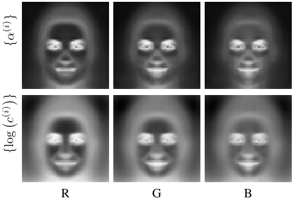

**1701.03077v10-Figure11-1.png**

- Caption: The final shape and scale parameters {α(i)} and {c(i)} for our “Wavelets + YUV” VAE after training has converged. We visualize α with black=0 and white=2 and log(c) with black=log(0.00002) and white=log(0.2).
- Content type: figure
- Figure type: other

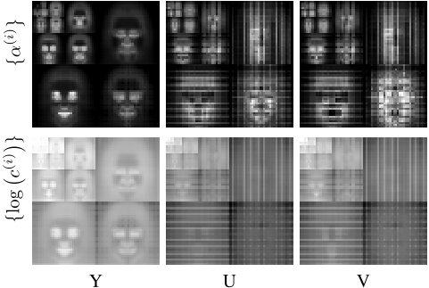

**1701.03077v10-Figure12-1.png**

- Caption: As is common practice, the VAE samples shown in this paper are samples from the latent space (left) but not from the final conditional distribution (right). Here we contrast decoded means and samples from VAEs using our different output spaces, all using our general distribution.
- Content type: figure
- Figure type: photograph(s)

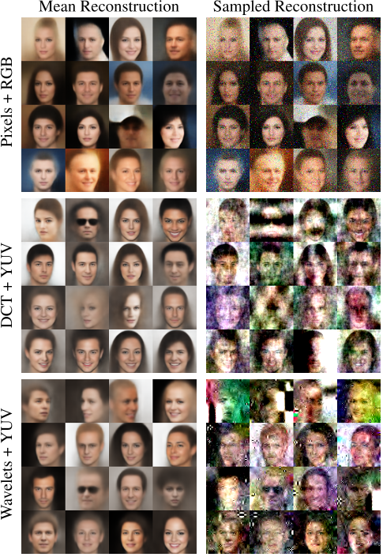

**1701.03077v10-Figure13-1.png**

- Caption: The final shape parameters α for our unsupervised monocular depth estimation model trained on KITTI data. The parameters are visualized in the same “YUV + Wavelet” output space as was used during training, where black is α = 0 and white is α = 2.
- Content type: figure
- Figure type: Plot

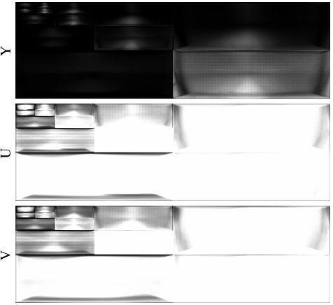

**1701.03077v10-Figure14-1.png**

- Caption: Random samples (more precisely, means of the output distributions decoded from random samples in our latent space) from our family of trained variational autoencoders.
- Content type: figure
- Figure type: photograph(s)

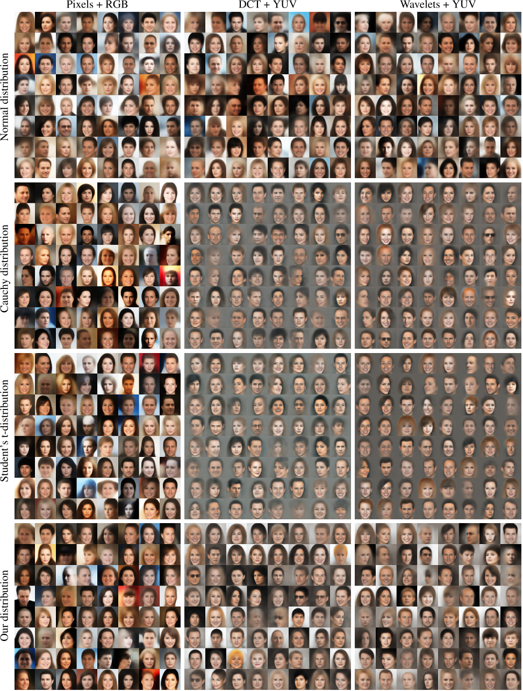

**1701.03077v10-Figure15-1.png**

- Caption: Reconstructions from our family of trained variational autoencoders, in which we use one of three different image representations for modeling images (super-columns) and use either normal, Cauchy, Student’s t, or our general distributions for modeling the coefficients of each representation (sub-columns). The leftmost column shows the images which are used as input to each autoencoder. Reconstructions from models using general distributions tend to be sharper and more detailed than reconstructions from the corresponding model that uses normal distributions, particularly for the DCT or wavelet representations, though this difference is less pronounced than what is seen when comparing samples from these models. The DCT and wavelet models trained with Cauchy distributions or Student’s t-distributions systematically fail to preserve the background of the input image, as was noted when observing samples from these distributions.
- Content type: figure
- Figure type: photograph(s)

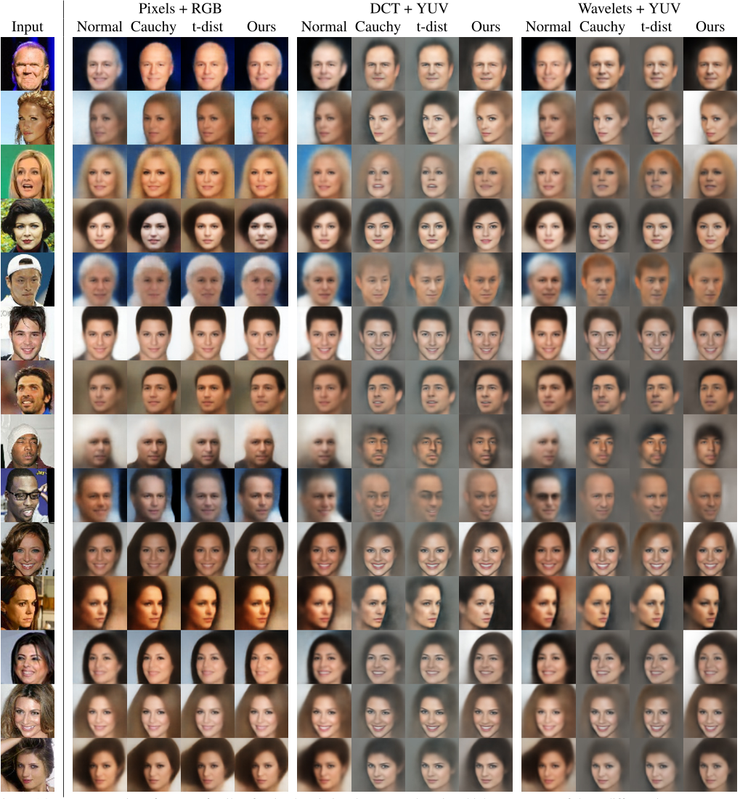

**1701.03077v10-Figure16-1.png**

- Caption: Monocular depth estimation results on the KITTI benchmark using the “Baseline” network of [42] and our own variant in which we replace the network’s loss function with our own adaptive loss over wavelet coefficients. Changing only the loss function results in significantly improved depth estimates.
- Content type: figure
- Figure type: photograph(s)

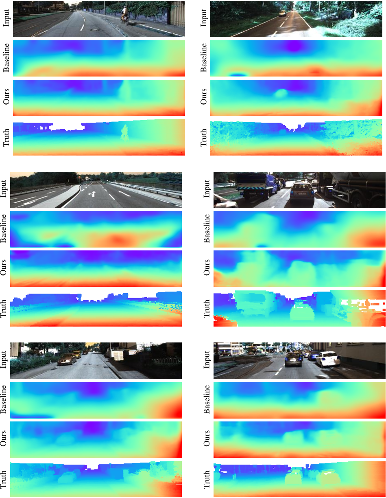

**1701.03077v10-Figure17-1.png**

- Caption: Additional monocular depth estimation results, in the same format as Figure 16.
- Content type: figure
- Figure type: photograph(s)

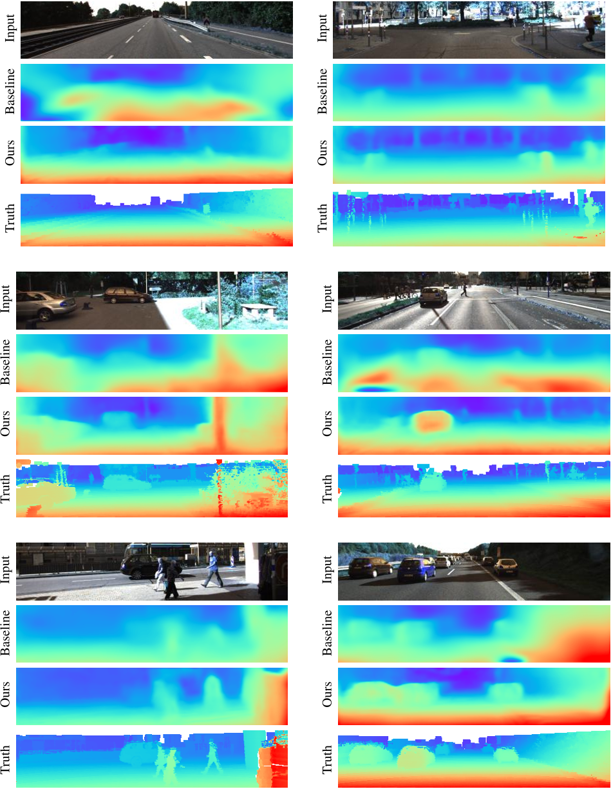

**1701.03077v10-Figure2-1.png**

- Caption: The negative log-likelihoods (left) and probability densities (right) of the distribution corresponding to our loss function when it is defined (α ≥ 0). NLLs are simply losses (Fig. 1) shifted by a log partition function. Densities are bounded by a scaled Cauchy distribution.
- Content type: figure
- Figure type: ** Plot

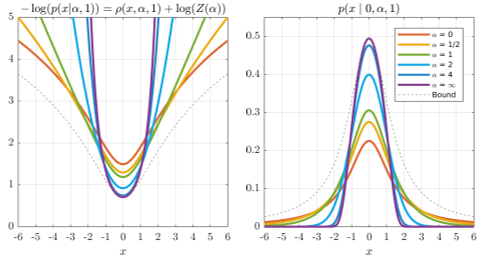

**1701.03077v10-Figure3-1.png**

- Caption: Random samples from our variational autoencoders. We use either normal, Cauchy, Student’s t, or our general distributions (columns) to model the coefficients of three different image representations (rows). Because our distribution can adaptively interpolate between Cauchy-like or normal-like behavior for each coefficient individually, using it results in sharper and higher-quality samples (particularly when using DCT or wavelet representations) and does a better job of capturing low-frequency image content than Student’s t-distribution.
- Content type: figure
- Figure type: photograph(s)

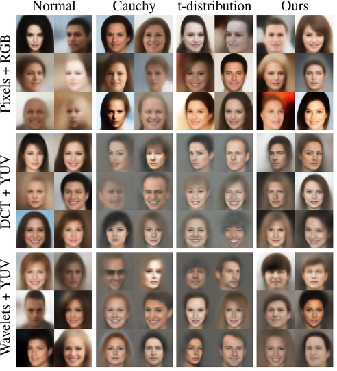

**1701.03077v10-Figure4-1.png**

- Caption: Monocular depth estimation results on the KITTI benchmark using the “Baseline” network of [42]. Replacing only the network’s loss function with our “adaptive” loss over wavelet coefficients results in significantly improved depth estimates.
- Content type: figure
- Figure type: photograph(s)

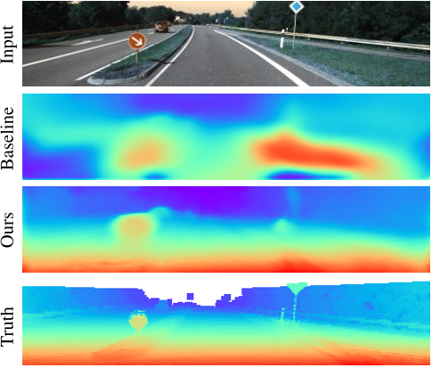

**1701.03077v10-Figure5-1.png**

- Caption: Performance (lower is better) of our gFGR algorithm on the task of [41] as we vary our shape parameter α, with the lowest-error point indicated by a circle. FGR (equivalent to gFGR with α = −2) is shown as a dashed line and a square, and shapeannealed gFGR for each noise level is shown as a dotted line.
- Content type: figure
- Figure type: plot

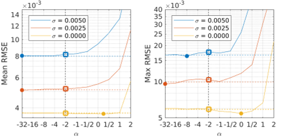

**1701.03077v10-Figure6-1.png**

- Caption: Figure 6. Performance (higher is better) of our gRCC algorithm on the clustering task of [32], for different values of our shape parameter α, with the highest-accuracy point indicated by a dot. Because the baseline RCC algorithm is equivalent to gRCC with α = −2, we highlight that α value with a dashed line and a square.
- Content type: figure
- Figure type: plot

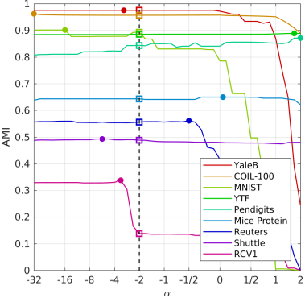

**1701.03077v10-Figure7-1.png**

- Caption: Our general loss’s IRLS weight function (left) and Ψfunction (right) for different values of the shape parameter α.
- Content type: figure
- Figure type: plot

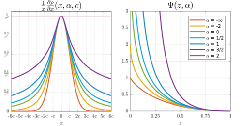

**1701.03077v10-Figure8-1.png**

- Caption: Because our distribution’s log partition function log(Z (α)) is difficult to evaluate for arbitrary inputs, we approximate it using cubic hermite spline interpolation in a transformed space: first we curve α by a continuously differentiable nonlinearity that increases knot density near α = 2 and decreases knot density when α > 4 (top) and then we fit an evenly-sampled cubic hermite spline in that curved space (bottom). The dots shown in the bottom plot are a subset of the knots used by our cubic spline, and are presented here to demonstrate how this approach allocates spline knots with respect to α.
- Content type: figure
- Figure type: plot

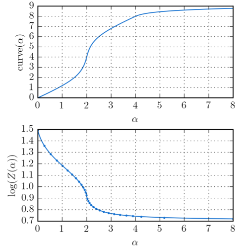

**1701.03077v10-Figure9-1.png**

- Caption: Figure 9. Here we compare the validation set ELBO of our adaptive “Wavelets + YUV” VAE model with the ELBO achieved when setting all wavelet coefficients to have the same fixed shape parameter α. We see that allowing our distribution to individually adapt its shape parameter to each coefficient outperforms any single fixed shape parameter.
- Content type: figure
- Figure type: plot

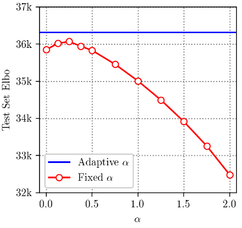

**1701.03077v10-Table1-1.png**

- Caption: Table 1. Validation set ELBOs (higher is better) for our variational autoencoders. Models using our general distribution better maximize the likelihood of unseen data than those using normal or Cauchy distributions (both special cases of our model) for all three image representations, and perform similarly to Student’s tdistribution (a different generalization of normal and Cauchy distributions). The best and second best performing techniques for each representation are colored orange and yellow respectively.
- Content type: table
- Figure type: N/A

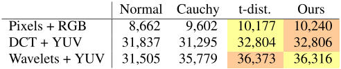

**1701.03077v10-Table2-1.png**

- Caption: Table 2. Results on unsupervised monocular depth estimation using the KITTI dataset [13], building upon the model from [42] (“Baseline”). By replacing the per-pixel loss used by [42] with several variants of our own per-wavelet general loss function in which our loss’s shape parameters are fixed, annealed, or adaptive, we see a significant performance improvement. The top three techniques are colored red, orange, and yellow for each metric.
- Content type: table
- Figure type: N/A

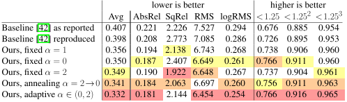

**1701.03077v10-Table3-1.png**

- Caption: Table 3. Results on the registration task of [41], in which we compare their “FGR” algorithm to two versions of our “gFGR” generalization.
- Content type: table
- Figure type: N/A

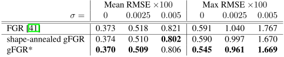

**1701.03077v10-Table4-1.png**

- Caption: Table 4. Results on the clustering task of [32] where we compare their “RCC” algorithm to our “gRCC*” generalization in terms of AMI on several datasets. We also report the AMI increase of “gRCC*” with respect to “RCC”. Baselines are taken from [32].
- Content type: table
- Figure type: N/A

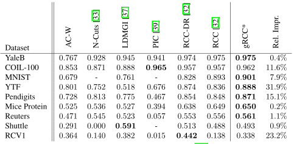

### QAs (15)
**QA 1**

- Question: How does the shape of the IRLS weight function change as the shape parameter α increases?
- Answer: The IRLS weight function becomes more peaked and concentrated around zero as the shape parameter α increases.
- Rationale: The left panel of the figure shows the IRLS weight function for different values of α. As α increases, the function becomes narrower and taller, with a sharper peak at zero. This indicates that the weight function gives more importance to data points that are close to zero and less importance to data points that are further away.
- References: 1701.03077v10-Figure7-1.png

Referenced images:

**QA 2**

- Question: How do the reconstructed faces in the "Mean Reconstruction" differ from those in the "Sampled Reconstruction"?
- Answer: The reconstructed faces in the "Mean Reconstruction" are smoother and less detailed than those in the "Sampled Reconstruction". This is because the mean reconstruction is based on the average of all the possible reconstructions, while the sampled reconstruction is based on a single sample from the distribution.
- Rationale: The figure shows that the mean reconstruction is smoother and less detailed than the sampled reconstruction for all four output spaces. This suggests that the mean reconstruction is a less accurate representation of the original image than the sampled reconstruction.
- References: 1701.03077v10-Figure12-1.png

Referenced images:

**QA 3**

- Question: How does the performance of the adaptive model compare to the fixed model with different values of α?
- Answer: The adaptive model consistently outperforms the fixed model for all values of α.
- Rationale: The plot shows that the test set ELBO (evidence lower bound) of the adaptive model (blue line) is always higher than the ELBO of the fixed model (red line) for all values of α. A higher ELBO indicates better performance.
- References: 1701.03077v10-Figure9-1.png

Referenced images:

**QA 4**

- Question: On which dataset did the gRCC* algorithm achieve the largest relative improvement over the RCC algorithm, and by approximately how much did it improve?
- Answer: The gRCC* algorithm achieved the largest relative improvement over the RCC algorithm on the YTF dataset, with a relative improvement of approximately 31.9%.
- Rationale: The table shows the AMI values for both gRCC* and RCC algorithms on various datasets. The "Rel. Impr." column shows the relative improvement of gRCC* compared to RCC. By looking at this column, we can identify that the YTF dataset has the highest value (31.9%), indicating the most significant improvement achieved by gRCC*.
- References: 1701.03077v10-Table4-1.png

Referenced images:

**QA 5**

- Question: What is the relationship between the shape parameter α and the shape of the loss function?
- Answer: The shape parameter α controls the shape of the loss function. As α increases, the loss function becomes more peaked, and as α decreases, the loss function becomes more flat.
- Rationale: The left plot shows the loss function for different values of α. For large values of α, the loss function is very peaked around zero, which means that small errors are penalized more heavily. For small values of α, the loss function is flatter, which means that small errors are penalized less heavily.
- References: 1701.03077v10-Figure1-1.png

Referenced images:

**QA 6**

- Question: What is the effect of replacing the loss function in the "Baseline" network with the "adaptive" loss over wavelet coefficients?
- Answer: Replacing the loss function in the "Baseline" network with the "adaptive" loss over wavelet coefficients results in significantly improved depth estimates.
- Rationale: The figure shows the input image, the depth estimates from the "Baseline" network, the depth estimates from the network with the "adaptive" loss, and the ground truth depth. The depth estimates from the network with the "adaptive" loss are much closer to the ground truth than the depth estimates from the "Baseline" network.
- References: 1701.03077v10-Figure4-1.png

Referenced images:

**QA 7**

- Question: Which method for setting the shape parameter of the proposed loss function achieved the best performance in terms of average error? How much improvement did it offer compared to the reproduced baseline?
- Answer: The "adaptive $\power \in (0, 2)$" strategy, where each wavelet coefficient has its own shape parameter that is optimized during training, achieved the best performance in terms of average error. It reduced the average error by approximately 17% compared to the reproduced baseline.
- Rationale: The table presents various error and accuracy metrics for different methods of setting the shape parameter in the proposed loss function. The "adaptive $\power \in (0, 2)$" model shows the lowest average error (0.332) among all the listed methods. The reproduced baseline has an average error of 0.398. The percentage improvement can be calculated as: 

(0.398 - 0.332) / 0.398 * 100% ≈ 17%
- References: 1701.03077v10-Table2-1.png

Referenced images:

**QA 8**

- Question: Why did the authors choose to use a nonlinearity to curve α before fitting the cubic hermite spline?
- Answer: The authors chose to use a nonlinearity to curve α before fitting the cubic hermite spline because it allows for increased knot density near α = 2 and decreased knot density when α > 4. This helps to better approximate the log partition function, which is difficult to evaluate for arbitrary inputs.
- Rationale: The top plot of the figure shows the nonlinearity that is used to curve α. The bottom plot shows the cubic hermite spline that is fit to the curved α. The dots in the bottom plot represent the knots that are used by the spline. It can be seen that the knots are more densely spaced near α = 2 and less densely spaced when α > 4. This is because the nonlinearity curves α in such a way that more knots are needed to accurately approximate the log partition function in the region where α is close to 2, and fewer knots are needed when α is greater than 4.
- References: 1701.03077v10-Figure8-1.png

Referenced images:

**QA 9**

- Question: What is the range of values for the shape parameter α?
- Answer: The range of values for the shape parameter α is from 0 to 2.
- Rationale: The caption states that "black is α = 0 and white is α = 2."
- References: 1701.03077v10-Figure13-1.png

Referenced images:

**QA 10**

- Question: How does the performance of gFGR change as the shape parameter α increases?
- Answer: The performance of gFGR generally improves as the shape parameter α increases.
- Rationale: The figure shows that the mean RMSE and max RMSE both decrease as α increases, indicating better performance.
- References: 1701.03077v10-Figure5-1.png

Referenced images:

**QA 11**

- Question: Which image representation results in the sharpest and highest-quality samples?
- Answer: DCT and wavelet representations.
- Rationale: The figure shows that the samples generated using our distribution are sharper and of higher quality when using DCT or wavelet representations than when using other representations. This is because our distribution can adaptively interpolate between Cauchy-like or normal-like behavior for each coefficient individually, which results in a better capture of low-frequency image content.
- References: 1701.03077v10-Figure3-1.png

Referenced images:

**QA 12**

- Question: Which dataset shows the greatest sensitivity to the choice of $\power$?
- Answer: RCV1
- Rationale: The RCV1 dataset shows the largest range of AMI values across the different values of $\power$, indicating that the performance of the algorithm on this dataset is highly dependent on the choice of $\power$.
- References: 1701.03077v10-Figure6-1.png

Referenced images:

**QA 13**

- Question: How does the shape of the negative log-likelihood (NLL) and probability density functions change as the value of α increases?
- Answer: As the value of α increases, the NLL functions become more peaked and the probability density functions become more concentrated around the mean.
- Rationale: The left panel of the figure shows the NLL functions for different values of α. As α increases, the NLL functions become more peaked, indicating that the loss function is more sensitive to deviations from the mean. The right panel of the figure shows the corresponding probability density functions. As α increases, the probability density functions become more concentrated around the mean, indicating that the distribution is becoming more peaked.
- References: 1701.03077v10-Figure2-1.png

Referenced images:

**QA 14**

- Question: How do the results of the baseline and the proposed method compare in terms of accuracy?
- Answer: The proposed method appears to be more accurate than the baseline method. The depth maps generated by the proposed method are more detailed and realistic than those generated by the baseline method.
- Rationale: The figure shows that the depth maps generated by our method are closer to the ground truth than the depth maps generated by the baseline method. This indicates that our method is more accurate than the baseline method.
- References: 1701.03077v10-Figure17-1.png

Referenced images:

**QA 15**

- Question: How does the choice of distribution affect the quality of the reconstructions?
- Answer: Reconstructions from models using general distributions tend to be sharper and more detailed than reconstructions from the corresponding model that uses normal distributions.
- Rationale: This can be seen in the figure by comparing the reconstructions in the "Ours" columns to the reconstructions in the "Normal" columns. For example, the reconstructions in the "Ours" column for the DCT + YUV representation are much sharper and more detailed than the reconstructions in the "Normal" column.
- References: 1701.03077v10-Figure15-1.png

Referenced images:

---
## Paper: 1703.00060v2
Semantic Scholar ID: 1703.00060v2

### Figures/Tables (2)
**1703.00060v2-Table1-1.png**

- Caption: Table 1: Measured discrimination before discrimination removal (values larger than threshold are highlighted as bold).
- Content type: table
- Figure type: N/A

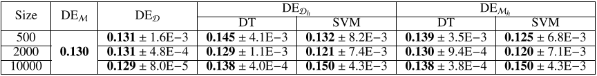

**1703.00060v2-Table2-1.png**

- Caption: Table 2: Measured discrimination after discrimination removal (decision tree as the classifier).
- Content type: table
- Figure type: N/A

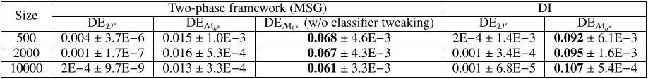

### QAs (1)
**QA 1**

- Question: How does the discrimination in the prediction of the two-phase framework (MSG) compare to that of DI, both with and without classifier tweaking, when the sample size is 2000?
- Answer: When the sample size is 2000, the two-phase framework (MSG) achieves lower discrimination in prediction compared to DI, both with and without classifier tweaking.

With classifier tweaking: MSG achieves a discrimination level of 0.016 ± 5.3E-4, while DI shows a significantly higher level of 0.095 ± 1.6E-3.
Without classifier tweaking: MSG still demonstrates lower discrimination with 0.067 ± 4.3E-3 compared to DI's 0.095 ± 1.6E-3.

This indicates that the two-phase framework is more effective in removing discrimination from predictions than DI, regardless of whether classifier tweaking is applied.
- Rationale: Table 2 presents the measured discrimination after discrimination removal for both MSG and DI methods. The rows correspond to different sample sizes, and the columns represent different discrimination measures. By comparing the values in the "DE_M_h*" columns for both methods at the row where the sample size is 2000, we can directly assess the difference in their prediction discrimination levels. The lower values for MSG in both scenarios (with and without tweaking) demonstrate its superior performance in eliminating prediction discrimination.
- References: 1703.00060v2-Table2-1.png

Referenced images:

---
## Paper: 1703.07015v3
Semantic Scholar ID: 1703.07015v3

### Figures/Tables (10)
**1703.07015v3-Figure1-1.png**

- Caption: The hourly occupancy rate of a road in the bay area for 2 weeks
- Content type: figure
- Figure type: plot

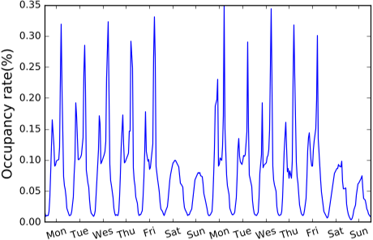

**1703.07015v3-Figure2-1.png**

- Caption: Figure 2: An overview of the Long- and Short-term Time-series network (LSTNet)
- Content type: figure
- Figure type: Schematic

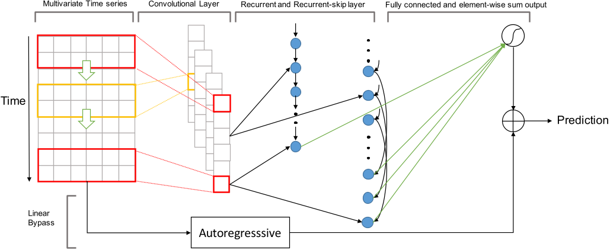

**1703.07015v3-Figure3-1.png**

- Caption: Autocorrelation graphs of sampled variables form four datasets.
- Content type: figure
- Figure type: plot

**1703.07015v3-Figure4-1.png**

- Caption: Simulation Test: Left side is the training set and right side is test set.
- Content type: figure
- Figure type: plot

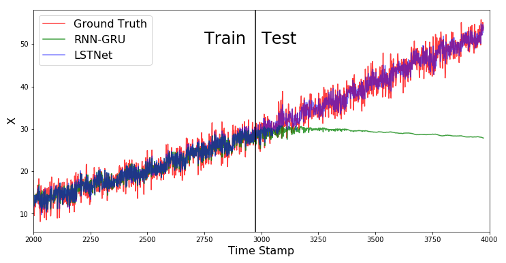

**1703.07015v3-Figure5-1.png**

- Caption: Results of LSTNet in the ablation tests on the Solar-Energy, Traffic and Electricity dataset
- Content type: figure
- Figure type: plot

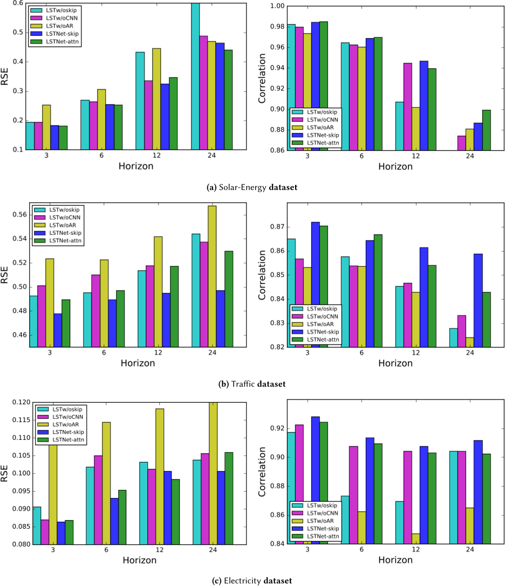

**1703.07015v3-Figure56-1.png**

- Caption: Several observations from these results are worth highlighting:
- Content type: figure
- Figure type: other

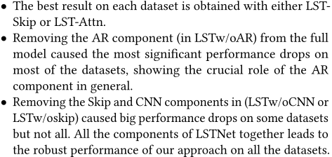

**1703.07015v3-Figure6-1.png**

- Caption: The predicted time series (red) by LSTw/oAR (a) and by LST-Skip (b) vs. the true data (blue) on Electricity dataset with horizon = 24
- Content type: figure
- Figure type: plot

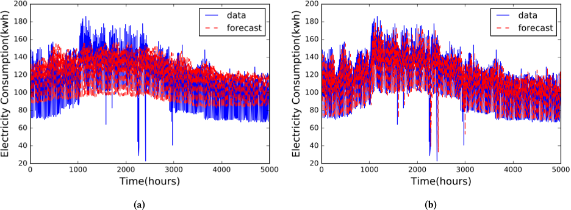

**1703.07015v3-Figure7-1.png**

- Caption: The true time series (blue) and the predicted ones (red) by VAR (a) and by LSTNet (b) for one variable in the Traffic occupation dataset. The X axis indicates the week days and the forecasting horizon = 24. VAR inadequately predicts similar patterns for Fridays and Saturdays, and ones for Sundays andMondays, while LSTNet successfully captures both the daily and weekly repeating patterns.
- Content type: figure
- Figure type: plot

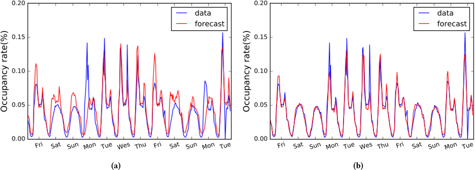

**1703.07015v3-Table1-1.png**

- Caption: Table 1: Dataset Statistics, whereT is length of time series,D is number of variables, L is the sample rate.
- Content type: table
- Figure type: N/A

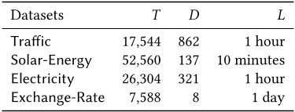

**1703.07015v3-Table2-1.png**

- Caption: Table 2: Results summary (in RSE and CORR) of all methods on four datasets: 1) each row has the results of a specific method in a particular metric; 2) each column compares the results of all methods on a particular dataset with a specific horizon value; 3) bold face indicates the best result of each column in a particular metric; and 4) the total number of bold-faced results of each method is listed under the method name within parentheses.
- Content type: table
- Figure type: N/A

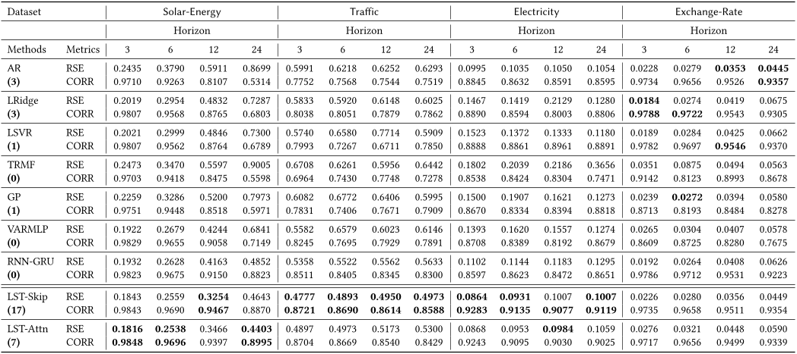

### QAs (7)
**QA 1**

- Question: Which dataset exhibits the strongest seasonality?
- Answer: The Traffic dataset.
- Rationale: The Traffic dataset's autocorrelation graph shows a clear, repeating pattern with a period of approximately 24 hours. This indicates that the data is strongly seasonal, with values tending to be similar at the same time of day on different days.
- References: 1703.07015v3-Figure3-1.png

Referenced images:

**QA 2**

- Question: What component of LSTNet is most important for its performance?
- Answer: The AR component.
- Rationale: Removing the AR component from the model caused the most significant performance drops on most of the datasets, indicating its importance.
- References: 1703.07015v3-Figure56-1.png

Referenced images:

**QA 3**

- Question: Which of the two models, LSTw/oAR or LST-Skip, seems to perform better in predicting electricity consumption?
- Answer: LST-Skip seems to perform better in predicting electricity consumption.
- Rationale: The figure shows the predicted time series (red) by LSTw/oAR (a) and by LST-Skip (b) vs. the true data (blue) on Electricity dataset with horizon = 24. It can be seen that the predicted time series by LST-Skip is closer to the true data than the predicted time series by LSTw/oAR.
- References: 1703.07015v3-Figure6-1.png

Referenced images:

**QA 4**

- Question: Which model, VAR or LSTNet, is better at capturing both daily and weekly repeating patterns in the data?
- Answer: LSTNet
- Rationale: The figure shows that LSTNet is able to predict similar patterns for Fridays and Saturdays, and ones for Sundays and Mondays, while VAR is not. This suggests that LSTNet is better at capturing both daily and weekly repeating patterns in the data.
- References: 1703.07015v3-Figure7-1.png

Referenced images:

**QA 5**

- Question: Which dataset has the highest temporal resolution, meaning it provides data points at the most frequent intervals?
- Answer: The solar dataset has the highest temporal resolution.
- Rationale: The sample rate, represented by $L$ in the table, indicates how frequently data points are collected for each dataset. The solar dataset has a sample rate of 10 minutes, which is the smallest interval compared to the other datasets. This means that the solar dataset provides more data points per unit of time than any other dataset in the table.
- References: 1703.07015v3-Table1-1.png

Referenced images:

**QA 6**

- Question: What are the different types of layers in the LSTNet model and how are they connected?
- Answer: The LSTNet model has four main types of layers:

1. Convolutional layer: This layer extracts local dependency patterns from the input data. 
2. Recurrent and recurrent-skip layer: These layers capture long-term dependencies in the data. 
3. Fully connected and element-wise sum output layer: This layer combines the outputs from the convolutional and recurrent layers to produce the final prediction.
4. Autoregressive layer: This layer provides a linear bypass to the non-linear neural network part of the model. 

The convolutional layer receives the input data and passes its output to the recurrent and recurrent-skip layers. These layers then pass their output to the fully connected and element-wise sum output layer. The autoregressive layer receives the input data directly and its output is also fed into the fully connected and element-wise sum output layer.
- Rationale: The figure shows the different layers of the LSTNet model and how they are connected. The arrows indicate the direction of data flow.
- References: 1703.07015v3-Figure2-1.png

Referenced images:

**QA 7**

- Question: How does the performance of LSTNet-attn vary with the horizon on the Solar-Energy dataset?
- Answer: The performance of LSTNet-attn generally improves as the horizon increases on the Solar-Energy dataset. This is evident from the fact that both the RMSE and correlation values improve with increasing horizon.
- Rationale: The figure shows the RMSE and correlation values for different horizons on the Solar-Energy dataset. The LSTNet-attn model is represented by the green bars.
- References: 1703.07015v3-Figure5-1.png

Referenced images:

---
## Paper: 1704.05426v4
Semantic Scholar ID: 1704.05426v4

### Figures/Tables (6)
**1704.05426v4-Figure1-1.png**

- Caption: The main text of a prompt (truncated) that was presented to our annotators. This version is used for the written non-fiction genres.
- Content type: figure
- Figure type: "other"

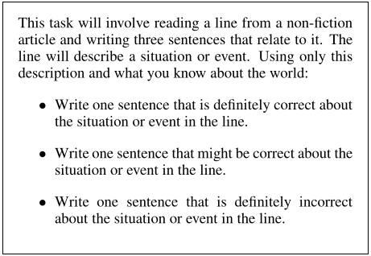

**1704.05426v4-Table1-1.png**

- Caption: Table 1: Randomly chosen examples from the development set of our new corpus, shown with their genre labels, their selected gold labels, and the validation labels (abbreviated E, N, C) assigned by individual annotators.
- Content type: table
- Figure type: N/A

**1704.05426v4-Table2-1.png**

- Caption: Key validation statistics for SNLI (copied from Bowman et al., 2015) and MultiNLI.
- Content type: table
- Figure type: table

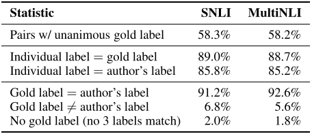

**1704.05426v4-Table3-1.png**

- Caption: Table 3: Key statistics for the corpus by genre. The first five genres represent the matched section of the development and test sets, and the remaining five represent the mismatched section. The first three statistics provide the number of examples in each genre. #Wds. Prem. is the mean token count among premise sentences. ‘S’ parses is the percentage of sentences for which the Stanford Parser produced a parse rooted with an ‘S’ (sentence) node. Agrmt. is the percent of individual labels that match the gold label in validated examples. Model Acc. gives the test accuracy for ESIM and CBOW models (trained on either SNLI or MultiNLI), as described in Section 3.
- Content type: table
- Figure type: N/A

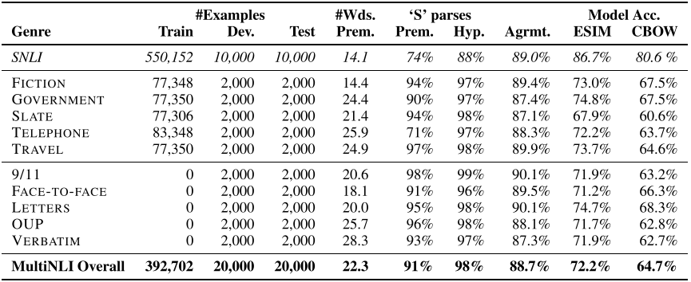

**1704.05426v4-Table4-1.png**

- Caption: Table 4: Test set accuracies (%) for all models; Match. represents test set performance on the MultiNLI genres that are also represented in the training set, Mis. represents test set performance on the remaining ones; Most freq. is a trivial ‘most frequent class’ baseline.
- Content type: table
- Figure type: N/A

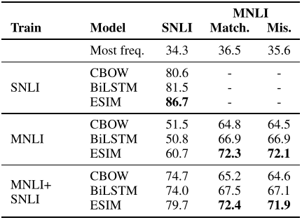

**1704.05426v4-Table5-1.png**

- Caption: Dev. Freq. is the percentage of dev. set examples that include each phenomenon, ordered by greatest difference in frequency of occurrence (Diff.) between MultiNLI and SNLI. Most Frequent Label specifies which label is the most frequent for each tag in the MultiNLI dev. set, and % is its incidence. Model Acc. is the dev. set accuracy (%) by annotation tag for each baseline model (trained on MultiNLI only). (PTB) marks a tag as derived from Penn Treebank-style parser output tags (Marcus et al., 1993).
- Content type: table
- Figure type: table

### QAs (5)
**QA 1**

- Question: What are the three types of sentences that the annotators are asked to write?
- Answer: The three types of sentences are: 
1. A sentence that is definitely correct about the situation or event in the line.
2. A sentence that might be correct about the situation or event in the line.
3. A sentence that is definitely incorrect about the situation or event in the line.
- Rationale: The figure shows the instructions given to the annotators, which explicitly state the three types of sentences they are asked to write.
- References: 1704.05426v4-Figure1-1.png

Referenced images:

**QA 2**

- Question: Which type of word has the greatest difference in frequency of occurrence between MultiNLI and SNLI?
- Answer: Negation (PTB)
- Rationale: The table shows the difference in frequency of occurrence between MultiNLI and SNLI for each type of word. The "Diff." column shows that negation has the greatest difference, with a difference of 26.
- References: 1704.05426v4-Table5-1.png

Referenced images:

**QA 3**

- Question: Which model performs better on the MultiNLI dataset when considering the percentage of individual labels that match the author's label?
- Answer: SNLI performs better than MultiNLI when considering the percentage of individual labels that match the author's label. SNLI has a score of 85.8%, while MultiNLI has a score of 85.2%.
- Rationale: The table shows the validation statistics for SNLI and MultiNLI. The "Individual label = author's label" row shows the percentage of individual labels that match the author's label. SNLI has a higher percentage than MultiNLI, which indicates that SNLI performs better on this metric.
- References: 1704.05426v4-Table2-1.png

Referenced images:

**QA 4**

- Question: Which genre in the MultiNLI corpus has the highest percentage of sentences where the Stanford Parser produced a parse rooted with an 'S' (sentence) node, and how does this compare to the overall average for the corpus?
- Answer: The genre with the highest percentage of 'S' parses is **9/11**, with **99%** of its sentences receiving this parse. This is higher than the overall average for the MultiNLI corpus, which sits at **91%**.
- Rationale: The table provides the percentage of 'S' parses for each genre under the column "`S' parses". By comparing these values, we can identify which genre has the highest percentage. Additionally, the overall average for the corpus is provided in the last row of the table, allowing for a comparison between the 9/11 genre and the entire dataset.
- References: 1704.05426v4-Table3-1.png

Referenced images:

**QA 5**

- Question: How does the performance of the ESIM model differ when trained on MNLI alone versus trained on both MNLI and SNLI combined?
- Answer: When trained on MNLI alone, the ESIM model achieves an accuracy of 60.7% on SNLI, 72.3% on matched genres in MNLI, and 72.1% on mismatched genres in MNLI. However, when trained on both MNLI and SNLI combined, the ESIM model's performance improves across all tasks, reaching 79.7% accuracy on SNLI, 72.4% on matched MNLI genres, and 71.9% on mismatched MNLI genres.
- Rationale: Table 1 shows the test set accuracies for different models trained on different data sets. By comparing the rows corresponding to ESIM trained on MNLI and ESIM trained on MNLI + SNLI, we can observe the impact of adding SNLI data to the training process. The increased accuracy across all test sets suggests that the combined dataset helps the model generalize better and improve its performance.
- References: 1704.05426v4-Table4-1.png

Referenced images:

---
## Paper: 1704.08615v2
Semantic Scholar ID: 1704.08615v2

### Figures/Tables (10)
**1704.08615v2-Figure1-1.png**

- Caption: No single saliency map can perform best in all metrics even when the true fixation distribution is known. This problem can be solved by separating saliency models from saliency maps. a) Fixations are distributed according to a ground truth fixation density p(x, y | I) for some stimulus I (see supplementary material for details on the visualization). b) This ground truth density predicts different saliency maps depending on the intended metric. The saliency maps differ dramatically due to the different properties of the metrics but always reflect the same underlying model. Note that the maps for the NSS and IG metrics are the same, as are those for CC and KL-Div. c) Performances of the saliency maps from b) under seven saliency metrics on a large number of fixations sampled from the model distribution in a). Colors of the bars correspond to the frame colors in b). The predicted saliency map for the specific metric (framed bar) yields best performance in all cases.
- Content type: figure
- Figure type: Schematic

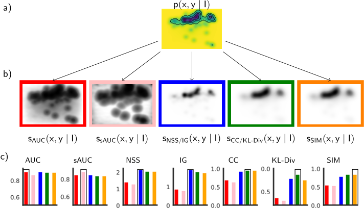

**1704.08615v2-Figure2-1.png**

- Caption: The predicted saliency map for various metrics according to different models, for the same stimulus. For six models (rows) we show their original saliency map (first column), the probability distribution after converting the model into a probabilistic model (second column) and the saliency maps predicted for seven different metrics (columns three through seven). The predictions of different models for the same metric (column) appear more similar than the predictions of the same model for different metrics (row). In particular, note the inconsistency of the original models (what are typically compared on the benchmark) relative to the per-metric saliency maps. It is therefore difficult to visually compare original model predictions, which have been formulated for different metrics.
- Content type: figure
- Figure type: photograph(s)

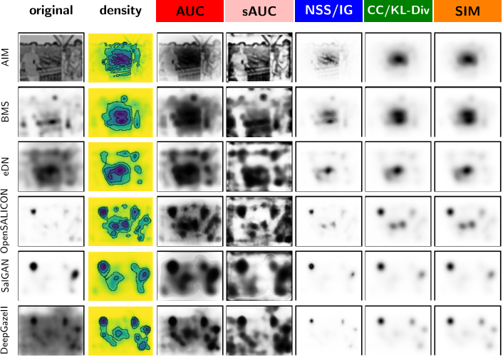

**1704.08615v2-Figure3-1.png**

- Caption: We reformulated several saliency models in terms of fixation densities and evaluated AUC, sAUC, NSS, IG, CC, KL-Div and SIM on the original saliency maps (dashed line) and the saliency maps derived from the probabilistic model for the different saliency metrics (solid lines) on the MIT1003 dataset. Saliency maps derived for a given metric always yield the highest performance for that metric(thick line), and for each metric the model ranking is consistent when using the correct saliency maps – unlike for the original saliency maps and some other derived saliency maps. Note that AUC metrics yield identical results on AUC saliency maps, NSS saliency maps and log-density saliency maps, therefore the blue and purple lines are hidden by the red line in the AUC and sAUC plots. Also, the CC metric yields only slightly worse results on the SIM saliency map than on the CC saliency map, therefore the orange line is hidden by the green line in the CC plot. OpnS=OpenSALICON, DGII=DeepGaze II.
- Content type: figure
- Figure type: plot

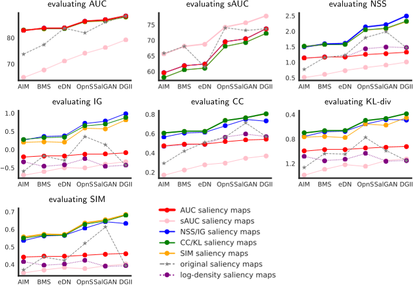

**1704.08615v2-Figure4-1.png**

- Caption: AUC metrics measure the performance of the saliency map in a 2AFC task where the saliency values of two locations are used to decide which of these two locations is a fixation and which is a nonfixation. a) An example saliency map is shown consisting of five saliency values (s1 < · · · < s5) and with five fixations (f1, . . . , f5) and four nonfixations (n1, . . . , n4). b) The performance in the 2AFC task can be calculated by going through all fixation-nonfixation pairs (fi, nj): The saliency map decides correct if the saliency value of fi is greater than nj (green), incorrect if it is smaller (red) and has chance performance if the values are equal (orange). Below the thick line are all correct predictions (green) and half of the chance cases (orange). c) The ROC curve of the saliency map with respect to the given fixations and nonfixations. For each threshold θ all values of saliency value greater or equal to θ are classified as fixations. Comparing b) and c) shows that the area under the curve in c) is exactly the performance in the 2AFC task in b).
- Content type: figure
- Figure type: schematic

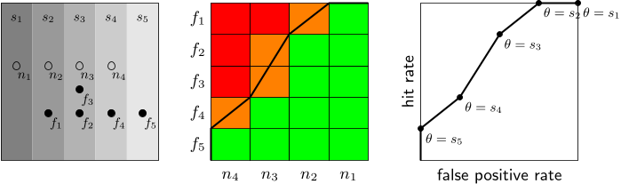

**1704.08615v2-Figure5-1.png**

- Caption: Visualizing fixation densities: a) an example stimulus with N = 97 ground truth fixations. b) DeepGaze II predicts a fixation density for this stimulus. The contour lines separate the image into four areas of decreasing probability density such that each area has the same total probability mass. c) The number of ground truth fixations in each of the four areas. The model expects the same number of fixations for each area (horizontal line: 24.25 fixations for N fixations total). The gray area shows the expected standard deviation from this number. DeepGaze II overestimates the how peaked the density is: there are too few fixations in darkest area. Vice versa, it misses some probability mass in the second to last area. However, the large error margin (gray area) indicates that substantial deviations from the expected number of fixations are to be expected.
- Content type: figure
- Figure type: photograph(s) and plot

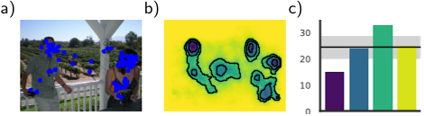

**1704.08615v2-Figure6-1.png**

- Caption: Predicting optimal saliency maps for the CC metric: Starting from a density (a) we sampled 100000 sets of either 1, 10 or 100 fixations and used them to create empirical saliency maps. Using these empirical saliency maps, we calculated the mean empirical saliency map (shown for 10 fixations per empirical saliency map in (b)). Additionally, we normalized the empirical saliency maps to have zero mean and unit variance to compute the mean normalized empirical saliency map (c) which is optimal with respect to the CC metric. Then we sampled another 100000 empirical saliency maps from the original density and evaluated CC scores of the mean empirical and mean normalized empirical saliency maps (d). The mean normalized saliency map yields slighly higher scores in all cases but the difference to the mean empirical saliency map is tiny, indicating that the expected empirical saliency map is a very good approximation of the optimal saliency map for the CC metric.
- Content type: figure
- Figure type: plot

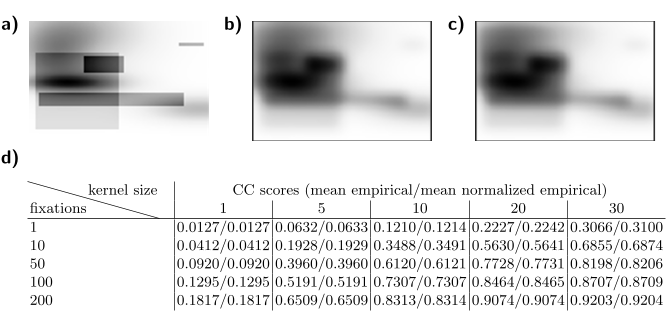

**1704.08615v2-Figure7-1.png**

- Caption: The optimal SIM saliency map depends on the number of fixations. (a) For a sample density (see Figure 6), we calculated the optimal SIM saliency map for different numbers of fixations per sample (numbers on top) and additionally the mean empirical saliency map (CC). (b) average performance of those saliency maps (rows) when repeatedly sampling a certain number of fixations (columns) and computing SIM. The best performing saliency map for each sampled dataset (columns) is printed in boldface. It’s always the saliency map calculated with the same number of fixations. Note that the CC saliency map – although looking identical – always performs slighly worse
- Content type: figure
- Figure type: table

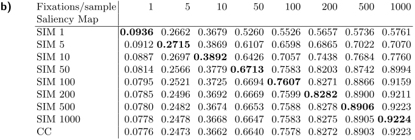

**1704.08615v2-Table1-1.png**

- Caption: Table 1: AUC and low precision: While AUC metrics in theory depend only on the ranking of the saliency values and therefore are invariant to monotone transformations, this does not hold anymore when the saliency map is saved with limited precision (e.g. as 8bit PNG/JPEG as common). In this case, the saliency map should be rescaled to have a uniform histogram before saving.
- Content type: table
- Figure type: N/A

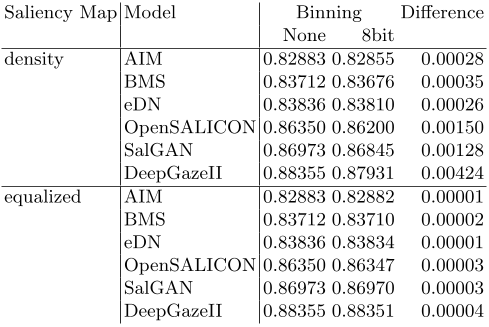

**1704.08615v2-Table2-1.png**

- Caption: Table 2: The raw data plotted in Figure 1
- Content type: table
- Figure type: N/A

**1704.08615v2-Table3-1.png**

- Caption: Table 3: The raw data plotted in Figure 3
- Content type: table
- Figure type: N/A

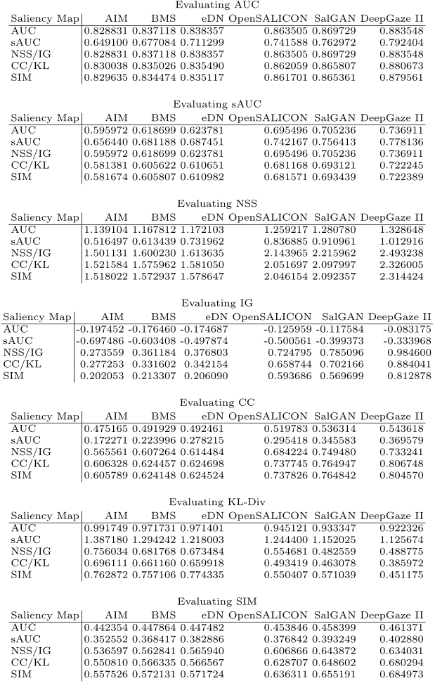

### QAs (5)
**QA 1**

- Question: How does the performance of the SIM saliency map change as the number of fixations increases?
- Answer: The performance of the SIM saliency map increases as the number of fixations increases.
- Rationale: The table in the figure shows the average performance of the SIM saliency map for different numbers of fixations. The performance is measured by the SIM score, which is a measure of how well the saliency map predicts the fixations of human observers. The table shows that the SIM score increases as the number of fixations increases. This means that the SIM saliency map is better at predicting the fixations of human observers when there are more fixations.
- References: 1704.08615v2-Figure7-1.png

Referenced images:

**QA 2**

- Question: Which saliency map method achieved the highest score for the sAUC metric, and how does its performance compare to other methods based on this metric?
- Answer: The saliency map method with the highest sAUC score is **SIM**. Its sAUC score appears to be significantly higher than all other methods listed in the table.
- Rationale: Table 1 presents the performance of different saliency map methods across various metrics, including sAUC. By examining the sAUC column, we can identify which method achieved the highest score and compare its performance to others. The table shows that SIM has the highest sAUC value, indicating superior performance compared to the other methods in terms of this specific metric.
- References: 1704.08615v2-Table3-1.png

Referenced images:

**QA 3**

- Question: What is the relationship between the ground truth fixation density and the saliency maps?
- Answer: The ground truth fixation density predicts different saliency maps depending on the intended metric.
- Rationale: The figure shows that the ground truth fixation density (a) is used to generate different saliency maps (b) for different metrics. The saliency maps differ dramatically due to the different properties of the metrics, but they all reflect the same underlying model.
- References: 1704.08615v2-Figure1-1.png

Referenced images:

**QA 4**

- Question: What is the relationship between the number of fixations and the CC score?
- Answer: The CC score increases as the number of fixations increases.
- Rationale: The figure shows that the CC score for the mean empirical and mean normalized empirical saliency maps increases as the number of fixations increases from 1 to 200. This is because the more fixations there are, the more information is available to calculate the CC score.
- References: 1704.08615v2-Figure6-1.png

Referenced images:

**QA 5**

- Question: What is the relationship between the fixation density map and the ground truth fixations?
- Answer: The fixation density map predicts the probability of a person fixating on a particular location in the image. The ground truth fixations are the actual locations where people fixated on the image.
- Rationale: The fixation density map is shown in panel b) and the ground truth fixations are shown in panel a). The contour lines in the fixation density map separate the image into four areas of decreasing probability density. The number of ground truth fixations in each of these areas is shown in panel c).
- References: 1704.08615v2-Figure5-1.png

Referenced images:

---
## Paper: 1705.07384v2
Semantic Scholar ID: 1705.07384v2

### Figures/Tables (2)
**1705.07384v2-Figure2-1.png**

- Caption: Policy learning results in Ex. 2; numbers denote regret
- Content type: figure
- Figure type: plot

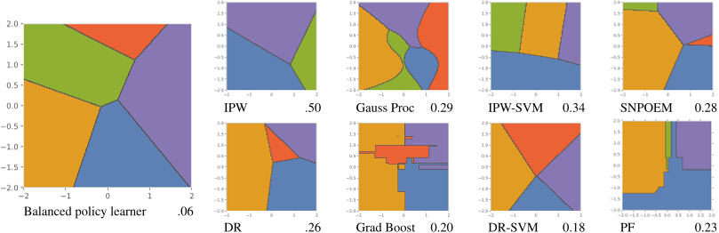

**1705.07384v2-Table2-1.png**

- Caption: Policy learning results in Ex. 3
- Content type: table
- Figure type: table

### QAs (1)
**QA 1**

- Question: Which policy learning method achieved the lowest regret in Ex. 2?
- Answer: The DR-SVM method achieved the lowest regret in Ex. 2, with a regret of 0.18.
- Rationale: The figure shows the regret for each policy learning method in Ex. 2. The DR-SVM method has the lowest regret, as indicated by the number 0.18 below its corresponding plot.
- References: 1705.07384v2-Figure2-1.png

Referenced images:

---
## Paper: 1705.09966v2
Semantic Scholar ID: 1705.09966v2

### Figures/Tables (16)
**1705.09966v2-Figure1-1.png**

- Caption: Fig. 1. Identity-guided face generation. Top: identity-preserving face super-resolution where (a) is the identity image; (b) input photo; (c) image crop from (b) in low resolution; (d) our generated high-res result; (e) ground truth image. Bottom: face transfer, where (f) is the identity image; (g) input low-res image of another person provides overall shape constraint; (h) our generated high-res result where the man’s identity is transferred. To produce the low-res input (g) we down-sample from (i), which is a woman’s face.
- Content type: figure
- Figure type: photograph(s)

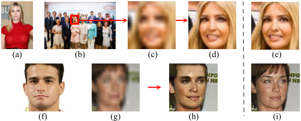

**1705.09966v2-Figure10-1.png**

- Caption: Fig. 10. Identity-guided face generation results on different persons. The last row shows some challenging examples, e.g., , the occluded forehead in low-res input is recovered (example in the green box). (a) low-res inputs provide overall shape constraint; (b) identity to be transferred; (c) our high-res face outputs (red boxes) from (a) where the man/woman’s identity in (b) is transferred; (d) the high-res ground truth of (a).
- Content type: figure
- Figure type: photograph(s)

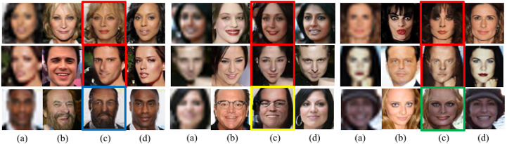

**1705.09966v2-Figure11-1.png**

- Caption: Fig. 11. Face swapping results within the high-res domain. (a)(c) are inputs of two different persons; (b)(d) their face swapping results. The black arrows indicate the guidance of identity, i.e. (d) is transformed from (c) under the identity constraint of (a). Similarly, (b) is transformed from (a) under the identity of (c). Note how our method transforms the identity by altering the appearance of eyes, eyebrows, hairs etc, while keeping other factors intact, e.g., head pose, shape of face and facial expression.
- Content type: figure
- Figure type: photograph(s)

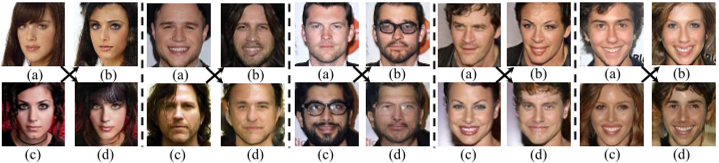

**1705.09966v2-Figure12-1.png**

- Caption: Fig. 12. Results without (c) and with (d) face verification loss. (a) is target identity image to be transferred and (b) is input image. The loss encourages subtle yet important improvement in photorealism, e.g. the eyebrows and eyes in (c) resemble the target identity in (a) by adding the face verification loss.
- Content type: figure
- Figure type: photograph(s)

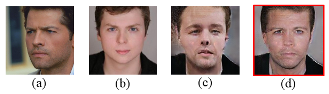

**1705.09966v2-Figure13-1.png**

- Caption: Fig. 13. Frontal face generation. Given a low-res template (a), our method can generate corresponding frontal faces from different side faces, e.g., (b) to (c), (d) to (e).
- Content type: figure
- Figure type: photograph(s)

**1705.09966v2-Figure14-1.png**

- Caption: Fig. 14. Interpolation results of the attribute vectors. (a) Low-res face input; (b) generated high-res face images; (c) to (k) interpolated results. Attributes of source and destination are shown in text.
- Content type: figure
- Figure type: ** photograph(s)

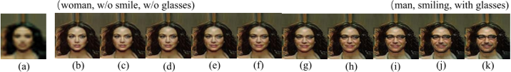

**1705.09966v2-Figure15-1.png**

- Caption: Fig. 15. Interpolating results of the identity feature vectors. Given the low-res input in (a), we randomly sample two target identity face images (b) and (k). (c) is the generated face from (a) conditioned on the identity in (b) and (d) to (j) are interpolations.
- Content type: figure
- Figure type: ** photograph(s)

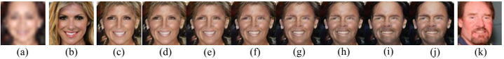

**1705.09966v2-Figure2-1.png**

- Caption: Fig. 2. Our Conditional CycleGAN for attribute-guided face generation. In contrast to the original CycleGAN, we embed an additional attribute vector z (e.g., blonde hair) which is associated with the input attribute image X to train a generator GY→X as well as the original GX→Y to generate high-res face image X̂ given the low-res input Y and the attribute vector z. Note the discriminators DX and DY are not shown for simplicity.
- Content type: figure
- Figure type: schematic

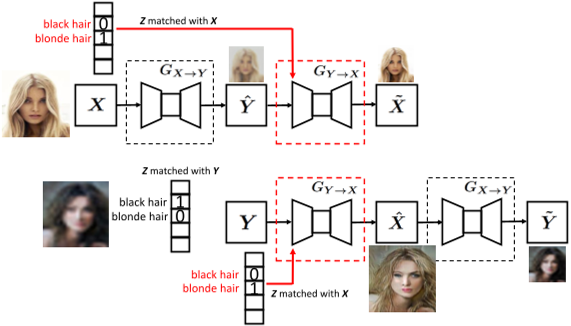

**1705.09966v2-Figure3-1.png**

- Caption: Fig. 3. Our Conditional CycleGAN for identity-guided face generation. Different from attribute-guided face generation, we incorporate a face verification network as both the source of conditional vector z and the proposed identity loss in an auxiliary discriminator DXaux . The network DXaux is pretrained. Note the discriminators DX and DY are not shown for simplicity.
- Content type: figure
- Figure type: ** Schematic

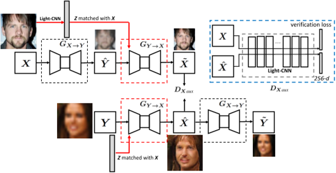

**1705.09966v2-Figure4-1.png**

- Caption: Fig. 4. From the low-res digit images (a), we can generate high-res digit images (b) to (k) subject to the conditional constrain from the digit class label in the first row.
- Content type: figure
- Figure type: photograph(s)

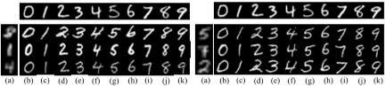

**1705.09966v2-Figure5-1.png**

- Caption: Fig. 5. Interpolation results of digits. Given the low-res inputs in (a), we randomly sample two digits (b) and (j). (c) is the generated results from (a) conditioned on the attribute of (b). Corresponding results of interpolating between attributes of (b) and (j) are shown in (d) to (i). We interpolate between the binary vectors of the digits.
- Content type: figure
- Figure type: ** photograph(s)

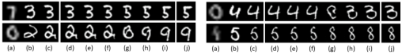

**1705.09966v2-Figure6-1.png**

- Caption: Fig. 6. Attribute-guided face generation. We flip one attribute label for each generated high-res face images, given the low-res face inputs. The 10 labels are: Bald, Bangs, Blond Hair, Gray Hair, Bushy Eyebrows, Eyeglasses, Male, Pale Skin, Smiling, Wearing Hat.
- Content type: figure
- Figure type: photograph(s)

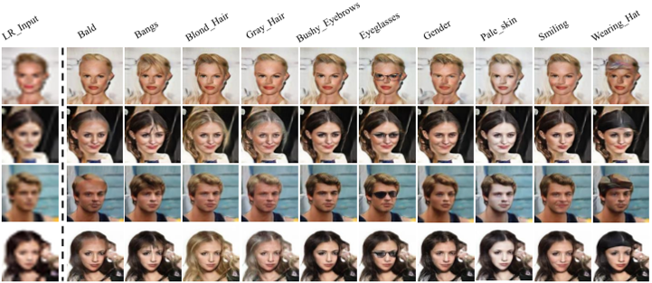

**1705.09966v2-Figure7-1.png**

- Caption: Fig. 7. Comparison with [13] by swapping facial attributes. Four paired examples are shown. Generally, our method can generate much better images compared to [13].
- Content type: figure
- Figure type: photograph(s)

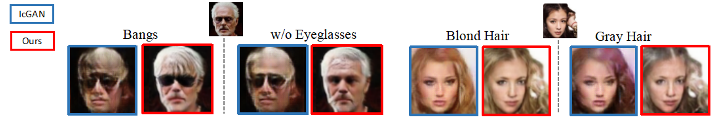

**1705.09966v2-Figure8-1.png**

- Caption: Fig. 8. Comparison results with [9]. Four source images are shown in top row. Images with blue and red bounding boxes indicates transferred results by [9] and results by our method, respectively.
- Content type: figure
- Figure type: photograph(s)

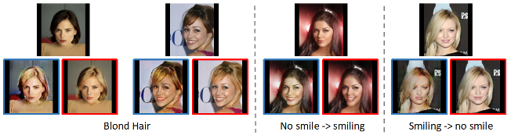

**1705.09966v2-Figure9-1.png**

- Caption: Fig. 9. Identity-guided face generation results on low-res input and high-res identity of the same person, i.e., identity-preserving face superresolution. (a) low-res inputs; (b) input identity of the same person; (c) our high-res face outputs (red boxes) from (a); (d) the high-res ground truth of (a).
- Content type: figure
- Figure type: photograph(s)

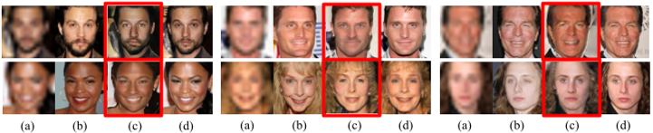

**1705.09966v2-Table1-1.png**

- Caption: Table 1. SSIM on CelebA test sets.
- Content type: table
- Figure type: N/A

### QAs (10)
**QA 1**

- Question: What is the role of the auxiliary discriminator $D_{X_{\textit{aux}}}$ in the Conditional CycleGAN for identity-guided face generation?
- Answer: The auxiliary discriminator $D_{X_{\textit{aux}}}$ helps to enforce the identity constraint in the generated image. It takes the generated image or the ground truth image as input and outputs a feature embedding. This embedding is then used to compute the identity loss, which encourages the generated image to have the same identity as the input image.
- Rationale: The figure shows that the auxiliary discriminator $D_{X_{\textit{aux}}}$ is connected to the generator $G_{Y \to X}$. The discriminator takes the generated image $\hat{X}$ or the ground truth image $X$ as input and outputs a 256-D feature embedding. This embedding is then compared to the conditional vector $z$, which encodes the identity of the input image. The identity loss is computed based on the difference between these two embeddings. This loss encourages the generator to produce images that have the same identity as the input image.
- References: 1705.09966v2-Figure3-1.png

Referenced images:

**QA 2**

- Question: How does the proposed method compare to the method in~\cite{kim2017learning}?
- Answer: The proposed method produces more realistic and natural-looking images than the method in~\cite{kim2017learning}.
- Rationale: The figure shows that the images generated by the proposed method (red bounding boxes) are more realistic and natural-looking than the images generated by the method in~\cite{kim2017learning} (blue bounding boxes). For example, in the first column, the proposed method is able to change the hair color of the woman to blonde while preserving her natural skin tone and facial features. In contrast, the method in~\cite{kim2017learning} produces an image with an unnatural skin tone and distorted facial features.
- References: 1705.09966v2-Figure8-1.png

Referenced images:

**QA 3**

- Question: Which of the methods among Conditional GAN, Unsupervised GAN and Consitional CycleGAN would you expect to produce images that are most visually similar to the real images in the CelebA dataset?
- Answer: The Conditional CycleGAN method is expected to produce images most visually similar to the real images.
- Rationale: Table 1 presents the SSIM scores for different image generation methods on the CelebA test set. SSIM measures the structural similarity between two images, with higher values indicating greater similarity. In this case, the Conditional CycleGAN method achieved the highest SSIM score of 0.92, suggesting that its generated images are most similar to the real images in terms of visual perception.
- References: 1705.09966v2-Table1-1.png

Referenced images:

**QA 4**

- Question: How does the proposed attribute-guided face generation method compare to conventional face super-resolution methods in terms of identity preservation?
- Answer: The proposed attribute-guided face generation method preserves the identity of the person in the high-resolution result, while conventional face super-resolution methods do not necessarily guarantee this.
- Rationale: The top row of Figure 1 shows an example of identity-preserving face super-resolution using the proposed method. The identity image of Ivanka Trump (a) is used to guide the generation of a high-resolution image (d) from a low-resolution input image (c). The generated image (d) clearly preserves the identity of Ivanka Trump, while the conventional face super-resolution method may not produce a result that is as faithful to the original identity.
- References: 1705.09966v2-Figure1-1.png

Referenced images:

**QA 5**

- Question: What role does the low-resolution input play in the identity-guided face generation process?
- Answer: The low-resolution input provides an overall shape constraint for the generated high-resolution image. The head pose and facial expression of the generated high-res images adopt those in the low-res inputs.
- Rationale: The figure shows that the generated high-resolution images (c) have the same head pose and facial expression as the low-resolution inputs (a), even when the target identity images (b) have different poses and expressions. For example, in the example inside the blue box in the last row of Figure 2, the target identity image (b) shows a man smiling, while the low-resolution input (a) shows another man with a closed mouth. The generated high-resolution image (c) preserves the identity of the man in (b) while the pose of the head and the mouth follow the input.
- References: 1705.09966v2-Figure9-1.png

Referenced images:

**QA 6**

- Question: What happens when there is a conflict between the low-res image and the feature vector?
- Answer: The generated high-res digit follows the given class label.
- Rationale: The passage states that "the generated high-res digit follows the given class label when there is conflict between the low-res image and feature vector." This is evident in Figure 1, where the generated high-res images (b) to (k) all match the class label in the first row, even though the low-res images (a) may not be clear.
- References: 1705.09966v2-Figure4-1.png

Referenced images:

**QA 7**

- Question: What is the difference between the input and output of the frontal face generation process?
- Answer: The input is a low-resolution frontal face image and a high-resolution side-face image. The output is a high-resolution frontal face image.
- Rationale: The figure shows that the input to the frontal face generation process is a low-resolution frontal face image and a high-resolution side-face image. The output is a high-resolution frontal face image that is consistent with the input side-face image.
- References: 1705.09966v2-Figure13-1.png

Referenced images:

**QA 8**

- Question: How does the proposed method preserve facial details and expression during face swapping?
- Answer: The proposed method utilizes Light-CNN as both the source of the identity features and face verification loss. This allows the method to transfer the appearance of eyes, eyebrows, hairs, etc., while keeping other factors intact, e.g., head pose, shape of face, and facial expression.
- Rationale: The figure shows that the proposed method can swap the identity of two people while preserving their facial details and expressions. For example, in the first row, the face of the woman in (a) is swapped with the face of the man in (c), but the woman's expression and facial features are still preserved in (b). Similarly, in the second row, the face of the man in (a) is swapped with the face of the woman in (c), but the man's expression and facial features are still preserved in (b).
- References: 1705.09966v2-Figure11-1.png

Referenced images:

**QA 9**

- Question: How does the proposed method compare to icGAN in terms of generating images with different hair colors?
- Answer: The proposed method is able to generate images with different hair colors more accurately than icGAN.
- Rationale: The figure shows that the proposed method is able to generate images with different hair colors that are more faithful to the input image than icGAN. For example, in the example with blonde hair, the proposed method is able to generate an image with blonde hair that is very similar to the input image, while icGAN generates an image with a different hair color.
- References: 1705.09966v2-Figure7-1.png

Referenced images:

**QA 10**

- Question: What is the role of the attribute vector $z$ in the Conditional CycleGAN network?
- Answer: The attribute vector $z$ provides additional information about the desired attributes of the generated high-resolution face image $\hat{X}$. This information is used by the generator networks $G_{X \to Y}$ and $G_{Y \to X}$ to generate images that are more consistent with the desired attributes.
- Rationale: The figure shows how the attribute vector $z$ is used as input to both generator networks. The generator network $G_{X \to Y}$ uses the attribute vector $z$ to generate a low-resolution face image $Y$ that has the desired attributes. The generator network $G_{Y \to X}$ then uses the attribute vector $z$ and the low-resolution face image $Y$ to generate a high-resolution face image $\hat{X}$ that has the desired attributes.
- References: 1705.09966v2-Figure2-1.png

Referenced images:

---
## Paper: 1706.03847v3
Semantic Scholar ID: 1706.03847v3

### Figures/Tables (9)
**1706.03847v3-Figure1-1.png**

- Caption: Mini-batch based negative sampling.
- Content type: figure
- Figure type: schematic

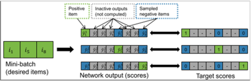

**1706.03847v3-Figure2-1.png**

- Caption: Median negative gradients of BPR and BPR-max w.r.t. the target score against the rank of the target item. Left: only minibatch samples are used (minibatch size: 32); Center: 2048 additional negative samples were added to the minibatch samples; Right: same setting as the center, focusing on ranks 0-200.
- Content type: figure
- Figure type: plot

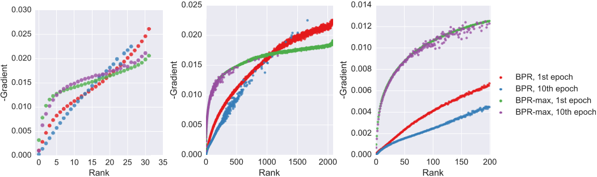

**1706.03847v3-Figure3-1.png**

- Caption: Recommendation accuracy with additional samples on the CLASS dataset. "ALL"means that there is no sampling, but scores are computed for all items in every step.
- Content type: figure
- Figure type: plot.

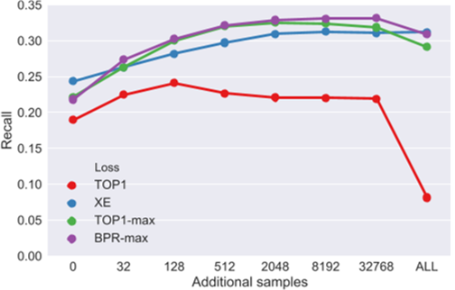

**1706.03847v3-Figure4-1.png**

- Caption: Training times with different sample sizes on the CLASS dataset.
- Content type: figure
- Figure type: plot

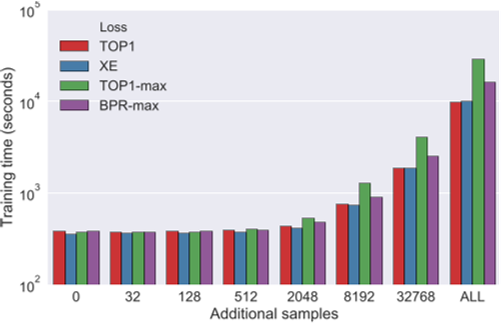

**1706.03847v3-Figure5-1.png**

- Caption: The effect of the alpha parameter on recommendation accuracy at different sample sizes on the CLASS dataset. Left: cross-entropy loss; Middle: TOP1-max loss; Right: BPR-max loss.
- Content type: figure
- Figure type: plot

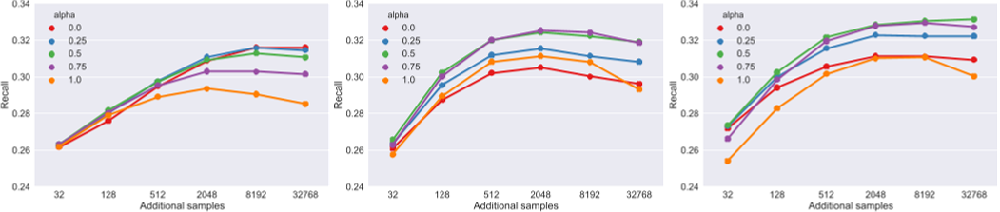

**1706.03847v3-Figure6-1.png**

- Caption: Performance of GRU4Rec relative to the baseline in the online A/B test.
- Content type: figure
- Figure type: plot

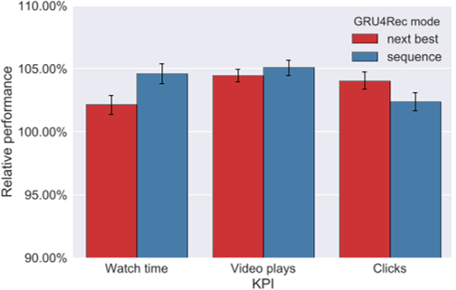

**1706.03847v3-Table1-1.png**

- Caption: Table 1: Properties of the datasets.
- Content type: table
- Figure type: N/A

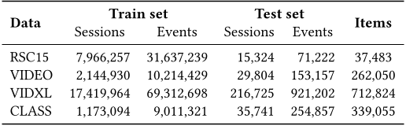

**1706.03847v3-Table2-1.png**

- Caption: Table 2: Recommendation accuracy with additional samples and different loss functions compared to item-kNN and the original GRU4Rec. Improvements over item-kNN and the original GRU4Rec (with TOP1 loss) results are shown in parentheses. Best results are typeset bold.
- Content type: table
- Figure type: N/A

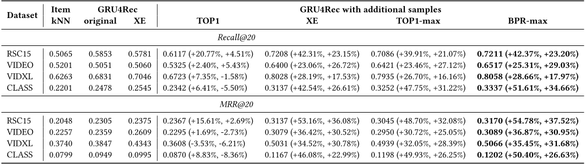

**1706.03847v3-Table3-1.png**

- Caption: Results with unified embeddings. Relative improvement over the same network without unified item representation is shown in the parentheses.
- Content type: table
- Figure type: table

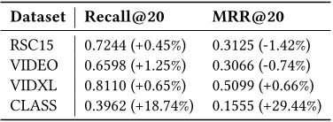

### QAs (8)
**QA 1**

- Question: How does the alpha parameter affect recommendation accuracy for different sample sizes on the CLASS dataset?
- Answer: The alpha parameter generally increases recommendation accuracy as the sample size increases. However, the effect of alpha varies depending on the loss function used. For cross-entropy loss, alpha has a relatively small effect on accuracy. For TOP1-max loss, alpha has a larger effect on accuracy, especially for smaller sample sizes. For BPR-max loss, alpha has a very large effect on accuracy, with higher values of alpha leading to much higher accuracy.
- Rationale: The figure shows the recall of the recommendation system for different values of alpha and different sample sizes. The recall is a measure of how well the system recommends relevant items. The figure shows that the recall generally increases as the sample size increases, and that the effect of alpha varies depending on the loss function used.
- References: 1706.03847v3-Figure5-1.png

Referenced images:

**QA 2**

- Question: Which combination of method and dataset achieved the highest Recall@20 score, and how much higher was it compared to the original GRU4Rec model?
- Answer: The highest Recall@20 score was achieved by the GRU4Rec with additional samples and BPR-max loss function on the RSC15 dataset. This score was 42.37% higher than the Recall@20 score of the original GRU4Rec model on the same dataset.
- Rationale: The table presents Recall@20 scores for different combinations of methods and datasets. By looking at the row for the RSC15 dataset and the column for the BPR-max loss function within the "GRU4Rec with additional samples" section, we can find the highest score (0.7211). The percentage improvement over the original GRU4Rec is also provided in parentheses within the same cell (+42.37%).
- References: 1706.03847v3-Table2-1.png

Referenced images:

**QA 3**

- Question: What is the performance of GRU4Rec relative to the baseline in terms of watch time?
- Answer: GRU4Rec has a slightly higher performance than the baseline in terms of watch time.
- Rationale: The bar for GRU4Rec in the "Watch time" category is slightly higher than the bar for the baseline.
- References: 1706.03847v3-Figure6-1.png

Referenced images:

**QA 4**

- Question: Which dataset contains the most interactions (events) in the training set and how much larger is it compared to the dataset with the least interactions in the training set?
- Answer: The VIDXL dataset contains the most interactions (events) in the training set with 69,312,698 events. This is roughly 7.7 times larger than the RSC15 dataset, which has the least interactions (9,011,321) in the training set.
- Rationale: By looking at the "Events" column under the "Train set" section of Table 1, we can compare the number of interactions for each dataset. VIDXL clearly has the highest number, while RSC15 has the lowest. To determine the relative size difference, we simply divide the number of events in VIDXL by the number of events in RSC15 (69,312,698 / 9,011,321 ≈ 7.7).
- References: 1706.03847v3-Table1-1.png

Referenced images:

**QA 5**

- Question: What is the purpose of negative sampling?
- Answer: Negative sampling is a technique used to reduce the number of negative examples that need to be considered during training.
- Rationale: The figure shows how negative sampling works. A mini-batch of desired items is fed into the network, and the network outputs a score for each item. The target scores are then computed, with a score of 1 for the positive item and a score of 0 for all other items. However, instead of considering all negative items, only a small number of negative items are sampled. This reduces the computational cost of training while still providing a good approximation of the true loss function.
- References: 1706.03847v3-Figure1-1.png

Referenced images:

**QA 6**

- Question: How does the training time of the different losses change as the number of additional samples increases?
- Answer: The training time of all losses increases as the number of additional samples increases.
- Rationale: The figure shows the training time of different losses on the y-axis and the number of additional samples on the x-axis. As the number of additional samples increases, the training time for all losses also increases. This is because the model has to process more data as the number of samples increases, which takes more time.
- References: 1706.03847v3-Figure4-1.png

Referenced images:

**QA 7**

- Question: Which dataset has the highest Recall@20 and MRR@20?
- Answer: VIDXL has the highest Recall@20 and MRR@20.
- Rationale: The table shows the Recall@20 and MRR@20 for four different datasets. VIDXL has the highest values for both metrics.
- References: 1706.03847v3-Table3-1.png

Referenced images:

**QA 8**

- Question: How does the addition of negative samples affect the gradient of BPR and BPR-max with respect to the target score?
- Answer: The addition of negative samples increases the gradient of BPR and BPR-max with respect to the target score.
- Rationale: The plots in the center and right panels of the figure show that the gradients of BPR and BPR-max are higher when 2048 additional negative samples are added to the minibatch samples (center and right panels) than when only minibatch samples are used (left panel).
- References: 1706.03847v3-Figure2-1.png

Referenced images:

---
## Paper: 1707.00189v3
Semantic Scholar ID: 1707.00189v3

### Figures/Tables (2)
**1707.00189v3-Table1-1.png**

- Caption: Table 1: Ranking performance when trained using contentbased sources (NYT and Wiki). Significant differences compared to the baselines ([B]M25, [W]T10, [A]OL) are indicated with ↑ and ↓ (paired t-test, p < 0.05).
- Content type: table
- Figure type: N/A

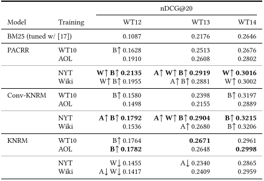

**1707.00189v3-Table2-1.png**

- Caption: Table 2: Ranking performance using filtered NYT and Wiki. Significant improvements and reductions compared to unfiltered dataset aremarkedwith ↑ and ↓ (paired t-test,p < 0.05).
- Content type: table
- Figure type: N/A

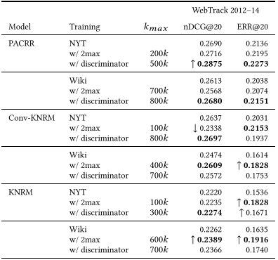

### QAs (1)
**QA 1**

- Question: Which model performs best when trained on the NYT dataset and evaluated on the WT14 dataset, and how does its performance compare to the baselines?
- Answer: The Conv-KNRM model performs best when trained on the NYT dataset and evaluated on the WT14 dataset, achieving an nDCG@20 score of 0.3215. This performance is significantly better than all the baselines: BM25 (B), WT10 (W), and AOL (A).
- Rationale: Looking at the "WT14" column and the row corresponding to "NYT" under each model, we can compare the nDCG@20 scores. Conv-KNRM has the highest score (0.3215) in that column. The upward arrows next to the score indicate that this performance is statistically significantly better than all the baselines according to a paired t-test.
- References: 1707.00189v3-Table1-1.png

Referenced images:

---
## Paper: 1707.06320v2
Semantic Scholar ID: 1707.06320v2

### Figures/Tables (6)
**1707.06320v2-Figure1-1.png**

- Caption: Model architecture: predicting either an image (Cap2Img), an alternative caption (Cap2Cap), or both at the same time (Cap2Both).
- Content type: figure
- Figure type: schematic

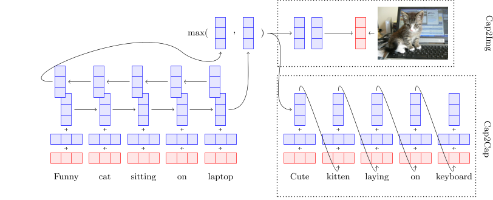

**1707.06320v2-Table1-1.png**

- Caption: Table 1: Retrieval (higher is better) results on COCO, plus median rank (MEDR) and mean rank (MR) (lower is better). Note that while this work underwent review, better methods have been published, most notably VSE++ (Faghri et al., 2017).
- Content type: table
- Figure type: N/A

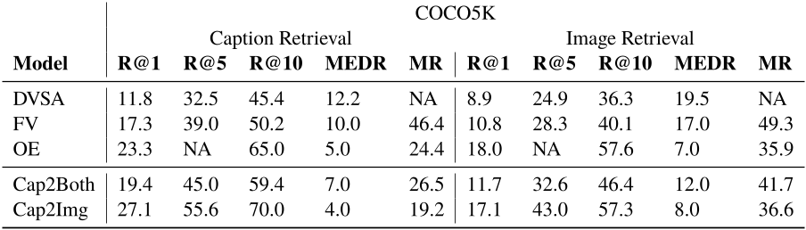

**1707.06320v2-Table2-1.png**

- Caption: Table 2: Accuracy results on sentence classification and entailment tasks.
- Content type: table
- Figure type: N/A

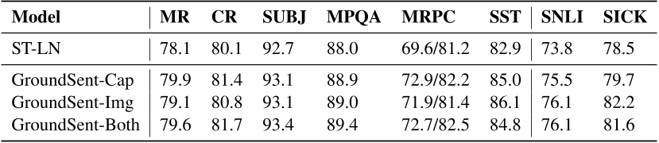

**1707.06320v2-Table3-1.png**

- Caption: Table 3: Thorough investigation of the contribution of grounding, ensuring equal number of components and identical architectures, on the variety of sentence-level semantic benchmark tasks. STb=SkipThought-like model with bidirectional LSTM+max. 2×STb-1024=ensemble of 2 different STb models with different initializations. GroundSent is STb-1024+Cap2Cap/Img/Both. We find that performance improvements are sometimes due to having more parameters, but in most cases due to grounding.
- Content type: table
- Figure type: N/A

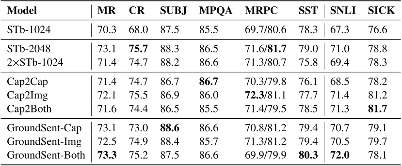

**1707.06320v2-Table4-1.png**

- Caption: Table 4: Mean and variance of dataset concreteness, over all words in the datasets.
- Content type: table
- Figure type: N/A

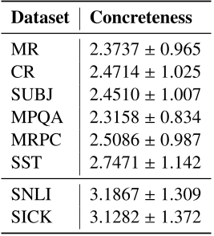

**1707.06320v2-Table5-1.png**

- Caption: Table 5: Spearman ρs correlation on four standard semantic similarity evaluation benchmarks.
- Content type: table
- Figure type: N/A

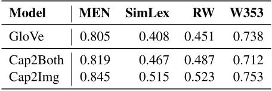

### QAs (5)
**QA 1**

- Question: Which model performs the best for caption retrieval in terms of R@1 and MEDR? Briefly explain why the performance might be better than other models.
- Answer: Cap2Img performs the best for caption retrieval in terms of both R@1 (27.1) and MEDR (4.0). This suggests that the model is more successful at retrieving the most relevant caption for a given image compared to other models.
- Rationale: The table shows the performance of different models on the COCO5K caption retrieval task. R@1 measures the percentage of times the correct caption is ranked first, while MEDR indicates the median rank of the correct caption across all searches. Cap2Img has the highest R@1 and lowest MEDR, suggesting it excels at finding the most relevant caption. This might be because Cap2Img focuses solely on predicting image features from captions, allowing it to specialize in this task, while Cap2Both, which considers both image and caption prediction, might face optimization challenges due to interference between the two signals.
- References: 1707.06320v2-Table1-1.png

Referenced images:

**QA 2**

- Question: Which type of grounding appears to be most beneficial for the MRPC task, and how does its performance compare to the baseline model (ST-LN)?
- Answer: GroundSent-Cap appears to be most beneficial for the MRPC task, achieving an accuracy of 72.9/82.2 compared to the baseline model ST-LN's 69.6/81.2.
- Rationale: Table 1 presents the accuracy results for different models on various semantic classification and entailment tasks. The MRPC task results are shown in the fifth column. Comparing the scores of different models on this task, we can see that GroundSent-Cap outperforms the others, including the baseline model ST-LN, by a small margin. This suggests that grounding with captions is particularly helpful for the MRPC task.
- References: 1707.06320v2-Table2-1.png

Referenced images:

**QA 3**

- Question: Which model performs best on the SNLI dataset, and how much does grounding contribute to its performance compared to the baseline STb-1024 model?
- Answer: The GroundSent-Both model performs best on the SNLI dataset, achieving an accuracy of 72.0%. Grounding contributes to an improvement of 4.7% compared to the baseline STb-1024 model, which achieves 67.3%.
- Rationale: The table displays the performance of different models on various datasets, including SNLI. By comparing the accuracy of the GroundSent-Both model (with grounding) to the STb-1024 model (without grounding), we can determine the contribution of grounding to the performance improvement.
- References: 1707.06320v2-Table3-1.png

Referenced images:

**QA 4**

- Question: How do the word embeddings learned by the Cap2Img model compare to the original GloVe embeddings in terms of semantic similarity?
- Answer: The word embeddings learned by the Cap2Img model outperform the original GloVe embeddings in terms of semantic similarity.
- Rationale: Table 1 shows the Spearman correlation scores for different word embedding models on four standard semantic similarity benchmarks. A higher correlation score indicates better performance in capturing semantic similarity. Comparing the scores of Cap2Img and GloVe across all four benchmarks, we see that Cap2Img consistently achieves higher scores. This suggests that the grounded word projections learned by the Cap2Img model lead to word embeddings that better capture semantic relationships compared to the original GloVe embeddings.
- References: 1707.06320v2-Table5-1.png

Referenced images:

**QA 5**

- Question: What is the role of the "max" function in the model architecture?
- Answer: The "max" function is used to select the most probable word at each time step in the decoding process.
- Rationale: The figure shows that the "max" function is applied to the output of the LSTM at each time step. This selects the word with the highest probability, which is then used as input to the next time step.
- References: 1707.06320v2-Figure1-1.png

Referenced images:

---
## Paper: 1708.02153v2
Semantic Scholar ID: 1708.02153v2

### Figures/Tables (5)
**1708.02153v2-Figure1-1.png**

- Caption: Parzen violates monotonicity; the point of interest ~x0 is marked with a green circle. Its influence is the slope of the blue arrow above it.
- Content type: figure
- Figure type: plot

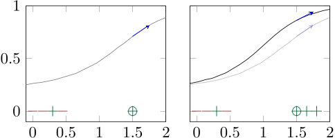

**1708.02153v2-Table1-1.png**

- Caption: Table 1: Influence of two different points of interest (POI)
- Content type: table
- Figure type: N/A

**1708.02153v2-Table2-1.png**

- Caption: Table 2: Influence of ten different points of interest computed with the same parameters as in the main paper (Parzen: σ = 4.7);Lime: Euclidean distance and 3.0 kernel width).
- Content type: table
- Figure type: N/A

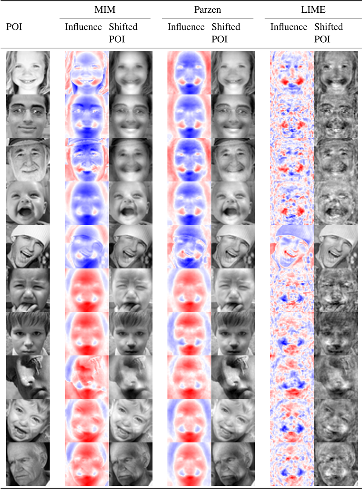

**1708.02153v2-Table3-1.png**

- Caption: Table 3: The effect of different parameters and different distance measures.
- Content type: table
- Figure type: N/A

**1708.02153v2-Table4-1.png**

- Caption: Table 4: Two example results of MIM influence measurement. Age is given in decades, features 5, 11, 12 and 13 are binary.
- Content type: table
- Figure type: N/A

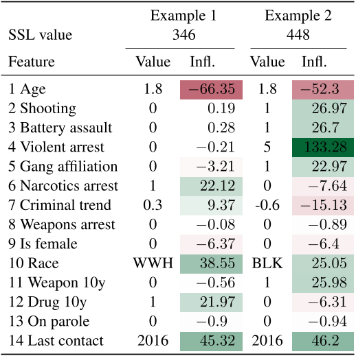

### QAs (3)
**QA 1**

- Question: How does increasing the parameter value (ρ for LIME with Euclidean distance, μ for LIME with cosine similarity, and σ for Parzen) seem to affect the influence vectors?
- Answer: As the parameter value increases, the influence vectors generally become smoother and less noisy.
- Rationale: Table 2 showcases the influence vectors and shifted POIs for different parameter values within each method (LIME with Euclidean distance, LIME with cosine similarity, and Parzen). By visually comparing the "Influence" images across increasing parameter values within each section, we can see a general trend of the influence vectors becoming less jagged and exhibiting smoother transitions. This suggests that higher parameter values lead to smoother and less noisy influence vectors.
- References: 1708.02153v2-Table3-1.png

Referenced images:

**QA 2**

- Question: Which explanation method seems to place the most emphasis on specific, localized features rather than smooth, gradual changes in pixel intensity?
- Answer: LIME appears to place the most emphasis on specific, localized features.
- Rationale: The passage describes the LIME influence visualization as "more 'shattered' compared to MIM and Parzen," indicating a less smooth and more focused influence pattern. This suggests that LIME assigns higher importance to specific pixels or small groups of pixels, rather than considering gradual changes in intensity across larger areas. 

This observation is further supported by the visual comparison of the "Shifted" images in the table. While MIM and Parzen result in relatively smooth shifts in brightness, LIME's shifted images show more abrupt changes and sharper contrasts, suggesting a stronger focus on specific features.
- References: 1708.02153v2-Table1-1.png

Referenced images:

**QA 3**

- Question: Explain why the "Last contact" feature has a significant positive influence on the SSL score in both examples, even though it is not directly used by the SSL algorithm.
- Answer: The "Last contact" feature shows a strong positive influence on the SSL score because it is likely correlated with other features that are used by the algorithm. As the passage mentions, data-driven methods like MIM can assign influence to features that are not directly used by the model if they are correlated with other influential features. In this case, a recent "Last contact" date might be correlated with a higher number of recent offenses or other factors that contribute to a higher SSL score.
- Rationale: Table 1 shows the "Infl." value for "Last contact" is positive and relatively large in both examples (45.32 and 46.2), indicating a significant positive influence on the SSL score. However, the passage clarifies that the SSL algorithm itself does not directly use this feature. This apparent contradiction can be explained by the fact that "Last contact" might be correlated with other features that are used by the algorithm and contribute to a higher score.
- References: 1708.02153v2-Table4-1.png

Referenced images:

---
## Paper: 1709.00139v4
Semantic Scholar ID: 1709.00139v4

### Figures/Tables (2)
**1709.00139v4-Figure1-1.png**

- Caption: F-1 Measure for Different Data Sets
- Content type: figure
- Figure type: plot

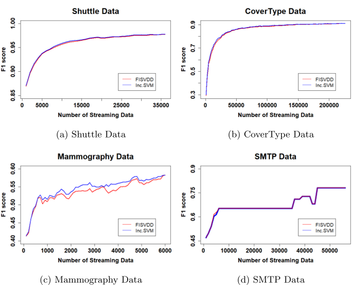

**1709.00139v4-Table1-1.png**

- Caption: Table 1: Experimental Results of FISVDD and Incremental SVM on Different Data Sets
- Content type: table
- Figure type: N/A

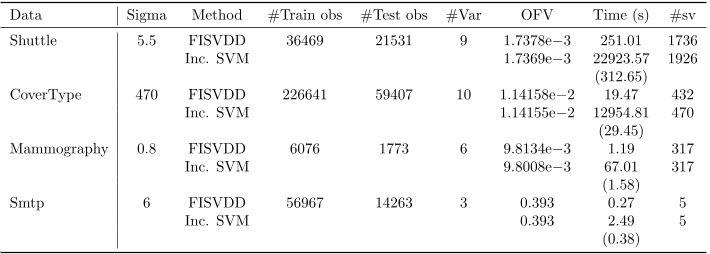

### QAs (1)
**QA 1**

- Question: Which method generally achieved a lower objective function value (OFV) for the different datasets, FISVDD or Incremental SVM? Does this imply that one method is definitively better than the other?
- Answer: For all datasets presented, Incremental SVM achieved a slightly lower OFV compared to FISVDD. However, this does not necessarily mean that Incremental SVM is definitively better.
- Rationale: The table shows that the OFV values for both methods are very close for each dataset. While Incremental SVM consistently has a lower value, the difference is minimal. Additionally, the passage mentions that FISVDD offers significant gains in efficiency, as evidenced by the significantly shorter training times shown in the table. Therefore, the slight decrease in OFV achieved by Incremental SVM might not outweigh its significantly longer training time, making FISVDD a potentially more attractive option depending on the specific needs of the application.
- References: 1709.00139v4-Table1-1.png

Referenced images:

---
## Paper: 1710.01507v4
Semantic Scholar ID: 1710.01507v4

### Figures/Tables (2)
**1710.01507v4-Figure1-1.png**

- Caption: Model Architecture
- Content type: figure
- Figure type: schematic

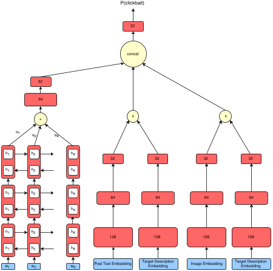

**1710.01507v4-Table1-1.png**

- Caption: Model Performance Comparison
- Content type: table
- Figure type: table

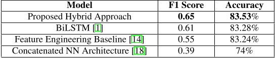

### QAs (1)
**QA 1**

- Question: What is the role of the LSTM network in the model architecture?
- Answer: The LSTM network is used to process the post text and generate a post text embedding.
- Rationale: The LSTM network is shown in the left-hand side of the figure. It takes the post text as input and outputs a post text embedding. This embedding is then used as input to the fully connected layers that predict the probability of clickbait.
- References: 1710.01507v4-Figure1-1.png

Referenced images:

---
## Paper: 1802.07351v2
Semantic Scholar ID: 1802.07351v2

### Figures/Tables (16)
**1802.07351v2-Figure1-1.png**

- Caption: Artifacts of using image warping. From (d), we can see the duplicates of the dragon head and wings. The images and the ground truth optical flow are from the Sintel dataset [5]. Warping is done with function image.warp() in the Torch-image toolbox.
- Content type: figure
- Figure type: 

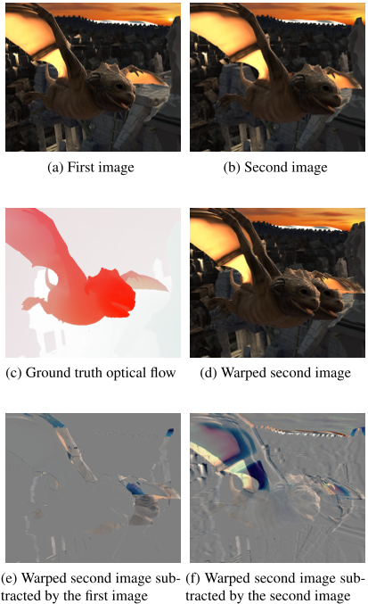

**1802.07351v2-Figure10-1.png**

- Caption: KITTI 2015 (training set). Green arrows indicate the small object that moves fast.
- Content type: figure
- Figure type: photograph(s)

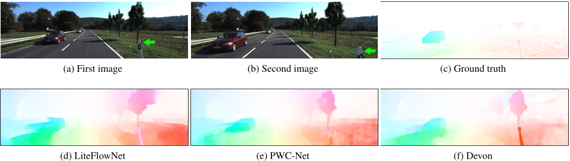

**1802.07351v2-Figure2-1.png**

- Caption: Cost Volumes
- Content type: figure
- Figure type: schematic

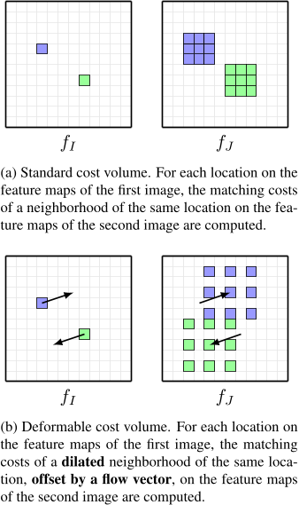

**1802.07351v2-Figure3-1.png**

- Caption: Deformable Volume Network (Devon) with three stages. I denotes the first image, J denotes the second image, f denotes the encoding module (§4.1), Rt denotes the relation module (§4.2), gt denotes the decoding module (§4.3) and Ft denotes the estimated optical flow for stage t.
- Content type: figure
- Figure type: ** schematic

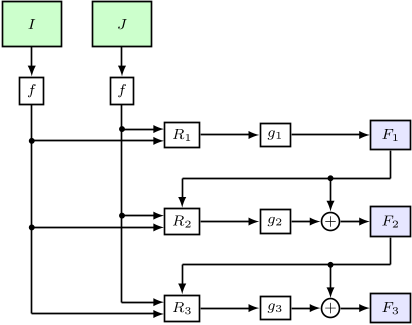

**1802.07351v2-Figure4-1.png**

- Caption: Encoding module f . The residual connection denotes the output of a layer is added to the output of another layer.
- Content type: figure
- Figure type: schematic

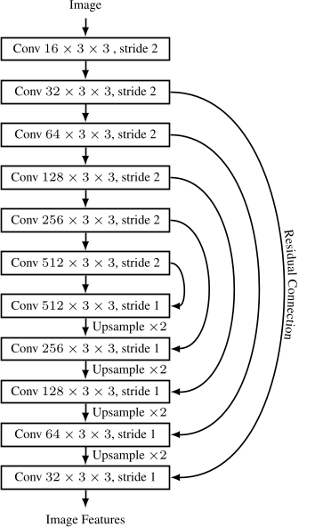

**1802.07351v2-Figure5-1.png**

- Caption: Relation module R. C1 ∼ C5 denote the deformable cost volumes. k1 ∼ k5 denote the neighborhood sizes. r1 ∼ r5 denote the dilation rates. Concat denotes concatenation. Norm denotes normalization.
- Content type: figure
- Figure type: schematic

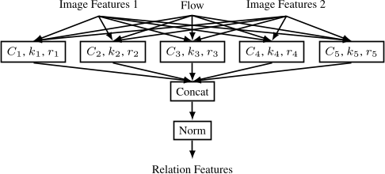

**1802.07351v2-Figure6-1.png**

- Caption: Concatenation of deformable cost volumes creates a retinal structure of correspondences. In this example, three cost volumes of neighborhood sizes (k1, k2, k3) = (3, 5, 3) and dilation rates (r1, r2, r3) = (1, 2, 7) respectively are concatenated.
- Content type: figure
- Figure type: schematic

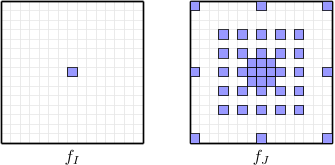

**1802.07351v2-Figure7-1.png**

- Caption: Decoding module g. The residual connection denotes the output of a layer is added to the output of another layer.
- Content type: figure
- Figure type: schematic

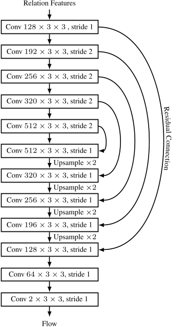

**1802.07351v2-Figure8-1.png**

- Caption: FlyingChairs (validation set). Green arrows indicate the small object that moves fast.
- Content type: figure
- Figure type: photograph(s)

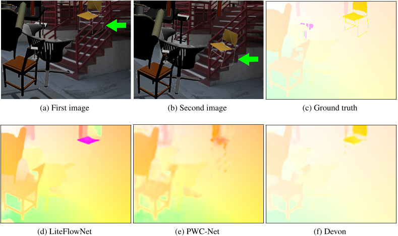

**1802.07351v2-Figure9-1.png**

- Caption: Sintel (training set). Green arrows indicate the small object that moves fast.
- Content type: figure
- Figure type: photograph(s)

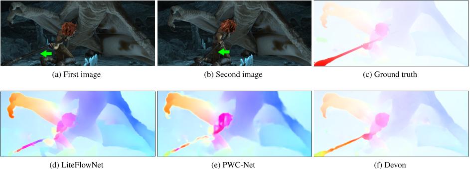

**1802.07351v2-Table1-1.png**

- Caption: Table 1. Hyperparameters of deformable cost volumes in Devon.
- Content type: table
- Figure type: N/A

**1802.07351v2-Table2-1.png**

- Caption: Table 2. Results on Sintel (end-point error). (ft) denotes the finetuning.
- Content type: table
- Figure type: N/A

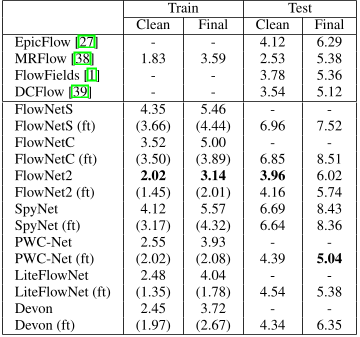

**1802.07351v2-Table3-1.png**

- Caption: Table 3. Detailed results on Sintel (end-point error) for different distances from motion boundaries (d) and velocities (s).
- Content type: table
- Figure type: N/A

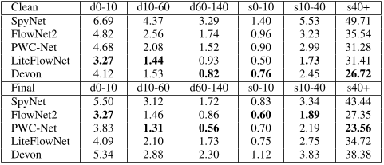

**1802.07351v2-Table4-1.png**

- Caption: Table 4. Results on KITTI. (ft) denotes the fine-tuning. EPE denotes end-point error. Fl-all denotes the ratio of pixels where the flow estimate is incorrect by both ≥ 3 pixels and ≥ 5%.
- Content type: table
- Figure type: N/A

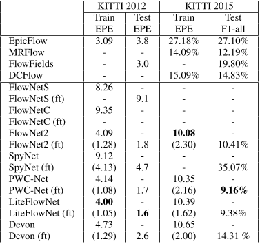

**1802.07351v2-Table5-1.png**

- Caption: Table 5. Results of ablation experiments after training on FlyingChairs (end-point error).
- Content type: table
- Figure type: N/A

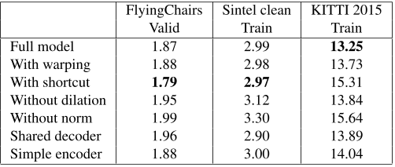

**1802.07351v2-Table6-1.png**

- Caption: Table 6. Runtime (ms).
- Content type: table
- Figure type: N/A

### QAs (11)
**QA 1**

- Question: What is the purpose of the residual connection in the decoding module?
- Answer: The residual connection allows the output of a layer to be added to the output of another layer, which helps to improve the flow of information through the network.
- Rationale: The figure shows a schematic of the decoding module, and the residual connection is labeled as such.
- References: 1802.07351v2-Figure7-1.png

Referenced images:

**QA 2**

- Question: What are the differences between the results of the three methods, LiteFlowNet, PWC-Net, and Devon, compared to the ground truth?
- Answer: LiteFlowNet, PWC-Net, and Devon all produce results that are similar to the ground truth, but there are some subtle differences. For example, LiteFlowNet tends to overestimate the motion of the small object, while PWC-Net and Devon tend to underestimate it. Additionally, all three methods produce some artifacts around the edges of the moving object.
- Rationale: The figure shows the results of three different methods for estimating optical flow, compared to the ground truth. The ground truth is the actual motion of the objects in the scene, and the other methods are trying to estimate this motion. The figure shows that all three methods are able to estimate the motion of the objects fairly accurately, but there are some differences between the results.
- References: 1802.07351v2-Figure9-1.png

Referenced images:

**QA 3**

- Question: What is the difference between a standard cost volume and a deformable cost volume?
- Answer: A standard cost volume computes the matching costs for a neighborhood of the same location on the feature maps of the first and second images. A deformable cost volume computes the matching costs for a dilated neighborhood of the same location on the feature maps of the first and second images, offset by a flow vector.
- Rationale: The figure shows the difference between a standard cost volume and a deformable cost volume. In the standard cost volume, the matching costs are computed for a fixed neighborhood around each location. In the deformable cost volume, the matching costs are computed for a neighborhood that is offset by a flow vector, which allows for more flexibility in matching features.
- References: 1802.07351v2-Figure2-1.png

Referenced images:

**QA 4**

- Question: Based on the ablation study, which modification to the Devon model architecture had the most significant negative impact on performance for the KITTI 2015 dataset?
- Answer: Removing the normalization in the relation modules had the most significant negative impact on performance for the KITTI 2015 dataset.
- Rationale: Table 1 shows the results of various modifications to the Devon model architecture on different datasets. For the KITTI 2015 dataset, the "Without norm" configuration resulted in the highest end-point error of 15.64, which is considerably higher than the baseline model's error of 13.25. This indicates that removing the normalization significantly reduces the model's accuracy on this particular dataset.
- References: 1802.07351v2-Table5-1.png

Referenced images:

**QA 5**

- Question: Which modification to the Devon model resulted in the fastest processing time for both forward and backward passes, and how much faster was it compared to the full model in terms of the backward pass?
- Answer: The "Without dilation" configuration resulted in the fastest processing time for both forward and backward passes. It was approximately 29.43 ms faster than the full model in terms of the backward pass (147.74 ms vs. 177.17 ms).
- Rationale: Table 1 shows the runtime (in milliseconds) for different configurations of the Devon model. The "Without dilation" configuration has the lowest values in both the "Forward" and "Backward" columns, indicating the fastest processing time in both directions. The difference between the "Without dilation" and "Full model" values in the "Backward" column (177.17 - 147.74) gives us the improvement in processing time.
- References: 1802.07351v2-Table6-1.png

Referenced images:

**QA 6**

- Question: What is the purpose of the residual connection in the encoding module?
- Answer: The residual connection adds the output of a layer to the output of another layer, which helps to prevent the vanishing gradient problem.
- Rationale: The figure shows that the residual connection connects the output of the Conv 512 × 3 × 3, stride 2 layer to the output of the Conv 512 × 3 × 3, stride 1 layer. This allows the gradient to flow more easily through the network, which can help to improve training performance.
- References: 1802.07351v2-Figure4-1.png

Referenced images:

**QA 7**

- Question: What is the role of the relation module (Rt) in the Deformable Volume Network (Devon)?
- Answer: The relation module (Rt) is responsible for capturing the spatial relationships between the features extracted from the first and second images.
- Rationale: The figure shows that the relation module (Rt) takes as input the features extracted from the encoding module (f) for both the first and second images. The output of the relation module is then fed into the decoding module (gt). This suggests that the relation module is used to compute some kind of similarity or correspondence between the features of the two images.
- References: 1802.07351v2-Figure3-1.png

Referenced images:

**QA 8**

- Question: Explain the rationale behind using five deformable cost volumes with different hyperparameter settings in Devon's relation module.
- Answer: The five deformable cost volumes in Devon's relation module are designed to capture multi-scale motion by combining dense correspondences near the image center with sparser correspondences in the periphery. This is achieved by using different neighborhood sizes (k) and dilation rates (r) for each cost volume, as shown in Table 1. Smaller neighborhood sizes and dilation rates result in denser correspondences, focusing on finer details and small displacements, while larger values capture broader context and larger motions.
- Rationale: Table 1 shows that the first four cost volumes share the same neighborhood size (k=5) but have increasing dilation rates (r = 1, 3, 8, 12). This suggests a focus on increasingly larger displacements while maintaining a relatively dense sampling. The fifth cost volume, however, uses a larger neighborhood size (k=9) and the largest dilation rate (r=20), indicating a focus on capturing sparse correspondences and large motions in the image periphery. This multi-scale approach aligns with the observation that small displacements are more frequent in natural videos and mimics the structure of the retina, which has higher resolution near the center and lower resolution in the periphery.
- References: 1802.07351v2-Table1-1.png

Referenced images:

**QA 9**

- Question: Based on the table, which model achieved the best performance on the KITTI 2015 test set in terms of F1-all score, and how does its performance compare to Devon (ft) on the same dataset?
- Answer: PWC-Net (ft) achieved the best performance on the KITTI 2015 test set with an F1-all score of 9.16%. This is significantly better than Devon (ft), which achieved an F1-all score of 14.31% on the same dataset.
- Rationale: The table shows the performance of different models on the KITTI 2015 dataset, including both training and testing sets. The F1-all score is listed for each model on the test set. By comparing the F1-all scores, we can see that PWC-Net (ft) has the lowest score, indicating the best performance. Additionally, we can directly compare the F1-all scores of PWC-Net (ft) and Devon (ft) to see that PWC-Net (ft) performs significantly better.
- References: 1802.07351v2-Table4-1.png

Referenced images:

**QA 10**

- Question: Based on the table, which method performs best on the Sintel "Final" test set, and how does its performance compare to Devon (ft) on the same set?
- Answer: PWC-Net (ft) performs best on the Sintel "Final" test set with an error of 5.04. Devon (ft) has a higher error of 6.35 on the same set.
- Rationale: The table shows the end-point error for various methods on both the "Clean" and "Final" versions of the Sintel test set. The lowest error value indicates the best performance. Comparing the values in the "Final" column, we can see PWC-Net (ft) has the lowest error (5.04), while Devon (ft) has a higher error of 6.35.
- References: 1802.07351v2-Table2-1.png

Referenced images:

**QA 11**

- Question: Which of the three methods, LiteFlowNet, PWC-Net, or Devon, most accurately predicts the motion of the small object in the scene?
- Answer: Devon.
- Rationale: The ground truth image shows the actual motion of the small object, which is indicated by the green arrows. Devon's prediction is closest to the ground truth, as it correctly predicts the direction and magnitude of the object's motion. LiteFlowNet and PWC-Net, on the other hand, underestimate the object's motion.
- References: 1802.07351v2-Figure8-1.png

Referenced images:

---
## Paper: 1803.03467v4
Semantic Scholar ID: 1803.03467v4

### Figures/Tables (14)
**1803.03467v4-Figure1-1.png**

- Caption: Illustration of knowledge graph enhanced movie recommender systems. The knowledge graph provides fruitful facts and connections among items, which are useful for improving precision, diversity, and explainability of recommended results.
- Content type: figure
- Figure type: ** Schematic

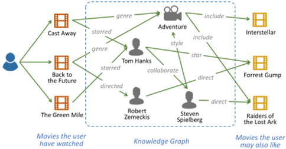

**1803.03467v4-Figure2-1.png**

- Caption: Figure 2: The overall framework of theRippleNet. It takes one user and one item as input, and outputs the predicted probability that the user will click the item. The KGs in the upper part illustrate the corresponding ripple sets activated by the user’s click history.
- Content type: figure
- Figure type: schematic

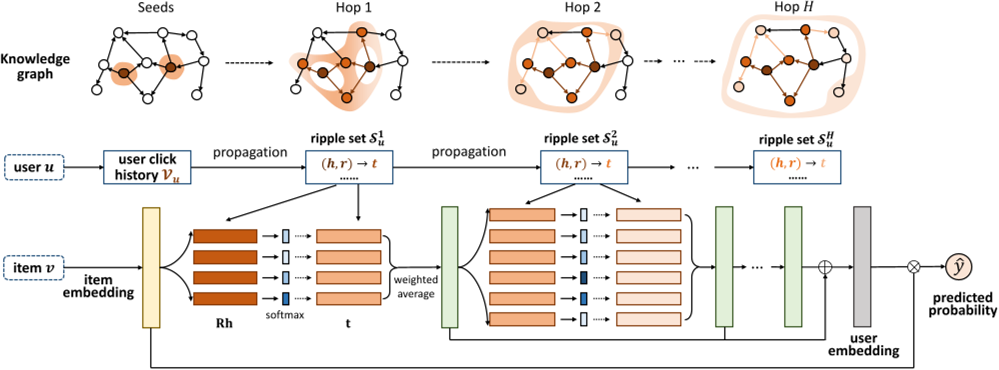

**1803.03467v4-Figure3-1.png**

- Caption: Illustration of ripple sets of "Forrest Gump" in KG ofmovies. The concentric circles denotes the ripple setswith different hops. The fading blue indicates decreasing relatedness between the center and surrounding entities.Note that the ripple sets of different hops are not necessarily disjoint in practice.
- Content type: figure
- Figure type: schematic

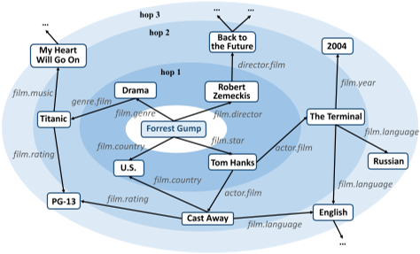

**1803.03467v4-Figure4-1.png**

- Caption: The average number of k-hop neighbors that two items share in the KG w.r.t. whether they have common raters in (a) MovieLens-1M, (b) Book-Crossing, and (c) BingNews datasets. (d) The ratio of the two average numberswith different hops.
- Content type: figure
- Figure type: plot

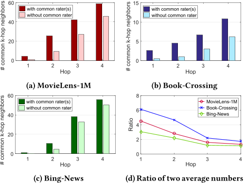

**1803.03467v4-Figure5-1.png**

- Caption: Precision@K , Recall@K , and F1@K in top-K recommendation for MovieLens-1M.
- Content type: figure
- Figure type: plot

**1803.03467v4-Figure6-1.png**

- Caption: Precision@K , Recall@K , and F1@K in top-K recommendation for Book-Crossing.
- Content type: figure
- Figure type: plot

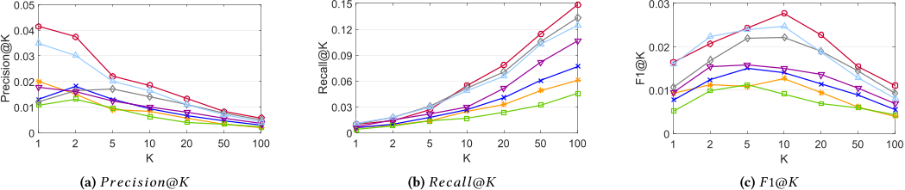

**1803.03467v4-Figure7-1.png**

- Caption: Precision@K , Recall@K , and F1@K in top-K recommendation for Bing-News.
- Content type: figure
- Figure type: plot

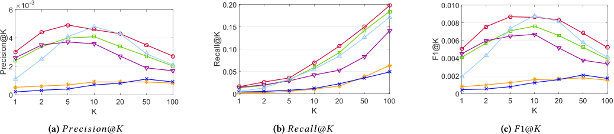

**1803.03467v4-Figure8-1.png**

- Caption: Visualization of relevance probabilities for a randomly sampled user w.r.t. a piece of candidate news with label 1. Links with value lower than −1.0 are omitted.
- Content type: figure
- Figure type: schematic

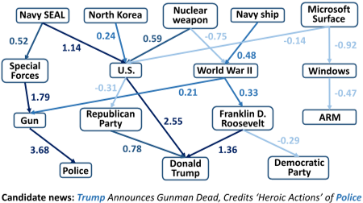

**1803.03467v4-Figure9-1.png**

- Caption: Parameter sensitivity of RippleNet.
- Content type: figure
- Figure type: plot

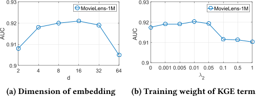

**1803.03467v4-Table1-1.png**

- Caption: Basic statistics of the three datasets.
- Content type: table
- Figure type: table

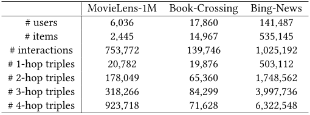

**1803.03467v4-Table2-1.png**

- Caption: Table 2: Hyper-parameter settings for the three datasets.
- Content type: table
- Figure type: N/A

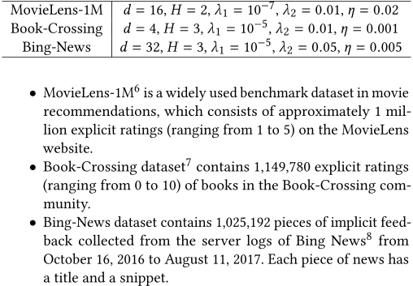

**1803.03467v4-Table3-1.png**

- Caption: The results of AUC and Accuracy in CTR prediction.
- Content type: table
- Figure type: ** table

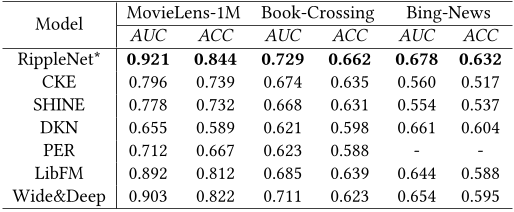

**1803.03467v4-Table4-1.png**

- Caption: The results of AUC w.r.t. different sizes of a user’s ripple set.
- Content type: table
- Figure type: ** Table

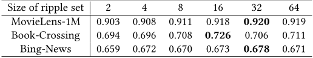

**1803.03467v4-Table5-1.png**

- Caption: The results of AUC w.r.t. different hop numbers.
- Content type: table
- Figure type: table

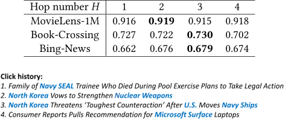

### QAs (7)
**QA 1**

- Question: Which dataset has the most 4-hop triples?
- Answer: Bing-News.
- Rationale: The table shows the number of 4-hop triples for each dataset. Bing-News has the highest number of 4-hop triples, with 6,322,548.
- References: 1803.03467v4-Table1-1.png

Referenced images:

**QA 2**

- Question: How does the number of common k-hop neighbors change as the hop distance increases for items with and without common raters?
- Answer: The number of common k-hop neighbors generally decreases as the hop distance increases for both items with and without common raters. However, the number of common k-hop neighbors is consistently higher for items with common raters than for items without common raters.
- Rationale: The figure shows that the bars representing items with common raters are consistently higher than the bars representing items without common raters for all three datasets and for all hop distances. This indicates that items with common raters are more likely to have common neighbors than items without common raters.
- References: 1803.03467v4-Figure4-1.png

Referenced images:

**QA 3**

- Question: Which model performs the best in terms of AUC on the MovieLens-1M dataset?
- Answer: RippleNet*
- Rationale: The table shows the AUC and ACC values for different models on three datasets. The highest AUC value for the MovieLens-1M dataset is 0.921, which corresponds to the RippleNet* model.
- References: 1803.03467v4-Table3-1.png

Referenced images:

**QA 4**

- Question: What is the role of the ripple sets in the RippleNet framework?
- Answer: The ripple sets are used to propagate a user's preferences from his or her click history to his or her relevant entities.
- Rationale: The figure shows how the ripple sets are used to propagate a user's preferences. The user's click history is used to generate the first-order ripple set, which is then used to generate the second-order ripple set, and so on. Each ripple set contains entities that are relevant to the user's interests, and the relevance probabilities are used to weight the entities in each ripple set. The weighted average of the entities in each ripple set is then used to generate the user's embedding, which is used to predict the probability that the user will click on a particular item.
- References: 1803.03467v4-Figure2-1.png

Referenced images:

**QA 5**

- Question: What is the relationship between the movies "Forrest Gump" and "Cast Away"?
- Answer: The movies "Forrest Gump" and "Cast Away" are connected by the actor Tom Hanks.
- Rationale: The figure shows that Tom Hanks is connected to both "Forrest Gump" and "Cast Away" by the "actor.film" relationship. This indicates that Tom Hanks starred in both movies.
- References: 1803.03467v4-Figure3-1.png

Referenced images:

**QA 6**

- Question: Which dataset has the highest AUC for all ripple set sizes?
- Answer: MovieLens-1M
- Rationale: The table shows the AUC values for three datasets (MovieLens-1M, Book-Crossing, and Bing-News) for different ripple set sizes. The values in the MovieLens-1M row are consistently higher than the values in the other two rows, indicating that MovieLens-1M has the highest AUC for all ripple set sizes.
- References: 1803.03467v4-Table4-1.png

Referenced images:

**QA 7**

- Question: How does the dimension of embedding affect the AUC of RippleNet on MovieLens-1M?
- Answer: The AUC of RippleNet first increases and then decreases with the increase of the dimension of embedding.
- Rationale: The figure shows that the AUC reaches its peak when the dimension of embedding is 8, and then starts to decrease.
- References: 1803.03467v4-Figure9-1.png

Referenced images:

---
## Paper: 1803.06506v3
Semantic Scholar ID: 1803.06506v3

### Figures/Tables (10)
**1803.06506v3-Figure1-1.png**

- Caption: Figure 1. We exploit the presence of semantic commonalities within a set of image-phrase pairs to generate supervisory signals. We hypothesize that to predict these commonalities, the model must localize them correctly within each image of the set.
- Content type: figure
- Figure type: ** photograph(s)

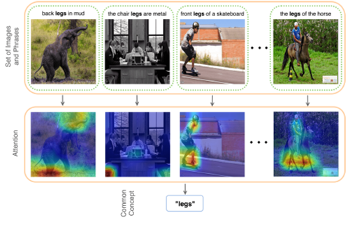

**1803.06506v3-Figure2-1.png**

- Caption: Figure 2. An overview of our model for unsupervised visual grounding of phrases. The encoder takes in a set of image-phrase pairs, indexed by i, all sharing a common concept. The encoder embeds the image and the phrase to Vi and ti respectively. These features are used to induce a parametrization for spatial attention. Next, the decoder uses the visual attention map to predict the common concept. In addition, the decoder also predicts the common concept independently for each pair (i). For details, see Section 3.2.
- Content type: figure
- Figure type: 

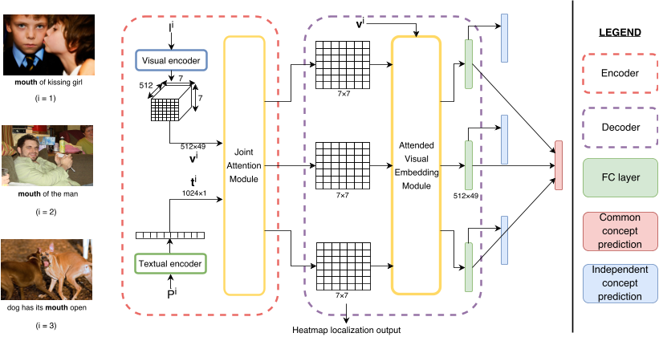

**1803.06506v3-Figure3-1.png**

- Caption: Variation of performance with respect to bounding box area and similarity of concept with ImageNet classes.
- Content type: figure
- Figure type: plot

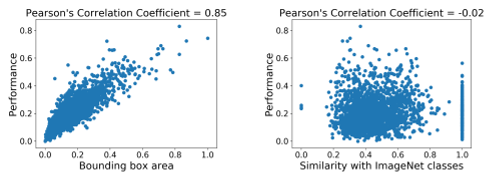

**1803.06506v3-Figure4-1.png**

- Caption: Figure 4. Qualitative results of our approach with different image and phrase pairs as input. More results and visual error analysis shown in supplementary material.
- Content type: figure
- Figure type: photograph(s)

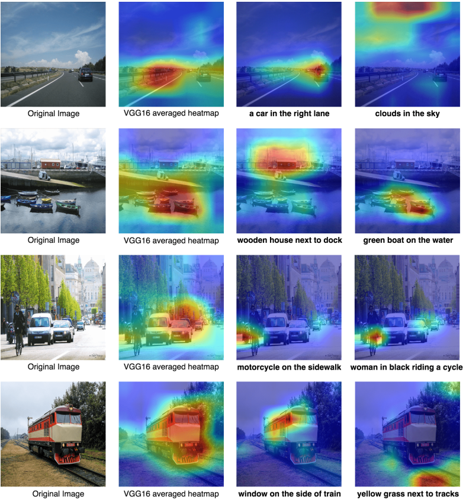

**1803.06506v3-Figure5-1.png**

- Caption: Figure 5. Comparison of VGG16 feature maps with our generated attention maps.
- Content type: figure
- Figure type: photograph(s)

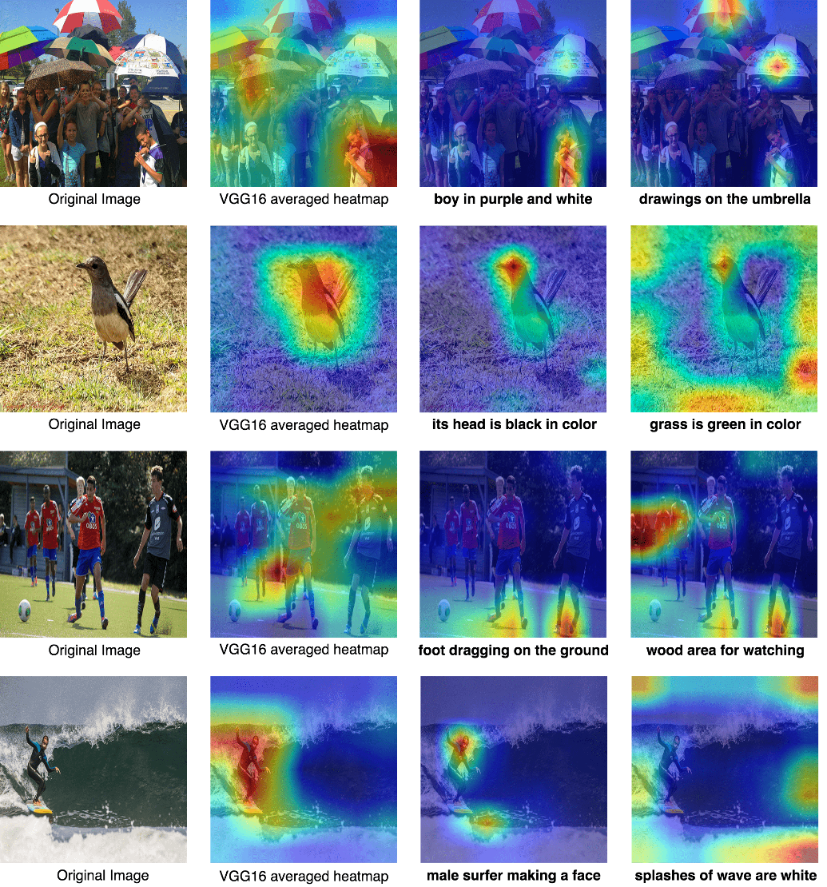

**1803.06506v3-Figure6-1.png**

- Caption: Figure 6. The figure shows how the quality of output heatmap changes with the alignment of the selected concept, predicted concept and the real entity to be grounded. For some sampled concept batch, the gray box refers to the chosen common concept, the red box refers to the predicted common concept and the blue box refers to the predicted independent concept. See section 10 for details about each row.
- Content type: figure
- Figure type: photograph(s)

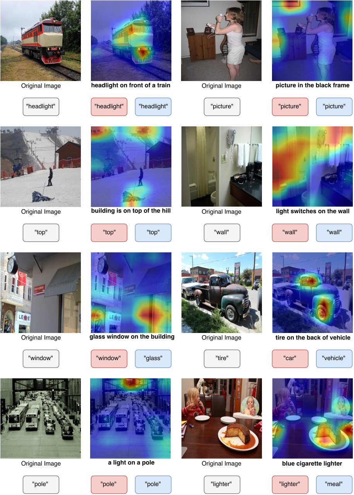

**1803.06506v3-Figure7-1.png**

- Caption: Figure 7. Additional qualitative examples
- Content type: figure
- Figure type: ** photograph(s)

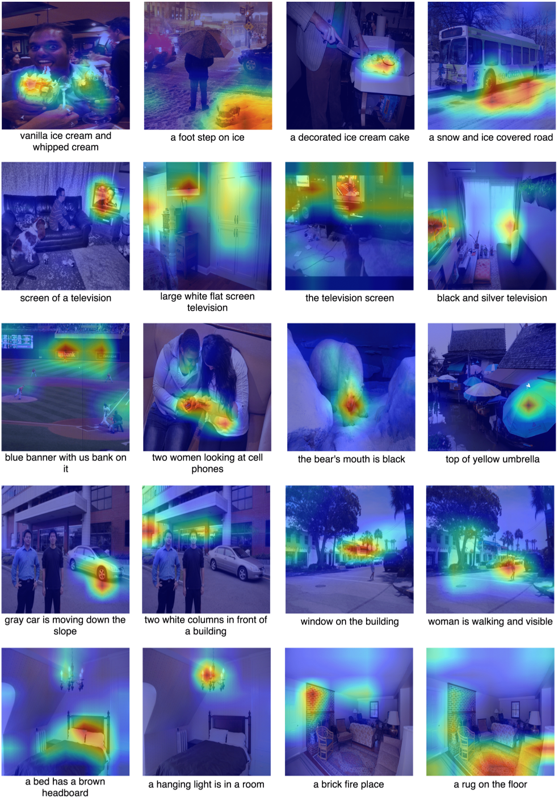

**1803.06506v3-Table1-1.png**

- Caption: Table 1. Phrase-region related statistics for datasets used in evaluation. The numbers reflect the relative complexity of these datasets.
- Content type: table
- Figure type: N/A

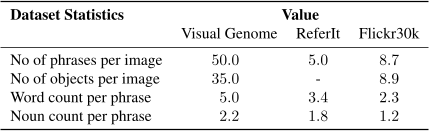

**1803.06506v3-Table2-1.png**

- Caption: Table 2. Phrase grounding evaluation on 3 datasets using the pointing game metric. See Section 5 for mask vs bbox explanation for ReferIt.
- Content type: table
- Figure type: N/A

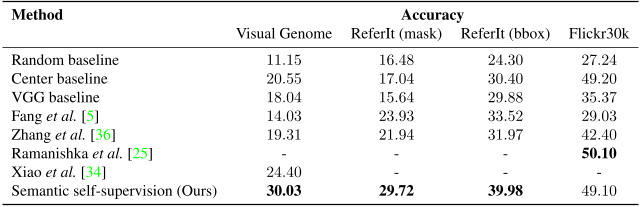

**1803.06506v3-Table3-1.png**

- Caption: Analysis of different surrogate losses while varying the concept batch size.
- Content type: table
- Figure type: table

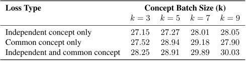

### QAs (7)
**QA 1**

- Question: What is the role of the Joint Attention Module in the model?
- Answer: The Joint Attention Module takes the embedded image and phrase features as input and uses them to induce a parameterization for spatial attention. This spatial attention map is then used by the decoder to predict the common concept.
- Rationale: The figure shows that the Joint Attention Module takes the embedded image features (V^i) and the embedded phrase features (t^i) as input. The output of the Joint Attention Module is a spatial attention map, which is used by the decoder to predict the common concept.

Figure type: schematic
- References: 1803.06506v3-Figure2-1.png

Referenced images:

**QA 2**

- Question: How does the quality of the output heatmap change when the selected concept, predicted concept, and the real entity to be grounded are all aligned?
- Answer: When the selected concept, predicted concept, and the real entity to be grounded are all aligned, the generated heatmap produces a good localization of the phrase.
- Rationale: This is shown in the first row of Figure~\ref{fig:fig2} with the concept \emph{`headlight'} and \emph{`picture'}. The heatmaps for both concepts are concentrated on the correct locations in the image.
- References: 1803.06506v3-Figure6-1.png

Referenced images:

**QA 3**

- Question: Why does the Semantic self-supervision model perform better on ReferIt (mask) compared to ReferIt (bbox), and how does this relate to the difference in performance between Visual Genome and Flickr30k datasets?
- Answer: The Semantic self-supervision model performs better on ReferIt (mask) compared to ReferIt (bbox) because mask-based annotations are considered more precise and accurate for measuring localization performance than bounding boxes. Masks tightly encompass the specific region referred to by the phrase, whereas bounding boxes can include extraneous areas. 

This relates to the difference in performance between Visual Genome and Flickr30k because both Visual Genome and ReferIt (mask) contain phrases that refer to very specific regions or non-salient objects. Precise localization is crucial for achieving high accuracy on these datasets. Flickr30k, on the other hand, annotates all bounding boxes referring to a phrase, leading to potentially less precise localization requirements and generally higher performance across methods.
- Rationale: The table shows the accuracy of different models on various datasets. By comparing the performance of the Semantic self-supervision model on ReferIt (mask) and ReferIt (bbox), we can see the impact of annotation type on accuracy. Additionally, the passage highlights the importance of precise localization for datasets like Visual Genome and ReferIt, which explains the lower performance compared to Flickr30k.
- References: 1803.06506v3-Table2-1.png

Referenced images:

**QA 4**

- Question: How does the proposed method's attention map differ from the VGG16 feature map?
- Answer: The attention map generated by proposed method is able to localize regions that were weak or non-existent in the activations of the input maps, while the VGG16 feature map simply amplifies the activations present in VGG16 channels.
- Rationale: The figure shows that the model's attention map is more focused on specific regions of the image, such as the boy in purple and white, the drawings on the umbrella, and the surfer's face. This suggests that the model is able to learn a phrase-dependent attention map that is more relevant to the task at hand.
- References: 1803.06506v3-Figure5-1.png

Referenced images:

**QA 5**

- Question: Which loss type performs best when the concept batch size is 5k?
- Answer: Independent and common concept
- Rationale: The table shows that the independent and common concept loss type has the highest value (29.89) when the concept batch size is 5k.
- References: 1803.06506v3-Table3-1.png

Referenced images:

**QA 6**

- Question: How does the performance of the model vary with respect to the bounding box area and the similarity of the concept with ImageNet classes?
- Answer: The performance of the model increases with increasing bounding box area and decreases with increasing similarity of the concept with ImageNet classes.
- Rationale: The left plot in the figure shows that the performance of the model is positively correlated with the bounding box area, with a Pearson correlation coefficient of 0.85. This means that as the bounding box area increases, the performance of the model also increases. The right plot in the figure shows that the performance of the model is negatively correlated with the similarity of the concept with ImageNet classes, with a Pearson correlation coefficient of -0.02. This means that as the similarity of the concept with ImageNet classes increases, the performance of the model decreases.
- References: 1803.06506v3-Figure3-1.png

Referenced images:

**QA 7**

- Question: Which dataset would you expect to be the easiest for a model to localize phrases in, and why?
- Answer: Flickr30k is likely the easiest dataset for a model to localize phrases in. 
Flickr30k has the shortest average phrase length (2.3 words) and the lowest average noun count (1.2) per phrase. This suggests that the phrases in this dataset are simpler and often directly refer to single objects present in the image. This makes the localization task easier, almost approaching a weakly supervised setting where the object to be localized is explicitly named in the phrase.
- Rationale: Table 1 shows that Flickr30k has the shortest average phrase length (2.3 words) and the lowest average noun count (1.2) per phrase. This suggests that the phrases in this dataset are simpler and often directly refer to single objects present in the image. This makes the localization task easier, almost approaching a weakly supervised setting where the object to be localized is explicitly named in the phrase.
- References: 1803.06506v3-Table1-1.png

Referenced images:

---
## Paper: 1804.04786v3
Semantic Scholar ID: 1804.04786v3

### Figures/Tables (7)
**1804.04786v3-Figure1-1.png**

- Caption: Illustration of different condition video generation schemes. (a) Frame-to-frame generation scheme (no correlation across different frames). (b) Sequential frame generation scheme (only short term frame correlation is considered). The dash block indicates when L = 2. (c) Recurrent frame generation scheme where the identity image I∗ is fed into all the future frame generation to preserve long-term dependency.
- Content type: figure
- Figure type: schematic

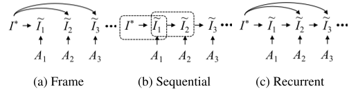

**1804.04786v3-Figure2-1.png**

- Caption: Figure 2: The proposed conditional recurrent adversarial video generation network structure.
- Content type: figure
- Figure type: ** Schematic

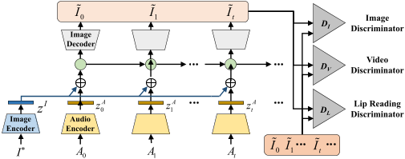

**1804.04786v3-Figure3-1.png**

- Caption: Comparison between the proposed method and the stateof-the-art algorithms. The first row shows the ground truth video, saying “high edu(cation)” which is the input audio, and the first image column gives the input faces. [Chen et al., 2018] can only generate the lip region. Frames corresponding to the letters inside parentheses are not presented here.
- Content type: figure
- Figure type: photograph(s)

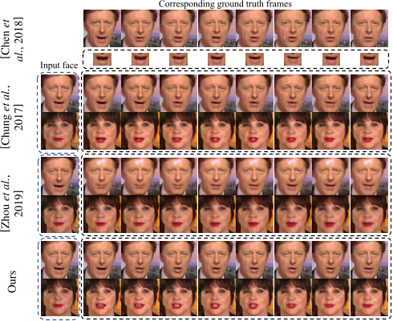

**1804.04786v3-Figure4-1.png**

- Caption: Ablation study on the loss functions used in the proposed method. The rows show the continuous frames generated from the same audio input but different loss combinations as denoted on the left. The subscripts r, I , V , and l indicates Lrec, LI , LV , and Ll in Eq. 5, respectively.
- Content type: figure
- Figure type: photograph(s)

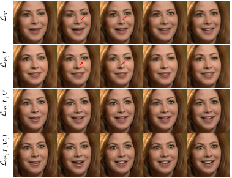

**1804.04786v3-Figure5-1.png**

- Caption: Effect of different generation schemes. The sample is randomly selected from the TCD-TIMIT dataset. From top to bottom: sequential generation, frame-to-frame generation, and our recurrent generation schemes. Optical flow is calculated on the frameto-frame and recurrent schemes as shown under the face images.
- Content type: figure
- Figure type: photograph(s)

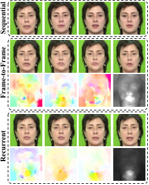

**1804.04786v3-Figure6-1.png**

- Caption: Figure 6: The first row is the ground truth image, the second row is our generated results.
- Content type: figure
- Figure type: photograph(s)

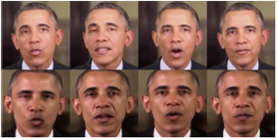

**1804.04786v3-Table1-1.png**

- Caption: The quantitative evaluation on the LRW testing dataset. The second block lists the results of our recurrent network using different loss functions. LRA (Top1/Top5) denotes the lip-reading accuracy.
- Content type: table
- Figure type: table

### QAs (3)
**QA 1**

- Question: What is the purpose of the audio encoder in the proposed conditional recurrent adversarial video generation network structure?
- Answer: The audio encoder extracts audio features from the MFCC features of each audio segment.
- Rationale: In Fig.~\ref{fig:flow}, the audio encoder is represented by the block labeled "Audio Encoder." It takes as input the MFCC features of each audio segment, denoted by $A_t$, and outputs the corresponding audio feature, denoted by $z^A_t$.
- References: 1804.04786v3-Figure2-1.png

Referenced images:

**QA 2**

- Question: Which loss function combination is most important for generating realistic mouth movements?
- Answer: The combination of Lrec, LI, and LV is most important for generating realistic mouth movements.
- Rationale: The figure shows that when Lrec, LI, and LV are used together, the generated mouth movements are more realistic and match the audio input more closely. When Ll is added to the loss function combination, the generated mouth movements become less realistic and more exaggerated.
- References: 1804.04786v3-Figure4-1.png

Referenced images:

**QA 3**

- Question: What is the difference between the sequential and recurrent generation schemes?
- Answer: The sequential generation scheme generates each frame of the video independently, while the recurrent generation scheme uses the previous frame to generate the next frame. This can be seen in the optical flow images, which show the motion of pixels between frames. The recurrent scheme has a smoother flow of motion, while the sequential scheme has more abrupt changes.
- Rationale: The figure shows examples of videos generated using the different schemes. The optical flow images show how the pixels in the video are moving.
- References: 1804.04786v3-Figure5-1.png

Referenced images:

---
## Paper: 1804.07707v2
Semantic Scholar ID: 1804.07707v2

### Figures/Tables (4)
**1804.07707v2-Figure1-1.png**

- Caption: An example AMR graph, with variable names and verb senses, followed by the input to our system after preprocessing, and finally two sample realisations different in syntax.
- Content type: figure
- Figure type: schematic

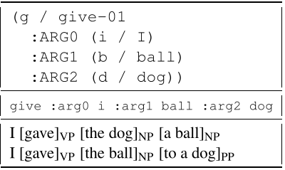

**1804.07707v2-Table1-1.png**

- Caption: Table 1: Parsing scores on LDC2017T10 dev set.
- Content type: table
- Figure type: N/A

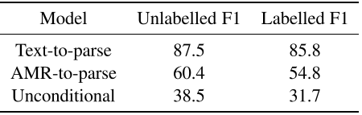

**1804.07707v2-Table2-1.png**

- Caption: Table 2: Average number of acceptable realisations out of 3. The difference is significant with p < 0.001.
- Content type: table
- Figure type: N/A

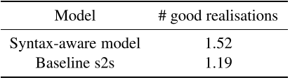

**1804.07707v2-Table3-1.png**

- Caption: Table 3: BLEU results for generation.
- Content type: table
- Figure type: N/A

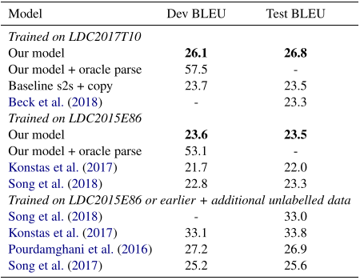

### QAs (3)
**QA 1**

- Question: How does the performance of the proposed model compare to other models when trained on the LDC2017T10 dataset, and what does this suggest about the effectiveness of incorporating syntax into the model?
- Answer: When trained on the LDC2017T10 dataset, the proposed model achieves the highest BLEU scores on both Dev and Test sets compared to other models listed in the table. This suggests that incorporating syntax into the model significantly improves its performance in generating text from AMR representations.
- Rationale: Table 1 presents BLEU scores for different models trained on various datasets. Comparing the scores of "Our model" to other models trained on LDC2017T10 specifically allows us to isolate the impact of the proposed approach on the same data. The higher BLEU scores achieved by "Our model" indicate that incorporating syntax leads to better generation quality compared to models without this feature.
- References: 1804.07707v2-Table3-1.png

Referenced images:

**QA 2**

- Question: How does explicitly modeling meaning-preserving invariances impact the generation of paraphrases?
- Answer: Explicitly modeling meaning-preserving invariances leads to the generation of better paraphrases.
- Rationale: Table 1 shows that the syntax-aware model, which explicitly models these invariances, produces a significantly higher average number of acceptable realisations (1.52) compared to the baseline model (1.19). This difference is statistically significant with p < 0.001. The passage further explains that this improvement is due to the explicit modeling of meaning-preserving invariances, allowing the model to generate more paraphrases that retain the same meaning as the reference realization.
- References: 1804.07707v2-Table2-1.png

Referenced images:

**QA 3**

- Question: Which model performs the best at predicting the delexicalised constituency tree of an example, and how much better does it perform compared to the baseline model in terms of unlabelled F1 score?
- Answer: The Text-to-parse model performs the best at predicting the delexicalised constituency tree, achieving an unlabelled F1 score of 87.5. This is significantly higher than the baseline Unconditional model, which achieves an unlabelled F1 score of 38.5. The Text-to-parse model therefore performs approximately 49 points better than the baseline.
- Rationale: Table 1 presents the parsing scores of different models on both labelled and unlabelled F1 metrics. By comparing the F1 scores across the models, we can identify which model performs best. The passage further clarifies that the Unconditional model serves as a baseline for comparison, as it does not leverage any information from the text or AMR graph. Therefore, the difference in unlabelled F1 scores between the Text-to-parse and Unconditional models demonstrates the improvement gained by utilizing textual information for predicting the syntactic structure.
- References: 1804.07707v2-Table1-1.png

Referenced images:

---
## Paper: 1805.01216v3
Semantic Scholar ID: 1805.01216v3

### Figures/Tables (23)
**1805.01216v3-Figure1-1.png**

- Caption: Figure 1: Performance of various task-oriented dialog systems on the CamRest dataset as the percentage of unseen information in the KB changes.
- Content type: figure
- Figure type: plot

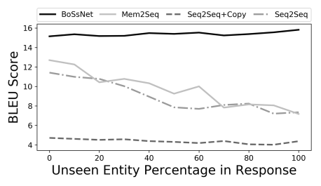

**1805.01216v3-Figure10-1.png**

- Caption: A sample HIT on Amazon Mechanical Turk to (a) validate useful responses based on the given dialog context, and (b) validate grammatical correctness of different responses on a scale of 0-3
- Content type: figure
- Figure type: "photograph(s)"

**1805.01216v3-Figure2-1.png**

- Caption: Figure 2: The dialog history and KB tuples stored in the memory have memory cell representations and token representations. The encoder understands the last user utterance using only the memory cell representations. The decoder generates the next response using both representations.
- Content type: figure
- Figure type: schematic

**1805.01216v3-Figure3-1.png**

- Caption: bAbI Task 1: Per-response accuracy comparison on KA sets
- Content type: figure
- Figure type: plot

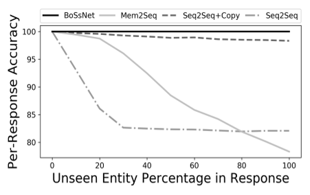

**1805.01216v3-Figure4-1.png**

- Caption: bAbI Task 5: Per-response accuracy comparison on KA sets
- Content type: figure
- Figure type: plot.

**1805.01216v3-Figure5-1.png**

- Caption: CamRest: Entity F1 comparison on KA sets Figure 6: SMD: Entity F1 comparison on KA sets
- Content type: figure
- Figure type: plot

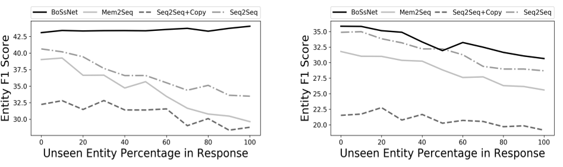

**1805.01216v3-Figure7-1.png**

- Caption: Figure 7: Visualization of attention weights on selected portions of memory in (a) BOSSNET with two-level attention vs (b) BOSSNET with one-level attention
- Content type: figure
- Figure type: ** schematic

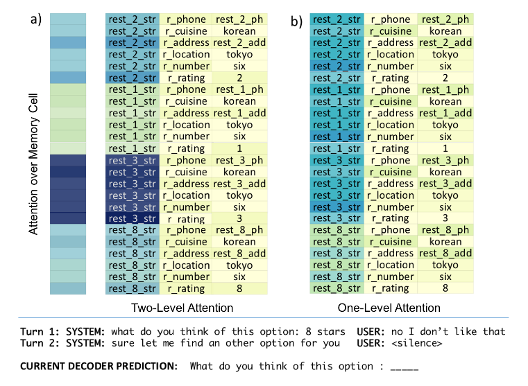

**1805.01216v3-Figure8-1.png**

- Caption: Figure 8: Pre-processing of bAbI dialog data used in Mem2Seq paper
- Content type: figure
- Figure type: ** Table

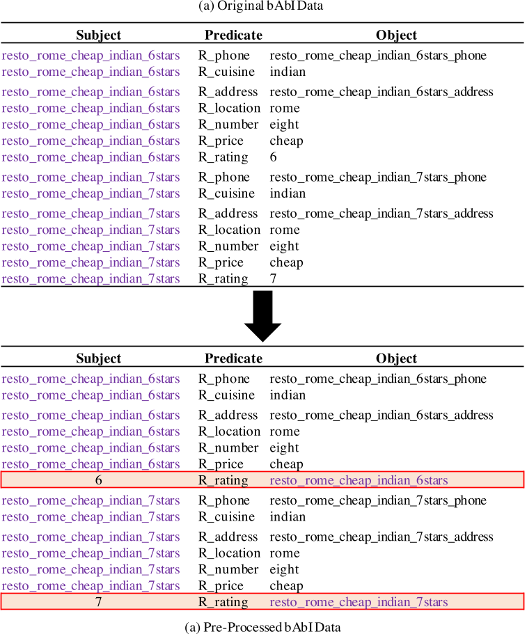

**1805.01216v3-Figure9-1.png**

- Caption: Figure 9: Pre-processing of SMD Navigate data used in Mem2Seq paper
- Content type: figure
- Figure type: ** Table

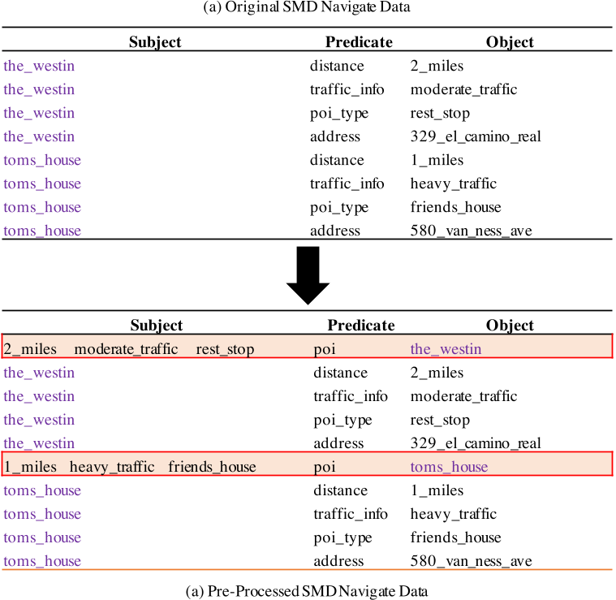

**1805.01216v3-Table1-1.png**

- Caption: Table 1: Per-response and per-dialog accuracies (in brackets) on bAbI dialog tasks of BOSSNET and baselines .
- Content type: table
- Figure type: N/A

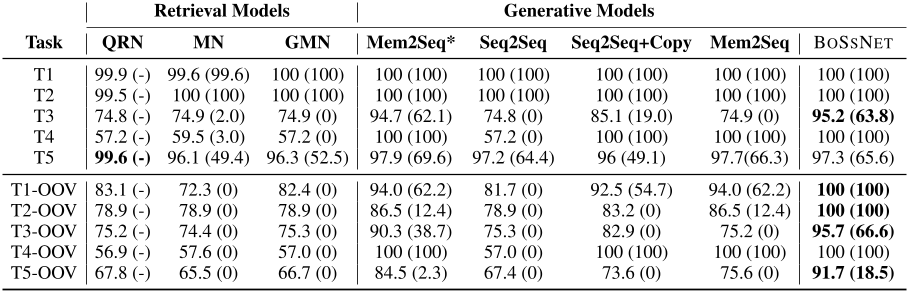

**1805.01216v3-Table10-1.png**

- Caption: Table 10: Example from bAbI dialog Task 1 with 100% OOV.
- Content type: table
- Figure type: N/A

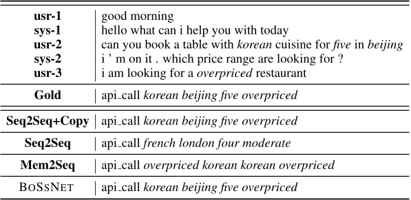

**1805.01216v3-Table11-1.png**

- Caption: Table 11: Example from Camrest with 50% OOV. The OOV entities present in the dialog are {ethiopian, 22 atlantis road}
- Content type: table
- Figure type: N/A

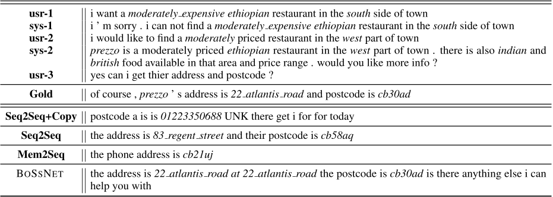

**1805.01216v3-Table12-1.png**

- Caption: Table 12: Example from SMD
- Content type: table
- Figure type: N/A

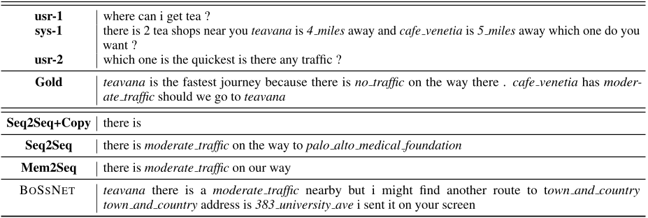

**1805.01216v3-Table13-1.png**

- Caption: Table 13: Example from SMD with 50% OOV. The OOV entity present in the dialog is {pittsburgh}
- Content type: table
- Figure type: N/A

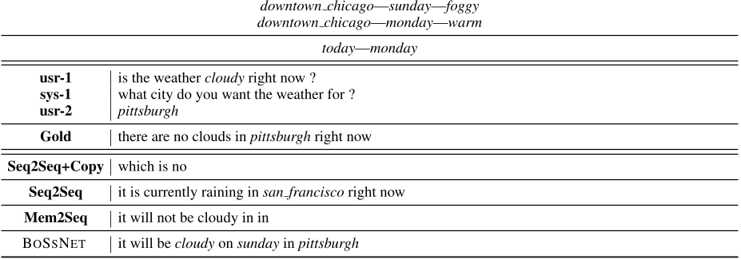

**1805.01216v3-Table14-1.png**

- Caption: Table 14: Ablation study: impact of hops in BOSSNET encoder
- Content type: table
- Figure type: N/A

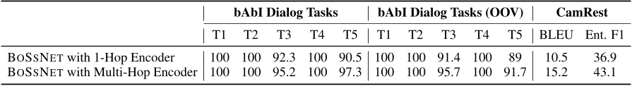

**1805.01216v3-Table2-1.png**

- Caption: Table 2: Performance of BOSSNET and baselines on the CamRest and SMD datasets
- Content type: table
- Figure type: N/A

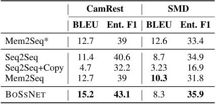

**1805.01216v3-Table3-1.png**

- Caption: Table 3: AMT Evaluations on CamRest and SMD
- Content type: table
- Figure type: N/A

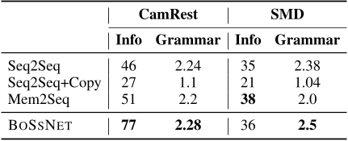

**1805.01216v3-Table4-1.png**

- Caption: Table 4: Example from bAbI Task 5 KA test set with 100% OOV entities. Identifying the address of an unseen restaurant is challenging for all models.
- Content type: table
- Figure type: N/A

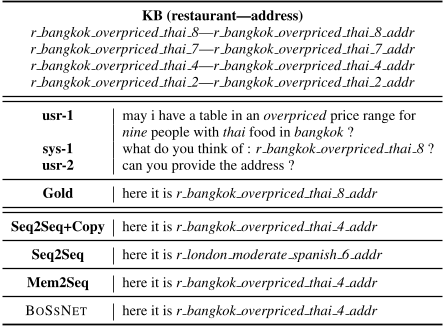

**1805.01216v3-Table5-1.png**

- Caption: Table 5: AMT Evaluations on CamRest and SMD (50% unseen) KA datasets
- Content type: table
- Figure type: N/A

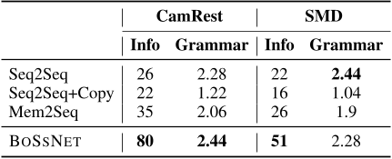

**1805.01216v3-Table6-1.png**

- Caption: Table 6: Ablation study: impact of each model element on BOSSNET
- Content type: table
- Figure type: N/A

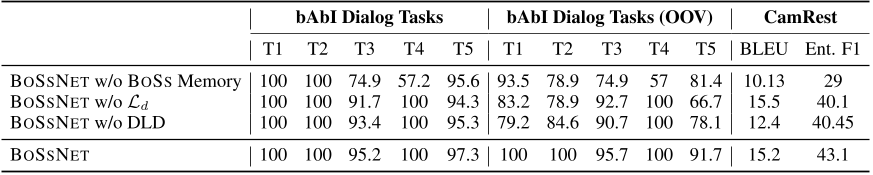

**1805.01216v3-Table7-1.png**

- Caption: Table 7: An example of responses generated by BOSSNET and baselines on the CamRest test set. Thia example has no unseen entities.
- Content type: table
- Figure type: N/A

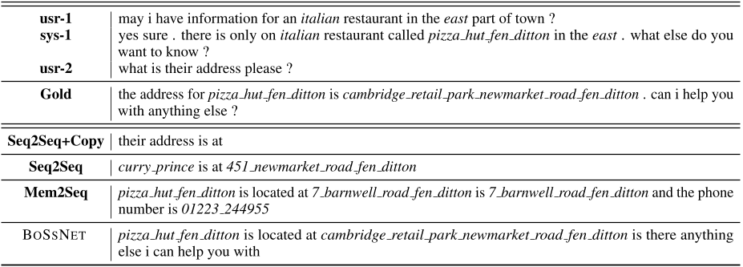

**1805.01216v3-Table8-1.png**

- Caption: Table 8: An example of responses generated by BOSSNET and baselines on bAbI dialog Task-5. This example is from the KA test set with 100% unseen entities.
- Content type: table
- Figure type: N/A

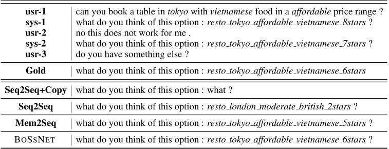

**1805.01216v3-Table9-1.png**

- Caption: Table 9: The hyperparameters used to train BOSSNET on the different datasets .
- Content type: table
- Figure type: N/A

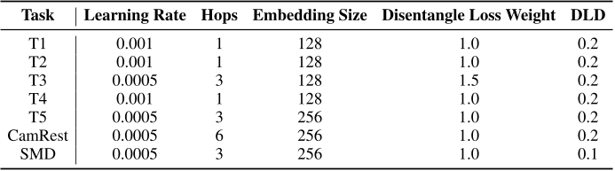

### QAs (12)
**QA 1**

- Question: Which task-oriented dialog system performs the best when the percentage of unseen information in the KB is high?
- Answer: BoSsNet
- Rationale: The figure shows that BoSsNet has the highest BLEU score across all percentages of unseen information in the KB. This suggests that BoSsNet is more robust to changes in the KB than the other systems.
- References: 1805.01216v3-Figure1-1.png

Referenced images:

**QA 2**

- Question: Why did Seq2Seq and Mem2Seq models perform poorly when the percentage of unseen entities in the knowledge base (KB) increased?
- Answer: Seq2Seq and Mem2Seq models performed poorly because they struggled to capture the semantic representations of unseen entities. This means they couldn't understand the meaning and relationships of new restaurants introduced in the KB. As a result, they were unable to accurately identify the correct restaurant and provide its address when faced with unseen entities.
- Rationale: The table shows an example where the user requests the address of an "overpriced" Thai restaurant in Bangkok. While the correct restaurant is "r\_bangkok\_overpriced\_thai\_8", both Seq2Seq and Mem2Seq models incorrectly provided the address of "r\_bangkok\_overpriced\_thai\_4". This error likely occurred because these models couldn't distinguish between the unseen restaurants in the KB due to their inability to grasp their semantic representations. This example illustrates the general trend observed in Figure 4a and 4b, where the performance of these models declined significantly with increasing unseen entities.
- References: 1805.01216v3-Table4-1.png

Referenced images:

**QA 3**

- Question: Which model achieved the highest combined score for informativeness and grammatical correctness on the CamRest dataset?
- Answer: The BOSSNET model achieved the highest combined score for informativeness and grammatical correctness on the CamRest dataset.
- Rationale: The table shows separate scores for informativeness ("Info") and grammatical correctness ("Grammar") for each model on both the CamRest and SMD datasets. To find the combined score, we simply add the two individual scores. For CamRest, \sys\ has an "Info" score of 80 and a "Grammar" score of 2.44, resulting in a combined score of 82.44, which is higher than any other model on that dataset.
- References: 1805.01216v3-Table3-1.png

Referenced images:

**QA 4**

- Question: Can you explain why the BOSSNET with multi-hop encoder performs better on bAbI tasks 3 and 5 compared to the 1-hop encoder, and how this relates to the tasks themselves?
- Answer: The multi-hop encoder performs better on bAbI tasks 3 and 5 because these tasks specifically require inferencing over multiple KB tuples. In other words, the model needs to "hop" between different pieces of information in the knowledge base to make the correct inferences and recommendations.

Task 3 involves sorting restaurants by rating, and task 5 requires recommending a restaurant based on user preferences. Both tasks necessitate the model to consider various restaurant attributes and their relationships, which the multi-hop encoder facilitates by capturing longer-range dependencies within the knowledge base.
- Rationale: The table shows that for tasks 3 and 5, the multi-hop encoder achieves higher accuracy compared to the 1-hop encoder. This improvement aligns with the nature of these tasks, which require multi-step reasoning and inference over multiple KB entries. The passage further clarifies this connection by highlighting the need for sorting and recommendation based on various restaurant attributes, achievable through the multi-hop encoder's ability to capture complex relationships within the knowledge base.
- References: 1805.01216v3-Table14-1.png

Referenced images:

**QA 5**

- Question: How does the encoder understand the last user utterance?
- Answer: The encoder understands the last user utterance by using the memory cell representations of the dialog history and KB tuples.
- Rationale: The figure shows that the encoder receives input from the memory cell representations of the dialog history and KB tuples. This suggests that the encoder uses these representations to understand the context of the conversation and generate a response.
- References: 1805.01216v3-Figure2-1.png

Referenced images:

**QA 6**

- Question: Which model performs best on tasks T3 and T3-OOV in terms of per-dialog accuracy, and how does its performance differ between the two test sets?
- Answer: The proposed system model (BOSSNET) performs best on both tasks T3 and T3-OOV in terms of per-dialog accuracy. However, its performance is significantly higher on the T3-OOV test set (95.7%) compared to the non-OOV T3 test set (95.2%).
- Rationale: The table shows the per-dialog accuracy for each model within parentheses. By comparing the values in the "\sys" column for tasks T3 and T3-OOV, we can see that the model performs better on the OOV version of the task. This is in contrast to the retrieval-based models (QRN, MN, GMN), which generally perform worse on OOV test sets.
- References: 1805.01216v3-Table1-1.png

Referenced images:

**QA 7**

- Question: Why might the authors claim that although BOSSNET achieves a lower BLEU score than Mem2Seq on the SMD dataset, it still performs better in conveying necessary entity information?
- Answer: While BOSSNET has a lower BLEU score than Mem2Seq on SMD, it achieves the highest Entity F1 score on that dataset. This suggests that BOSSNET is better at capturing and including the relevant entities in its responses, even though it may not have as much lexical overlap with the gold responses as Mem2Seq.
- Rationale: The table shows both BLEU scores and Entity F1 scores for each model on both datasets. While BLEU score measures the lexical similarity between generated and reference responses, Entity F1 measures how well the model identifies and incorporates relevant entities. By comparing these two metrics, we can see that **\sys\** prioritizes including accurate entities even if it sacrifices some lexical overlap with the reference response. The passage further supports this by stating that **\sys\** responses "convey the necessary entity information from the KB" despite having lower BLEU scores.
- References: 1805.01216v3-Table2-1.png

Referenced images:

**QA 8**

- Question: Which model performs the best in terms of Entity F1 score when the percentage of unseen entities in the response is low?
- Answer: BoSsNet
- Rationale: The plot shows that the BoSsNet line is the highest for both CamRest and SMD datasets when the percentage of unseen entities is low.
- References: 1805.01216v3-Figure5-1.png

Referenced images:

**QA 9**

- Question: What is the difference between the original and pre-processed SMD Navigate data?
- Answer: The pre-processed SMD Navigate data combines all the properties (such as distance, address) of a point of interest (POI) into a single subject with the object being "poi". The original data had separate entries for each property.
- Rationale: The figure shows two tables. The top table is the original SMD Navigate data, and the bottom table is the pre-processed data. In the original data, each property of a POI has its own entry in the table. For example, the POI "the_westin" has three entries: one for its distance, one for its traffic information, and one for its address. In the pre-processed data, all of these properties are combined into a single entry with the subject "2 miles moderate_traffic rest_stop" and the object "poi".
- References: 1805.01216v3-Figure9-1.png

Referenced images:

**QA 10**

- Question: Which model performs best when the percentage of unseen entities in the response is low?
- Answer: BoSsNet
- Rationale: The figure shows that the BoSsNet line is at the top when the percentage of unseen entities in the response is low.
- References: 1805.01216v3-Figure3-1.png

Referenced images:

**QA 11**

- Question: Which task required the highest learning rate and how does this compare to the learning rate used for CamRest?
- Answer: Task T1 and T2 required the highest learning rate of 0.001. This is twice the learning rate used for CamRest, which was trained with a learning rate of 0.0005.
- Rationale: The table shows the hyperparameters used for training \sys\ on different datasets. The "Learning Rate" column directly provides the information needed to answer the question. By comparing the values in this column for different tasks, we can determine which task required the highest learning rate and how it compares to the learning rate used for CamRest.
- References: 1805.01216v3-Table9-1.png

Referenced images:

**QA 12**

- Question: What is the difference between the attention weights in the two-level attention model and the one-level attention model?
- Answer: The two-level attention model has higher attention weights on the relevant information in the memory, while the one-level attention model has more uniform attention weights.
- Rationale: The figure shows that the two-level attention model has higher attention weights on the entries for "rest_3_str" and "rating 3", which are relevant to the current decoder prediction. In contrast, the one-level attention model has more uniform attention weights across all the entries in the memory. This suggests that the two-level attention model is able to focus on the most relevant information in the memory, while the one-level attention model is not as selective.
- References: 1805.01216v3-Figure7-1.png

Referenced images:

---
## Paper: 1805.06431v4
Semantic Scholar ID: 1805.06431v4

### Figures/Tables (28)
**1805.06431v4-Figure1-1.png**

- Caption: A process of binary classification on corrupt data using the mixture of (a) densities and (b) classifiers through (4).
- Content type: figure
- Figure type: plot

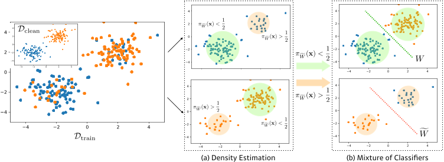

**1805.06431v4-Figure10-1.png**

- Caption: Manually collected trajectories of (a) safe driving mode and (b) careless driving mode. (best viewed in color).
- Content type: figure
- Figure type: schematic

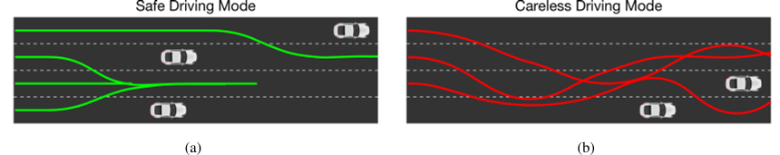

**1805.06431v4-Figure12-1.png**

- Caption: Learning curves of compared methods on random shuffle experiments using MNIST with different noise levels.
- Content type: figure
- Figure type: plot

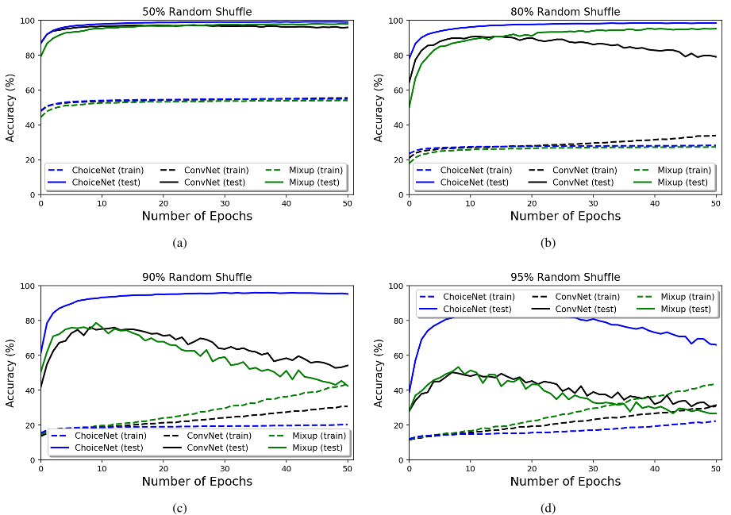

**1805.06431v4-Figure13-1.png**

- Caption: Learning curves of compared methods on random permutation experiments using MNIST with different noise levels.
- Content type: figure
- Figure type: plot

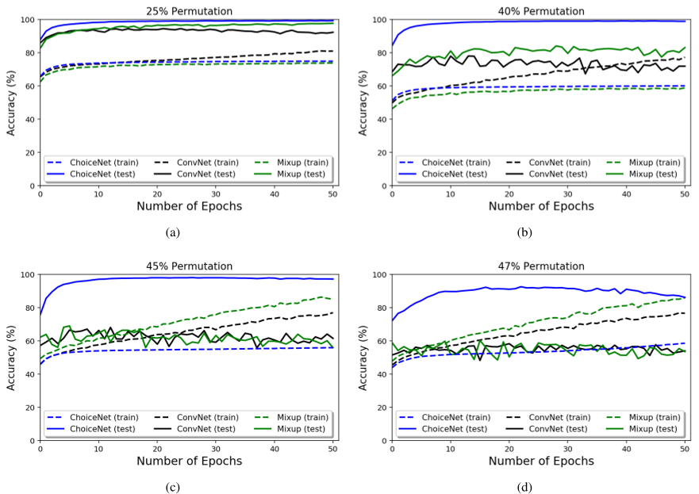

**1805.06431v4-Figure14-1.png**

- Caption: Learning curves of compared methods on CIFAR-10 experiments with different noise levels.
- Content type: figure
- Figure type: plot

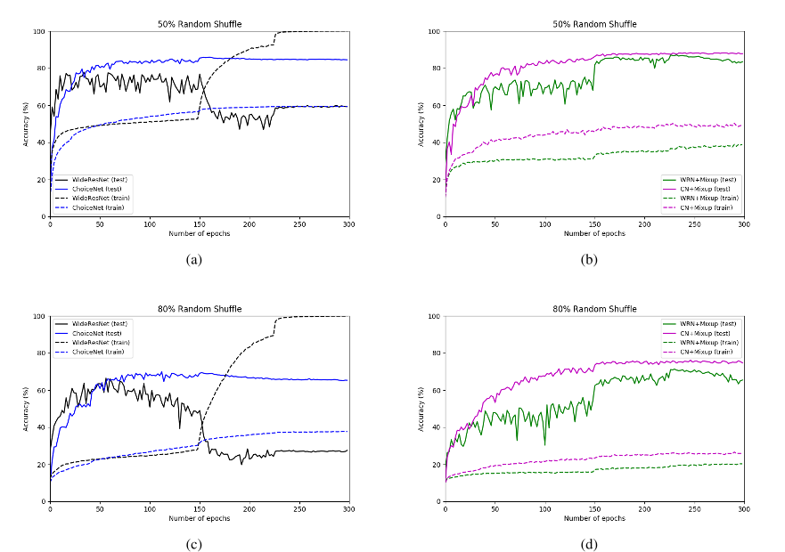

**1805.06431v4-Figure2-1.png**

- Caption: Illustration of a Cholesky Block. Every block shares target weight matrix W∗ and auxiliary matrix Z, and outputs correlated weight matrix W̃k through CholeskyTransform (see (5)) to distinguish the abnormal pattern from normal one which will be learned by W∗.
- Content type: figure
- Figure type: schematic

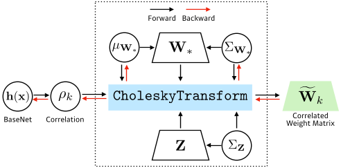

**1805.06431v4-Figure3-1.png**

- Caption: Overall mechanism of ChoiceNet. It consists of K mixtures and each mixture outputs triplet (πk, µk,Σk) via Algorithm 1. ρ1 = 1 is reserved to model the target distribution.
- Content type: figure
- Figure type: schematic

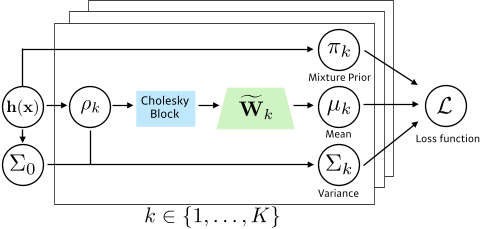

**1805.06431v4-Figure4-1.png**

- Caption: Fitting results on datasets with (a) flipped function and (c) uniform corruptions. Resulting correlations of two components with (b) flipped function and (d) uniform corruptions.
- Content type: figure
- Figure type: ** plot

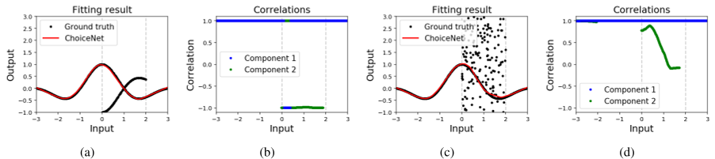

**1805.06431v4-Figure5-1.png**

- Caption: The predictions results of the second mixture of test inputs whose labels are (a) 0 and (b) 1, respectively.
- Content type: figure
- Figure type: plot

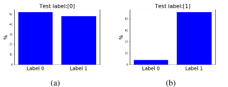

**1805.06431v4-Figure6-1.png**

- Caption: (a-c) Average fitting errors while varying the outlier rates and (e-f) fitting results of the compared methods with 60% outliers using cosexp, linear, and step functions.
- Content type: figure
- Figure type: plot

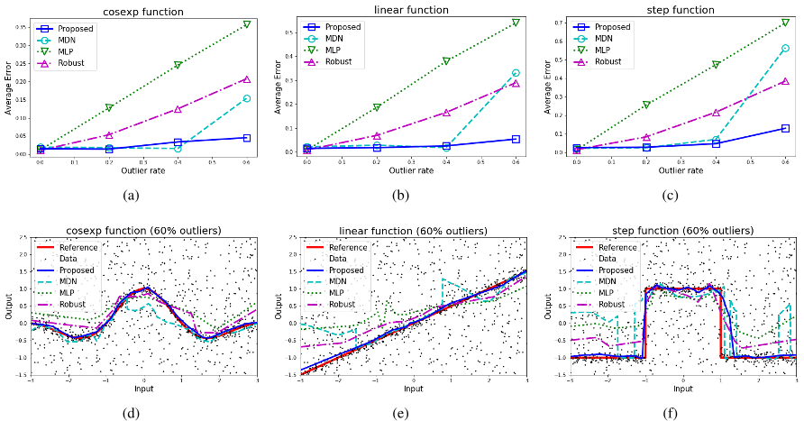

**1805.06431v4-Figure7-1.png**

- Caption: Figure 7: Reference function and fitting results of compared methods on different outlier rates, 0%,20% 40%, 80%, and 90%).
- Content type: figure
- Figure type: plot

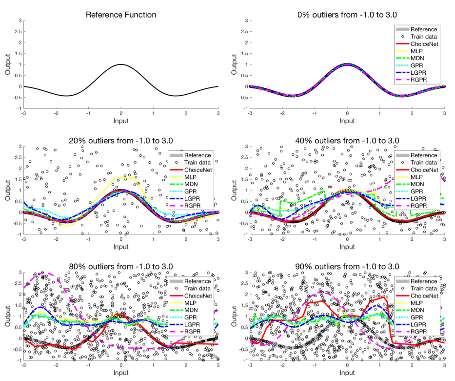

**1805.06431v4-Figure8-1.png**

- Caption: Resulting trajectories of compared methods trained with mixed demonstrations. (best viewed in color).
- Content type: figure
- Figure type: schematic

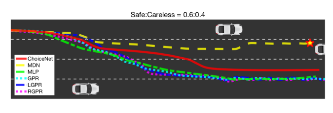

**1805.06431v4-Figure9-1.png**

- Caption: Figure 9: Descriptions of the featrues of an ego red car used in autonomous driving experiments.
- Content type: figure
- Figure type: Schematic

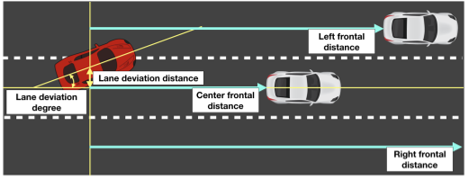

**1805.06431v4-Table1-1.png**

- Caption: Table 1: The RMSEs of compared methods on the Boston Housing Dataset
- Content type: table
- Figure type: N/A

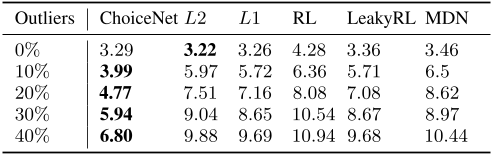

**1805.06431v4-Table10-1.png**

- Caption: Table 10: Test accuracies on the MNIST dataset with biased label.
- Content type: table
- Figure type: N/A

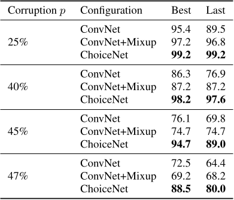

**1805.06431v4-Table11-1.png**

- Caption: Table 11: Test accuracies on the MNIST dataset with corrupt label.
- Content type: table
- Figure type: N/A

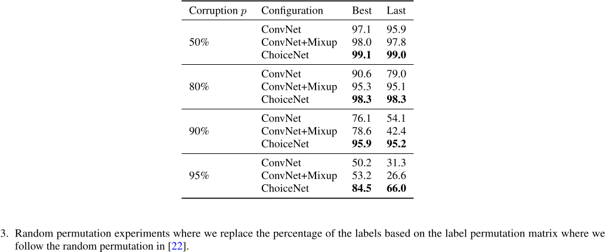

**1805.06431v4-Table12-1.png**

- Caption: Table 12: Test accuracies on the MNIST dataset with randomly permutated label.
- Content type: table
- Figure type: N/A

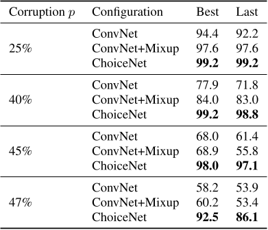

**1805.06431v4-Table13-1.png**

- Caption: Table 13: Test accuracies on the CIFAR-10 datasets with symmetric noises.
- Content type: table
- Figure type: N/A

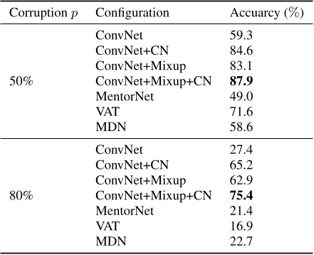

**1805.06431v4-Table14-1.png**

- Caption: Table 14: Test accuracies on the CIFAR-10 dataset with by symmetric and asymmetric noises.
- Content type: table
- Figure type: N/A

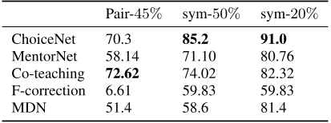

**1805.06431v4-Table15-1.png**

- Caption: Table 15: Test accuracies on the Large Movie Review dataset with different corruption probabilities.
- Content type: table
- Figure type: N/A

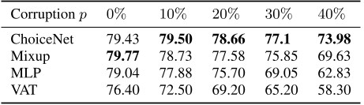

**1805.06431v4-Table2-1.png**

- Caption: Table 2: Test accuracies on the CIFAR-10 dataset with by symmetric and asymmetric noises.
- Content type: table
- Figure type: N/A

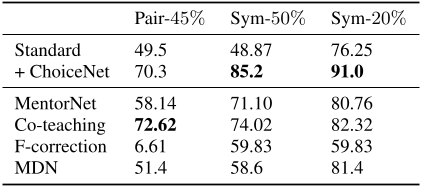

**1805.06431v4-Table3-1.png**

- Caption: Table 3: The comparison between naive WideResNet and ChoiceNet on multile benchmark datasets.
- Content type: table
- Figure type: N/A

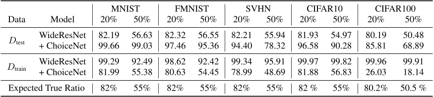

**1805.06431v4-Table4-1.png**

- Caption: Table 4: The RMSEs of compared methods on synthetic toy examples
- Content type: table
- Figure type: N/A

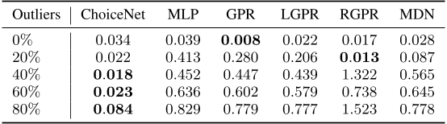

**1805.06431v4-Table5-1.png**

- Caption: Table 5: The RMSEs of compared methods on the Boston Housing Dataset
- Content type: table
- Figure type: N/A

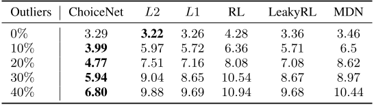

**1805.06431v4-Table6-1.png**

- Caption: Table 6: Average returns of compared methods on behavior cloning problems using MuJoCo
- Content type: table
- Figure type: N/A

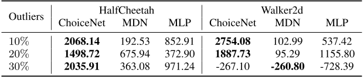

**1805.06431v4-Table7-1.png**

- Caption: Table 7: Collision rates of compared methods on straight lanes.
- Content type: table
- Figure type: N/A

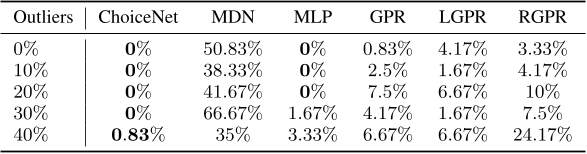

**1805.06431v4-Table8-1.png**

- Caption: Table 8: Root mean square lane deviation distances (m) of compared methods on straight lanes.
- Content type: table
- Figure type: N/A

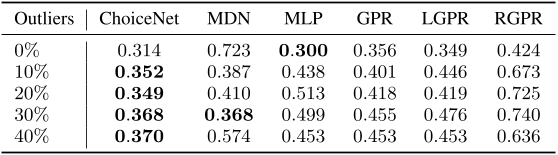

**1805.06431v4-Table9-1.png**

- Caption: Table 9: Test accuracies on the MNIST datasets with corrupt labels.
- Content type: table
- Figure type: N/A

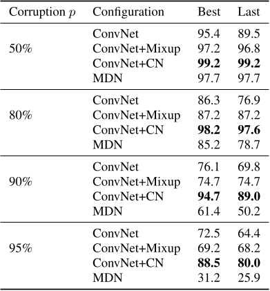

### QAs (18)
**QA 1**

- Question: Which method appears to be the safest for autonomous driving on straight lanes with different levels of outlier vehicles?
- Answer: ChoiceNet appears to be the safest method for autonomous driving on straight lanes, regardless of the percentage of outlier vehicles present.
- Rationale: Table 1 shows the collision rates of different methods on straight lanes with varying percentages of outlier vehicles (0% to 40%). ChoiceNet consistently demonstrates the lowest collision rate (0% or close to 0%) across all outlier percentages. This is further supported by the passage, which explicitly states that ChoiceNet outperforms other methods in terms of safety, as evidenced by its low collision rates.
- References: 1805.06431v4-Table7-1.png

Referenced images:

**QA 2**

- Question: Which of the compared methods is most likely to be the safest?
- Answer: ChoiceNet
- Rationale: The trajectories of the different methods are shown in the figure. ChoiceNet's trajectory is the one that stays closest to the center of the lane and avoids the oncoming car.
- References: 1805.06431v4-Figure8-1.png

Referenced images:

**QA 3**

- Question: How does the ChoiceNet model perform on datasets with uniform corruptions?
- Answer: The ChoiceNet model performs poorly on datasets with uniform corruptions.
- Rationale: The figure shows the fitting results and correlations of the ChoiceNet model on datasets with flipped functions and uniform corruptions. In (c), the ChoiceNet model is unable to accurately fit the data with uniform corruptions. This is further supported by the correlations in (d), which show that the two components of the ChoiceNet model have low correlations with the ground truth.
- References: 1805.06431v4-Figure4-1.png

Referenced images:

**QA 4**

- Question: Which method performs the best when there are a lot of outliers in the data?
- Answer: ChoiceNet.
- Rationale: The figure shows that ChoiceNet is able to fit the reference function more accurately than the other methods when there are a lot of outliers in the data. For example, when the outlier rate is 80%, ChoiceNet is still able to fit the reference function quite well, while the other methods are not.
- References: 1805.06431v4-Figure7-1.png

Referenced images:

**QA 5**

- Question: Which of the two approaches, density estimation or mixture of classifiers, is more robust to outliers?
- Answer: Mixture of classifiers.
- Rationale: The figure shows that the mixture of classifiers approach is able to correctly classify the data points even when there are outliers present. This is because the mixture of classifiers approach is able to learn the different modes of the data distribution, while the density estimation approach is not.
- References: 1805.06431v4-Figure1-1.png

Referenced images:

**QA 6**

- Question: How does the performance of the different models change as the corruption level increases? Which model appears to be the most robust to label corruption?
- Answer: As the corruption level increases, the performance of all models decreases. However, ChoiceNet consistently outperforms both ConvNet and ConvNet+Mixup across all corruption levels, maintaining high accuracy even when almost half of the labels are incorrect. This suggests that ChoiceNet is significantly more robust to label corruption compared to the other models.
- Rationale: The table shows the test accuracies of different models on the MNIST dataset with varying levels of label corruption. By comparing the accuracies across different corruption levels (25%, 40%, 45%, 47%), we can observe the trend of decreasing performance for all models. However, the decline is much less severe for ChoiceNet, which maintains an accuracy above 92% even at the highest corruption level. This observation allows us to conclude that ChoiceNet is more robust to label corruption than the other models.
- References: 1805.06431v4-Table12-1.png

Referenced images:

**QA 7**

- Question: Which method appears to be most robust to the presence of outliers in the training data?
- Answer: ChoiceNet appears to be the most robust to outliers in the training data.
- Rationale: Table 1 shows the RMSEs of different methods for various percentages of outliers in the training data. While all methods perform well with no outliers (RMSE < 0.1), ChoiceNet consistently maintains the lowest RMSE even as the outlier rate increases. The passage also explicitly states that ChoiceNet successfully fits the target function even with outlier rates exceeding 40%, whereas other methods fail. This suggests that ChoiceNet is better able to handle noisy data and produce accurate predictions compared to the other methods.
- References: 1805.06431v4-Table4-1.png

Referenced images:

**QA 8**

- Question: Which method performs best when there is no label corruption (p = 0%) on the Large Movie Review dataset and how does its performance change as the corruption level increases?
- Answer: When there is no label corruption (p = 0%), Mixup achieves the highest test accuracy of 79.77%. However, as the corruption level increases, Mixup's performance deteriorates more rapidly compared to other methods. ChoiceNet, on the other hand, demonstrates a more stable performance across different corruption levels, maintaining the highest accuracy when p is 10%, 20%, 30%, and 40%.
- Rationale: The table displays the test accuracies of different methods under varying degrees of label corruption. By comparing the values in the p = 0% column, we can identify the best performing method in the absence of corruption. Additionally, by observing the trend of each method's accuracy as p increases, we can assess their relative robustness to label noise.
- References: 1805.06431v4-Table15-1.png

Referenced images:

**QA 9**

- Question: How does the accuracy of the WideResNet model compare to the ChoiceNet model on the CIFAR-10 dataset with 50% random shuffle?
- Answer: The WideResNet model has higher accuracy than the ChoiceNet model on the CIFAR-10 dataset with 50% random shuffle.
- Rationale: The figure shows the learning curves of the WideResNet and ChoiceNet models on the CIFAR-10 dataset with 50% random shuffle. The WideResNet model's learning curve is higher than the ChoiceNet model's learning curve, indicating that the WideResNet model has higher accuracy.
- References: 1805.06431v4-Figure14-1.png

Referenced images:

**QA 10**

- Question: Which of the four methods has the best performance in terms of average error for the step function?
- Answer: The proposed method.
- Rationale: From the plot (c), it can be seen that the proposed method has the lowest average error for all outlier rates compared to the other three methods.
- References: 1805.06431v4-Figure6-1.png

Referenced images:

**QA 11**

- Question: How does the performance of ChoiceNet compare to other methods under different noise settings? Briefly explain the strengths and weaknesses of ChoiceNet.
- Answer: ChoiceNet generally performs well compared to other methods, achieving the highest accuracy on both symmetric noise settings (sym-50% and sym-20%). However, it falls to second place under the Pair-45% asymmetric noise setting, indicating a weakness in handling this specific type of noise.
- Rationale: Table 2 presents the test accuracies of various methods under different noise conditions. By comparing the values in the table, we can see that ChoiceNet outperforms all other methods on the two symmetric noise settings, demonstrating its strength in handling such noise. However, under the Pair-45% asymmetric noise setting, ChoiceNet is surpassed by Co-teaching. This suggests that ChoiceNet may struggle with accurately inferring label distributions when noise patterns become more complex and asymmetric. The passage further clarifies this weakness, explaining that the "Cholesky Block" component of ChoiceNet struggles under Pair-45% noise due to the specific way this noise type assigns labels.
- References: 1805.06431v4-Table2-1.png

Referenced images:

**QA 12**

- Question: Which method generally performed better in the HalfCheetah task, ChoiceNet or MDN? How does the performance gap between these two methods change as the percentage of outliers increases?
- Answer: ChoiceNet generally performed better than MDN in the HalfCheetah task. This is evident from the higher average returns of ChoiceNet across all outlier percentages (10%, 20%, and 30%).

The performance gap between ChoiceNet and MDN appears to decrease as the percentage of outliers increases. At 10% outliers, ChoiceNet has a significantly higher average return than MDN (2068.14 vs. 192.53). However, at 30% outliers, the difference in average return is smaller (2035.91 vs. 363.08).
- Rationale: The table shows the average returns of different methods in the HalfCheetah task for different outlier percentages. By comparing the values in the ChoiceNet and MDN columns, we can directly see which method performed better for each outlier percentage. The difference in average return values reflects the performance gap between the two methods.
- References: 1805.06431v4-Table6-1.png

Referenced images:

**QA 13**

- Question: How does the performance of ChoiceNet compare to other methods under different noise settings on the CIFAR-10 dataset? Briefly explain the strengths and weaknesses of ChoiceNet.
- Answer: ChoiceNet generally performs well compared to other methods, achieving the highest accuracy on both symmetric noise settings (sym-50% and sym-20%). However, it falls to second place under the Pair-45% asymmetric noise setting, indicating a weakness in handling this specific type of noise.
- Rationale: Table 2 presents the test accuracies of various methods under different noise conditions. By comparing the values in the table, we can see that ChoiceNet outperforms all other methods on the two symmetric noise settings, demonstrating its strength in handling such noise. However, under the Pair-45% asymmetric noise setting, ChoiceNet is surpassed by Co-teaching. This suggests that ChoiceNet may struggle with accurately inferring label distributions when noise patterns become more complex and asymmetric. The passage further clarifies this weakness, explaining that the "Cholesky Block" component of ChoiceNet struggles under Pair-45% noise due to the specific way this noise type assigns labels.
- References: 1805.06431v4-Table14-1.png

Referenced images:

**QA 14**

- Question: Which method performs best at all noise levels?
- Answer: ChoiceNet.
- Rationale: The figure shows that ChoiceNet consistently achieves the highest accuracy across all noise levels (25%, 40%, 45%, and 47%) on both the training and test sets.
- References: 1805.06431v4-Figure13-1.png

Referenced images:

**QA 15**

- Question: What is the role of the Cholesky block in the ChoiceNet architecture?
- Answer: The Cholesky block is used to decompose the covariance matrix Σk into a lower triangular matrix and its transpose. This decomposition is used to ensure that the covariance matrix is positive definite, which is a requirement for the Gaussian distribution.
- Rationale: The Cholesky block is shown in the figure as a blue box. It takes the covariance matrix Σk as input and outputs a lower triangular matrix. This matrix is then used to generate the variance of the Gaussian distribution.
- References: 1805.06431v4-Figure3-1.png

Referenced images:

**QA 16**

- Question: What is the purpose of the Cholesky Block in this figure?
- Answer: The Cholesky Block is used to distinguish abnormal patterns from normal patterns.
- Rationale: The Cholesky Block takes the target weight matrix W∗ and auxiliary matrix Z as input and outputs a correlated weight matrix W̃k. This correlated weight matrix is then used to learn the abnormal patterns.
- References: 1805.06431v4-Figure2-1.png

Referenced images:

**QA 17**

- Question: Is it more beneficial to use ConvNet+CN with or without Mixup when the corruption probability is 80%? Explain your reasoning.
- Answer: ConvNet+CN with Mixup achieves a higher accuracy (75.4%) than ConvNet+CN without Mixup (65.2%) when the corruption probability is 80%.
- Rationale: The table directly compares the test accuracies of different methods under varying corruption probabilities. By looking at the row corresponding to 80% corruption, we can see the performance of each method under that specific condition. The table clearly shows that ConvNet+CN combined with Mixup yields a higher accuracy than ConvNet+CN alone at that corruption level.
- References: 1805.06431v4-Table13-1.png

Referenced images:

**QA 18**

- Question: How does the accuracy of the Mixup method change as the level of random shuffle increases?
- Answer: The accuracy of the Mixup method decreases as the level of random shuffle increases.
- Rationale: The figure shows that the Mixup method achieves the highest accuracy with 50% random shuffle and the lowest accuracy with 95% random shuffle. This suggests that the Mixup method is more sensitive to the level of noise in the data than the other methods.
- References: 1805.06431v4-Figure12-1.png

Referenced images:

---
## Paper: 1805.08751v2
Semantic Scholar ID: 1805.08751v2

### Figures/Tables (7)
**1805.08751v2-Figure2-1.png**

- Caption: Hybrid Feature Learning Unit (HFLU).
- Content type: figure
- Figure type: schematic

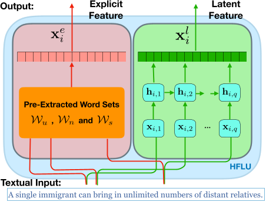

**1805.08751v2-Figure3-1.png**

- Caption: Relationships of Articles, Creators and Subjects.
- Content type: figure
- Figure type: schematic

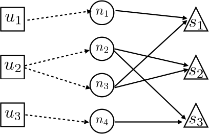

**1805.08751v2-Figure4-1.png**

- Caption: Gated Diffusive Unit (GDU).
- Content type: figure
- Figure type: schematic

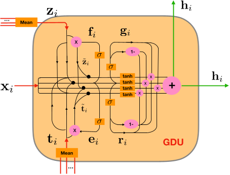

**1805.08751v2-Figure5-1.png**

- Caption: The Architecture of Framework FAKEDETECTOR.
- Content type: figure
- Figure type: Schematic

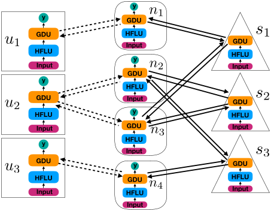

**1805.08751v2-Figure6-1.png**

- Caption: Bi-Class Credibility Inference of News Articles 6(a)-6(d), Creators 6(e)-6(h) and Subjects 6(i)-6(l).
- Content type: figure
- Figure type: plot

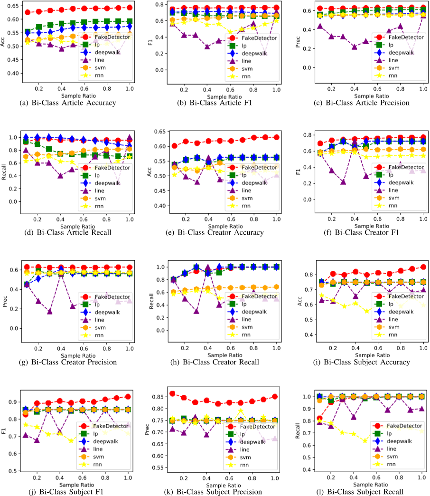

**1805.08751v2-Figure7-1.png**

- Caption: Multi-Class Credibility Inference of News Articles 7(a)-7(d), Creators 7(e)-7(h) and Subjects 7(i)-7(l).
- Content type: figure
- Figure type: plot

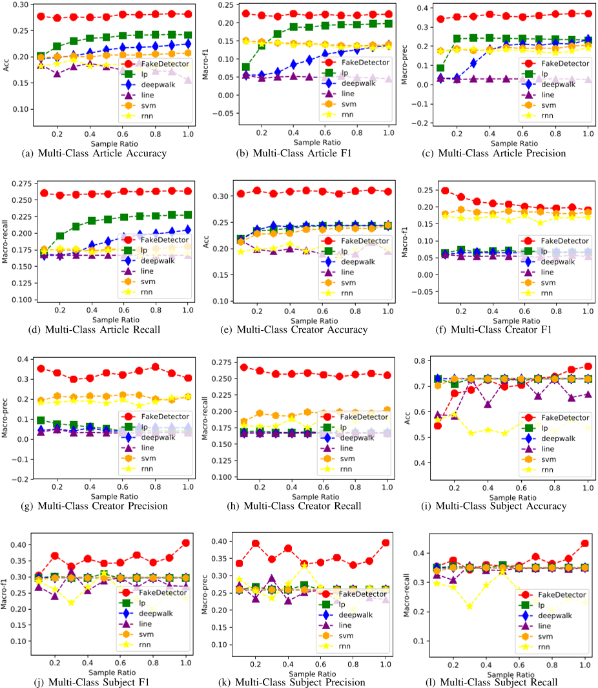

**1805.08751v2-TableI-1.png**

- Caption: TABLE I PROPERTIES OF THE HETEROGENEOUS NETWORKS
- Content type: table
- Figure type: table

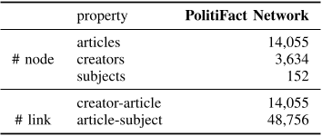

### QAs (1)
**QA 1**

- Question: What is the role of the GDU and HFLU modules in the FAKEDETECTOR framework?
- Answer: The GDU (Gated Dilated Unit) modules are responsible for extracting features from the input data, while the HFLU (Hybrid Feature Learning Unit) modules are responsible for fusing the features extracted by the GDU modules.
- Rationale: The figure shows that the GDU and HFLU modules are used in both the encoder and decoder parts of the FAKEDETECTOR framework. The GDU modules take the input data and extract features, which are then passed to the HFLU modules. The HFLU modules then fuse the features from the different GDU modules and produce the final output.
- References: 1805.08751v2-Figure5-1.png

Referenced images:

---
## Paper: 1809.01989v2
Semantic Scholar ID: 1809.01989v2

### Figures/Tables (2)
**1809.01989v2-Figure1-1.png**

- Caption: Index tracking performance: Top plots are the index and trackers. Bottom is the percentage tracking error ŷ−yy .
- Content type: figure
- Figure type: ** plot

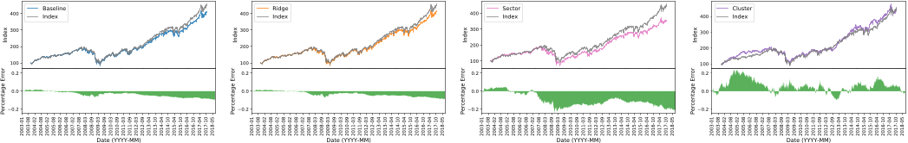

**1809.01989v2-Table1-1.png**

- Caption: Table 1. Absolute percentage errors for different methods
- Content type: table
- Figure type: N/A

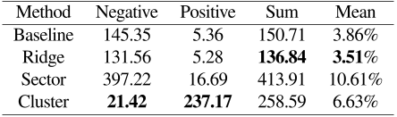

### QAs (1)
**QA 1**

- Question: Which method achieved the highest tracking accuracy in terms of minimizing the sum of absolute percentage errors? Does this necessarily mean it had the best overall performance?
- Answer: The Ridge method achieved the lowest sum of absolute percentage errors (136.84), indicating the highest tracking accuracy in terms of minimizing absolute deviations from the index. However, this doesn't necessarily translate to the best overall performance.
- Rationale: While the sum/mean of absolute percentage errors in Table 2 reflects the tracking accuracy, the passage emphasizes the importance of considering the **sign** of the error. Positive errors, representing better returns than the market, are more desirable than negative errors. Although Ridge has the lowest overall error, the Cluster approach has a much higher proportion of positive errors (237.17) compared to its negative errors (21.42). This suggests that the Cluster approach, despite having a slightly higher total error than Ridge, might actually be achieving better overall performance due to its tendency to outperform the market.
- References: 1809.01989v2-Table1-1.png

Referenced images:

---
## Paper: 1809.03550v3
Semantic Scholar ID: 1809.03550v3

### Figures/Tables (10)
**1809.03550v3-Figure1-1.png**

- Caption: Top: Effects of subsampling in the projection (7). Bottom: Performance of Algorithm 2 as a function of the number of epochs per update.
- Content type: figure
- Figure type: plot

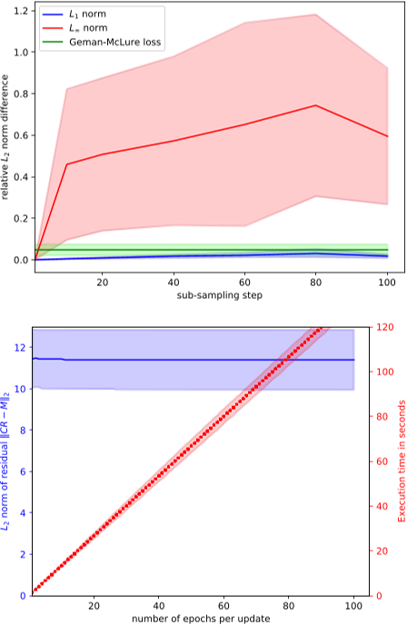

**1809.03550v3-Figure2-1.png**

- Caption: Figure 2: The configurations of the 3× 3 contiguous patches, whose fraction within all the 3× 3 contiguous patches is sought.
- Content type: figure
- Figure type: schematic

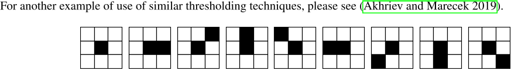

**1809.03550v3-Figure3-1.png**

- Caption: Figure 3: A histogram of residuals. The histogram was truncated from the original 3·255 residuals to allow for some clarity of presentation. In green, there is the middle of the least-width interval representing half of the mass. In yellow, there are the end-points of the interval. In red, the “optimal” threshold we use.
- Content type: figure
- Figure type: plot

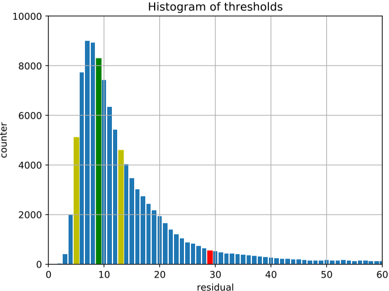

**1809.03550v3-Figure4-1.png**

- Caption: One snapshot from the video baseline/highway (from the top left, clock-wise): one frame of the original video, our estimate of the background, our residuals prior to thresholding, the ground truth, an exponential smoothing of all frames prior to the current one with smoothing factor of 1/35, and finally, our Boolean map obtained by thresholding residuals.
- Content type: figure
- Figure type: photograph(s)

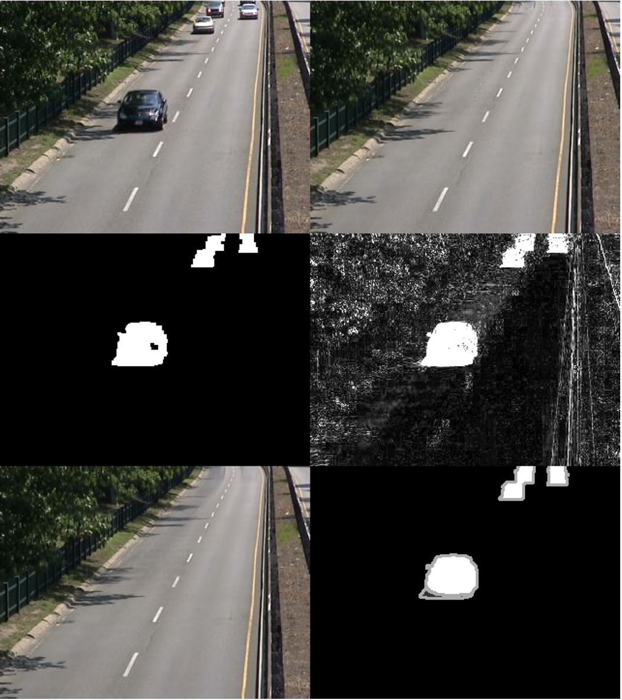

**1809.03550v3-Table1-1.png**

- Caption: Table 1: A comparison of our approach against five of the best-known RPCA implementations and the recent OMoGMF, featuring the F1 score on the baseline category of http://changedetection.net and mean run time (in seconds per input frame, single-threaded) on the “baseline/highway” video-sequence of the same benchmark.
- Content type: table
- Figure type: N/A

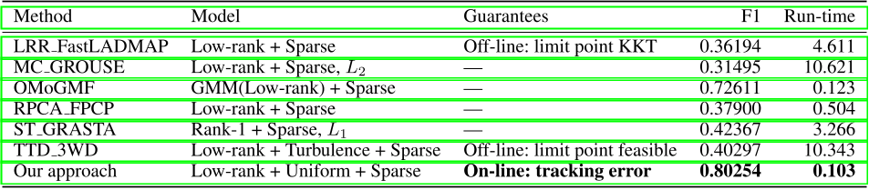

**1809.03550v3-Table2-1.png**

- Caption: Table 2: Results of our Algorithm 2, compared to 6 other approaces on the “baseline” category of http://changedetection.net, evaluated on the 6 performance metrics of (Goyette et al. 2012). For each performance metric, the best result across the presented methods is highlighted in bold.
- Content type: table
- Figure type: N/A

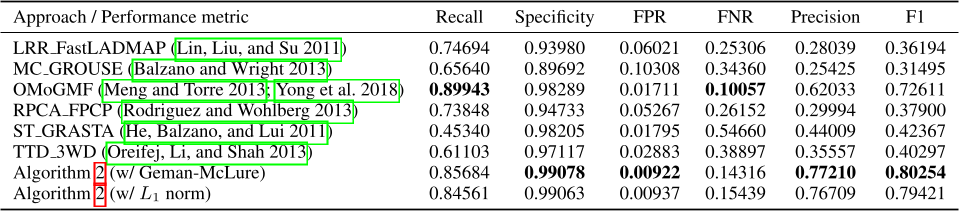

**1809.03550v3-Table3-1.png**

- Caption: Table 3: Results of our Algorithm 2, compared to 3 other approaches on 6 categories of http://changedetection.net, evaluated on the 6 performance metrics of (Goyette et al. 2012). For each pair of performance metric and category, the best result across the presented methods is highlighted in bold.
- Content type: table
- Figure type: N/A

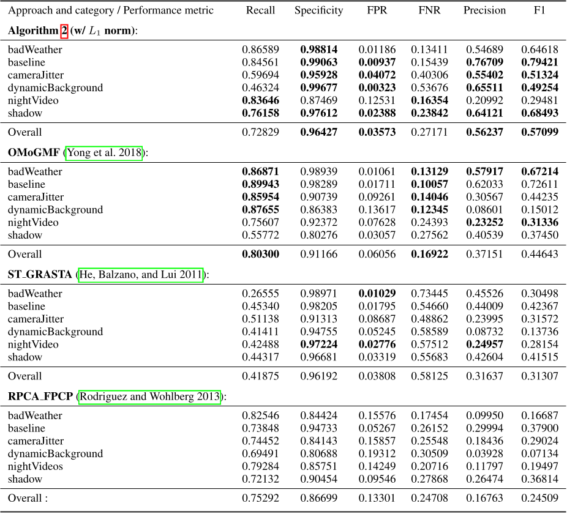

**1809.03550v3-Table4-1.png**

- Caption: Table 4: Results on changedetection.net.
- Content type: table
- Figure type: N/A

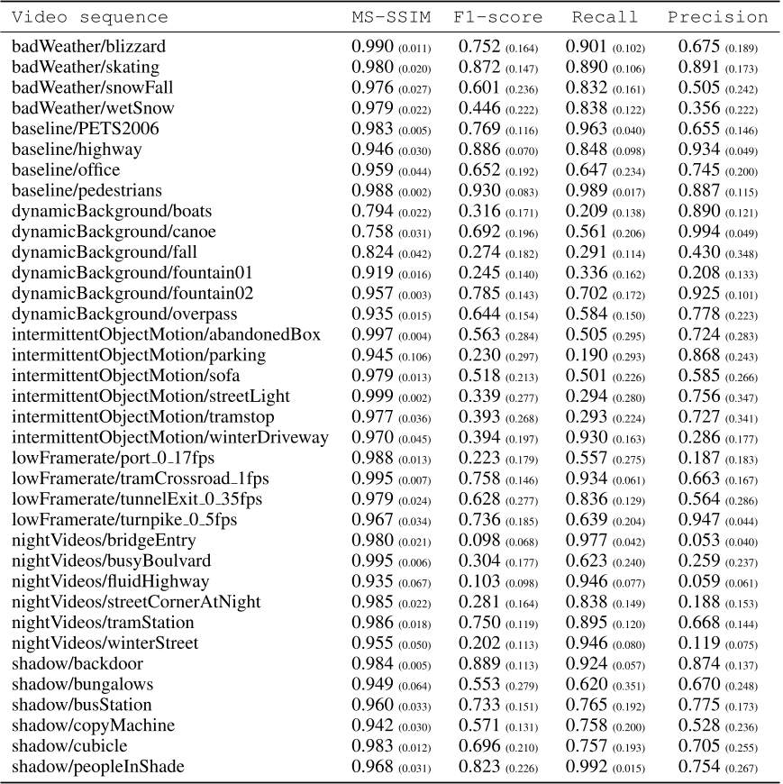

**1809.03550v3-Table5-1.png**

- Caption: Table 5: Further results on http://changedetection.net.
- Content type: table
- Figure type: N/A

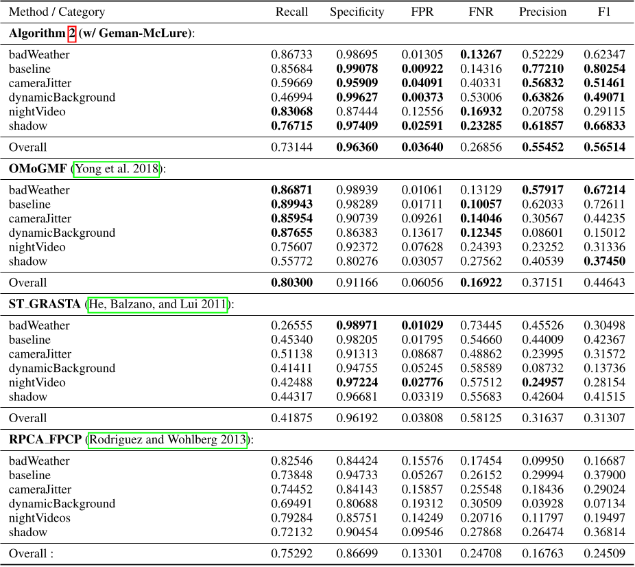

**1809.03550v3-Table6-1.png**

- Caption: Table 6: Mean processing time per input frame (in seconds) on the “baseline/highway” video-sequence from http://changedetection. net. Note, our implementation does not use any parallelisation at the moment. This was done on purpose to run on a machine serving multiple cameras simultaneously.
- Content type: table
- Figure type: N/A

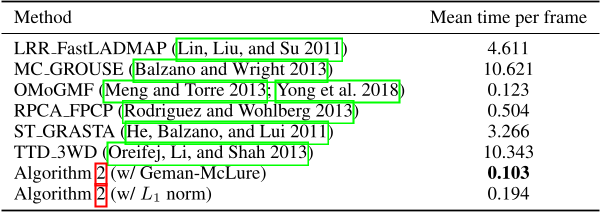

### QAs (4)
**QA 1**

- Question: Why is the optimal threshold chosen to be at the right margin of the region around the mode of the histogram?
- Answer: The region around the mode of the histogram mostly contains noise. Therefore, the optimal threshold is chosen to be at the right margin of this region to avoid including too much noise in the thresholded image.
- Rationale: The figure shows that the region around the mode of the histogram has a high count, which indicates that there are many pixels with similar intensity values in this region. Since noise is typically characterized by random variations in intensity, it is likely that this region contains a significant amount of noise. By choosing the optimal threshold at the right margin of this region, we can exclude most of the noise while still preserving the important features of the image.
- References: 1809.03550v3-Figure3-1.png

Referenced images:

**QA 2**

- Question: Which method achieves the best overall F1 score across all categories? Is this method consistently the best across all individual categories?
- Answer: According to the table, Algorithm 2 w/ Geman-McLure) achieves the best overall F1 score of 0.56514. However, this method is not consistently the best across all individual categories. For example, OMoGMF has a higher F1 score for the "badWeather" category.
- Rationale: The table presents the performance of various methods for different categories in terms of several metrics, including F1 score. The overall F1 score is shown in the last row. By comparing the F1 scores in this row, we can determine which method performs best overall. However, examining the F1 scores within each category reveals that different methods may excel in different scenarios.
- References: 1809.03550v3-Table5-1.png

Referenced images:

**QA 3**

- Question: Which algorithm achieves the fastest processing time per frame and how much faster is it compared to the slowest algorithm listed?
- Answer: Algorithm 12(SCDM with Geman-McLure) achieves the fastest processing time per frame at 0.103 seconds. This is approximately 100 times faster than the slowest algorithm, TTD_3WD, which takes 10.343 seconds per frame.
- Rationale: Table 1 explicitly lists the mean processing time per frame for each algorithm. By comparing these values, we can identify the fastest and slowest algorithms. The caption clarifies that the implementation does not utilize parallelization, ensuring a fair comparison across algorithms.
- References: 1809.03550v3-Table6-1.png

Referenced images:

**QA 4**

- Question: What is the relationship between the residuals prior to thresholding and the Boolean map?
- Answer: The Boolean map is obtained by thresholding the residuals prior to thresholding.
- Rationale: The residuals prior to thresholding show the difference between the current frame and the estimated background. The Boolean map is a binary image where pixels are set to 1 if the corresponding residual value is above a certain threshold and 0 otherwise. This means that the Boolean map highlights the areas where the current frame differs significantly from the estimated background, which is likely due to the presence of moving objects.
- References: 1809.03550v3-Figure4-1.png

Referenced images:

---
## Paper: 1811.06635v1
Semantic Scholar ID: 1811.06635v1

### Figures/Tables (4)
**1811.06635v1-Figure1-1.png**

- Caption: Block sparsity structure as a weighted graph model: nodes are variables, black nodes are selected variables
- Content type: figure
- Figure type: schematic

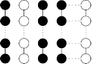

**1811.06635v1-Figure2-1.png**

- Caption: An example of constructing an underlying graph for ρ(G) = 2 and B s−g = 2
- Content type: figure
- Figure type: ** Schematic

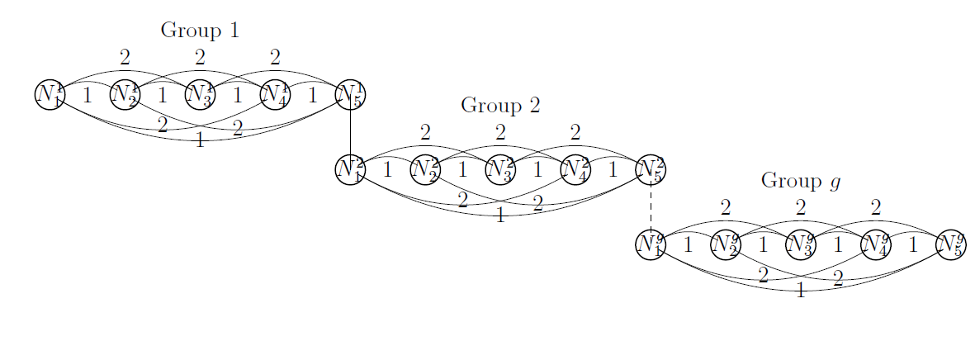

**1811.06635v1-Figure3-1.png**

- Caption: An example of an underlying graph G for (G, s, g,B) − WGM with parameters d = 15, s = 10, g = 5, B = 5, ρ(G) = 2
- Content type: figure
- Figure type: schematic

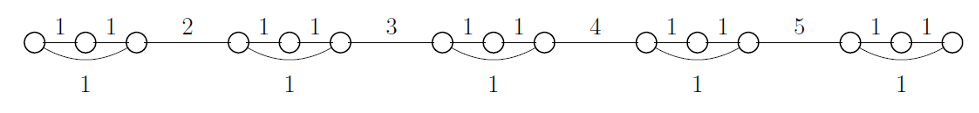

**1811.06635v1-Table1-1.png**

- Caption: Sample Complexity Results for Structured Sparsity Models (d is the dimension of the true signal, s is the signal sparsity, i.e., the number of non-zero entries, g is the number of connected components, ρ(G) is the maximum weight degree of graph G, B is the weight budget in the weighted graph model, K is the block sparsity, J is the number of entries in a block and N is the total number of blocks in the block structured sparsity model – detailed explanation of notations are provided in Sections 3 and 5)
- Content type: table
- Figure type: table

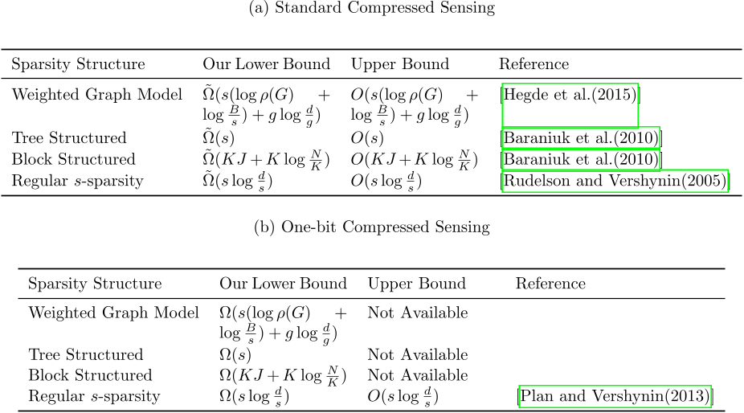

### QAs (1)
**QA 1**

- Question: What is the sample complexity lower bound for recovering a tree-structured sparse signal using standard compressed sensing?
- Answer: Ω(s)
- Rationale: The table in the figure shows the sample complexity lower and upper bounds for different sparsity structures and compressed sensing methods. For standard compressed sensing and a tree-structured sparsity model, the lower bound is Ω(s), where s is the signal sparsity.
- References: 1811.06635v1-Table1-1.png

Referenced images:

---
## Paper: 1811.09393v4
Semantic Scholar ID: 1811.09393v4

### Figures/Tables (23)
**1811.09393v4-Figure10-1.png**

- Caption: Video translations between renderings of smoke simulations and real-world captures for smokes.
- Content type: figure
- Figure type: ** photograph(s)

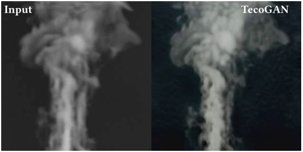

**1811.09393v4-Figure11-1.png**

- Caption: Additional VSR comparisons, with videos in Sec 2 of the supplemental web-page. The TecoGAN model generates sharp details in both scenes.
- Content type: figure
- Figure type: photograph(s)

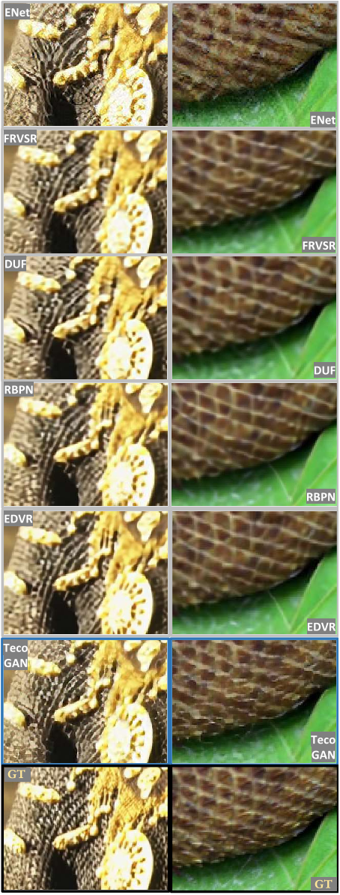

**1811.09393v4-Figure12-1.png**

- Caption: Fig. 12. Detail views of the VSR results of ToS scenes (first three columns) and Vid4 scenes (two right-most columns) generated with different methods: from top to bottom. ENet [Sajjadi et al. 2017], FRVSR [Sajjadi et al. 2018], DUF [Jo et al. 2018], RBPN [Haris et al. 2019], EDVR [Wang et al. 2019a], TecoGAN, and the ground truth. Tears of Steel (ToS) movie (CC) Blender Foundation | mango.blender.org.
- Content type: figure
- Figure type: photograph(s)

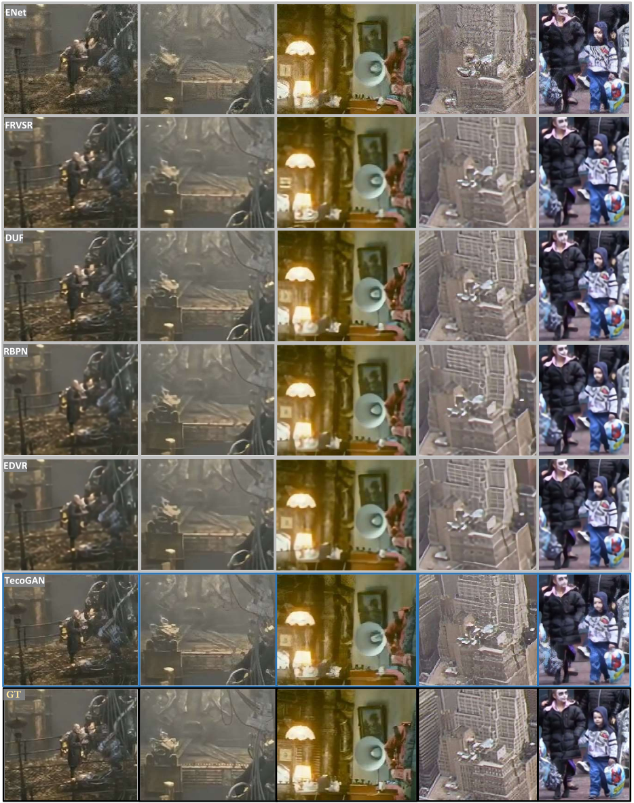

**1811.09393v4-Figure13-1.png**

- Caption: VSR comparisons for different captured images in order to compare to previous work [Liao et al. 2015; Tao et al. 2017].
- Content type: figure
- Figure type: photograph(s)

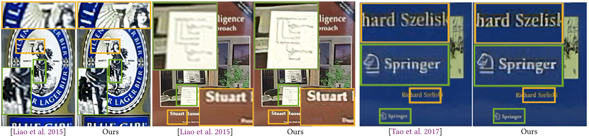

**1811.09393v4-Figure14-1.png**

- Caption: Visual summary of VSR models. a) LPIPS (x-axis) measures spatial detail and temporal coherence is measured by tLP (y-axis) and tOF (bubble size with smaller as better). b) The red-dashed-box region of a), containing our ablated models. c) The network sizes.
- Content type: figure
- Figure type: plot

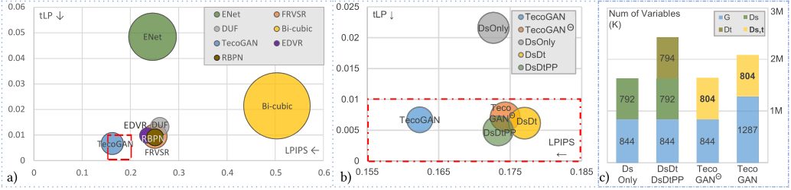

**1811.09393v4-Figure15-1.png**

- Caption: Bar graphs of temporal metrics for Vid4.
- Content type: figure
- Figure type: plot

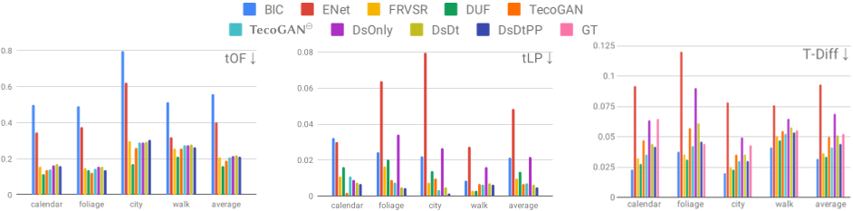

**1811.09393v4-Figure16-1.png**

- Caption: Spatial metrics for Vid4. Fig. 17. Metrics for ToS.
- Content type: figure
- Figure type: plot

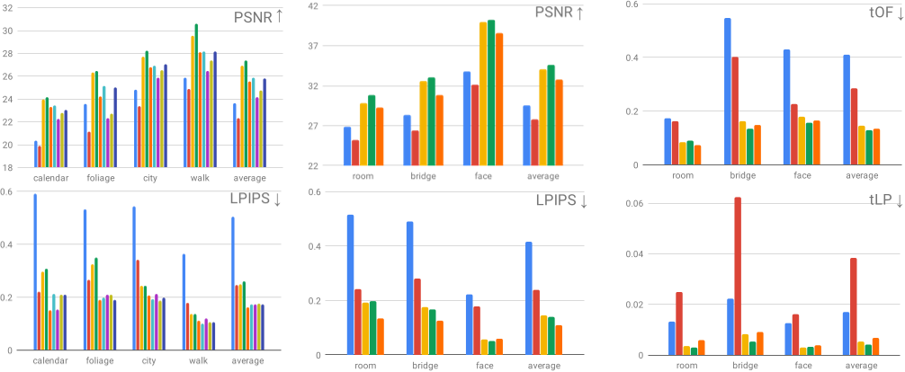

**1811.09393v4-Figure18-1.png**

- Caption: Tables and visualization of perceptual metrics computed with PieAPP [Prashnani et al. 2018] (instead of LPIPS used in Fig. 14 previously) on ENet, FRVSR, DUF and TecoGAN for the VSR of Vid4. Bubble size indicates the tOF score.
- Content type: figure
- Figure type: plot.

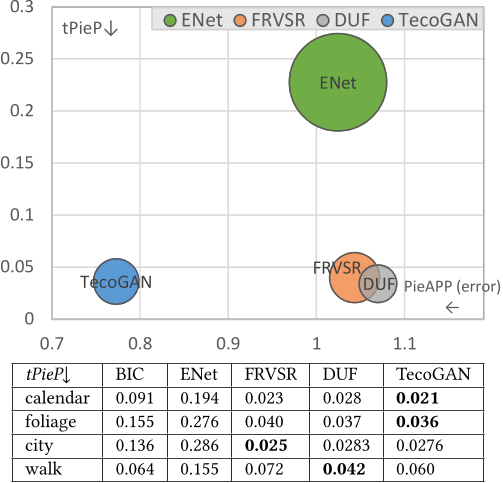

**1811.09393v4-Figure19-1.png**

- Caption: A sample setup of user study.
- Content type: figure
- Figure type: photograph(s)

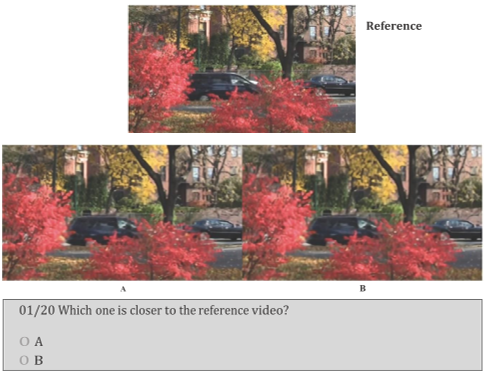

**1811.09393v4-Figure2-1.png**

- Caption: a) A spatial GAN for image generation. b) A frame recurrent Generator. c) A spatio-temporal Discriminator. In these figures, letter a, b , and д, stand for the input domain, the output domain and the generated results respectively. G and D stand for the generator and the discriminator.
- Content type: figure
- Figure type: schematic

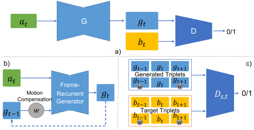

**1811.09393v4-Figure20-1.png**

- Caption: Tables and bar graphs of Bradley-Terry scores and standard errors for Vid4 VSR.
- Content type: figure
- Figure type: plot

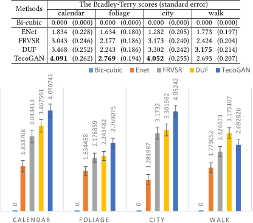

**1811.09393v4-Figure22-1.png**

- Caption: Near image boundaries, flow estimation is less accurate and warping often fails to align content. The first two columns show original and warped frames, the third one shows differences after warping (ideally all black). The top row shows that structures moving into the view can cause problems, visible at the bottom of the images. The second row has objects moving out of the view.
- Content type: figure
- Figure type: photograph(s)

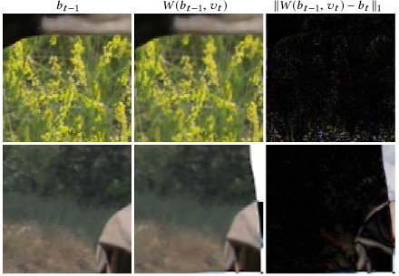

**1811.09393v4-Figure23-1.png**

- Caption: 1st & 2nd row: Frame 15 & 40 of the Foliage scene. While DsDt leads to strong recurrent artifacts early on, PP-Augment shows similar artifacts later in time (2nd row, middle). TecoGAN⊖ model successfully removes these artifacts.
- Content type: figure
- Figure type: photograph(s)

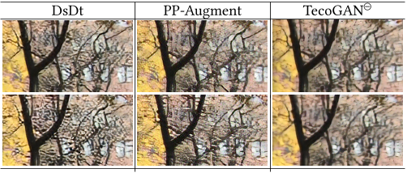

**1811.09393v4-Figure3-1.png**

- Caption: a) Result without PP loss. The VSR network is trained with a recurrent frame-length of 10. When inference on long sequences, frame 15 and latter frames of the foliage scene show the drifting artifacts. b) Result trained with PP loss. These artifacts are removed successfully for the latter. c) When inferring a symmetric PP sequence with a forward pass (Ping) and its backward counterpart (Pong), our PP loss constrains the output sequence to be symmetric. It reduces the L2 distance between дt and д′t , the corresponding frames in the forward and backward passes, shown via red circles with a minus sign. The PP loss reduces drifting artifacts and improves temporal coherence.
- Content type: figure
- Figure type: 

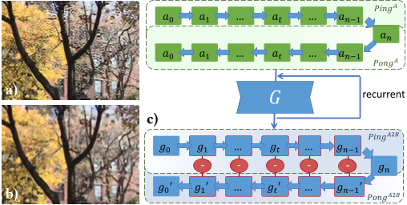

**1811.09393v4-Figure4-1.png**

- Caption: a) The frame-recurrent VSR Generator. b) Conditional VSR Ds,t .
- Content type: figure
- Figure type: ** Schematic

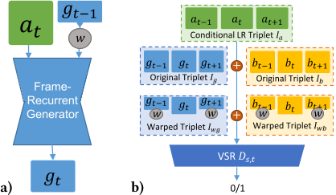

**1811.09393v4-Figure5-1.png**

- Caption: a) The UVT cycle link formed by two recurrent generators. b) Unconditional UVT Ds,t .
- Content type: figure
- Figure type: schematic

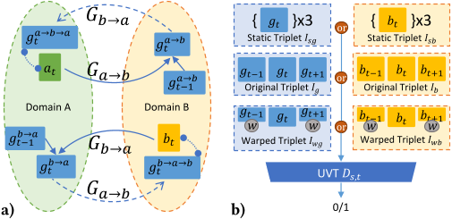

**1811.09393v4-Figure8-1.png**

- Caption: When learning a mapping between Trump and Obama, the CycleGAN model gives good spatial features but collapses to essentially static outputs of Obama. It manages to transfer facial expressions back to Trump using tiny differences encoded in its Obama outputs, without understanding the cycle-consistency between the two domains. Being able to establish the correct temporal cycle-consistency between domains, ours, RecycleGAN and STC-V2V can generate correct blinking motions, shown in Sec. 4.7 of the supplemental web-page. Our model outperforms the latter two in terms of coherent detail that is generated. Obama and Trump video courtesy of the White House (public domain).
- Content type: figure
- Figure type: photograph(s)

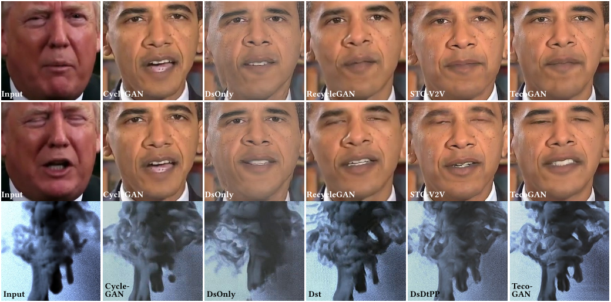

**1811.09393v4-Figure9-1.png**

- Caption: Adversarial training arrives at different equilibriums when discriminators use different inputs. The baseline model (supervised on original triplets) and the vid2vid variant (supervised on original triplets and estimated motions) fail to learn the complex temporal dynamics of a highresolution smoke. The warped triplets improve the result of the concat model and the full TecoGAN model performs better spatio-temporally. Video comparisons are shown in Sec 5. of the supplemental web-page.
- Content type: figure
- Figure type: photograph(s)

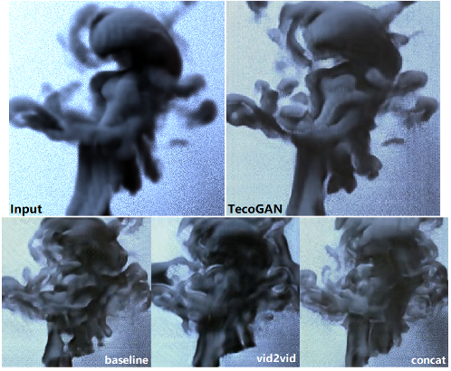

**1811.09393v4-Table2-1.png**

- Caption: Averaged VSR metric evaluations for the Vid4 data set with the following metrics, PSNR: pixel-wise accuracy. LPIPS (AlexNet): perceptual distance to the ground truth. T-diff: pixel-wise differences of warped frames. tOF: pixel-wise distance of estimated motions. tLP: perceptual distance between consecutive frames. User study: Bradley-Terry scores [Bradley and Terry 1952]. Performance is averaged over 500 images up-scaled from 320x134 to 1280x536. More details can be found in Appendix A and Sec. 3 of the supplemental web-page.
- Content type: table
- Figure type: table

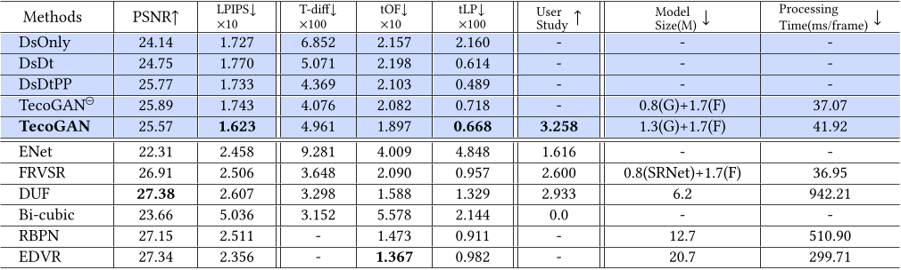

**1811.09393v4-Table3-1.png**

- Caption: For the Obama&Trump dataset, the averaged tLP and tOF evaluations closely correspond to our user studies. The table below summarizes user preferences as Bradley-Terry scores. Details are given in Appendix B and Sec. 3 of the supplemental web-page.
- Content type: table
- Figure type: table

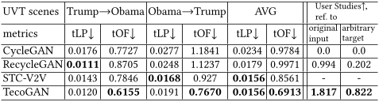

**1811.09393v4-Table4-1.png**

- Caption: Metrics evaluated for the VSR Vid4 scenes.
- Content type: table
- Figure type: table

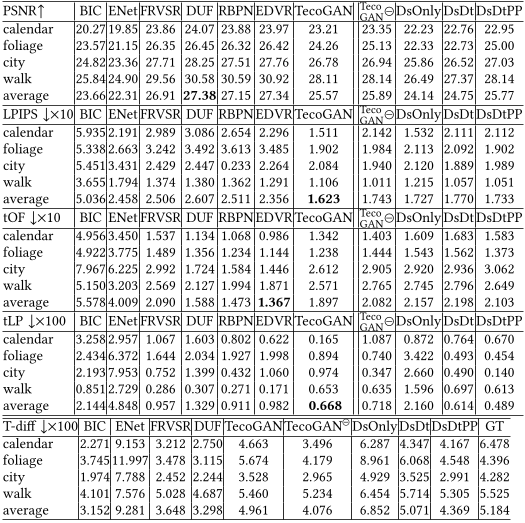

**1811.09393v4-Table5-1.png**

- Caption: Metrics evaluated for VSR of ToS scenes.
- Content type: table
- Figure type: table

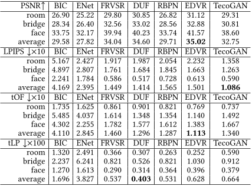

**1811.09393v4-Table6-1.png**

- Caption: Training parameters
- Content type: table
- Figure type: table

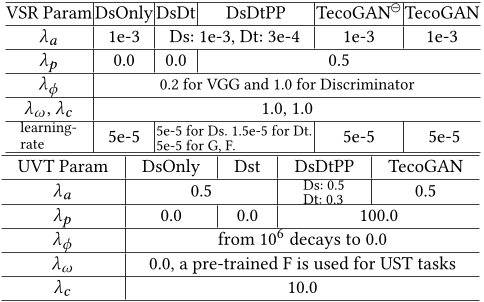

### QAs (15)
**QA 1**

- Question: Which method has the highest T-Diff on average for the Vid4 dataset?
- Answer: TecoGAN.
- Rationale: The bar for TecoGAN is the highest in the "average" category of the T-Diff graph.
- References: 1811.09393v4-Figure15-1.png

Referenced images:

**QA 2**

- Question: Which GAN model is able to generate the most realistic blinking motions?
- Answer: TecoGAN
- Rationale: The caption states that our model, RecycleGAN, and STC-V2V are all able to generate correct blinking motions, but that our model outperforms the latter two in terms of coherent detail that is generated. This can be seen in the figure, where the blinking motions generated by our model are more realistic and less jerky than those generated by the other models.
- References: 1811.09393v4-Figure8-1.png

Referenced images:

**QA 3**

- Question: Which of the VSR models in the figure achieves the best balance of spatial detail and temporal coherence?
- Answer: TecoGAN
- Rationale: The figure shows that TecoGAN achieves the lowest LPIPS score (which measures spatial detail) and the lowest tLP score (which measures temporal coherence).
- References: 1811.09393v4-Figure14-1.png

Referenced images:

**QA 4**

- Question: Which method achieves the highest PSNR on the Vid4 data set?
- Answer: DUF
- Rationale: The table shows that DUF has the highest PSNR value of 27.38.
- References: 1811.09393v4-Table2-1.png

Referenced images:

**QA 5**

- Question: What is the role of the warped triplets in the conditional VSR Ds,t?
- Answer: The warped triplets provide additional information about the motion and appearance of the scene, which helps the VSR Ds,t to generate more accurate and realistic results.
- Rationale: The warped triplets are created by warping the original triplets using the estimated motion information. This warping process aligns the corresponding pixels in the different frames, which allows the VSR Ds,t to better understand the motion and appearance of the scene.
- References: 1811.09393v4-Figure4-1.png

Referenced images:

**QA 6**

- Question: How does the PP loss improve the temporal coherence of the video sequence?
- Answer: The PP loss constrains the output sequence to be symmetric by reducing the L2 distance between corresponding frames in the forward and backward passes. This helps to reduce drifting artifacts and improve temporal coherence.
- Rationale: The figure shows how the PP loss works. The forward pass (Ping) and the backward pass (Pong) are shown in the figure. The PP loss reduces the L2 distance between corresponding frames in the forward and backward passes, which is shown by the red circles with a minus sign. This helps to reduce drifting artifacts and improve temporal coherence.

**Figure type:** Schematic
- References: 1811.09393v4-Figure3-1.png

Referenced images:

**QA 7**

- Question: What is the role of the Motion Compensation block in the Frame-Recurrent Generator?
- Answer: The Motion Compensation block estimates the motion between the previous frame and the current frame, and uses this information to warp the previous frame to the current frame. This helps the generator to produce more realistic images by taking into account the temporal information in the video sequence.
- Rationale: The Motion Compensation block is shown in Figure b, and it is connected to the input gt−1 and the output gt. The block W represents the warping operation.
- References: 1811.09393v4-Figure2-1.png

Referenced images:

**QA 8**

- Question: Which method produces the least amount of artifacts?
- Answer: TecoGAN⊖.
- Rationale: The figure shows that both DsDt and PP-Augment produce artifacts, while TecoGAN⊖ does not.
- References: 1811.09393v4-Figure23-1.png

Referenced images:

**QA 9**

- Question: Which method produces the most realistic results for the Vid4 scenes?
- Answer: TecoGAN.
- Rationale: The figure shows the VSR results of different methods for the Vid4 scenes. The results of TecoGAN are visually the closest to the ground truth.
- References: 1811.09393v4-Figure12-1.png

Referenced images:

**QA 10**

- Question: What is the learning rate for the generator in the DsOnly model?
- Answer: 5.00E-05
- Rationale: The learning rate for the generator is listed in the table under the VSR Param section for the DsOnly model.
- References: 1811.09393v4-Table6-1.png

Referenced images:

**QA 11**

- Question: Why does flow estimation become less accurate near image boundaries?
- Answer: Flow estimation becomes less accurate near image boundaries because there is less information available to estimate the flow. This is because the pixels at the boundaries are only surrounded by pixels on one side, whereas pixels in the interior of the image are surrounded by pixels on all sides.
- Rationale: The figure shows that the differences after warping are not all black near the image boundaries, indicating that the flow estimation is less accurate in these regions.
- References: 1811.09393v4-Figure22-1.png

Referenced images:

**QA 12**

- Question: Which method has the best perceptual performance according to the tOF score?
- Answer: TecoGAN.
- Rationale: The bubble size indicates the tOF score. TecoGAN has the largest bubble, which means it has the highest tOF score.
- References: 1811.09393v4-Figure18-1.png

Referenced images:

**QA 13**

- Question: Which of the methods generated the sharpest details?
- Answer: TecoGAN
- Rationale: The caption states that the TecoGAN model generates sharp details in both scenes.
- References: 1811.09393v4-Figure11-1.png

Referenced images:

**QA 14**

- Question: What is the purpose of the UVT cycle link?
- Answer: The UVT cycle link is used to transfer knowledge between two recurrent generators.
- Rationale: The figure shows that the UVT cycle link connects two recurrent generators, one for domain A and one for domain B. The generators are connected in a cycle, so that each generator can learn from the other. This allows the generators to share knowledge and improve their performance.
- References: 1811.09393v4-Figure5-1.png

Referenced images:

**QA 15**

- Question: What is the purpose of the user study?
- Answer: The user study is designed to test which of two images is closer to a reference video.
- Rationale: The image shows three images, one labeled "Reference" and two labeled "A" and "B." The question asks which of the two images is closer to the reference video, suggesting that the user study is designed to test the participants' ability to identify the image that is most similar to the reference video.
- References: 1811.09393v4-Figure19-1.png

Referenced images:

---
## Paper: 1812.06589v2
Semantic Scholar ID: 1812.06589v2

### Figures/Tables (10)
**1812.06589v2-Figure1-1.png**

- Caption: Illustration of proposed audio-visual coherence learning.
- Content type: figure
- Figure type: schematic

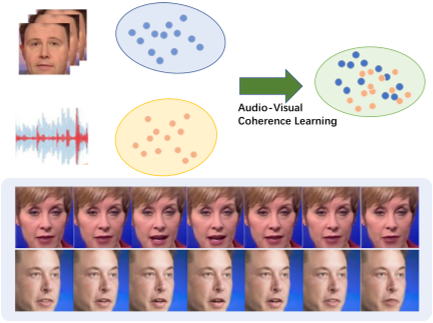

**1812.06589v2-Figure2-1.png**

- Caption: Figure 2: Pipeline of our proposed method.
- Content type: figure
- Figure type: schematic

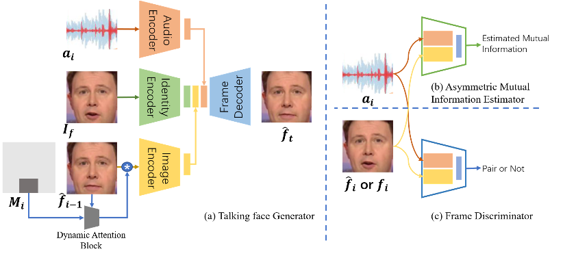

**1812.06589v2-Figure3-1.png**

- Caption: Visualization of distributions of real and generated frames. We reduce the dimension of frames into two-dimension via PCA for better demonstration. It is obvious that the generated samples are closer to the real samples than that with original MINE.
- Content type: figure
- Figure type: plot

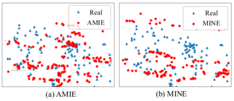

**1812.06589v2-Figure4-1.png**

- Caption: Figure 4: The illustration of the proposed dynamic attention.
- Content type: figure
- Figure type: photograph(s)

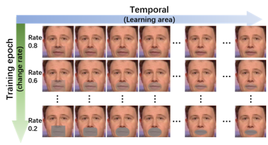

**1812.06589v2-Figure5-1.png**

- Caption: Figure 5: Generation examples of our method comparing with Ground Truth (G.T.) (a), and Zhou et al. and Chen et al. (b). (Better zoom in to see the detail).
- Content type: figure
- Figure type: ** photograph(s)

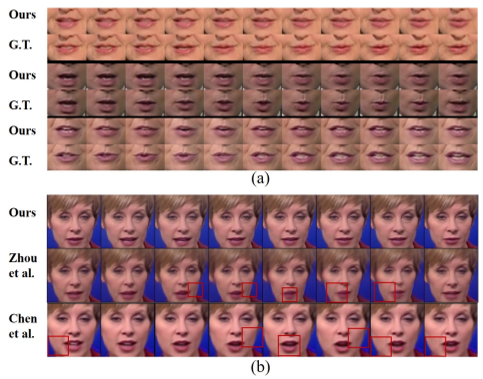

**1812.06589v2-Figure6-1.png**

- Caption: Qualitative results of ablation.
- Content type: figure
- Figure type: photograph(s)

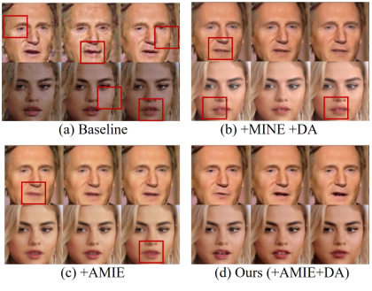

**1812.06589v2-Table1-1.png**

- Caption: Quantitative results.
- Content type: table
- Figure type: table

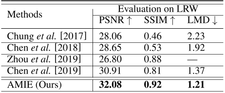

**1812.06589v2-Table2-1.png**

- Caption: Cross-dataset evaluation of our method on GRID dataset pre-trained on LRW dataset.
- Content type: table
- Figure type: table

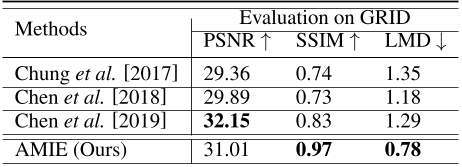

**1812.06589v2-Table3-1.png**

- Caption: Ablation study of the key components AMIE and DA in our method as well as two strategies applied in AMIE: Asymmetric Training (Asy.) and JS represented estimator (JS). Ours = Baseline + AMIE + DA, and AMIE = MINE + Asy. + JS.
- Content type: table
- Figure type: table

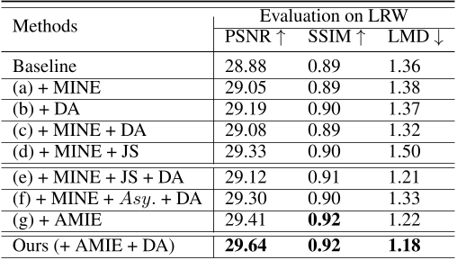

**1812.06589v2-Table4-1.png**

- Caption: Results of user study.
- Content type: table
- Figure type: table

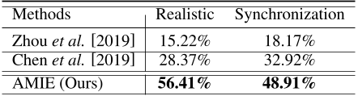

### QAs (8)
**QA 1**

- Question: How do the different methods compare in terms of their ability to generate realistic faces?
- Answer: The baseline method generates faces that are blurry and unrealistic, while the other methods generate faces that are more realistic.
- Rationale: The figure shows examples of faces generated by the different methods. The baseline method generates faces that are blurry and unrealistic, while the other methods generate faces that are more realistic.
- References: 1812.06589v2-Figure6-1.png

Referenced images:

**QA 2**

- Question: What is the effect of adding DA to the baseline method?
- Answer: Adding DA to the baseline method improves the PSNR and SSIM values, while slightly decreasing the LMD value.
- Rationale: The table shows that the baseline method has a PSNR of 28.88, an SSIM of 0.89, and an LMD of 1.36. When DA is added to the baseline method (b), the PSNR increases to 29.19, the SSIM increases to 0.90, and the LMD decreases to 1.37. This indicates that adding DA improves the image quality and reduces the distortion.
- References: 1812.06589v2-Table3-1.png

Referenced images:

**QA 3**

- Question: Which method performed the best on the GRID dataset?
- Answer: AMIE (Ours)
- Rationale: The table shows the results of different methods on the GRID dataset. AMIE (Ours) achieved the highest PSNR and SSIM values, and the lowest LMD value, indicating that it performed the best.
- References: 1812.06589v2-Table2-1.png

Referenced images:

**QA 4**

- Question: What is the role of the frame discriminator in the proposed method?
- Answer: The frame discriminator is used to detect whether the generated frame and audio are matched or not.
- Rationale: The figure shows that the frame discriminator takes the generated frame and audio as input and outputs a decision of whether they are matched or not. This information is used to train the talking face generator to produce frames that are more consistent with the input audio.
- References: 1812.06589v2-Figure2-1.png

Referenced images:

**QA 5**

- Question: How does the dynamic attention block improve the transition of generated video for arbitrary identities?
- Answer: The dynamic attention block decouples the lip-related and identity-related information, allowing the network to focus on the most important area for generating realistic talking faces.
- Rationale: Figure 2 shows how the dynamic attention block works. The block takes as input the previous generated frame and the current audio frame. It then uses a convolutional neural network to compute a set of attention maps, which are used to weight the different parts of the input frame. The attention maps are then used to generate the next frame. The figure shows that the attention maps focus on the lip area, which is the most important area for generating realistic talking faces.
- References: 1812.06589v2-Figure4-1.png

Referenced images:

**QA 6**

- Question: Which method, AMIE or MINE, produces generated frames that are closer in distribution to the real frames?
- Answer: MINE
- Rationale: The figure shows that the red dots, which represent the generated frames produced by MINE, are more closely clustered with the blue triangles, which represent the real frames, than the red dots produced by AMIE. This indicates that the MINE method produces generated frames that are closer in distribution to the real frames.
- References: 1812.06589v2-Figure3-1.png

Referenced images:

**QA 7**

- Question: What are the limitations of the Zhou \textit{et al.} and Chen \textit{et al.} methods for generating talking-face videos, as compared to the method proposed in the paper?
- Answer: The Zhou \textit{et al.} method suffers from a "zoom-in-and-out" effect, while the Chen \textit{et al.} method produces lip shapes that differ from the real ones.
- Rationale: Figure \ref{fig:compare_results} (b) shows that the Zhou \textit{et al.} method produces frames that appear to zoom in and out, while the Chen \textit{et al.} method produces frames with inaccurate lip shapes. In contrast, the proposed method generates frames that are more realistic and synchronous with the audio input.
- References: 1812.06589v2-Figure5-1.png

Referenced images:

**QA 8**

- Question: Which method performed the best according to the LMD metric?
- Answer: AMIE (Ours)
- Rationale: The table shows the LMD values for different methods, and AMIE (Ours) has the lowest LMD value, which is desirable because lower LMD indicates better performance.
- References: 1812.06589v2-Table1-1.png

Referenced images:

---
## Paper: 1906.06589v3
Semantic Scholar ID: 1906.06589v3

### Figures/Tables (19)
**1906.06589v3-Figure1-1.png**

- Caption: Distillation for Membership Privacy (DMP) defense. (1) In pre-distillation phase, DMP trains an unprotected model θup on the private training data without any privacy protection. (2.1) In distillation phase, DMP uses θup to select/generate appropriate reference data Xref that minimizes membership privacy leakage. (2.2) Then, DMP transfers the knowledge of θup by computing predictions of θup on Xref , denoted by θXref
- Content type: figure
- Figure type: Schematic

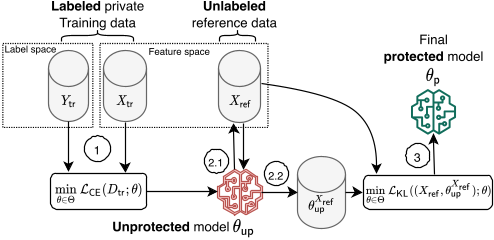

**1906.06589v3-Figure2-1.png**

- Caption: The lower the entropy of predictions of unprotected model on Xref , the higher the membership privacy.
- Content type: figure
- Figure type: plot

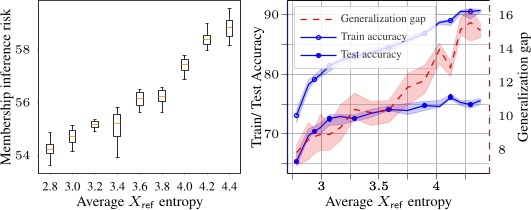

**1906.06589v3-Figure3-1.png**

- Caption: Empirical validation of simplification of (14) to (15): Increase in ∆LCE increases ∆LKL, and that of (14) to (19): Increase inH(θup(z)) increases ∆LKL.
- Content type: figure
- Figure type: Plot

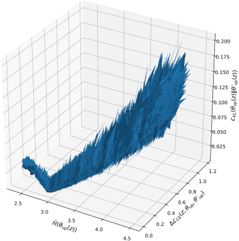

**1906.06589v3-Figure4-1.png**

- Caption: Increasing reference data size, |Xref|, increases accuracy of θp, but also increases R in (11), which increases the membership inference risk due to θp.
- Content type: figure
- Figure type: plot

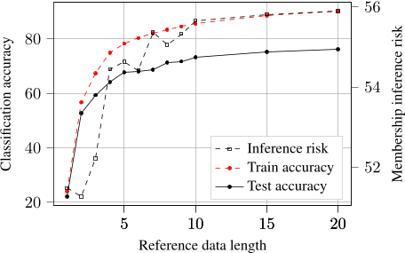

**1906.06589v3-Figure5-1.png**

- Caption: Impact of softmax temperature on training of θp: Increase in the temperature of softmax layer of θup reduces ∆LKL in (13), and hence, the ratioR in (11). This improves the membership privacy and generalization of θp.
- Content type: figure
- Figure type: plot

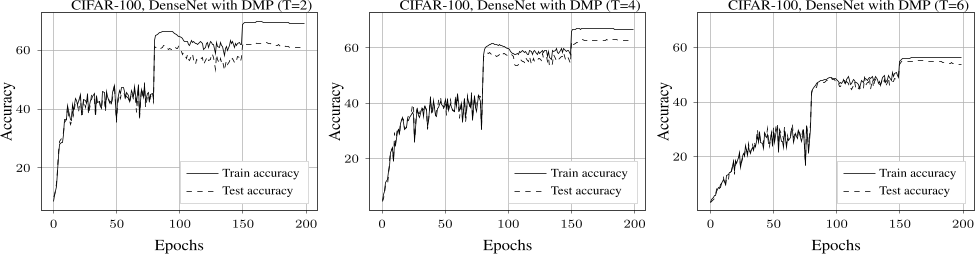

**1906.06589v3-Figure6-1.png**

- Caption: Distributions of gradient norms of members and non-members of private training data. (Upper row): Unlike the distribution of non-members, that of the members of the unprotected model, θup, is skewed towards 0 as θup memorizes the members. (Lower row): The distributions of gradient norms for members and non-members for the protected model, θp, of DMP are almost indistinguishable.
- Content type: figure
- Figure type: plot

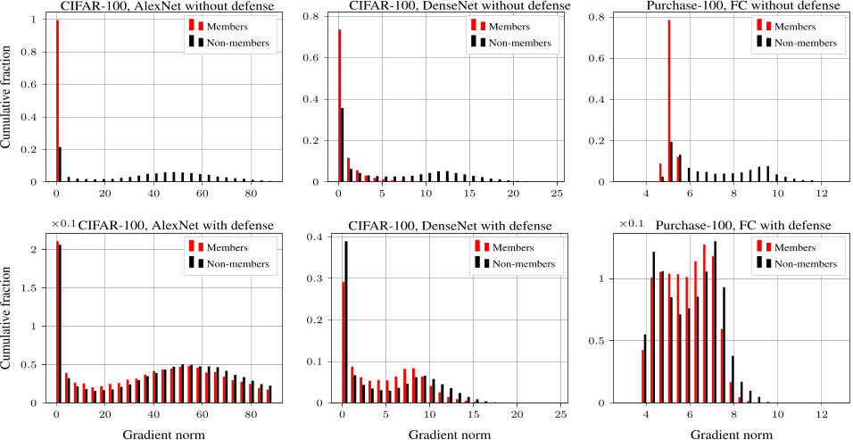

**1906.06589v3-Figure7-1.png**

- Caption: The empirical CDF of the generalization error of models trained with DMP, adversarial regularization (AdvReg), and without defense. The y-axis is the fraction of classes that have generalization error less than the values on x-axis. The generalization error reduction due to DMP is much larger (10× for CIFAR100 and 2× for Purchase) than due to AdvReg. The low generalization error improves membership privacy due to DMP.
- Content type: figure
- Figure type: plot

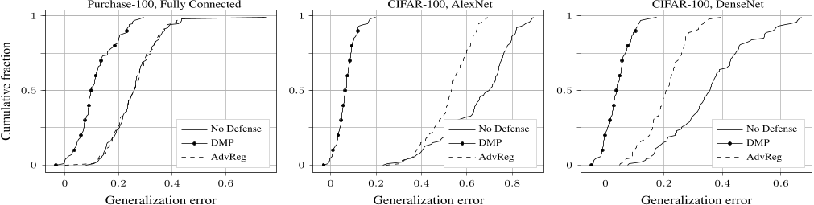

**1906.06589v3-Table1-1.png**

- Caption: Table 1: All the dataset splits are disjoint. D, D′ data are the members and non-members ofDtr known to MIA adversary.
- Content type: table
- Figure type: N/A

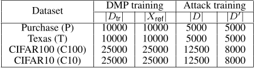

**1906.06589v3-Table10-1.png**

- Caption: DMP does not pose membership inference risk to the possibly sensitive reference data. Aref and Atest are accuracies of protected model, θp, on Xref and Dtest, respectively.
- Content type: table
- Figure type: table

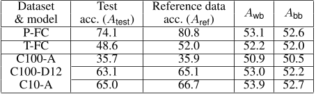

**1906.06589v3-Table11-1.png**

- Caption: Table 11: Generalization error (Egen), test accuracy (Atest), and various MIA risks (evaluated using MIAs from Section 5.2) of models trained using state-of-the-art regularization techniques. Here we provide MIA risks for regularized models whose accuracy is close to that of DMP-trained models. We note that, for the same test accuracy, DMP-trained models provide significantly higher resistance to MIAs.
- Content type: table
- Figure type: N/A

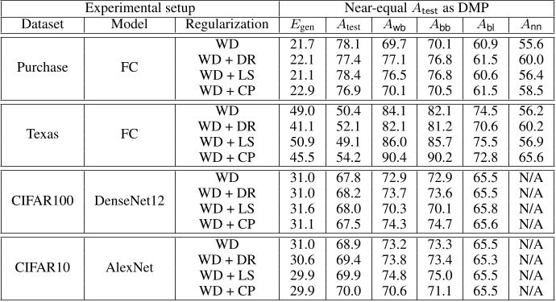

**1906.06589v3-Table12-1.png**

- Caption: Table 12: Best tradeoffs between test accuracy (Atest) and membership inference risks (evaluated using MIAs from Section 5.2) due to adversarial regularization. DMP significantly improves the tradeoffs over the adversarial regularization (results for DMP are in Table 3).
- Content type: table
- Figure type: N/A

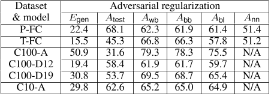

**1906.06589v3-Table2-1.png**

- Caption: Table 2: Models trained without any defenses have high test accuracies, Atest, but their high generalization errors, Egen (i.e., Atrain − Atest) facilitate strong MIAs (§ 5.2). “N/A” means the attack is not evaluated due to lack of data.
- Content type: table
- Figure type: N/A

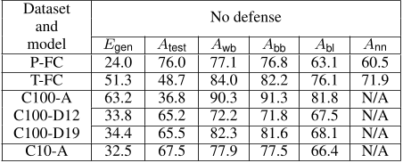

**1906.06589v3-Table3-1.png**

- Caption: Comparing test accuracy (Atest) and generalization error (Egen) of DMP and Adversarial Regularization, for near-equal, low MIA risks (high membership privacy). A+ test shows the % increase in Atest of DMP over Adversarial Regularization.
- Content type: table
- Figure type: Table

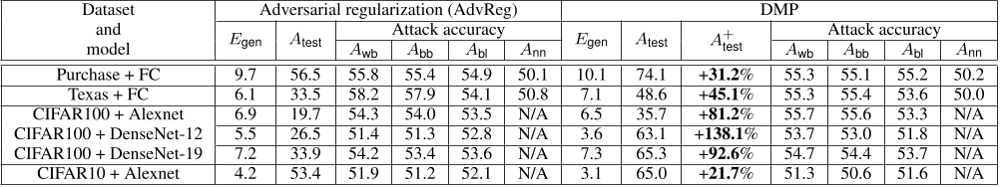

**1906.06589v3-Table4-1.png**

- Caption: Table 4: Evaluating three state-of-the-art regularizers, with similar, low MIA risks (high membership privacy) as DMP. A+ test shows the % increase in Atest due to DMP over the corresponding regularizers.
- Content type: table
- Figure type: N/A

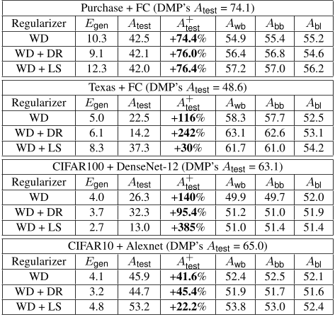

**1906.06589v3-Table5-1.png**

- Caption: Table 5: DP-SGD versus DMP for CIFAR10 and Alexnet. For low MIA risk of ∼ 51.3%, DMP achieves 24.5% higher Atest than of DP-SGD (12.8% absolute increase in Atest).
- Content type: table
- Figure type: N/A

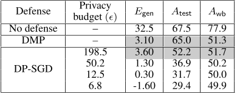

**1906.06589v3-Table6-1.png**

- Caption: Table 6: Comparing PATE with DMP. DMP has Egen, Atest, and Awb of 1.19%, 76.79%, and 50.8%, respectively. PATE has low accuracy even at high privacy budgets, as it divides data among teachers and produces low accuracy ensembles.
- Content type: table
- Figure type: N/A

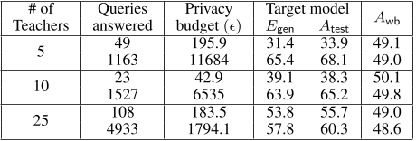

**1906.06589v3-Table7-1.png**

- Caption: Table 7: Evaluation of PATE using the discriminator architecture in (Salimans et al. 2016) trained on CIFAR10. The corresponding DMP-trained model has 77.98% and 76.79% accuracies on the training and test data, and 50.8% membership inference accuracy. Comparison of results clearly show the superior membership privacy-model utility tradeoffs of DMP over PATE.
- Content type: table
- Figure type: N/A

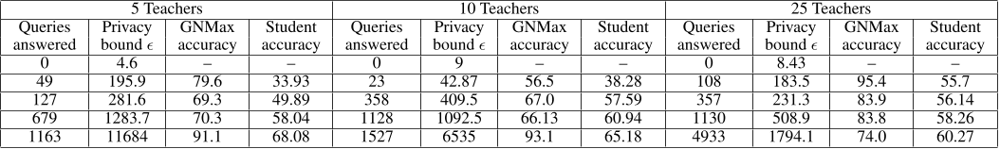

**1906.06589v3-Table8-1.png**

- Caption: Table 8: Effect of the softmax temperature on DMP: For a fixed Xref, increasing the temperature of softmax layer of θup reduces R in (11), which strengthens the membership privacy.
- Content type: table
- Figure type: N/A

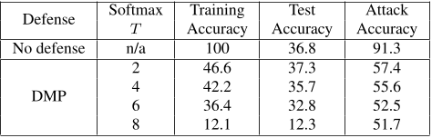

**1906.06589v3-Table9-1.png**

- Caption: Table 9: Temperature of the softmax layers for the different combinations of dataset and network architecture used to produce the results in Table 3 of the main paper.
- Content type: table
- Figure type: N/A

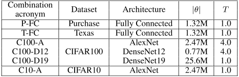

### QAs (3)
**QA 1**

- Question: Which model performed the best on the test data?
- Answer: P-FC
- Rationale: The table shows that P-FC achieved the highest test accuracy (Atest) of 74.1.
- References: 1906.06589v3-Table10-1.png

Referenced images:

**QA 2**

- Question: How does the size of the reference set ($X_\textsf{ref}$) used for DMP training differ between the Purchase/Texas datasets and the CIFAR datasets? Explain the rationale behind this difference.
- Answer: For Purchase and Texas datasets, $X_\textsf{ref}$ is specifically selected and contains 10,000 data points. In contrast, for CIFAR datasets, the entire remaining data (25,000 points) after selecting $D_\textsf{tr}$ is used as $X_\textsf{ref}$. This difference is due to the smaller size of the CIFAR datasets. Using the entire remaining data as $X_\textsf{ref}$ ensures sufficient data for effective DMP training in these cases.
- Rationale: The table shows the sizes of different data splits used in the experiment. By comparing the values in the $X_\textsf{ref}$ column for different datasets, we can see that the selection strategy differs. The passage further clarifies that this difference is intentional and is based on the size of the datasets.
- References: 1906.06589v3-Table1-1.png

Referenced images:

**QA 3**

- Question: What is the relationship between the average X_ref entropy and the generalization gap?
- Answer: The generalization gap increases as the average X_ref entropy increases.
- Rationale: The right panel of the figure shows that the generalization gap (red dashed line) increases as the average X_ref entropy increases.
- References: 1906.06589v3-Figure2-1.png

Referenced images:

