# SPIQA test-A (Part 2 of 4)
Papers in this part: 30

---
## Paper: 1603.03833v4
Semantic Scholar ID: 1603.03833v4

### Figures/Tables (6)
**1603.03833v4-Figure1-1.png**

- Caption: Figure 1: The general flow of our approach. The demonstrations of the ADL manipulation tasks are collected in a virtual environment. The collected trajectories are used to train the neural network controller.
- Content type: figure
- Figure type: schematic

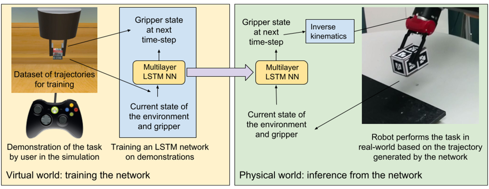

**1603.03833v4-Figure2-1.png**

- Caption: Figure 2: Creating multiple trajectories from a demonstration recorded at a higher frequency.
- Content type: figure
- Figure type: ** Schematic

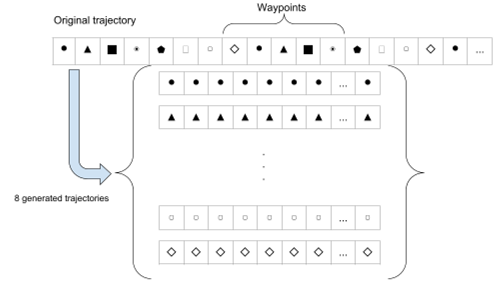

**1603.03833v4-Figure3-1.png**

- Caption: Figure 3: The training and evaluation phase. During the training the LSTM network is unrolled for 50 time-steps. The gripper pose and status (open/close) et and the pose of relevant objects qt at time-step t is used as input and output of the network to calculate and backpropagate the error to update the weights. During the evaluation phase, the mixture density parameters are used to form a mixture of Gaussians and draw a sample from it. The sample is used to control the robot arm.
- Content type: figure
- Figure type: schematic

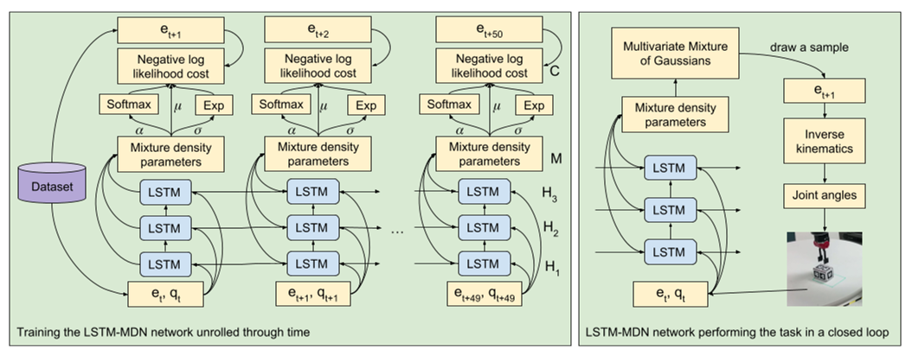

**1603.03833v4-Figure4-1.png**

- Caption: A sequence of images showing the autonomous execution of pick and place in simulation (first row), pick and place in real world (second row), pushing in simulation (third row), and pushing in real world (fourth row). The robot is controlled by a mixture density network with 3 layers of LSTM.
- Content type: figure
- Figure type: photograph(s)

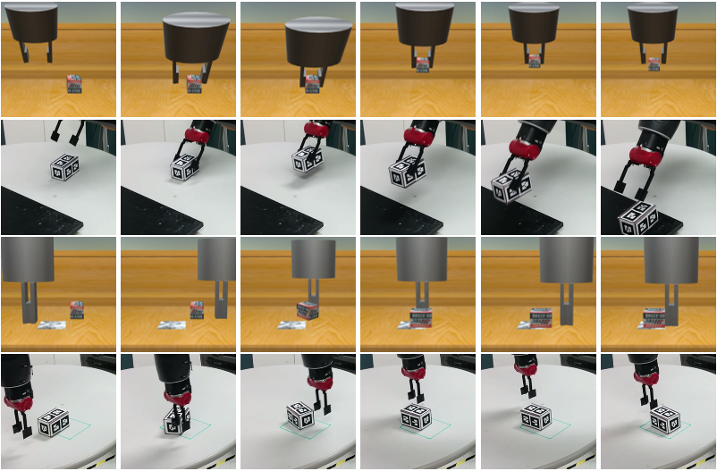

**1603.03833v4-Figure5-1.png**

- Caption: Figure 5: Alternative network architectures used in the comparison study: Feedforward-MSE, LSTM-MSE and Feedforward-MDN
- Content type: figure
- Figure type: schematic

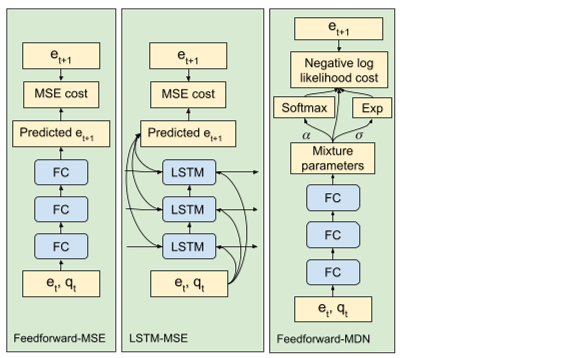

**1603.03833v4-Table1-1.png**

- Caption: Table 1: The size of the datasets for the two studied tasks
- Content type: table
- Figure type: N/A

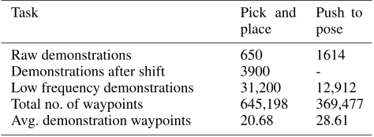

### QAs (6)
**QA 1**

- Question: What is the role of the LSTM-MDN network in the training phase?
- Answer: The LSTM-MDN network is used to learn the relationship between the gripper pose and status, the pose of relevant objects, and the joint angles of the robot arm.
- Rationale: The figure shows that the LSTM-MDN network is unrolled for 50 time-steps during the training phase. The gripper pose and status (open/close)  𝑒𝑡  and the pose of relevant objects  𝑞𝑡  at time-step  𝑡  is used as input and output of the network to calculate and backpropagate the error to update the weights. This process allows the network to learn the relationship between the inputs and outputs.
- References: 1603.03833v4-Figure3-1.png

Referenced images:

**QA 2**

- Question: Why is the number of demonstrations after the shift not available for the "Push to Pose" task?
- Answer: The passage mentions that additional trajectories were generated for the "Pick and Place" task by reducing the frequency of the recorded demonstrations. This process was not applied to the "Push to Pose" task, therefore no "Demonstrations after shift" are listed for it.
- Rationale: The table shows a significant increase in the number of demonstrations for the "Pick and Place" task after applying the frequency reduction technique ("Demonstrations after shift"). This value is absent for the "Push to Pose" task, indicating that this specific technique was not used for that task.
- References: 1603.03833v4-Table1-1.png

Referenced images:

**QA 3**

- Question: How does the frequency reduction process create multiple trajectories from a single demonstration?
- Answer: The frequency reduction process takes a high-frequency trajectory and samples it at a lower frequency, resulting in multiple trajectories with different starting and ending points.
- Rationale: Figure 0 shows how the original trajectory (recorded at 33Hz) is sampled at a lower frequency (4Hz) to generate 8 different trajectories. The waypoints are used to guide the generation of the new trajectories.
- References: 1603.03833v4-Figure2-1.png

Referenced images:

**QA 4**

- Question: What is the role of the virtual environment in the proposed approach?
- Answer: The virtual environment is used to collect demonstrations of the task from the user. This allows for safe and efficient data collection.
- Rationale: The left side of Figure 1 shows the virtual environment, which includes a simulation of the task and a user interface (Xbox controller) for providing demonstrations. The figure also shows that the collected trajectories are used to train the neural network controller.
- References: 1603.03833v4-Figure1-1.png

Referenced images:

**QA 5**

- Question: What is the difference between the pick and place task in simulation and the real world?
- Answer: In the simulation, the robot is able to pick up the object and place it in the desired location without any errors. However, in the real world, the robot makes some errors, such as dropping the object or placing it in the wrong location.
- Rationale: The first row of images shows the pick and place task in simulation, while the second row shows the same task in the real world. The images in the real world show that the robot is not as precise as it is in the simulation.
- References: 1603.03833v4-Figure4-1.png

Referenced images:

**QA 6**

- Question: What are the three different network architectures used in the comparison study?
- Answer: Feedforward-MSE, LSTM-MSE, and Feedforward-MDN.
- Rationale: The figure shows the three different network architectures used in the comparison study. Each network architecture is shown with its corresponding name.
- References: 1603.03833v4-Figure5-1.png

Referenced images:

---
## Paper: 1611.02654v2
Semantic Scholar ID: 1611.02654v2

### Figures/Tables (6)
**1611.02654v2-Figure2-1.png**

- Caption: t-SNE embeddings of representations learned by the model for sentences from the test set. Embeddings are color coded by the position of the sentence in the document it appears.
- Content type: figure
- Figure type: ** plot

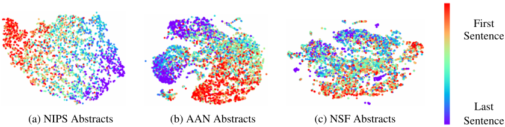

**1611.02654v2-Table1-1.png**

- Caption: Table 1: Mean Accuracy comparison on the Accidents and Earthquakes data for the order discrimination task. The reference models are Entity-Grid (Barzilay and Lapata 2008), HMM (Louis and Nenkova 2012), Graph (Guinaudeau and Strube 2013), Window network (Li and Hovy 2014) and sequence-to-sequence (Li and Jurafsky 2016), respectively.
- Content type: table
- Figure type: N/A

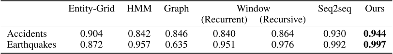

**1611.02654v2-Table2-1.png**

- Caption: Comparison against prior methods on the abstracts data.
- Content type: table
- Figure type: table

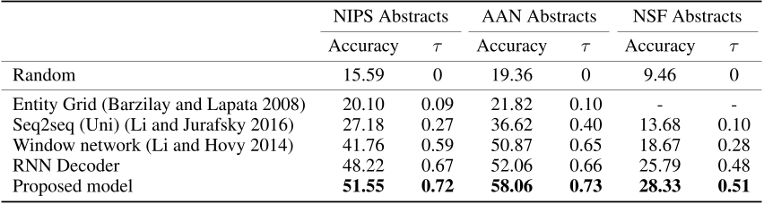

**1611.02654v2-Table3-1.png**

- Caption: Comparison on extractive summarization between models trained from scratch and models pre-trained with the ordering task.
- Content type: table
- Figure type: table

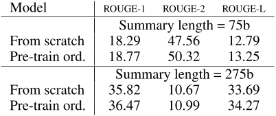

**1611.02654v2-Table4-1.png**

- Caption: Performance comparison for semantic similarity and paraphrase detection. The first row shows the best performing purely supervised methods. The last section shows our models.
- Content type: table
- Figure type: table

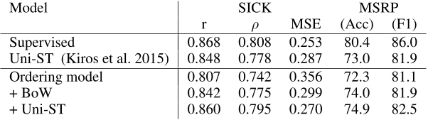

**1611.02654v2-Table5-1.png**

- Caption: Table 5: Visualizing salient words (Abstracts are from the AAN corpus).
- Content type: table
- Figure type: N/A

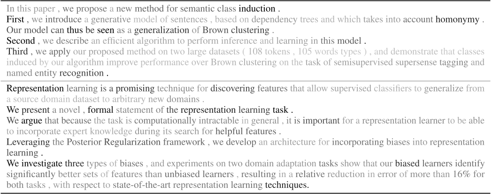

### QAs (5)
**QA 1**

- Question: Which model performed the best on the SICK dataset according to the MSE metric?
- Answer: The supervised model performed the best on the SICK dataset according to the MSE metric.
- Rationale: The table shows the MSE for each model on the SICK dataset. The supervised model has the lowest MSE of 0.253.
- References: 1611.02654v2-Table4-1.png

Referenced images:

**QA 2**

- Question: What is the effect of pre-training with the ordering task on the ROUGE-L score for extractive summarization?
- Answer: Pre-training with the ordering task increases the ROUGE-L score for extractive summarization.
- Rationale: The table shows that the ROUGE-L score for models pre-trained with the ordering task is higher than the ROUGE-L score for models trained from scratch, for both summary lengths.
- References: 1611.02654v2-Table3-1.png

Referenced images:

**QA 3**

- Question: Which model performs the best for the order discrimination task on the Accidents dataset and how does it compare to the other data-driven approaches?
- Answer: The proposed model in this paper achieves the best performance for the order discrimination task on the Accidents dataset with an accuracy of 0.944. It outperforms the other data-driven approaches, namely Window (Recurrent) with 0.840, Window (Recursive) with 0.864, and Seq2seq with 0.930.
- Rationale: Table 1 presents the mean accuracy of different models on the Accidents and Earthquakes datasets for the order discrimination task. By comparing the accuracy values within the Accidents row, we can identify which model performs best. Our model has the highest value (0.944) compared to the other data-driven models listed in the table.
- References: 1611.02654v2-Table1-1.png

Referenced images:

**QA 4**

- Question: What can you say about the relationship between the sentences in a document based on the t-SNE embeddings?
- Answer: Sentences that are closer together in the embedding space are more semantically similar than those that are farther apart.
- Rationale: The t-SNE embeddings are color-coded by the position of the sentence in the document. We can see that sentences that are close together in the embedding space tend to be from the same part of the document, which suggests that they are semantically similar.
- References: 1611.02654v2-Figure2-1.png

Referenced images:

**QA 5**

- Question: How does the proposed model compare to the other models in terms of accuracy on the NIPS Abstracts dataset?
- Answer: The proposed model has the highest accuracy on the NIPS Abstracts dataset, with an accuracy of 51.55.
- Rationale: The table shows the accuracy of different models on three different datasets. The proposed model has the highest accuracy on the NIPS Abstracts dataset.
- References: 1611.02654v2-Table2-1.png

Referenced images:

---
## Paper: 1611.05742v3
Semantic Scholar ID: 1611.05742v3

### Figures/Tables (3)
**1611.05742v3-Figure1-1.png**

- Caption: Conceptual illustration of the proposed Grassmann Network (GrNet) architecture. The rectangles in blue represent three basic blocks, i.e., Projection, Pooling and Output blocks, respectively.
- Content type: figure
- Figure type: schematic

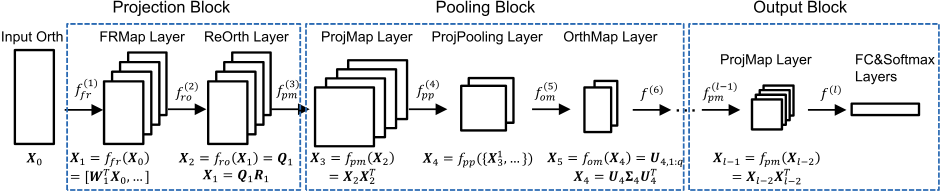

**1611.05742v3-Figure2-1.png**

- Caption: (a) Results of using single and multiple FRMap (S-FRMap, M-FRMap), ProjPoolings across or within projections (A-ProjPooling, W-ProjPooling) for the three used databases. (b) (c) Convergence and accuracy curves of SPDNet and the proposed GrNet for the AFEW.
- Content type: figure
- Figure type: plot

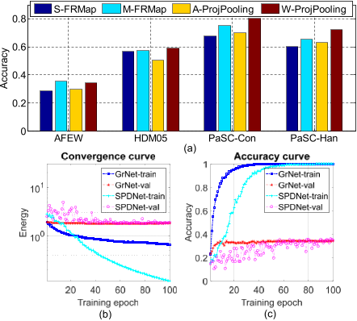

**1611.05742v3-Table1-1.png**

- Caption: Table 1: Results for the AFEW, HDM05 and PaSC datasets. PaSC1/PaSC2 are the control/handheld testings.
- Content type: table
- Figure type: N/A

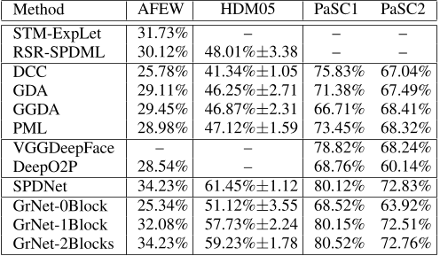

### QAs (3)
**QA 1**

- Question: What is the function of the ReOrth Layer in the Projection Block of the Grassmann Network architecture?
- Answer: The ReOrth Layer re-orthogonalizes the output of the FRMap Layer.
- Rationale: The figure shows that the ReOrth Layer takes the output of the FRMap Layer as its input and outputs a re-orthogonalized version of that input.
- References: 1611.05742v3-Figure1-1.png

Referenced images:

**QA 2**

- Question: Which pooling method is the most accurate for the AFEW database?
- Answer: W-ProjPooling
- Rationale: The accuracy of each pooling method for each database is shown in the bar graph in part (a) of the figure. The bar for W-ProjPooling for the AFEW database is the highest, indicating that it is the most accurate pooling method for that database.
- References: 1611.05742v3-Figure2-1.png

Referenced images:

**QA 3**

- Question: Which method performs best on the PaSC dataset for the handheld testing scenario (PaSC2), and how does its performance compare to other methods?
- Answer: The method that performs best on the PaSC dataset for the handheld testing scenario (PaSC2) is SPDNet, with an accuracy of 72.83%. This performance is slightly higher than GrNet-2Blocks (72.76%) and significantly higher than other methods like VGGDeepFace (68.24%) and DeepO2P (60.14%).
- Rationale: By looking at the column corresponding to PaSC2 in Table 1, we can directly compare the accuracy of all the methods for this specific testing scenario. We can see that SPDNet has the highest accuracy value, indicating its superior performance compared to the other methods.
- References: 1611.05742v3-Table1-1.png

Referenced images:

---
## Paper: 1701.06171v4
Semantic Scholar ID: 1701.06171v4

### Figures/Tables (7)
**1701.06171v4-Figure1-1.png**

- Caption: Comparison of different types of hierarchical compositional models. (a) A sample of the training data; (b & c) Hierarchical compositional models with black strokes indicating edge features at the different location and orientation. (b) The approach as proposed by Dai et al. [5] learns an unnatural rather arbitrary decomposition of the object. (c) Our proposed greedy compositional clustering process learns a semantically meaningful hierarchical compositional model without the need of any a-priori knowledge about the object’s geometry.
- Content type: figure
- Figure type: schematic

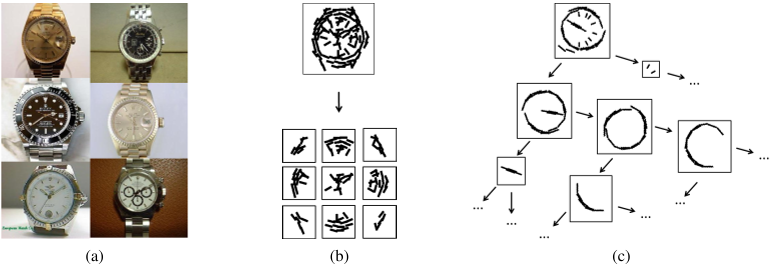

**1701.06171v4-Figure2-1.png**

- Caption: The dependence structure between random variables in a Compositional Active Basis Model. (a) The simplest possible CABM, a binary-tree structured Markov random field. (b) The graphical model of a generalized multi-layer CABM (Section 3.3). We learn the full multi-layer structure of a CABM including the number of layers L, the number of parts per layer NL, . . . , N0 as well as their hierarchical dependence structure.
- Content type: figure
- Figure type: ** Schematic

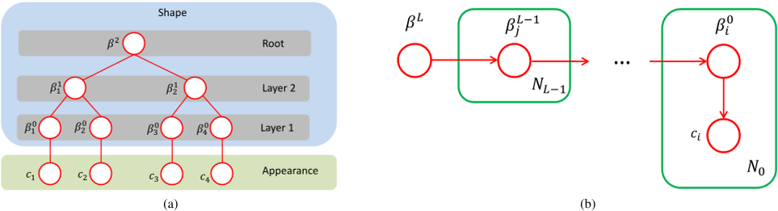

**1701.06171v4-Figure3-1.png**

- Caption: Illustration of the joint bottom-up and top-down compositional learning scheme. During the bottom-up process (blue box) basis filters (black strokes) are grouped into higher-order parts until no further compositions are found. The subsequent top-down process (green box) composes the learned hierarchical part dictionary into a holistic object model (orange box).
- Content type: figure
- Figure type: schematic

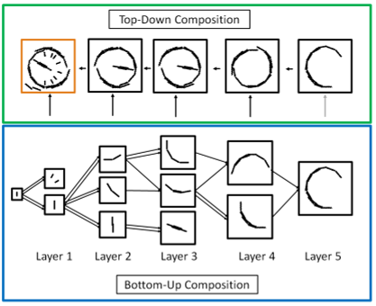

**1701.06171v4-Figure4-1.png**

- Caption: Illustration of the proposed greedy EM-type learning process. The part models are composed of 5 Gabor filters which are represented as colored ellipses. (a) The first t = 22 iterations of the greedy learning scheme. Each row shows the evolution of a part model over time. Each column shows the learning result at one iteration of the learning process. When a new part is initialized (t = 1, 6, 11, . . . ), also a generic background model is learned from the training image (marked by dashed rectangles). The background model and the learned part models are not adapted in the subsequent iterations (gray background) but serve as competitors for data in the E-step. For more details refer to Section 4.1. (b) An example encoding of a training image with the learned part models.
- Content type: figure
- Figure type: schematic

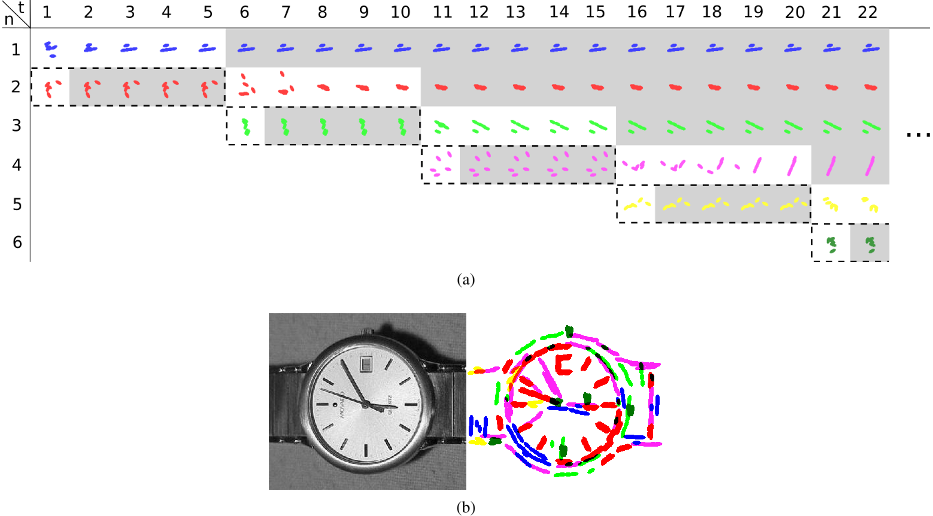

**1701.06171v4-Figure5-1.png**

- Caption: Learned hierarchical compositional models. (a) Samples from the training data. (b) The hierarchical part dictionary learned with our the bottom-up process. (c) The holistic object model after the top-down process. (d) The HCM learned with the HABM approach [5]. The gray squares indicate the parts of their HCM. Compared to the HABM, our method is able to learn the number of parts and layers of the hierarchy. Both approaches are not able to learn the holistic structure of the windmill due to the strong relative rotation between its parts.
- Content type: figure
- Figure type: schematic

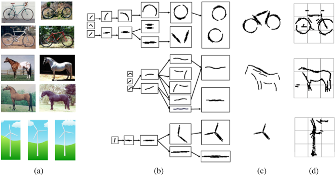

**1701.06171v4-Table1-1.png**

- Caption: Table 1: Unsupervised domain adaptation: Classification scores on the Four Domain Dataset. The four domains are Amazon (A), Webcam (W), Caltech256(C), DSLR (D). We compare our results to dictionary learning with K-SVD, subspace geodesic flow (SGF), and the hierarchical active basis model (HABM). Our approach outperforms other generative approaches in six out of eight experiments.
- Content type: table
- Figure type: N/A

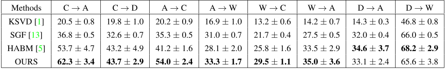

**1701.06171v4-Table2-1.png**

- Caption: Table 2: Semi-supervised domain adaptation: Classification scores on the Four Domain Dataset. The four domains are Amazon (A), Webcam (W), Caltech256(C), DSLR (D). We compare our results to subspace geodesic flow (SGF), fisher discriminant dictionary learning (FDDL), shared domain-adapted dictionary learning, hierarchical matching pursuit (HMP), and the hierarchical active basis model (HABM). Our approach outperforms the other approaches in five out of eight experiments.
- Content type: table
- Figure type: N/A

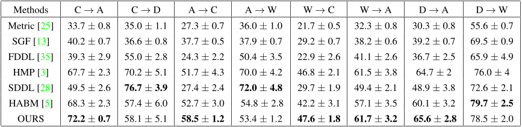

### QAs (4)
**QA 1**

- Question: How many iterations did the greedy EM-type learning process take to learn the part models for the watch image?
- Answer: 22 iterations
- Rationale: The figure shows the evolution of the part models over time, with each column representing one iteration of the learning process. The last column shows the final learned part models, which were learned after 22 iterations.
- References: 1701.06171v4-Figure4-1.png

Referenced images:

**QA 2**

- Question: What is the relationship between the variables in the Compositional Active Basis Model?
- Answer: The variables in the Compositional Active Basis Model are hierarchically dependent. The variables at each layer are dependent on the variables at the layer above it.
- Rationale: This is shown in Figure (a) and (b), where the variables at each layer are connected to the variables at the layer above it by arrows.
- References: 1701.06171v4-Figure2-1.png

Referenced images:

**QA 3**

- Question: What is the difference between the hierarchical part dictionary learned with the bottom-up process and the holistic object model learned with the top-down process?
- Answer: The hierarchical part dictionary learned with the bottom-up process is a set of parts that can be combined to create objects. The holistic object model learned with the top-down process is a single model that represents the entire object.
- Rationale: The figure shows that the hierarchical part dictionary is a set of parts that are arranged in a hierarchy. The holistic object model is a single model that represents the entire object.
- References: 1701.06171v4-Figure5-1.png

Referenced images:

**QA 4**

- Question: What is the difference between the top-down and bottom-up compositional learning schemes?
- Answer: The top-down compositional learning scheme starts with a holistic object model and decomposes it into smaller parts, while the bottom-up compositional learning scheme starts with basic parts and composes them into a holistic object model.
- Rationale: The figure shows the two learning schemes side-by-side. The top-down scheme is shown in the green box, where the clock image is decomposed into smaller parts. The bottom-up scheme is shown in the blue box, where basic parts are composed into a clock image.
- References: 1701.06171v4-Figure3-1.png

Referenced images:

---
## Paper: 1703.00899v2
Semantic Scholar ID: 1703.00899v2

### Figures/Tables (1)
**1703.00899v2-Figure1-1.png**

- Caption: Picturing the continual observation technique for preserving privacy [7, 10]. Each dqt is a trade. The true market state at t is qt = ∑t j=1 dq j and the goal is to release a noisy version q̂t Each arrow originates at t, points backwards to s(t), and is labeled with independent Laplace noise vector zt. Now q̂t = qt + zt + zs(t) + zs(s(t)) + · · · . In other words, the noise added at t is a sum of noises obtained by following the arrows all the way back to 0. There are two key properties: Each t has only log T arrows passing above it, and each path backwards takes only log T jumps.
- Content type: figure
- Figure type: Schematic

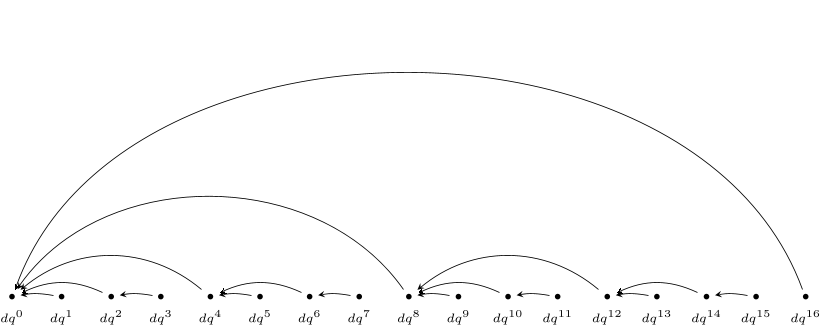

### QAs (1)
**QA 1**

- Question: What is the relationship between the true market state qt and the noisy version q̂t at time t?
- Answer: The noisy version q̂t at time t is equal to the true market state qt plus a sum of Laplace noise vectors obtained by following the arrows all the way back to 0.
- Rationale: The figure shows a directed graph where each node represents a trade (dqt) at a given time t. The arrows in the graph represent the relationship between the true market state and the noisy version. Each arrow originates at t, points backwards to s(t), and is labeled with an independent Laplace noise vector zt. The noisy version q̂t at time t is then calculated by adding the true market state qt to the sum of all the noise vectors encountered by following the arrows backwards to 0.
- References: 1703.00899v2-Figure1-1.png

Referenced images:

---
## Paper: 1703.10730v2
Semantic Scholar ID: 1703.10730v2

### Figures/Tables (13)
**1703.10730v2-Figure1-1.png**

- Caption: Figure 1: The proposed algorithm is able to synthesize an image from key local patches without geometric priors, e.g., restoring broken pieces of ancient ceramics found in ruins. Convolutional neural networks are trained to predict locations of input patches and generate the entire image based on adversarial learning.
- Content type: figure
- Figure type: schematic

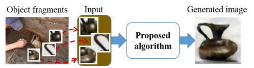

**1703.10730v2-Figure10-1.png**

- Caption: Figure 10: Results of the proposed algorithm on the CelebA dataset when input patches are came from other images. Input 1 and Input 2 are patches from Real 1. Input 3 is a local region of Real 2. Given inputs, the proposed algorithm generates the image (Gen) and mask (Gen M).
- Content type: figure
- Figure type: 

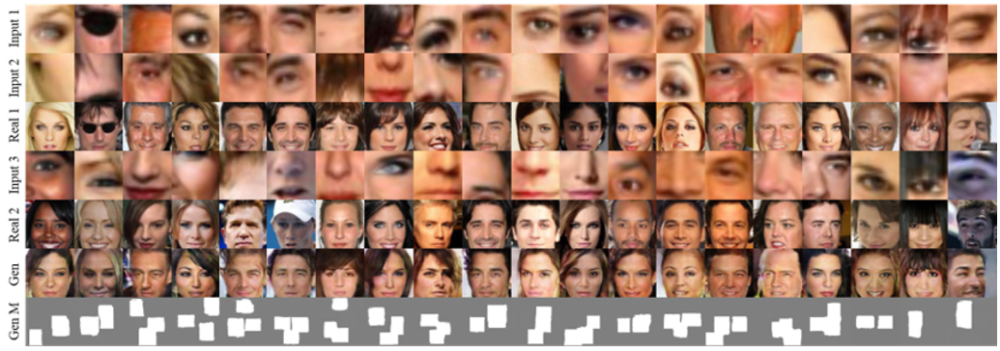

**1703.10730v2-Figure11-1.png**

- Caption: Figure 11: Examples of failure cases of the proposed algorithm.
- Content type: figure
- Figure type: photograph(s)

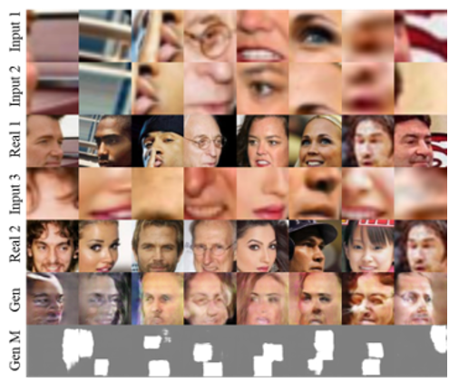

**1703.10730v2-Figure12-1.png**

- Caption: Figure 12: Results of the proposed algorithm on the CompCars dataset when input patches are from different cars. Input 1 and Input 2 are patches from Real 1. Input 3 is a local region of Real 2. Given inputs, the proposed algorithm generates the image (Gen) and mask (Gen M). The size of the generated image is of 128× 128 pixels.
- Content type: figure
- Figure type: 

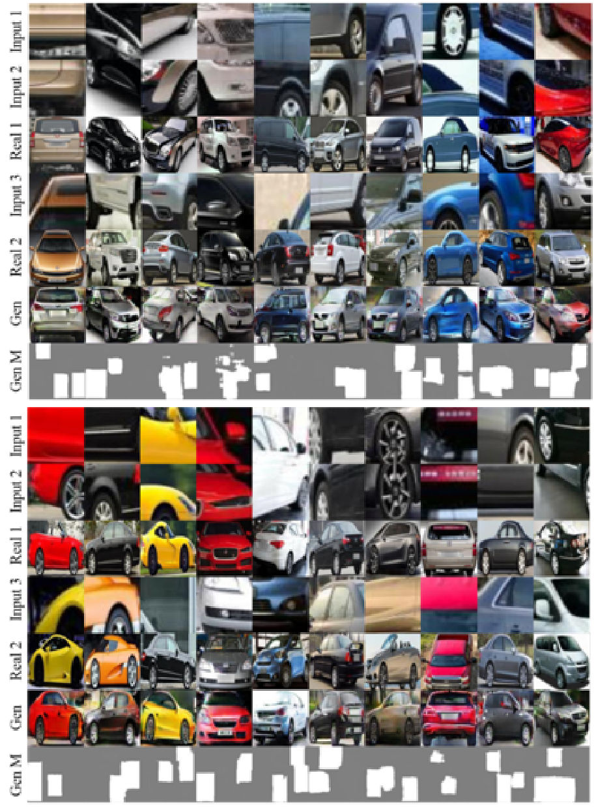

**1703.10730v2-Figure13-1.png**

- Caption: Image generation results with two input patches. Input 1 and 2 are local patches from the image Real.
- Content type: figure
- Figure type: photograph(s)

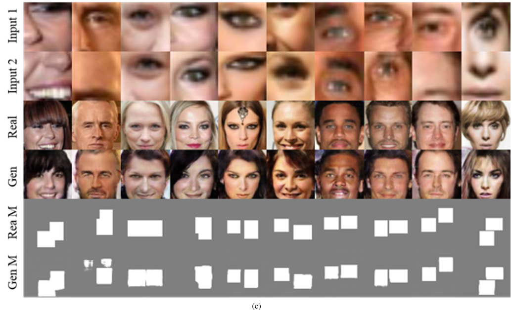

**1703.10730v2-Figure14-1.png**

- Caption: Image generation results on the CelebA dataset. Gen 1 and GenM1 are generated by (5). Gen 2 and GenM2 are obtained using (4) in the paper.
- Content type: figure
- Figure type: photograph(s)

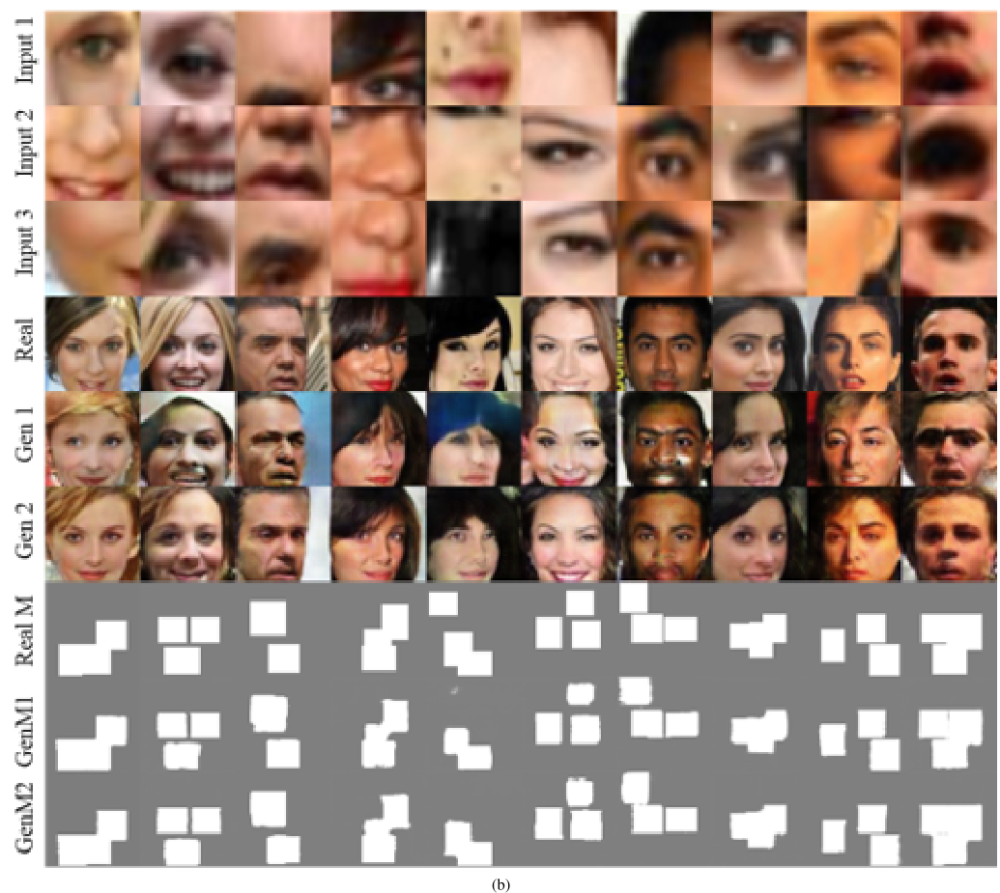

**1703.10730v2-Figure2-1.png**

- Caption: Figure 2: Proposed network architecture. A bar represents a layer in the network. Layers of the same size and the same color have the same convolutional feature maps. Dashed lines in the part encoding network represent shared weights. In addition, E denotes an embedded vector and z is a random noise vector.
- Content type: figure
- Figure type: schematic

**1703.10730v2-Figure3-1.png**

- Caption: Examples of detected key patches on faces [14], vehicles [9], flowers [18], and waterfall scenes. Three regions with top scores from the EdgeBox algorithm are shown in red boxes after pruning candidates of an extreme size or aspect ratio.
- Content type: figure
- Figure type: photograph(s)

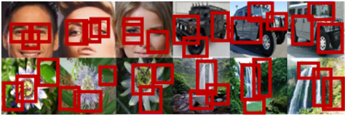

**1703.10730v2-Figure4-1.png**

- Caption: Figure 4: Different structures of networks to predict a mask from input patches. We choose (e) as our encoder-decoder model.
- Content type: figure
- Figure type: schematic

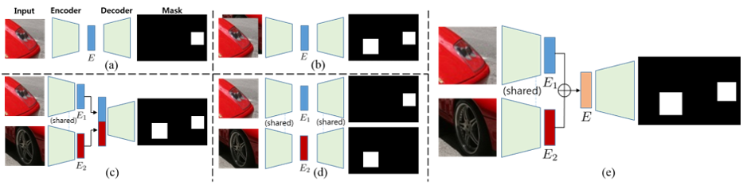

**1703.10730v2-Figure6-1.png**

- Caption: Examples of generated masks and images on six datasets. The generated images for each class are shown in 12 columns. Three key local patches (Input 1, Input 2, and Input 3) from a real image (Real). The key parts are top-3 regions in terms of the objectness score. Given inputs, images (Gen) and masks (Gen M) are generated. Real M is the ground truth mask.
- Content type: figure
- Figure type: 

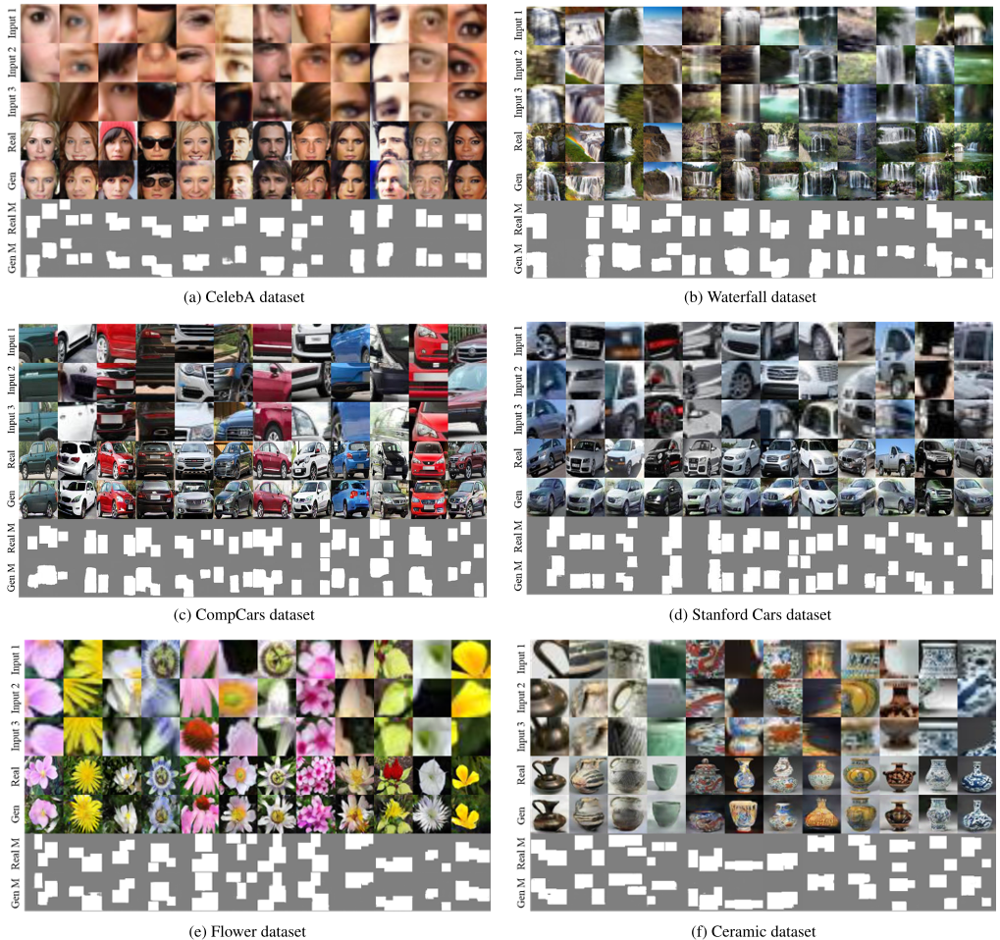

**1703.10730v2-Figure7-1.png**

- Caption: Figure 7: Sample generated masks and images at different epochs.
- Content type: figure
- Figure type: photograph(s)

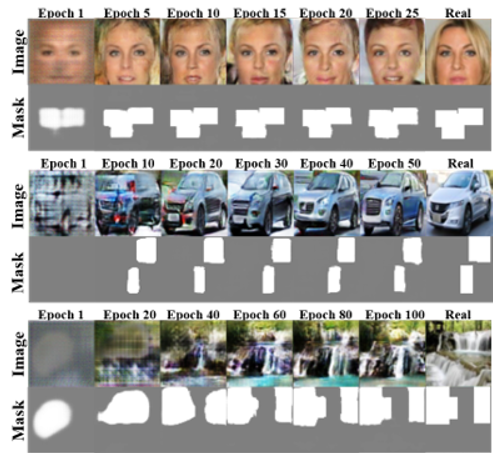

**1703.10730v2-Figure8-1.png**

- Caption: Figure 8: For each generated image in the green box, nearest neighbors in the corresponding training dataset are displayed.
- Content type: figure
- Figure type: photograph(s)

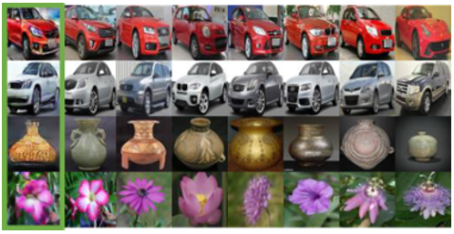

**1703.10730v2-Figure9-1.png**

- Caption: Figure 9: Examples of generated results when the input image contains noises. We add a Gaussian noise at each pixel of Input 3. Gen 1 and Gen M1 are generated without noises. Gen 2 and Gen M2 are generated with noises.
- Content type: figure
- Figure type: photograph(s)

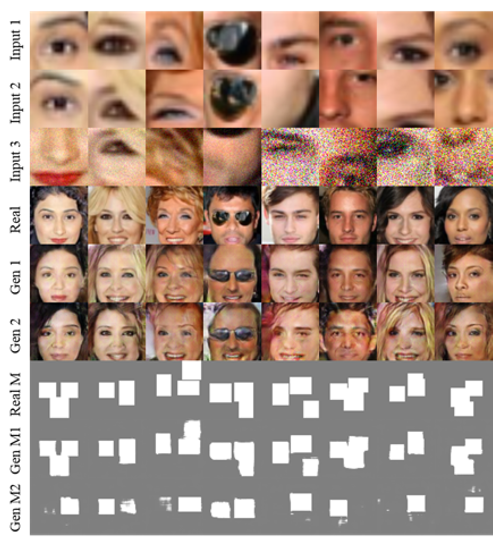

### QAs (5)
**QA 1**

- Question: What are the three goals that the proposed algorithm must achieve simultaneously?
- Answer: The three goals that the proposed algorithm must achieve simultaneously are: 
1. To predict the locations of the input patches. 
2. To generate the entire image based on the predicted locations of the input patches. 
3. To do so without any geometric priors.
- Rationale: The figure shows that the algorithm takes as input a set of local patches and outputs a complete image. This suggests that the algorithm must be able to predict the locations of the input patches and then generate the rest of the image based on those predictions. Additionally, the caption states that the algorithm does not require any geometric priors, which means that it must be able to infer the structure of the image from the input patches alone.
- References: 1703.10730v2-Figure1-1.png

Referenced images:

**QA 2**

- Question: How does the network's focus change as the training epoch increases?
- Answer: The network initially focuses on predicting a good mask. As the epoch increases, the input parts become sharper. Finally, the network concentrates on generating realistic images.
- Rationale: Figure 0 shows how the generated images and masks change as the training epoch increases. In the early epochs, the masks are blurry and the images are unrealistic. However, as the training progresses, the masks become sharper and the images become more realistic. This suggests that the network is learning to focus on different aspects of the image generation process at different stages of training.
- References: 1703.10730v2-Figure7-1.png

Referenced images:

**QA 3**

- Question: What is the relationship between the input patches and the generated images?
- Answer: The input patches are used to generate the images. The generator network takes the input patches as input and generates new images that are similar to the input patches.
- Rationale: The figure shows two input patches (Input 1 and Input 2) and the corresponding generated images (Gen). The generated images are similar to the input patches, but they are not identical. This suggests that the generator network is able to learn the features of the input patches and generate new images that are similar to the input patches.
- References: 1703.10730v2-Figure13-1.png

Referenced images:

**QA 4**

- Question: What are the inputs to the image generation network?
- Answer: The inputs to the image generation network are the observed images (x) and a random noise vector (z).
- Rationale: The figure shows that the image generation network takes two inputs: one from the part encoding network (which represents the observed images) and one from a random noise vector.
- References: 1703.10730v2-Figure2-1.png

Referenced images:

**QA 5**

- Question: How does the presence of noise in the input image affect the quality of the generated images?
- Answer: The presence of noise in the input image can degrade the quality of the generated images, but the proposed algorithm is still able to generate realistic images even with a certain amount of noise.
- Rationale: The figure shows that the generated images with noise (Gen 2 and Gen M2) are still recognizable as faces, even though they are not as clear as the generated images without noise (Gen 1 and Gen M1). This suggests that the proposed algorithm is robust to noise and can still generate realistic images even when the input image is degraded.
- References: 1703.10730v2-Figure9-1.png

Referenced images:

---
## Paper: 1704.05958v2
Semantic Scholar ID: 1704.05958v2

### Figures/Tables (10)
**1704.05958v2-Figure1-1.png**

- Caption: The wrong labeling problem of distant supervision, and how to combat it with global statistics. Left: conventional distant supervision. Each of the textual relations will be labeled with both KB relations, while only one is correct (blue and solid), and the other is wrong (red and dashed). Right: distant supervision with global statistics. The two textual relations can be clearly distinguished by their co-occurrence distribution of KB relations. Statistics are based on the annotated ClueWeb data released in (Toutanova et al., 2015).
- Content type: figure
- Figure type: schematic

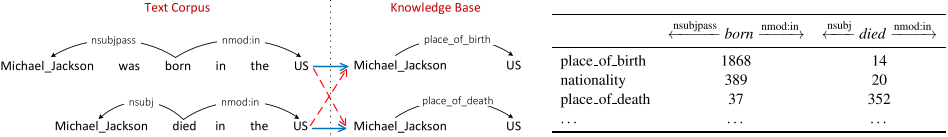

**1704.05958v2-Figure2-1.png**

- Caption: Relation graph. The left node set is textual relations, and the right node set is KB relations. The raw cooccurrence counts are normalized such that the KB relations corresponding to the same textual relation form a valid probability distribution. Edges are colored by textual relation and weighted by normalized co-occurrence statistics.
- Content type: figure
- Figure type: schematic

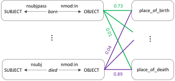

**1704.05958v2-Figure3-1.png**

- Caption: Embedding model. Left: A RNN with GRU for embedding. Middle: embedding of textual relation. Right: a separate GRU cell to map a textual relation embedding to a probability distribution over KB relations.
- Content type: figure
- Figure type: schematic

**1704.05958v2-Figure4-1.png**

- Caption: Held-out evaluation: other base relation extraction models and the improved versions when augmented with GloRE.
- Content type: figure
- Figure type: plot

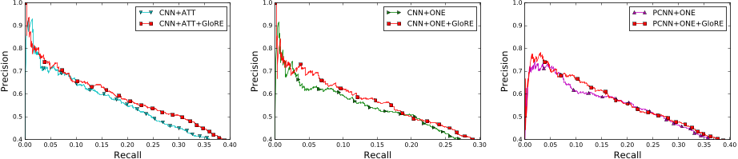

**1704.05958v2-Figure5-1.png**

- Caption: Held-out evaluation: the previous best-performing model can be further improved when augmented with GloRE. PCNN+ATT+TM is a recent model (Luo et al., 2017) whose performance is slightly inferior to PCNN+ATT. Because the source code is not available, we did not experiment to augment this model with GloRE. Another recent method (Wu et al., 2017) incorporates adversarial training to improve PCNN+ATT, but the results are not directly comparable (see Section 2 for more discussion). Finally, Ji et al. (2017) propose a model similar to PCNN+ATT, but the performance is inferior to PCNN+ATT and is not shown here for clarity.
- Content type: figure
- Figure type: plot

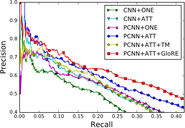

**1704.05958v2-Figure6-1.png**

- Caption: Held-out evaluation: GloRE brings the largest improvement to BASE (PCNN+ATT), which further shows that GloRE captures useful information for relation extraction that is complementary to existing models.
- Content type: figure
- Figure type: plot

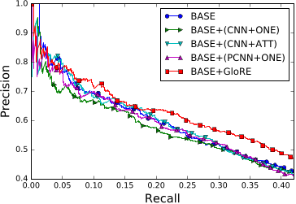

**1704.05958v2-Figure7-1.png**

- Caption: Held-out evaluation: LoRE vs. GloRE.
- Content type: figure
- Figure type: plot

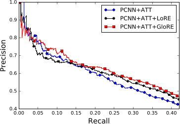

**1704.05958v2-Table1-1.png**

- Caption: Table 1: Statistics of the NYT dataset.
- Content type: table
- Figure type: N/A

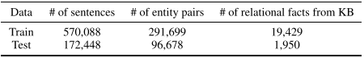

**1704.05958v2-Table2-1.png**

- Caption: Table 2: Manual evaluation: false negatives from held-out evaluation are manually corrected by human experts.
- Content type: table
- Figure type: N/A

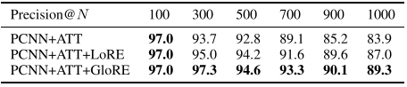

**1704.05958v2-Table3-1.png**

- Caption: Table 3: Case studies. We select entity pairs that have only one contextual sentence, and the head and tail entities are marked. The top 3 predictions from each model with the associated probabilities are listed, with the correct relation bold-faced.
- Content type: table
- Figure type: N/A

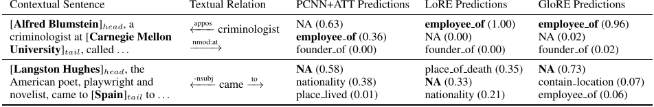

### QAs (3)
**QA 1**

- Question: Can you estimate the percentage of entity pairs in the NYT training set that have a corresponding relational fact in the Knowledge Base (KB)?
- Answer: Approximately 6.66%.
- Rationale: The table shows that the training set contains 291,699 entity pairs and 19,429 relational facts from the KB. To find the percentage of entity pairs with a corresponding KB fact, we divide the number of facts by the number of entity pairs and multiply by 100: 

(19,429 / 291,699) * 100 ≈ 6.66%. 

This indicates that only a small fraction of entity pairs in the training data have an explicitly defined relationship in the KB.
- References: 1704.05958v2-Table1-1.png

Referenced images:

**QA 2**

- Question: Why is conventional distant supervision problematic?
- Answer: Conventional distant supervision can lead to wrong labeling of textual relations with KB relations.
- Rationale: The figure shows that with conventional distant supervision, both textual relations ("Michael_Jackson was born in the US" and "Michael_Jackson died in the US") are labeled with both KB relations ("place_of_birth" and "place_of_death"), even though only one of them is correct in each case. This is because conventional distant supervision relies on local information, and does not take into account global statistics about the co-occurrence of KB relations.
- References: 1704.05958v2-Figure1-1.png

Referenced images:

**QA 3**

- Question: What is the role of the GRU cell in the embedding model?
- Answer: The GRU cell is used to map a textual relation embedding to a probability distribution over KB relations.
- Rationale: The figure shows a RNN with GRU for embedding, which is used to generate a textual relation embedding. This embedding is then fed into a separate GRU cell, which outputs a probability distribution over KB relations.
- References: 1704.05958v2-Figure3-1.png

Referenced images:

---
## Paper: 1705.02798v6
Semantic Scholar ID: 1705.02798v6

### Figures/Tables (10)
**1705.02798v6-Figure1-1.png**

- Caption: Figure 1: An example from the SQuAD dataset. Evidences needed for the answer are marked as green.
- Content type: figure
- Figure type: other

**1705.02798v6-Figure2-1.png**

- Caption: Figure 2: Illustrations of reattention for the example in Figure 1.
- Content type: figure
- Figure type: schematic

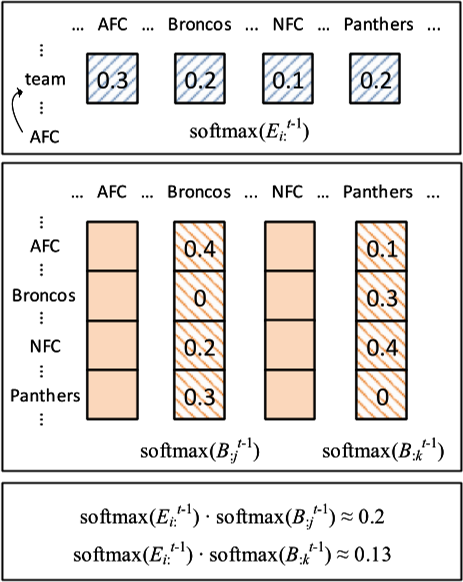

**1705.02798v6-Figure3-1.png**

- Caption: Figure 3: The architecture overview of Reinforced Mnemonic Reader. The subfigures to the right show detailed demonstrations of the reattention mechanism: 1) refined Et to attend the query; 2) refined Bt to attend the context.
- Content type: figure
- Figure type: schematic

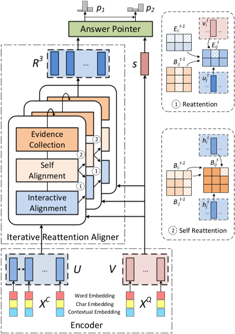

**1705.02798v6-Figure4-1.png**

- Caption: Figure 4: The detailed overview of a single aligning block. Different colors in E and B represent different degrees of similarity.
- Content type: figure
- Figure type: schematic

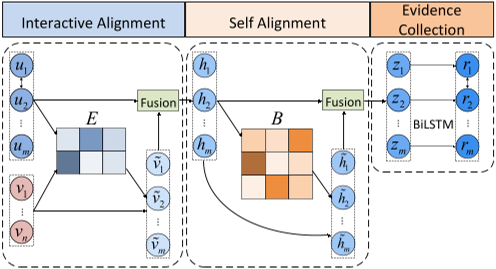

**1705.02798v6-Figure5-1.png**

- Caption: Figure 5: Predictions with DCRL (red) and with SCST (blue) on SQuAD dev set.
- Content type: figure
- Figure type: plot

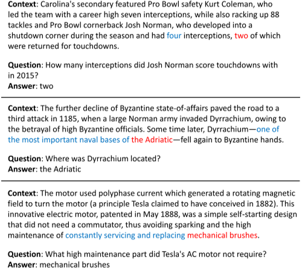

**1705.02798v6-Table1-1.png**

- Caption: Comparison of alignment architectures of competing models: Wang & Jiang[2017]1, Wang et al.[2017]2, Seo et al.[2017]3, Weissenborn et al.[2017]4, Xiong et al.[2017a]5 and Huang et al.[2017]6.
- Content type: table
- Figure type: table

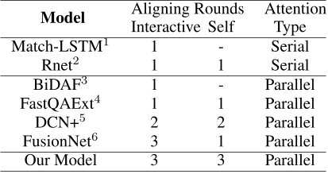

**1705.02798v6-Table2-1.png**

- Caption: Table 2: The performance of Reinforced Mnemonic Reader and other competing approaches on the SQuAD dataset. The results of test set are extracted on Feb 2, 2018: Rajpurkar et al.[2016]1, Xiong et al.[2017a]2, Huang et al.[2017]3, Liu et al.[2017b]4 and Peters[2018]5. † indicates unpublished works. BSE refers to BiDAF + Self Attention + ELMo.
- Content type: table
- Figure type: N/A

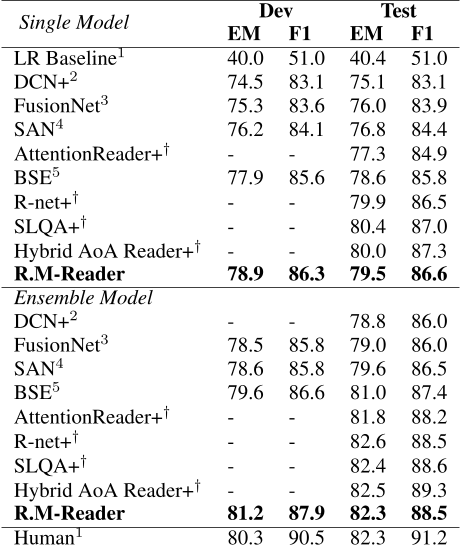

**1705.02798v6-Table3-1.png**

- Caption: Performance comparison on two adversarial SQuAD datasets. Wang & Jiang[2017]1, Seo et al.[2017]2, Liu et al.[2017a]3, Shen et al.[2016]4 and Huang et al.[2017]5. ∗ indicates ensemble models.
- Content type: table
- Figure type: table.

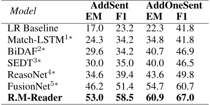

**1705.02798v6-Table4-1.png**

- Caption: Table 4: Ablation study on SQuAD dev set.
- Content type: table
- Figure type: N/A

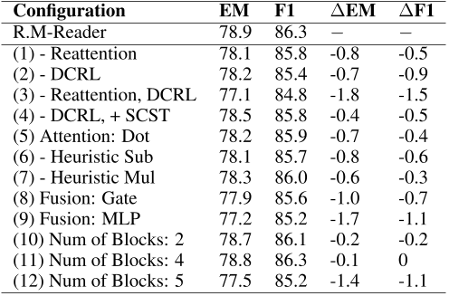

**1705.02798v6-Table5-1.png**

- Caption: Table 5: Comparison of KL diverfence on different attention distributions on SQuAD dev set.
- Content type: table
- Figure type: N/A

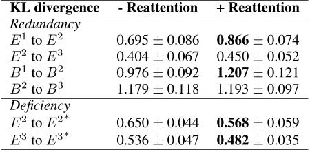

### QAs (6)
**QA 1**

- Question: Which component of the model seems to have the biggest impact on the F1 score on SQuAD dataset, and how much does removing it affect the score?
- Answer: The DCRL training method appears to have the biggest impact on the F1 score. Removing it leads to a drop of 0.9 points in F1, which is the largest decrease observed for any single component in the ablation study.
- Rationale: The table shows the results of an ablation study, where different components of the model are removed or replaced to see how they affect performance. The "ΔF1" column specifically shows the change in F1 score compared to the baseline model (R.M-Reader). By comparing the values in this column, we can identify which component has the largest impact on the F1 score when removed. In this case, removing DCRL in ablation (2) leads to the biggest drop in F1 score, indicating its importance for achieving a high F1 score.
- References: 1705.02798v6-Table4-1.png

Referenced images:

**QA 2**

- Question: Which model performs the best on the AddOneSent dataset in terms of F1 score?
- Answer: R.M.-Reader.
- Rationale: The table shows the performance of different models on the AddOneSent dataset in terms of EM and F1 score. The R.M.-Reader model has the highest F1 score of 67.0.
- References: 1705.02798v6-Table3-1.png

Referenced images:

**QA 3**

- Question: How does the performance of the single R.M-Reader model compare to the best single models of other approaches on the SQuAD test set?
- Answer: The single R.M-Reader model achieves an EM score of 79.5% and an F1 score of 86.6% on the SQuAD test set. This performance is better than all other single models listed in the table, except for SLQA and Hybrid AoA Reader, which achieve slightly higher F1 scores of 87.0% and 87.3%, respectively.
- Rationale: Table 3 presents the performance of different models on the SQuAD dataset, including both single and ensemble models. By comparing the EM and F1 scores of R.M-Reader with those of other models in the "Single Model" section, we can assess its relative performance. While SLQA and Hybrid AoA Reader have slightly higher F1 scores, R.M-Reader still outperforms all other single models in terms of EM score and has a competitive F1 score.
- References: 1705.02798v6-Table2-1.png

Referenced images:

**QA 4**

- Question: What are the two types of attention mechanisms used in the Reinforced Mnemonic Reader architecture?
- Answer: The two types of attention mechanisms are reattention and self-attention.
- Rationale: The figure shows the architecture of the Reinforced Mnemonic Reader, which includes two types of attention mechanisms: reattention and self-attention. Reattention is used to refine the evidence embedding Et to attend to the query, and self-attention is used to refine the context embedding Bt to attend to the context.
- References: 1705.02798v6-Figure3-1.png

Referenced images:

**QA 5**

- Question: What is the purpose of the fusion modules in the interactive alignment and self-alignment modules?
- Answer: The fusion modules are used to combine the outputs of the interactive alignment and self-alignment modules.
- Rationale: The figure shows that the fusion modules take as input the outputs of the interactive alignment and self-alignment modules and produce a single output. This suggests that the fusion modules are used to combine the information from these two modules.
- References: 1705.02798v6-Figure4-1.png

Referenced images:

**QA 6**

- Question: How does reattention affect the redundancy and deficiency of attention distributions? Can you explain the observed differences in the impact of reattention on different blocks?
- Answer: This paper shows that reattention helps alleviate both redundancy and deficiency in attention distributions.

Redundancy: Reattention increases the KL divergence between adjacent attention blocks, indicating that the attention distributions across blocks become more distinct and less redundant.
Deficiency: Reattention reduces the KL divergence between the normalized attention distribution ($E^t$) and the ideal uniform distribution (${E^t}^*$), suggesting that the attention becomes more balanced and closer to the desired distribution.
However, the improvement in redundancy is more pronounced between the first two blocks ($E^1$ to $E^2$) than the last two blocks ($B^2$ to $B^3$). This suggests that the first reattention is more effective in capturing word pair similarities using the original word representations. In contrast, the later reattention might be negatively impacted by the highly non-linear word representations generated in the previous layers.
- Rationale: The KL divergence values in Table 7 quantify the differences between attention distributions. Comparing the values with and without reattention allows us to assess the impact of reattention on redundancy and deficiency. The passage further clarifies the observed differences in the effectiveness of reattention across different blocks.
- References: 1705.02798v6-Table5-1.png

Referenced images:

---
## Paper: 1705.08016v3
Semantic Scholar ID: 1705.08016v3

### Figures/Tables (7)
**1705.08016v3-Figure1-1.png**

- Caption: Fig. 1. CNN training pipeline for Pairwise Confusion (PC). We employ a Siamese-like architecture, with individual cross entropy calculations for each branch, followed by a joint energy-distance minimization loss. We split each incoming batch of samples into two mini-batches, and feed the network pairwise samples.
- Content type: figure
- Figure type: ** Schematic

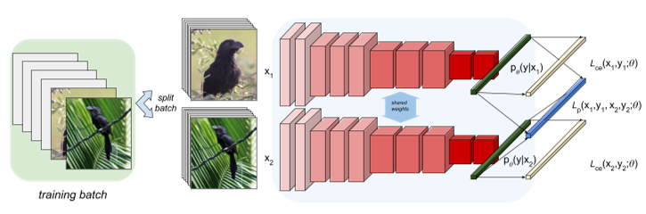

**1705.08016v3-Figure2-1.png**

- Caption: (left) Variation of test accuracy on CUB-200-2011 with logarithmic variation in hyperparameter λ. (right) Convergence plot of GoogLeNet on CUB-200-2011.
- Content type: figure
- Figure type: plot

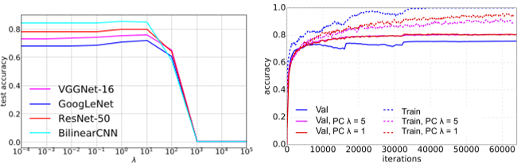

**1705.08016v3-Figure3-1.png**

- Caption: Fig. 3. Pairwise Confusion (PC) obtains improved localization performance, as demonstrated here with Grad-CAM heatmaps of the CUB-200-2011 dataset images (left) with a VGGNet-16 model trained without PC (middle) and with PC (right). The objects in (a) and (b) are correctly classified by both networks, and (c) and (d) are correctly classified by PC, but not the baseline network (VGG-16). For all cases, we consistently observe a tighter and more accurate localization with PC, whereas the baseline VGG-16 network often latches on to artifacts, even while making correct predictions.
- Content type: figure
- Figure type: photograph(s)

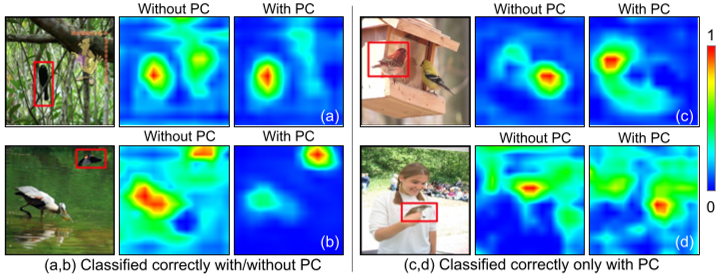

**1705.08016v3-Table1-1.png**

- Caption: A comparison of fine-grained visual classification (FGVC) datasets with largescale visual classification (LSVC) datasets. FGVC datasets are significantly smaller and noisier than LSVC datasets.
- Content type: table
- Figure type: table

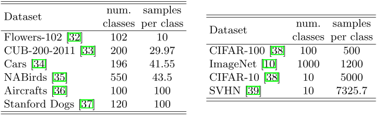

**1705.08016v3-Table2-1.png**

- Caption: Pairwise Confusion (PC) obtains state-of-the-art performance on six widelyused fine-grained visual classification datasets (A-F). Improvement over the baseline model is reported as (∆). All results averaged over 5 trials.
- Content type: table
- Figure type: table

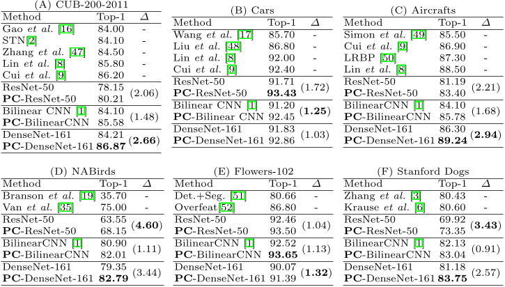

**1705.08016v3-Table3-1.png**

- Caption: Table 3. Experiments with ImageNet and CIFAR show that datasets with large intraclass variation and high inter-class similarity benefit from optimization with Pairwise Confusion. Only the mean accuracy over 3 Imagenet-Random experiments is shown.
- Content type: table
- Figure type: N/A

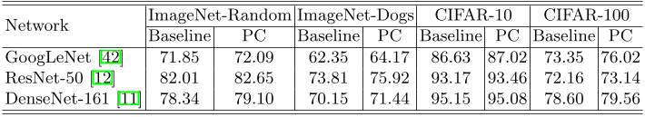

**1705.08016v3-Table4-1.png**

- Caption: Table 4. Pairwise Confusion (PC) improves localization performance in fine-grained visual classification tasks. On the CUB-200-2011 dataset, PC obtains an average improvement of 3.4% in Mean Intersection-over-Union (IoU) for Grad-CAM bounding boxes for each of the five baseline models.
- Content type: table
- Figure type: N/A

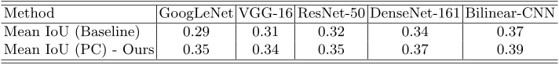

### QAs (6)
**QA 1**

- Question: How does the test accuracy of the different models vary with the hyperparameter λ?
- Answer: The test accuracy of all models decreases as λ increases.
- Rationale: The left plot shows the test accuracy of the different models as a function of λ. The x-axis is logarithmic, so the values of λ increase from left to right. The y-axis shows the test accuracy, which decreases for all models as λ increases.
- References: 1705.08016v3-Figure2-1.png

Referenced images:

**QA 2**

- Question: Which method achieves the highest Top-1 accuracy on the CUB-200-2011 dataset?
- Answer: PC-DenseNet-161
- Rationale: The table shows the Top-1 accuracy for each method on the CUB-200-2011 dataset. PC-DenseNet-161 has the highest Top-1 accuracy of 86.87.
- References: 1705.08016v3-Table2-1.png

Referenced images:

**QA 3**

- Question: How does Pairwise Confusion (PC) affect the localization ability of a CNN?
- Answer: PC improves the localization ability of a CNN.
- Rationale: Figure 4 shows Grad-CAM heatmaps of images from the CUB-200-2011 dataset, with and without PC. The heatmaps show that PC-trained models provide tighter, more accurate localization around the target object, whereas baseline models sometimes have localization driven by image artifacts. For example, in Figure 4(a), the baseline VGG-16 network pays significant attention to a cartoon bird in the background, even though it makes the correct prediction. With PC, the attention is limited almost exclusively to the correct object.
- References: 1705.08016v3-Figure3-1.png

Referenced images:

**QA 4**

- Question: Which dataset has the highest number of samples per class?
- Answer: SVHN
- Rationale: The table shows the number of samples per class for each dataset. SVHN has the highest number of samples per class with 7325.7.
- References: 1705.08016v3-Table1-1.png

Referenced images:

**QA 5**

- Question: Which dataset benefited more from the Pairwise Confusion (PC) optimization method: ImageNet-Dogs or ImageNet-Random?
- Answer: ImageNet-Dogs benefited more from the PC optimization method compared to ImageNet-Random.
- Rationale: The table shows the classification accuracy with and without PC for both datasets. While both datasets show improvement with PC, the gain in accuracy for ImageNet-Dogs (1.45%) is significantly higher than that for ImageNet-Random (0.54% ± 0.28%). This aligns with the passage's explanation that PC provides a larger benefit for datasets with higher inter-class similarity and intra-class variation, which is the case for ImageNet-Dogs compared to ImageNet-Random.
- References: 1705.08016v3-Table3-1.png

Referenced images:

**QA 6**

- Question: What is the role of the shared weights in the Siamese-like architecture shown in the first figure?
- Answer: The shared weights allow the two branches of the network to learn similar representations of the input images. This helps to improve the performance of the Euclidean Confusion loss, which measures the distance between the conditional probability distributions of the two branches.
- Rationale: The figure shows that the two branches of the network share the same weights, which means that they are learning the same features from the input images. This is important for the Euclidean Confusion loss because it needs to compare the representations of the two images in order to determine how similar they are. If the two branches of the network were not learning similar representations, then the Euclidean Confusion loss would be less effective.
- References: 1705.08016v3-Figure1-1.png

Referenced images:

---
## Paper: 1705.10667v4
Semantic Scholar ID: 1705.10667v4

### Figures/Tables (8)
**1705.10667v4-Figure1-1.png**

- Caption: Architectures of Conditional Domain Adversarial Networks (CDAN) for domain adaptation, where domain-specific feature representation f and classifier prediction g embody the cross-domain gap to be reduced jointly by the conditional domain discriminatorD. (a) Multilinear (M) Conditioning, applicable to lower-dimensional scenario, where D is conditioned on classifier prediction g via multilinear map f ⊗ g; (b) Randomized Multilinear (RM) Conditioning, fit to higher-dimensional scenario, where D is conditioned on classifier prediction g via randomized multilinear map 1√ d (Rf f) (Rgg). Entropy Conditioning (dashed line) leads to CDAN+E that prioritizesD on easy-to-transfer examples.
- Content type: figure
- Figure type: Schematic

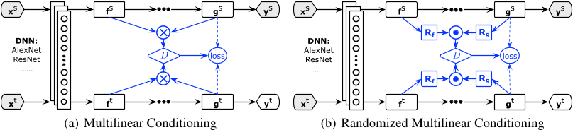

**1705.10667v4-Figure2-1.png**

- Caption: Analysis of conditioning strategies, distribution discrepancy, and convergence.
- Content type: figure
- Figure type: plot

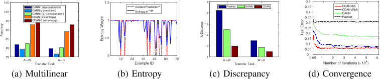

**1705.10667v4-Figure3-1.png**

- Caption: T-SNE of (a) ResNet, (b) DANN, (c) CDAN-f, (d) CDAN-fg (red: A; blue: W).
- Content type: figure
- Figure type: plot

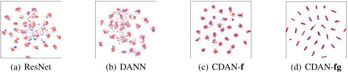

**1705.10667v4-Table1-1.png**

- Caption: Table 1: Accuracy (%) on Office-31 for unsupervised domain adaptation (AlexNet and ResNet)
- Content type: table
- Figure type: N/A

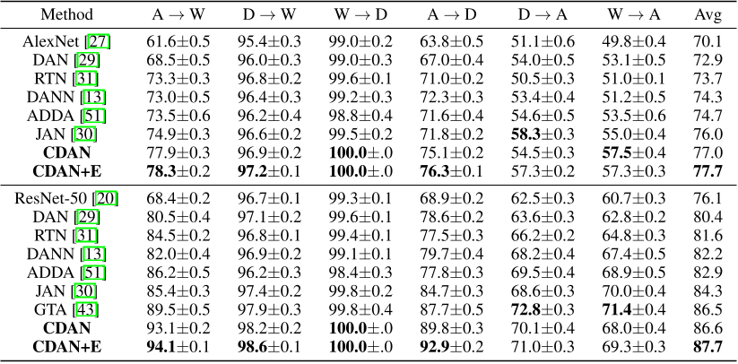

**1705.10667v4-Table2-1.png**

- Caption: Table 2: Accuracy (%) on ImageCLEF-DA for unsupervised domain adaptation (AlexNet and ResNet)
- Content type: table
- Figure type: N/A

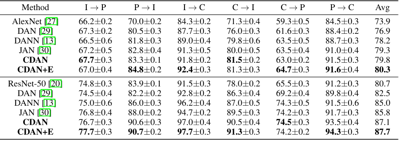

**1705.10667v4-Table3-1.png**

- Caption: Table 3: Accuracy (%) on Office-Home for unsupervised domain adaptation (AlexNet and ResNet)
- Content type: table
- Figure type: N/A

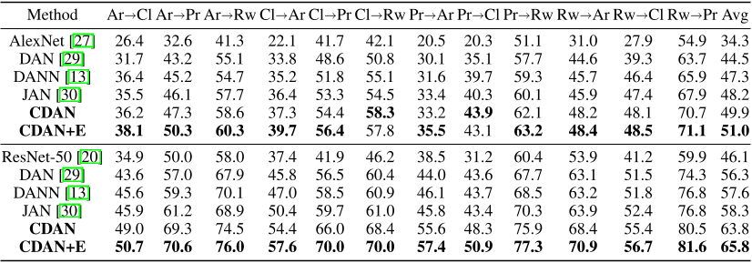

**1705.10667v4-Table4-1.png**

- Caption: Table 4: Accuracy (%) on Digits and VisDA-2017 for unsupervised domain adaptation (ResNet-50)
- Content type: table
- Figure type: N/A

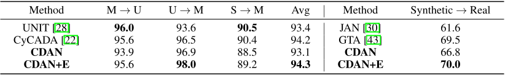

**1705.10667v4-Table5-1.png**

- Caption: Table 5: Accuracy (%) of CDAN variants on Office-31 for unsupervised domain adaptation (ResNet)
- Content type: table
- Figure type: N/A

### QAs (5)
**QA 1**

- Question: What is the main difference between the Multilinear Conditioning architecture and the Randomized Multilinear Conditioning architecture?
- Answer: The main difference is that the Multilinear Conditioning architecture uses a multilinear map to condition the domain discriminator on the classifier prediction, while the Randomized Multilinear Conditioning architecture uses a randomized multilinear map.
- Rationale: The figure shows that the Multilinear Conditioning architecture uses a multilinear map to combine the feature representation and the classifier prediction, while the Randomized Multilinear Conditioning architecture uses a randomized multilinear map to do the same thing. The randomized multilinear map is more efficient than the multilinear map, especially for high-dimensional data.
- References: 1705.10667v4-Figure1-1.png

Referenced images:

**QA 2**

- Question: Which of the four methods (ResNet, DANN, CDAN-f, CDAN-fg) is most effective at separating the two classes of data points?
- Answer: CDAN-fg
- Rationale: In the figure, we can see that CDAN-fg produces the clearest separation between the red and blue data points. The other methods show some overlap between the two classes, indicating that they are not as effective at separating them.
- References: 1705.10667v4-Figure3-1.png

Referenced images:

**QA 3**

- Question: Why might CDAN+E be considered a more versatile method for unsupervised domain adaptation compared to UNIT, CyCADA, and GTA?
- Answer: CDAN+E performs well across all five datasets listed in the table, including both digit and synthetic-to-real datasets, while UNIT, CyCADA, and GTA show strong results only on the digits and synthetic-to-real datasets.
- Rationale: The passage highlights that UNIT, CyCADA, and GTA are specifically designed for digit and synthetic-to-real adaptation tasks, which explains their high performance in those domains. However, their performance might not generalize well to other types of domain adaptation tasks. On the other hand, CDAN+E, despite being a simpler discriminative model, achieves good performance across all datasets, suggesting it is more adaptable and less reliant on task-specific design choices.
- References: 1705.10667v4-Table4-1.png

Referenced images:

**QA 4**

- Question: Which sampling strategy for random matrices in CDAN+E leads to the highest average accuracy across all domain adaptation tasks on Office-31? How does this compare to the performance of CDAN+E variants that use random sampling?
- Answer: The table shows that CDAN+E (w/o random sampling) achieves the highest average accuracy of 87.7% across all domain adaptation tasks. This is slightly higher than the performance of CDAN+E with uniform sampling (87.0%) and Gaussian sampling (86.4%).
- Rationale: The table presents the accuracy of different CDAN variants on various domain adaptation tasks. The "Avg" column provides the average accuracy across all tasks. By comparing the values in this column, we can see that not using random sampling leads to the best overall performance. This suggests that relying on pre-defined matrices might be more effective than introducing randomness in this specific context.
- References: 1705.10667v4-Table5-1.png

Referenced images:

**QA 5**

- Question: Which model performs the best in terms of test error?
- Answer: CDAN (M)
- Rationale: Figure (d) shows the test error for different models. CDAN (M) has the lowest test error.
- References: 1705.10667v4-Figure2-1.png

Referenced images:

---
## Paper: 1706.04269v2
Semantic Scholar ID: 1706.04269v2

### Figures/Tables (6)
**1706.04269v2-Figure1-1.png**

- Caption: Left: A partial search sequence a human performed to find the start of a Long Jump action (the shaded green area). Notably, humans are efficient in spotting actions without observing a large portion of the video. Right: An efficiency comparison between humans, Action Search, and other detection/proposal methods on THUMOS14 [24]. Our model is 5.8x more efficient than other methods.
- Content type: figure
- Figure type: ** schematic

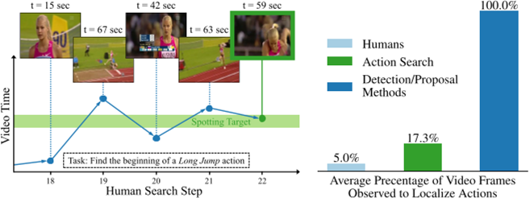

**1706.04269v2-Figure2-1.png**

- Caption: Illustration of two human search sequences from our Human Searches dataset for an AVA [21] training video (first row) and a THUMOS14 [24] training video (second row). The shaded green areas are where the search targets occur.
- Content type: figure
- Figure type: plot

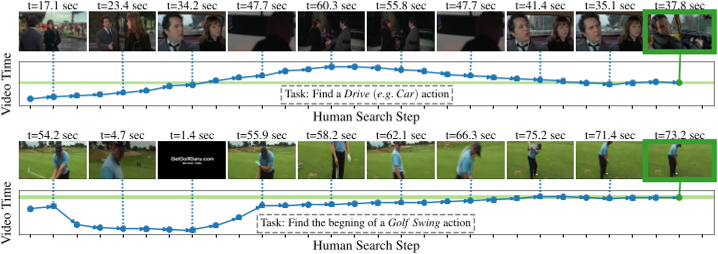

**1706.04269v2-Figure3-1.png**

- Caption: Fig. 3: Our model harnesses the temporal context from its current location and the history of what it has observed to predict the next search location in the video. At each step, (i) a visual encoder transforms the visual observation extracted from the model’s current temporal location to a representative feature vector; (ii) an LSTM consumes this feature vector plus the state and temporal location produced in the previous step; (iii) the LSTM outputs its updated state and the next search location; (iv) the model moves to the new temporal location.
- Content type: figure
- Figure type: schematic

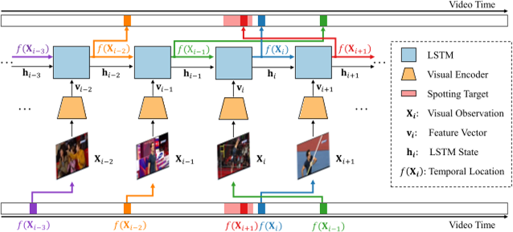

**1706.04269v2-Figure4-1.png**

- Caption: Fig. 4: Action spotting results for the AVA testing set for 1000 independent search trials per video. We report the cumulative spotting metric results on videos with action coverage (i.e. the percentage of video containing actions) ≤ 5%. Action Search takes 22%, 17%, and 13% fewer observations than the Direction Baseline on videos with at most 0.5%, 2.5%, and 5% action coverage, respectively.
- Content type: figure
- Figure type: plot

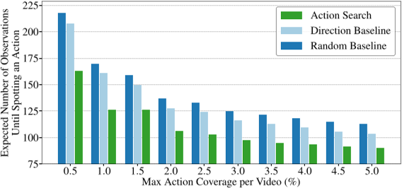

**1706.04269v2-Figure5-1.png**

- Caption: Qualitative search sequences produced by Action Search. The left column corresponds to AVA [21] testing videos, and the right column corresponds to THUMOS14 [24] testing videos. The top two rows depict examples when our model successfully spots the target action location (in green). The last row illustrate failure cases, i.e. when the action location (in red) is not spotted exactly. We observe that Action Search uses temporal context to reason about where to search next. In failure cases, we notice that our model often oscillates around actions without spotting frames within the exact temporal location.
- Content type: figure
- Figure type: ** photograph(s)

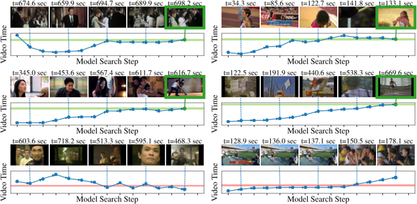

**1706.04269v2-Table1-1.png**

- Caption: Temporal localization results (mAP at tIoU) on the THUMOS14 testing set. We assign ‘–’ to unavailable mAP values. We report the average percentage of observed frames (S) for each approach. (a) Comparison against state-of-theart methods: Our method (Action Search + Priors + Res3D + S-CNN) achieves state-of-the-art results while observing only 17.3% of the video; (b) Video features effect: We compare C3D for Action Search visual encoder + the C3D-based classifier from [35] vs. ResNet for Action Search visual encoder + the Res3Dbased classifier from [41]; (c) The trade-off between Action Search training size and performance: mAP and S score improve as we increase the training size.
- Content type: table
- Figure type: table

### QAs (4)
**QA 1**

- Question: What are the three main components of the Action Search model architecture?
- Answer: The three main components of the Action Search model architecture are the visual encoder, the LSTM, and the spotting target.
- Rationale: The figure shows how these three components are connected and how they work together to predict the next search location in the video. The visual encoder takes the visual observation from the current temporal location and transforms it into a feature vector. The LSTM takes this feature vector, as well as the state and temporal location from the previous step, and outputs its updated state and the next search location. The spotting target is the location in the video where the model is currently searching for the action.
- References: 1706.04269v2-Figure3-1.png

Referenced images:

**QA 2**

- Question: Which method requires the fewest observations to spot an action in a video with 2.5% action coverage?
- Answer: Action Search
- Rationale: The figure shows that the Action Search method (green bars) consistently requires fewer observations than the other two methods (blue and light blue bars) across all levels of action coverage. At 2.5% action coverage, the Action Search method requires about 120 observations on average, while the Direction Baseline and Random Baseline methods require about 150 and 175 observations, respectively.
- References: 1706.04269v2-Figure4-1.png

Referenced images:

**QA 3**

- Question: How does Action Search use temporal context to reason about where to search next?
- Answer: Action Search uses temporal context to reason about where to search next by looking at the frames before and after the current frame. This allows the model to learn the temporal patterns of actions and to predict where the action is most likely to occur in the next frame.
- Rationale: The figure shows the search sequences produced by Action Search for different videos. The x-axis shows the model search step, and the y-axis shows the video time. The blue dots represent the frames that the model has searched, and the green and red boxes represent the ground-truth action locations. The figure shows that the model is able to use temporal context to successfully spot the target action location in some cases, but it also fails in some cases. In the failure cases, the model often oscillates around the action without spotting frames within the exact temporal location.
- References: 1706.04269v2-Figure5-1.png

Referenced images:

**QA 4**

- Question: How does the training size of the Action Search model affect its performance?
- Answer: As the training size increases, the mAP and S score of the Action Search model also improve.
- Rationale: This can be seen in Figure (c), where the mAP and S score are shown for different training sizes.
- References: 1706.04269v2-Table1-1.png

Referenced images:

---
## Paper: 1707.00524v2
Semantic Scholar ID: 1707.00524v2

### Figures/Tables (7)
**1707.00524v2-Figure1-1.png**

- Caption: An illustration over the decision making for the informed exploration framework. At state St, the agent needs to choose from a (1) t to a (|A|)
- Content type: figure
- Figure type: Schematic

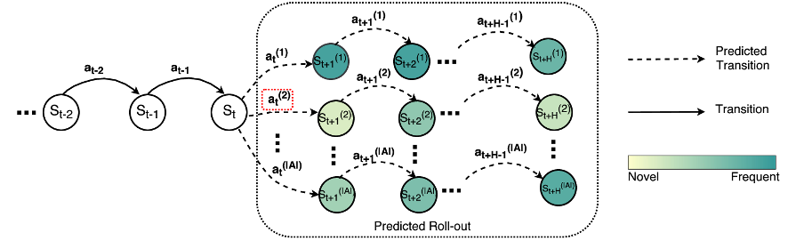

**1707.00524v2-Figure2-1.png**

- Caption: Deep neural network architectures adopted for informed exploration. Up: action-conditional prediction model for predicting over future transition frames; down: autoencoder model for conducting hashing over the state space.
- Content type: figure
- Figure type: schematic

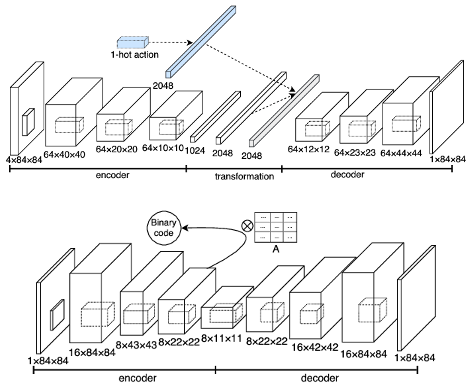

**1707.00524v2-Figure3-1.png**

- Caption: The prediction and reconstruction result for each task domain. For each task, we present 1 set of frames, where the four frames are organized as follows: (1) the ground-truth frame seen by the agent; (2) the predicted frame by the prediction model; (3) the reconstruction of autoencoder trained only with reconstruction loss; (4) the reconstruction of autoencoder trained after the second phase (i.e., trained with both reconstruction loss and code matching loss). Overall, the prediction model could perfectly produce frame output, while the fully trained autoencoder generates slightly blurred frames.
- Content type: figure
- Figure type: photograph(s)

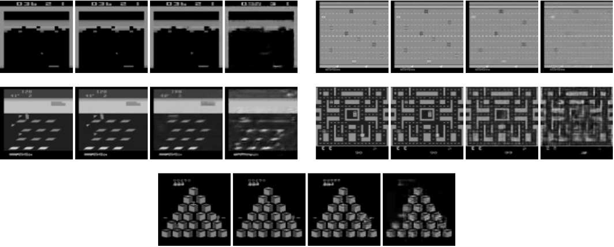

**1707.00524v2-Figure4-1.png**

- Caption: Left: the predicted future trajectories for each action in Breakout. In each row, the first frame is the ground-truth frame and the following five frames are the predicted future trajectories with length 5. In each row, the agent takes one of the following actions (continuously): (1) no-op; (2) fire; (3) right; (4) left. Right: the hash codes for the frames in the same row ordered in a top-down manner. To save the space, four binary codes are grouped into one hex code, i.e., in a range of [0,15]. The color map is normalized linearly by hex value.
- Content type: figure
- Figure type: photograph(s)

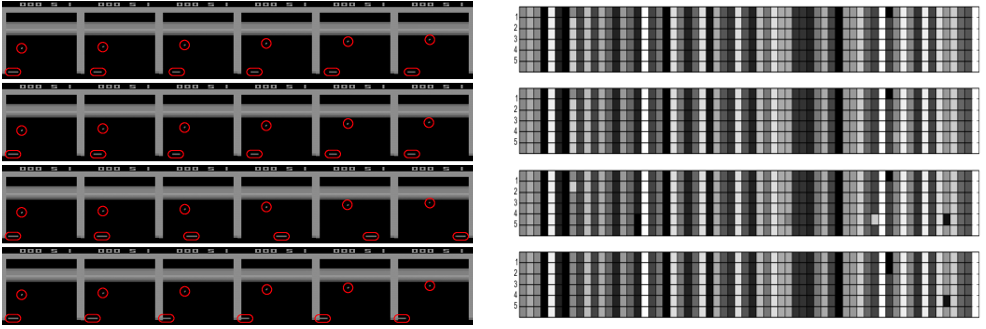

**1707.00524v2-Figure5-1.png**

- Caption: Comparison of the code loss and the frame reconstruction loss (MSE) for autoencoder after the training of phase 1 & phase 2.
- Content type: figure
- Figure type: plot

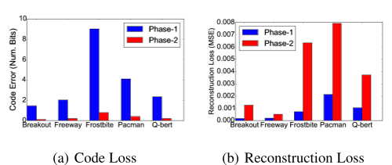

**1707.00524v2-Table1-1.png**

- Caption: Table 1: The prediction loss in MSE for the trained prediction model.
- Content type: table
- Figure type: N/A

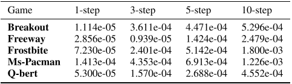

**1707.00524v2-Table2-1.png**

- Caption: Performance score for the proposed approach and baseline RL approaches.
- Content type: table
- Figure type: table

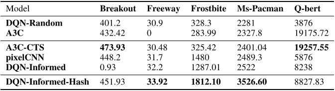

### QAs (4)
**QA 1**

- Question: Which model achieved the highest performance score on the Breakout game?
- Answer: A3C-CTS
- Rationale: The table shows the performance scores for different models on various games. The highest score for the Breakout game is 473.93, which is achieved by the A3C-CTS model.
- References: 1707.00524v2-Table2-1.png

Referenced images:

**QA 2**

- Question: Which game has the highest code loss in phase 2?
- Answer: Pacman
- Rationale: The figure shows the code loss for different games in phase 1 and phase 2. The height of the bars represents the code loss. In phase 2, the bar for Pacman is the highest, indicating that it has the highest code loss.
- References: 1707.00524v2-Figure5-1.png

Referenced images:

**QA 3**

- Question: What is the difference between the predicted frame and the reconstructed frame for each task domain?
- Answer: The predicted frame is generated by the prediction model, while the reconstructed frame is generated by the autoencoder. The predicted frame is typically more accurate than the reconstructed frame, as the prediction model is trained to predict the future state of the environment, while the autoencoder is only trained to reconstruct the input image.
- Rationale: The figure shows the ground-truth frame, the predicted frame, and the reconstructed frame for each task domain. The predicted frame is typically very similar to the ground-truth frame, while the reconstructed frame is often slightly blurred.
- References: 1707.00524v2-Figure3-1.png

Referenced images:

**QA 4**

- Question: What is the difference between the encoder and decoder networks in the action-conditional prediction model?
- Answer: The encoder network takes a one-hot action and the current state as input and outputs a latent representation of the state. The decoder network takes the latent representation and outputs a prediction of the next state.
- Rationale: The figure shows that the encoder network has a smaller input size than the decoder network. This is because the encoder network is only taking in the current state and the action, while the decoder network is taking in the latent representation of the state, which is a more compact representation of the information.
- References: 1707.00524v2-Figure2-1.png

Referenced images:

---
## Paper: 1707.08608v3
Semantic Scholar ID: 1707.08608v3

### Figures/Tables (11)
**1707.08608v3-Table1-1.png**

- Caption: Table 1: Comparison of the GBI vs. A*inference procedure for SRL. We report the avg. disagreement rate, F1-scores and exact match for the failure set (columns 5-10) and F1-score for the whole test set (last 2 columns). Also, we report performances on a wide range of reference models SRL-X, where X denotes % of dataset used for training. We employ Viterbi decoding as a base inference strategy (before) and apply GBI (after) in combination with Viterbi.
- Content type: table
- Figure type: N/A

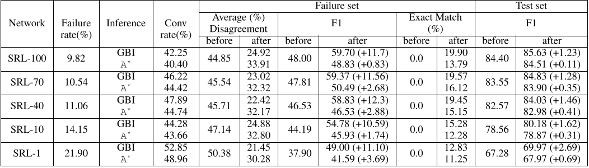

**1707.08608v3-Table10-1.png**

- Caption: Table 10: Comparison of different inference procedures: Viterbi, A*(He et al. 2017) and GBI with noisy and noise-free constraints. Note that the (+/-) F1 are reported w.r.t Viterbi decoding on the same column.
- Content type: table
- Figure type: N/A

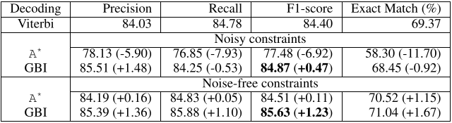

**1707.08608v3-Table11-1.png**

- Caption: Table 11: Comparison of runtime for difference inference procedures in the noise-free constraint setting: Viterbi, A*(He et al. 2017) and GBI. For SRL-100 refer Table 1 and SRL-NW is a model trained on NW genre.
- Content type: table
- Figure type: N/A

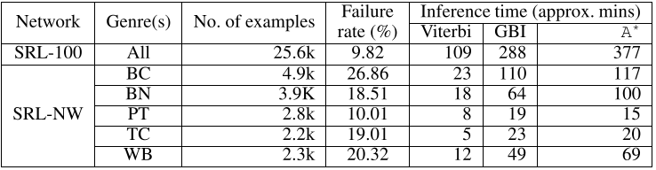

**1707.08608v3-Table2-1.png**

- Caption: Table 2: Parsing Networks with various performances (BS-9 means beam size 9). Net1,2 are GNMT seq2seq models whereas Net3-5 are lower-resource and simpler seq2seq models, providing a wide range of model performances on which to test GBI.
- Content type: table
- Figure type: N/A

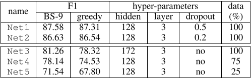

**1707.08608v3-Table3-1.png**

- Caption: Table 3: Evaluation of GBI on syntactic parsing using GNMT seq2seq. Note that GBI without beam search performs higher than BS-9 in Table 2.
- Content type: table
- Figure type: N/A

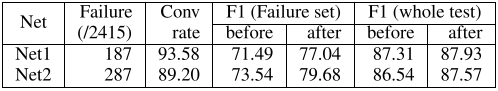

**1707.08608v3-Table4-1.png**

- Caption: Table 4: Evaluation of GBI on simpler, low-resource seq2seq networks. Here, we also evaluate whether GBI can be used in combination with different inference techniques: greedy and beam search of various widths.
- Content type: table
- Figure type: N/A

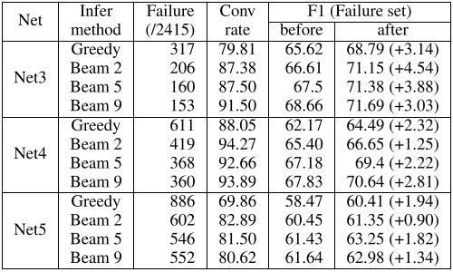

**1707.08608v3-Table5-1.png**

- Caption: Table 5: Evaluation of syntactic parser and SRL system on out-of-domain data. F1 scores are reported on the failure set. SRL model was trained on NW and the syntactic parser was trained on WSJ Section on OntoNote v5.0. Except PT, which is new and old Testament, all failure rate on out-domain data is higher than that of in-domain (11.9% for parsing and 18.1% for SRL) as suspected. The table shows that GBI can be successfully applied to resolve performance degradation on out-of-domain data.
- Content type: table
- Figure type: N/A

**1707.08608v3-Table6-1.png**

- Caption: A shift-reduce example for which the method successfully enforces constraints. The initial unconstrained decoder prematurely reduces “So it” into a phrase, missing the contracted verb “is.” Errors then propagate through the sequence culminating in the final token missing from the tree (a constraint violation). The constrained decoder is only able to deal with this at the end of the sequence, while our method is able to harness the constraint to correct the early errors.
- Content type: table
- Figure type: table

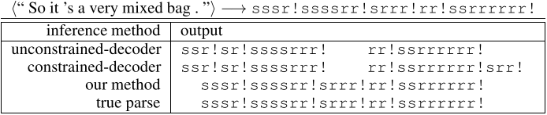

**1707.08608v3-Table7-1.png**

- Caption: A semantic role labeling example for which the method successfully enforces syntactic constraints. The initial output has an inconsistent span for token ”really like this”. Enforcing the constraint not only corrects the number of agreeing spans, but also changes the semantic role ”B-ARG2” to ”B-ARGM-ADV” and ”I-ARG2” to ”B-ARG2”..
- Content type: table
- Figure type: table

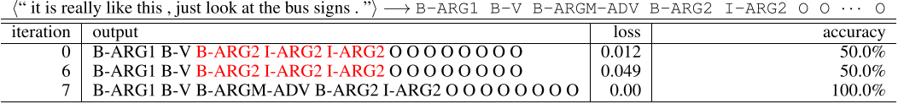

**1707.08608v3-Table8-1.png**

- Caption: A shift-reduce example for which the method successfully enforces constraints. The initial output has only nine shifts, but there are ten tokens in the input. Enforcing the constraint not only corrects the number of shifts to ten, but changes the implied tree structure to the correct tree.
- Content type: table
- Figure type: table

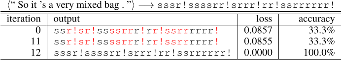

**1707.08608v3-Table9-1.png**

- Caption: A sequence transduction example for which enforcing the constraints improves accuracy. Red indicates errors.
- Content type: table
- Figure type: table

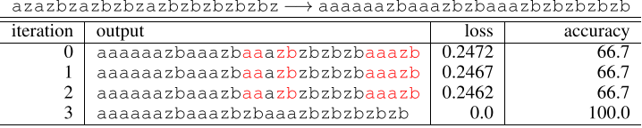

### QAs (7)
**QA 1**

- Question: Which genre in the SRL-NW network has the lowest failure rate and how does its inference time compare to other genres within the same network?
- Answer: The PT genre within the SRL-NW network has the lowest failure rate at 10.01%. Its inference time is also the lowest across all genres in the SRL-NW network for all three inference procedures (Viterbi, GBI, and A*).
- Rationale: The table shows the failure rate and inference time for each genre in both the SRL-100 and SRL-NW networks. By comparing the failure rate values within the SRL-NW network, we can identify PT as having the lowest rate. Additionally, by comparing the inference times for PT to other genres in the same network, we can see that it consistently requires the least amount of time for all three procedures.
- References: 1707.08608v3-Table11-1.png

Referenced images:

**QA 2**

- Question: Which genre shows the **largest absolute improvement** in F1 score on the failure set after applying GBI for **both** syntactic parsing and SRL?
- Answer: Pivot Corpus (PT) shows the largest absolute improvement in F1 score on the failure set after applying GBI for both syntactic parsing and SRL.
- Rationale: Looking at the "F1 on failure set" columns in Table 1, we can compare the "before" and "after" scores for each genre and task. 

For syntactic parsing, PT improves by 4.4 points (75.8 - 71.4), which is the highest increase among all genres. 

Similarly, for SRL, PT again shows the biggest improvement, with a 16.5 point increase (63.69 - 47.19) after applying GBI. 

Therefore, PT demonstrates the largest absolute improvement in both tasks based on the F1 scores on the failure set.
- References: 1707.08608v3-Table5-1.png

Referenced images:

**QA 3**

- Question: How did the accuracy of the model change as the iterations progressed?
- Answer: The accuracy of the model increased from 66.7% to 100% as the iterations progressed.
- Rationale: The table shows that the accuracy of the model increased from 66.7% to 100% as the iterations progressed.
- References: 1707.08608v3-Table9-1.png

Referenced images:

**QA 4**

- Question: What is the effect of enforcing syntactic constraints on the semantic role labeling output?
- Answer: Enforcing syntactic constraints can correct the number of agreeing spans, and also change the semantic roles assigned to tokens.
- Rationale: The figure shows that the initial output has an inconsistent span for token ”really like this”. Enforcing the constraint not only corrects the number of agreeing spans, but also changes the semantic role ”B-ARG2” to ”B-ARGM-ADV” and ”I-ARG2” to ”B-ARG2”.
- References: 1707.08608v3-Table7-1.png

Referenced images:

**QA 5**

- Question: What is the relationship between the number of shifts and the accuracy of the output?
- Answer: The accuracy of the output increases as the number of shifts increases.
- Rationale: The figure shows that the accuracy of the output is 33.3% when there are 9 shifts, and 100% when there are 10 shifts.
- References: 1707.08608v3-Table8-1.png

Referenced images:

**QA 6**

- Question: Which inference method consistently leads to the highest F1 score on the failure set across all three networks (Net3, Net4, and Net5)?
- Answer: Beam search with a width of 9 consistently leads to the highest F1 score on the failure set across all three networks.
- Rationale: The table shows the F1 scores on the failure set for different inference methods and network architectures. By comparing the F1 scores within each network, we can see that Beam 9 consistently achieves the highest score, indicating better performance in identifying and correcting failures compared to other methods like Greedy or Beam search with smaller widths.
- References: 1707.08608v3-Table4-1.png

Referenced images:

**QA 7**

- Question: How does GBI compare to A* in terms of reducing disagreement rate on the SRL-100 network's failure set?
- Answer: GBI is more effective than A* in reducing the disagreement rate on the SRL-100 network's failure set. After applying GBI, the average disagreement rate drops to 24.92%, while A* only reduces it to 33.91%. This represents an 19.93% greater reduction in disagreement rate when using GBI compared to A*.
- Rationale: Table 1 provides the average disagreement rate on the failure set for both GBI and A* across different SRL networks. Looking specifically at the SRL-100 network, we can see that the "after" values under the "Average Disagreement" column show a larger decrease for GBI (44.85% to 24.92%) compared to A* (44.85% to 33.91%). This indicates that GBI is more successful in reducing the number of predicted spans that disagree with the true syntactic parse.
- References: 1707.08608v3-Table1-1.png

Referenced images:

---
## Paper: 1708.03797v1
Semantic Scholar ID: 1708.03797v1

### Figures/Tables (3)
**1708.03797v1-Figure1-1.png**

- Caption: Overview of HDMF
- Content type: figure
- Figure type: schematic

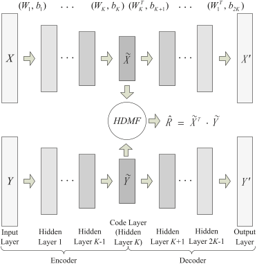

**1708.03797v1-Table1-1.png**

- Caption: Dataset Information
- Content type: table
- Figure type: ** table

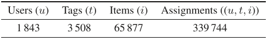

**1708.03797v1-Table2-1.png**

- Caption: Table 2: Recommendation Performance of Various Models (in %)
- Content type: table
- Figure type: N/A

### QAs (2)
**QA 1**

- Question: What is the role of the code layer in the HDMF architecture?
- Answer: The code layer is responsible for generating a compressed representation of the input data. This compressed representation is then used by the decoder to reconstruct the original data.
- Rationale: The figure shows that the code layer is located in the middle of the HDMF architecture, between the encoder and decoder. The encoder takes the input data and transforms it into a compressed representation, which is then fed into the code layer. The code layer further compresses this representation before passing it on to the decoder. The decoder then uses this compressed representation to reconstruct the original data.
- References: 1708.03797v1-Figure1-1.png

Referenced images:

**QA 2**

- Question: Which model achieved the best overall performance in terms of ranking relevant tags for users?
- Answer: HDMF achieved the best overall performance.
- Rationale: The table shows the performance of various models on several metrics, including Precision at different cut-off ranks (P@k), Recall at different cut-off ranks (R@k), F-score at different cut-off ranks (F@k), Mean Average Precision (MAP), and Mean Reciprocal Rank (MRR). Higher values indicate better performance for all metrics. Observing the bolded values in the table, which represent the highest scores achieved for each metric, we can see that HDMF consistently outperforms all other models across all the listed metrics. This suggests that HDMF is most effective at ranking relevant tags for users compared to the other models considered.
- References: 1708.03797v1-Table2-1.png

Referenced images:

---
## Paper: 1709.02418v2
Semantic Scholar ID: 1709.02418v2

### Figures/Tables (2)
**1709.02418v2-Figure1-1.png**

- Caption: Illustration of how performing a left-swap on binary vector y at index j′ yields a new vector z such that the number of misclassified pairs h(z, ŷ) is one more than h(y, ŷ). Specifically, ŷ misclassifies pairs (3, 4), (3, 5), (3, 7), and (6, 7) w.r.t. to y, since for each such pair (i, j), ŷi < ŷj but yi > yj . In contrast, ŷ misclassifies (3, 4), (3, 6), (3, 7), (5, 6), and (5, 7) w.r.t. to z.
- Content type: figure
- Figure type: Table

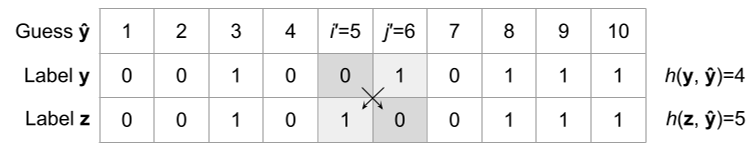

**1709.02418v2-Figure2-1.png**

- Caption: Illustration of how any binary vector y with n1 1s can be produced by repeatedly leftswapping the 1’s in a right-most binary vector r. In the example above, left-swaps are indicated with blue arrows, with s1 = 3, s2 = 1, and s3 = s4 = s5 = 0.
- Content type: figure
- Figure type: schematic

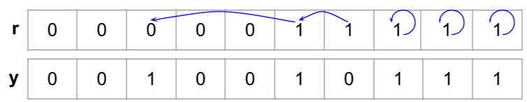

### QAs (1)
**QA 1**

- Question: What is the effect of performing a left-swap on a binary vector y at index j′?
- Answer: The left-swap increases the number of misclassified pairs by one.
- Rationale: The figure shows that the number of misclassified pairs for y is 4, while the number of misclassified pairs for z is 5. This means that the left-swap operation increased the number of misclassified pairs by one.
- References: 1709.02418v2-Figure1-1.png

Referenced images:

---
## Paper: 1710.05654v2
Semantic Scholar ID: 1710.05654v2

### Figures/Tables (14)
**1710.05654v2-Figure1-1.png**

- Caption: Time comparison of different ways to compute a graph. Left: Graph between 10,000 most frequent English words using a word2vec representation. Right: Graph between 1,000,000 nodes from 68 features (US Census 1990). Scalable algorithms benefit from a small average node degree k.
- Content type: figure
- Figure type: plot

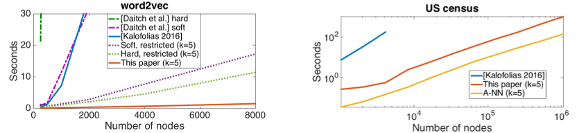

**1710.05654v2-Figure10-1.png**

- Caption: A 2-hop sub-graph of the word ”use”. Left: A-NN (k = 5.4). Center: k-NN graph (k = 5.0). Right: Large scale log (k = 5.7) being manifold-like only reaches relevant terms.
- Content type: figure
- Figure type: schematic

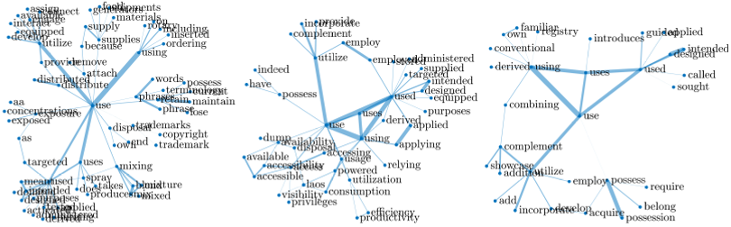

**1710.05654v2-Figure11-1.png**

- Caption: Label frequency (left) and average squared distribution (right) of MNIST train data (60000 nodes). The distances between digits “1” are significantly smaller than distances between other digits.
- Content type: figure
- Figure type: plot

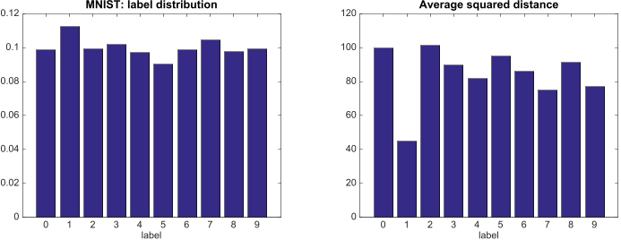

**1710.05654v2-Figure12-1.png**

- Caption: Robustness of the theoretical bounds of θ in the existence of outliers or duplicate nodes. Same dataset as the one used for Figure 2. Even for extreme cases in terms of distance distribution, the bounds give a good approximation. Left: Results when we add Gaussian noise from N (0, 1) to 10% of the images before calculating Z. Note that the noise added is significant given that the initial pixel values are in [0, 1]. Right: We replaced 10% of the images with duplicates of other images already in the dataset.
- Content type: figure
- Figure type: plot

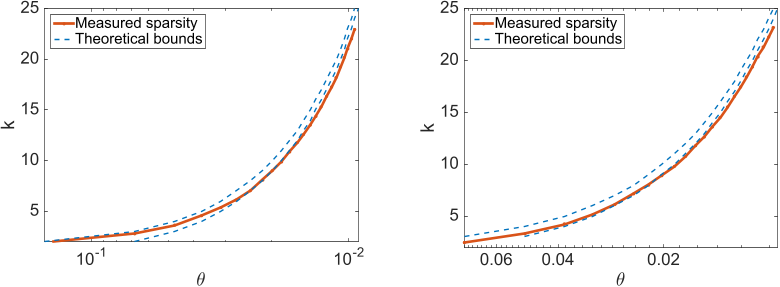

**1710.05654v2-Figure13-1.png**

- Caption: Predicted and measured sparsity for different choices of θ. Note that θ is plotted in logarithmic scale and decreasing. Up left: 400 ATT face images. Up right: 1440 object images from the COIL dataset. Down left: Graph between 1000 samples from a multivariate uniform distribution. Down right: Graph between 1000 samples from a multivariate Gaussian distribution.
- Content type: figure
- Figure type: plot

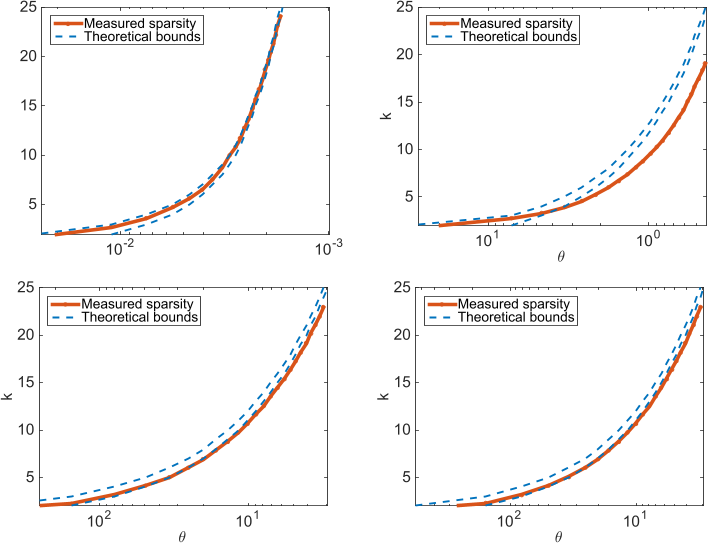

**1710.05654v2-Figure14-1.png**

- Caption: Connectivity across different classes of MNIST (60000 nodes). The graph is normalized so that ‖W‖1,1 = 1. We measure the percentage of the total weight for connected pairs of each label. The last columns correspond to the total of the wrong edges, between images of different labels. Left: (Daitch et al., 2009) hard model. As the degree is constant over the nodes, the hard model is close the A-NN. Right: (Daitch et al., 2009) soft model. In terms of connextivity, the soft model seems to be between the log and the `2 model. Note that while it favors connections between "1"s, this effect becomes worse with higher density. Note also that these algorithms fail to give reasonable graphs for densities outside a small range, making it very difficult to control sparsity.
- Content type: figure
- Figure type: plot

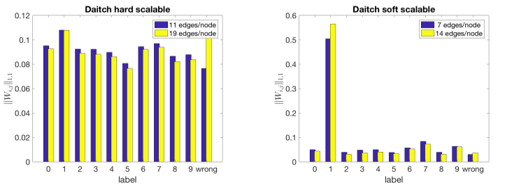

**1710.05654v2-Figure15-1.png**

- Caption: Figure 15: Time needed for learning a graph of 60000 nodes (MNIST images) using the large-scale version of (3). Our algorithm converged after 250 to 450 iterations with a tolerance of 1e− 4. The time needed is linear to the number of variables, that is linear to the average degree of the graph.
- Content type: figure
- Figure type: plot

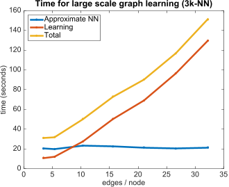

**1710.05654v2-Figure4-1.png**

- Caption: Figure 4: Effectiveness of θ bounds eq. (18). Requested versus obtained degree, "spherical" data (262, 000 nodes).
- Content type: figure
- Figure type: plot

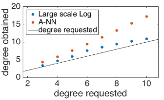

**1710.05654v2-Figure5-1.png**

- Caption: Connectivity across classes of MNIST. The graph is normalized so that ‖W‖1,1 = 1. We measure the percentage of the total weight for connected pairs of each label. The last columns correspond to the total of the wrong edges, between images of different labels. Left: A-NN graph. Middle: `2 model (4) neglects digits with larger distance. Right: log model (5) does not neglect to connect any cluster even for very sparse graphs of 5 edges per node.
- Content type: figure
- Figure type: plot

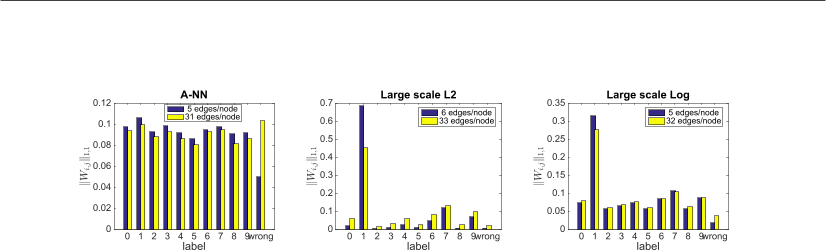

**1710.05654v2-Figure6-1.png**

- Caption: Left: Edge accuracy of large scale models for MNIST. Right: Digit classification error with 1% labels. Dashed lines represent nodes in components without known labels (non-classifiable).
- Content type: figure
- Figure type: plot

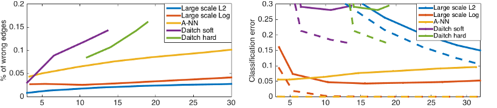

**1710.05654v2-Figure7-1.png**

- Caption: Spherical data, ground truth and recovered manifolds. Up left: The ground truth manifold is on the sphere. We have colored the nodes that correspond to the middle of the 2-D grid and the lower corner so that we track where they are mapped in the recovered manifolds. In Figure 8 we keep only the subgraphs of the green or blue nodes. Up, right: Recovered by A-NN, k = 4.31. Down, left: Recovered by the `2 model, k = 4.70. The middle region is mixed with nodes outside the very center. The corners are much more dense, the blue region is barely visible on the bottom. Note that 46 nodes were disconnected so they are not mapped at all. Down, right: Recovered by the log model, k = 4.73. The middle region is much better mapped. The corners are still very dense, we have to zoom-in for the blue region (Figure 8).
- Content type: figure
- Figure type: plot

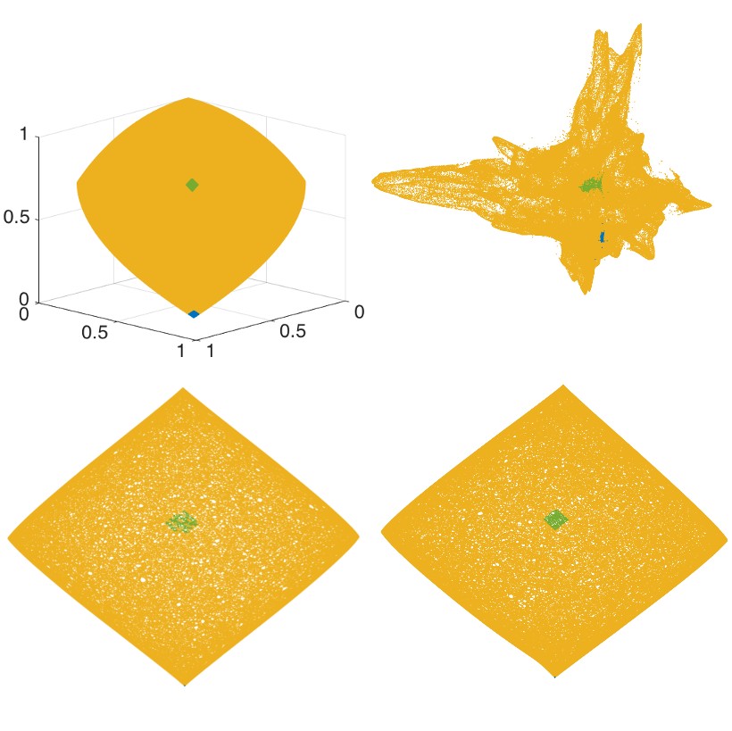

**1710.05654v2-Figure8-1.png**

- Caption: Detail from the manifolds recovered by `2 and log models from "spherical data" (262, 144 nodes, 1920 signals). Corner (blue) and middle (green) parts of the manifold. Left: `2 model, k = 4.70. Right: log model, k = 4.73. See Figure 7 for the big picture.
- Content type: figure
- Figure type: plot

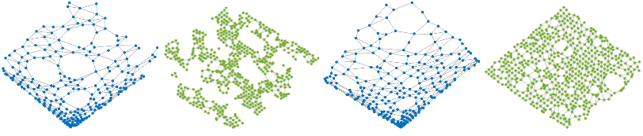

**1710.05654v2-Figure9-1.png**

- Caption: Graph diameter measures manifold recovery quality. Left: small spherical data: 4096 nodes, 1920 signals. Middle: Same data, 40 signals. Right: word2vec: 10,000 nodes, 300 features.
- Content type: figure
- Figure type: plot

**1710.05654v2-Table1-1.png**

- Caption: Table 1: Weight comparison between k-NN, A-NN and learned graphs. The weights assigned by graph learning correspond much better to the relevance of the terms.
- Content type: table
- Figure type: N/A

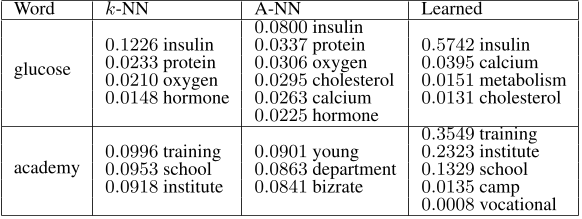

### QAs (9)
**QA 1**

- Question: How does the time needed for learning a graph with a subset of allowed edges $\mathcal{E}^\text{allowed}$ change as the number of edges per node increases?
- Answer: The time needed for learning a graph with a subset of allowed edges $\mathcal{E}^\text{allowed}$ increases linearly as the number of edges per node increases.
- Rationale: The figure shows that the time needed for learning a graph increases linearly with the number of edges per node. This is because the cost of learning a graph with a subset of allowed edges $\mathcal{E}^\text{allowed}$ is linear to the size of the set.
- References: 1710.05654v2-Figure15-1.png

Referenced images:

**QA 2**

- Question: Which method is the fastest for computing a graph with a small average node degree?
- Answer: The proposed method in this paper (k=5) is the fastest for computing a graph with a small average node degree.
- Rationale: The figure on the right shows that the method in this paper (k=5) has the lowest time complexity for computing a graph with a small average node degree.
- References: 1710.05654v2-Figure1-1.png

Referenced images:

**QA 3**

- Question: Which digit has the highest average squared distance to other digits in the MNIST dataset?
- Answer: Digit "1"
- Rationale: The right plot shows the average squared distance for each digit. We can see that the bar for digit "1" is the highest, which means that on average, digit "1" is further away from other digits than any other digit.
- References: 1710.05654v2-Figure11-1.png

Referenced images:

**QA 4**

- Question: How well do the approximate bounds of $\theta$ predict sparsity in the "spherical" dataset?
- Answer: The approximate bounds of $\theta$ are very effective at predicting sparsity in the "spherical" dataset.
- Rationale: The figure shows that the obtained degree closely follows the requested degree for both the large-scale log and A-NN methods. This indicates that the approximate bounds of $\theta$ are accurately predicting the sparsity of the resulting graph.
- References: 1710.05654v2-Figure4-1.png

Referenced images:

**QA 5**

- Question: Which model is the most effective at connecting digits with larger distances?
- Answer: The log model.
- Rationale: The rightmost plot shows that the log model has the highest percentage of weight for connected pairs of each label, even for very sparse graphs of 5 edges per node. This indicates that the log model is the most effective at connecting digits with larger distances.
- References: 1710.05654v2-Figure5-1.png

Referenced images:

**QA 6**

- Question: What is the effect of adding Gaussian noise to the images on the measured sparsity?
- Answer: Adding Gaussian noise to the images increases the measured sparsity.
- Rationale: The left panel of the figure shows that the measured sparsity (solid line) is higher when Gaussian noise is added to the images (orange line) than when no noise is added (blue line). This is because the noise adds additional non-zero entries to the data matrix, which increases the sparsity.
- References: 1710.05654v2-Figure12-1.png

Referenced images:

**QA 7**

- Question: How does the connectivity of the Daitch hard scalable model compare to the Daitch soft scalable model?
- Answer: The Daitch hard scalable model has a higher connectivity than the Daitch soft scalable model. This can be seen in the figure, where the bars for the hard model are generally higher than the bars for the soft model.
- Rationale: The figure shows the percentage of the total weight for connected pairs of each label for the Daitch hard scalable model (left) and the Daitch soft scalable model (right). The height of the bars represents the percentage of the total weight, so taller bars indicate a higher connectivity.
- References: 1710.05654v2-Figure14-1.png

Referenced images:

**QA 8**

- Question: How does the relevance of terms assigned by the learned graph compare to the relevance assigned by k-NN and A-NN graphs?
- Answer: The learned graph assigns weights that correspond much better to the relevance of the terms compared to k-NN and A-NN graphs.
- Rationale: The caption of Table 1 explicitly states that "the weights assigned by graph learning correspond much better to the relevance of the terms." Additionally, when comparing the terms associated with "glucose" and "academy" across the different methods, the learned graph generally assigns higher weights to terms that are intuitively more relevant to the respective words. For example, "insulin" has a much higher weight for "glucose" in the learned graph compared to the other methods, and "training" has a higher weight for "academy" in the learned graph compared to the other methods. This suggests that the learned graph is better at capturing semantic relationships between words.
- References: 1710.05654v2-Table1-1.png

Referenced images:

**QA 9**

- Question: How does the graph diameter change with increasing average degree for different methods and datasets?
- Answer: The graph diameter generally decreases with increasing average degree for all methods and datasets. However, the rate of decrease and the final diameter value vary depending on the method and dataset.
- Rationale: The figure shows the graph diameter as a function of the average degree for different methods and datasets. The diameter is a measure of how far apart nodes are in the graph, and a lower diameter indicates a better manifold recovery. The figure shows that the diameter decreases as the average degree increases, which means that the nodes are becoming more connected and the manifold is being recovered more accurately.
- References: 1710.05654v2-Figure9-1.png

Referenced images:

---
## Paper: 1802.07459v2
Semantic Scholar ID: 1802.07459v2

### Figures/Tables (5)
**1802.07459v2-Figure1-1.png**

- Caption: An example to show a piece of text and its Concept Interaction Graph representation.
- Content type: figure
- Figure type: schematic

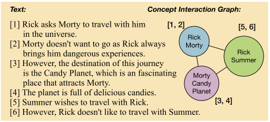

**1802.07459v2-Figure2-1.png**

- Caption: An overview of our approach for constructing the Concept Interaction Graph (CIG) from a pair of documents and classifying it by Graph Convolutional Networks.
- Content type: figure
- Figure type: schematic

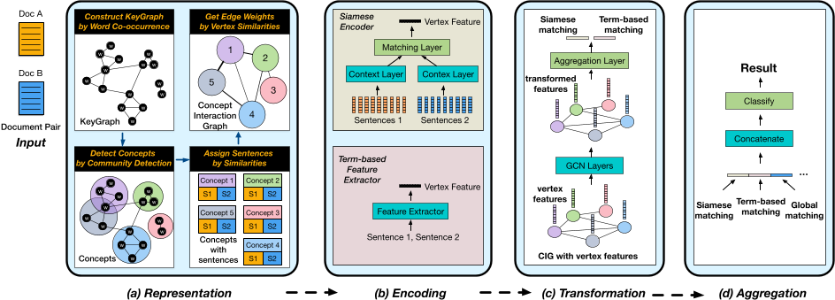

**1802.07459v2-Figure3-1.png**

- Caption: The events contained in the story “2016 U.S. presidential election”.
- Content type: figure
- Figure type: schematic

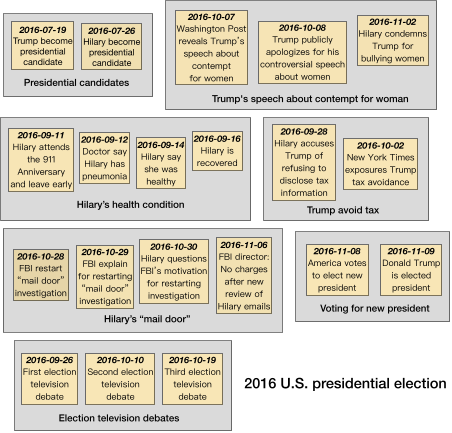

**1802.07459v2-Table1-1.png**

- Caption: Table 1: Description of evaluation datasets.
- Content type: table
- Figure type: N/A

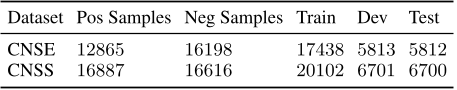

**1802.07459v2-Table2-1.png**

- Caption: Table 2: Accuracy and F1-score results of different algorithms on CNSE and CNSS datasets.
- Content type: table
- Figure type: N/A

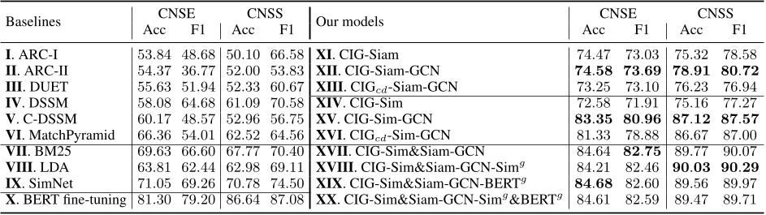

### QAs (3)
**QA 1**

- Question: How many negative samples are there in the training set of the CNSE dataset?
- Answer: There are approximately 9,719 negative samples in the training set of the CNSE dataset.
- Rationale: Table 1 shows that the CNSE dataset has a total of 16,198 negative samples. The passage states that 60% of all samples are used for training. Therefore, to find the number of negative samples in the training set, we can calculate: 

0.6 * 16,198 = 9,718.8 

Since we cannot have fractions of samples, we round this number to the nearest whole number, which is 9,719.
- References: 1802.07459v2-Table1-1.png

Referenced images:

**QA 2**

- Question: Which model variant achieves the best performance on the CNSS dataset in terms of F1-score, and what are its key components?
- Answer: Model XVIII, CIG-Sim&Siam-GCN-Sim$^{g}$, achieves the best performance on the CNSS dataset with an F1-score of 90.29%. This model utilizes the following key components:

1. CIG: It directly uses keywords as concepts without community detection.
2. Sim & Siam: It employs both term-based similarity encoder ("Sim") and Siamese encoder ("Siam") for generating matching vectors on vertices.
3. GCN: It performs convolution on local matching vectors through GCN layers.
4. Sim$^{g}$: It incorporates additional global features based on the five term-based similarity metrics.
- Rationale: Table 1 presents the performance of various models on both CNSE and CNSS datasets, with columns specifically indicating Accuracy and F1-score for each dataset. By looking at the F1-score column for CNSS, we can identify model XVIII as having the highest score. 

The passage then helps us understand the specific components of this model by explaining the abbreviations used in the model names. We can see that model XVIII combines various techniques, including both "Sim" and "Siam" encoders, GCN for local information aggregation, and global features from term-based similarity metrics ("Sim$^{g}$").
- References: 1802.07459v2-Table2-1.png

Referenced images:

**QA 3**

- Question: What are the different stages involved in constructing the Concept Interaction Graph (CIG) from a pair of documents?
- Answer: The different stages involved in constructing the Concept Interaction Graph (CIG) from a pair of documents are: (a) Representation, (b) Encoding, (c) Transformation, and (d) Aggregation.
- Rationale: The figure shows the different stages involved in constructing the CIG. The first stage, Representation, involves constructing a KeyGraph from the document pair by word co-occurrence and detecting concepts by community detection. The second stage, Encoding, involves getting edge weights by vertex similarities and assigning sentences by similarities. The third stage, Transformation, involves using a Siamese encoder to generate vertex features and a term-based feature extractor to generate vertex features. The fourth stage, Aggregation, involves performing Siamese-based matching, term-based matching, and global matching to generate the final CIG.
- References: 1802.07459v2-Figure2-1.png

Referenced images:

---
## Paper: 1803.04383v2
Semantic Scholar ID: 1803.04383v2

### Figures/Tables (6)
**1803.04383v2-Figure1-1.png**

- Caption: The above figure shows the outcome curve. The horizontal axis represents the selection rate for the population; the vertical axis represents the mean change in score. (a) depicts the full spectrum of outcome regimes, and colors indicate regions of active harm, relative harm, and no harm. In (b): a group that has much potential for gain, in (c): a group that has no potential for gain.
- Content type: figure
- Figure type: plot

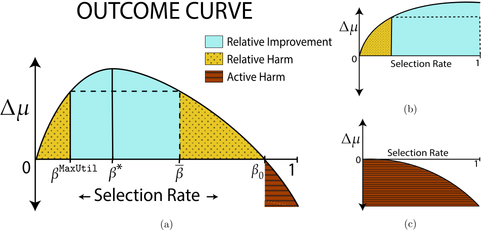

**1803.04383v2-Figure2-1.png**

- Caption: Figure 2: Both outcomes ∆µ and institution utilities U can be plotted as a function of selection rate for one group. The maxima of the utility curves determine the selection rates resulting from various decision rules.
- Content type: figure
- Figure type: plot

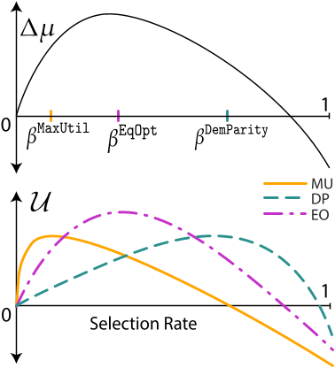

**1803.04383v2-Figure3-1.png**

- Caption: Figure 3: Considering the utility as a function of selection rates, fairness constraints correspond to restricting the optimization to one-dimensional curves. The DemParity (DP) constraint is a straight line with slope 1, while the EqOpt (EO) constraint is a curve given by the graph of G(A→B). The derivatives considered throughout Section 6 are taken with respect to the selection rate βA (horizontal axis); projecting the EO and DP constraint curves to the horizontal axis recovers concave utility curves such as those shown in the lower panel of Figure 2 (where MaxUtil in is represented by a horizontal line through the MU optimal solution).
- Content type: figure
- Figure type: plot

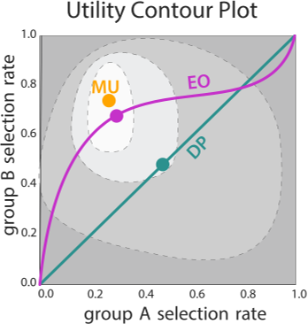

**1803.04383v2-Figure4-1.png**

- Caption: Figure 4: The empirical payback rates as a function of credit score and CDF for both groups from the TransUnion TransRisk dataset.
- Content type: figure
- Figure type: plot

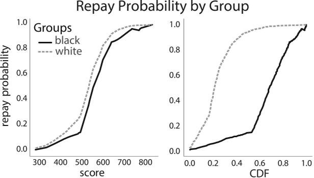

**1803.04383v2-Figure5-1.png**

- Caption: Figure 5: The empirical CDFs of both groups are plotted along with the decision thresholds resulting from MaxUtil, DemParity, and EqOpt for a model with bank utilities set to (a) u− u+ = −4 and (b) u− u+ = −10. The threshold for active harm is displayed; in (a) DemParity causes active harm while in (b) it does not. EqOpt and MaxUtil never cause active harm.
- Content type: figure
- Figure type: plot

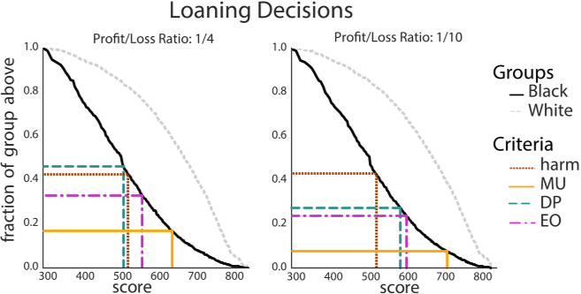

**1803.04383v2-Figure6-1.png**

- Caption: Figure 6: The outcome and utility curves are plotted for both groups against the group selection rates. The relative positions of the utility maxima determine the position of the decision rule thresholds. We hold u− u+ = −4 as fixed.
- Content type: figure
- Figure type: plot

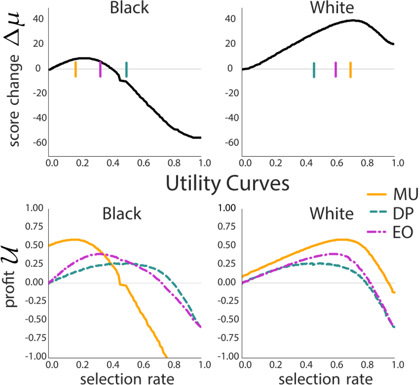

### QAs (5)
**QA 1**

- Question: How do the outcome curves for the black and white groups differ?
- Answer: The outcome curve for the black group is generally lower than the outcome curve for the white group. This indicates that, for a given selection rate, the black group experiences a smaller change in credit score than the white group.
- Rationale: The outcome curves in the top panel of the figure show the average change in credit score for each group under different loaning rates. The black curve is consistently below the white curve, demonstrating the disparity in credit score changes between the two groups.
- References: 1803.04383v2-Figure6-1.png

Referenced images:

**QA 2**

- Question: How does the selection rate affect the expected outcome and institution utilities for different decision rules?
- Answer: The selection rate has a different effect on the expected outcome and institution utilities for different decision rules. For example, the maximum expected outcome is achieved at a higher selection rate for the MaxUtil rule than for the EqOpt rule.
- Rationale: The figure shows that the expected outcome and institution utilities are both functions of the selection rate. The different decision rules correspond to different curves in the figure, and the maximum of each curve corresponds to the selection rate that maximizes the corresponding objective function.
- References: 1803.04383v2-Figure2-1.png

Referenced images:

**QA 3**

- Question: Does the probability of repaying a debt increase or decrease with credit score?
- Answer: The probability of repaying a debt increases with credit score.
- Rationale: The figure shows that the empirical payback rates for both black and white groups increase with credit score. This is because individuals with higher credit scores are more likely to be able to repay their debts than individuals with lower credit scores.
- References: 1803.04383v2-Figure4-1.png

Referenced images:

**QA 4**

- Question: Which fairness criteria results in the highest loan approval rate for the Black group when the loss/profit ratio is -4?
- Answer: The maximum profit criteria ($\maxprof$) results in the highest loan approval rate for the Black group when the loss/profit ratio is -4.
- Rationale: The figure shows the loan approval rates for different fairness criteria and different loss/profit ratios. The vertical lines represent the loan approval thresholds for each criteria. The higher the threshold, the more loans are approved. When the loss/profit ratio is -4, the $\maxprof$ threshold is the highest for the Black group, indicating that it approves the most loans for this group.
- References: 1803.04383v2-Figure5-1.png

Referenced images:

**QA 5**

- Question: What does the outcome curve tell us about the relationship between selection rate and mean change in score?
- Answer: The outcome curve shows that the relationship between selection rate and mean change in score is complex and depends on the specific group being considered. For groups with high potential for gain, increasing the selection rate can lead to large increases in mean score. However, for groups with low potential for gain, increasing the selection rate can actually lead to decreases in mean score.
- Rationale: The figure shows that the outcome curve is divided into three regions: relative improvement, relative harm, and active harm. The relative improvement region is the area where increasing the selection rate leads to increases in mean score. The relative harm region is the area where increasing the selection rate leads to smaller increases in mean score than would be expected if the selection rate were lower. The active harm region is the area where increasing the selection rate leads to decreases in mean score.
- References: 1803.04383v2-Figure1-1.png

Referenced images:

---
## Paper: 1804.00863v3
Semantic Scholar ID: 1804.00863v3

### Figures/Tables (13)
**1804.00863v3-Figure1-1.png**

- Caption: Frames from a video with a moving viewer (columns) comparing a re-synthesis using our novel deep appearance maps (DAMs) (top) and reflectance maps (RMs) (bottom) to a photo reference of a decorative sphere with a complex material under natural illumination (middle).
- Content type: figure
- Figure type: ** photograph(s)

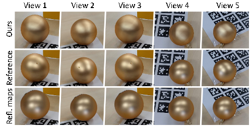

**1804.00863v3-Figure10-1.png**

- Caption: Relation of gloss and representation error.
- Content type: figure
- Figure type: plot

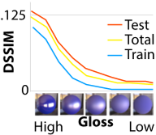

**1804.00863v3-Figure11-1.png**

- Caption: Real-world photo data and our reconstruction (from other views) of multiple materials (denoted M) in multiple illumination (L) from multiple views (V).
- Content type: figure
- Figure type: photograph(s)

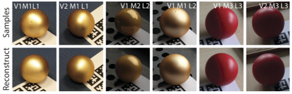

**1804.00863v3-Figure12-1.png**

- Caption: Transfer of appearance from a real video sequence (left) to new 3D shapes (right).
- Content type: figure
- Figure type: photograph(s)

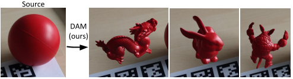

**1804.00863v3-Figure2-1.png**

- Caption: Reflectance and Appearance maps.
- Content type: figure
- Figure type: Photograph(s)

**1804.00863v3-Figure3-1.png**

- Caption: Different appearance processing tasks that we address using our deep appearance maps. a) The first task simply reproduces a given appearance, i. e., it maps from normal and view directions to RGB values using a NN. b) In a learning-to-learn task a network maps an image to a DAM representation. c) Finally, in the segmentation-and-estimation task, a network maps an image to multiple DAMs and multiple segmentation networks.
- Content type: figure
- Figure type: schematic

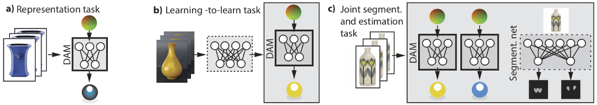

**1804.00863v3-Figure4-1.png**

- Caption: The four architectures used.
- Content type: figure
- Figure type: schematic

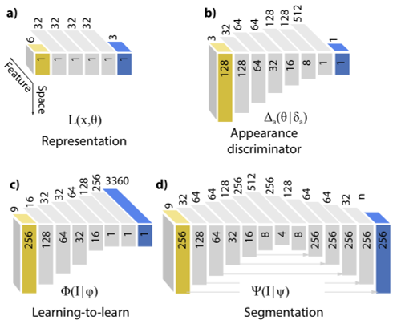

**1804.00863v3-Figure5-1.png**

- Caption: Two samples from four variants of our data set.
- Content type: figure
- Figure type: photograph(s)

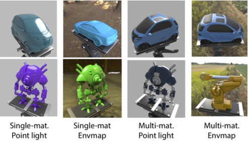

**1804.00863v3-Figure6-1.png**

- Caption: Pairs of error plots for each task. In each pair, the first is the old and the second the new view. Each curve is produced by sorting the DSSIM (less is better) of all samples in the data set. Blue colors are for point light illumination, red colors for environment maps. Dark hues are the competitor and light hues ours.
- Content type: figure
- Figure type: plot

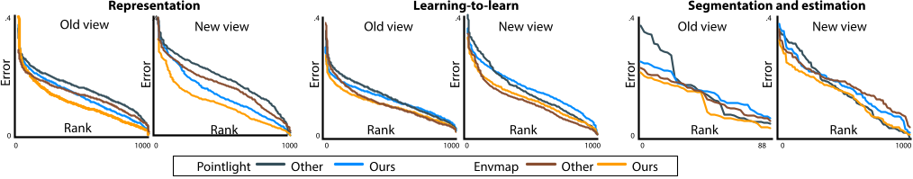

**1804.00863v3-Figure7-1.png**

- Caption: Results of our DAM representation trained using stochastic gradient descent (1st column), our DAMs produced by our learning-to-learn network (2nd column) as well as a reference (3rd column) in a novel-view task.
- Content type: figure
- Figure type: photograph(s)

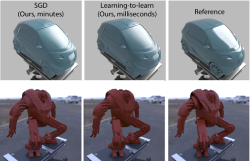

**1804.00863v3-Figure8-1.png**

- Caption: Failure modes for all three tasks: blurry highlights, split highlight segmentation and a overshooting DAM.
- Content type: figure
- Figure type: photograph(s)

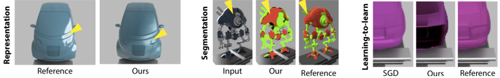

**1804.00863v3-Figure9-1.png**

- Caption: Results of joint material segmentation and estimation for two samples (rows). In every part we show a re-synthesis, as well as two estimated materials and the resulting mask. The insets in the last row show that, while not all reflection details are reproduced, ours is free of color shifts around the highlights and mostly a lowfrequency approximation of the environment reflected.
- Content type: figure
- Figure type: photograph(s)

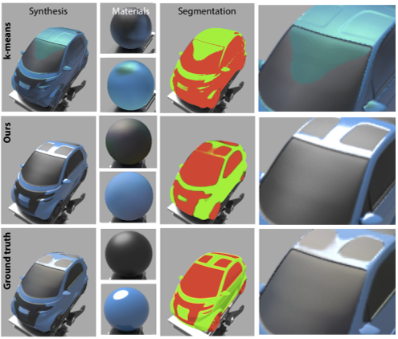

**1804.00863v3-Table1-1.png**

- Caption: Quantitative results on synthetic data. Rows are different combination of tasks and methods (three applications, two view protocols, our two methods). Columns are different data. Error is measured as mean DSSIM across the data set (less is better).
- Content type: table
- Figure type: Table

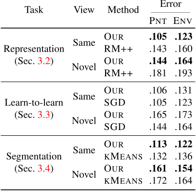

### QAs (6)
**QA 1**

- Question: How does the appearance of the sphere differ between the re-synthesis using DAMs and the reference image?
- Answer: The sphere in the re-synthesis using DAMs appears to have a more even and consistent surface texture than the reference image.
- Rationale: The images in the top row of the figure show the re-synthesis using DAMs, while the images in the middle row show the reference image. By comparing the two, it can be seen that the DAMs-based re-synthesis results in a smoother and more uniform appearance of the sphere.
- References: 1804.00863v3-Figure1-1.png

Referenced images:

**QA 2**

- Question: Which method performs best for the "Representation" task when the view is "Novel"?
- Answer: The "OUR" method performs best for the "Representation" task when the view is "Novel".
- Rationale: The table shows that the "OUR" method has a lower error rate (0.144) than the "RM++" method (0.181) for the "Representation" task when the view is "Novel".
- References: 1804.00863v3-Table1-1.png

Referenced images:

**QA 3**

- Question: How do the reconstructions compare to the original samples?
- Answer: The reconstructions are very similar to the original samples.
- Rationale: The figure shows the original samples in the top row and the reconstructions in the bottom row. The reconstructions are very close to the original samples, indicating that the method is able to accurately reconstruct the objects.
- References: 1804.00863v3-Figure11-1.png

Referenced images:

**QA 4**

- Question: What is the difference between the representation module and the learning-to-learn module?
- Answer: The representation module takes an input image and outputs a feature representation. The learning-to-learn module takes a set of features and learns how to segment the image.
- Rationale: The figure shows that the representation module has a fixed number of channels, while the learning-to-learn module has a variable number of channels. This suggests that the learning-to-learn module is more flexible and can adapt to different types of images.
- References: 1804.00863v3-Figure4-1.png

Referenced images:

**QA 5**

- Question: What is the difference between the representation task and the learning-to-learn task?
- Answer: The representation task takes an appearance as input and outputs an RGB value, while the learning-to-learn task takes an image as input and outputs a DAM representation.
- Rationale: The figure shows that the representation task takes a normal and view direction as input, while the learning-to-learn task takes an image as input.
- References: 1804.00863v3-Figure3-1.png

Referenced images:

**QA 6**

- Question: What is the relationship between gloss and representation error?
- Answer: The representation error decreases as the gloss decreases.
- Rationale: The figure shows that the DSSIM (Deep Structural Similarity Index Measure) for the test, total, and train sets decreases as the gloss of the sphere decreases. This means that the representation error is lower for spheres with lower gloss.
- References: 1804.00863v3-Figure10-1.png

Referenced images:

---
## Paper: 1804.05936v2
Semantic Scholar ID: 1804.05936v2

### Figures/Tables (9)
**1804.05936v2-Figure1-1.png**

- Caption: The overall structure of the Deep Listwise Context Model (DLCM). Rnq is a ranked list provided by a global ranking function f for query q; x(q,di ) is the feature vector for document di ; sn and oi is the final network state and hidden outputs of the RNN with GRU in I (Rnq ,Xn q ); and Score(di ) is the final ranking score of di computed with ϕ(on+1−i , sn )
- Content type: figure
- Figure type: schematic

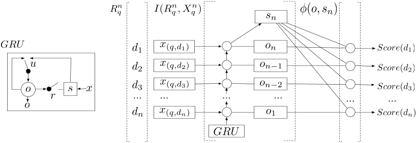

**1804.05936v2-Figure2-1.png**

- Caption: Figure 2: The NegPair reduction (NP(d,LambdaMART )- NP(d,DLCM)) on documents with different relevance labels.
- Content type: figure
- Figure type: plot

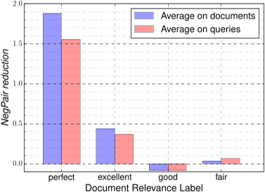

**1804.05936v2-Figure3-1.png**

- Caption: Figure 3: TheNegPair reduction and corresponding improvement proportion for queries with different number of perfect documents.
- Content type: figure
- Figure type: plot

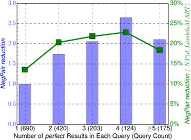

**1804.05936v2-Figure4-1.png**

- Caption: The performance of the DLCMs on Microsoft 30k with different hyper-parameters.
- Content type: figure
- Figure type: plot

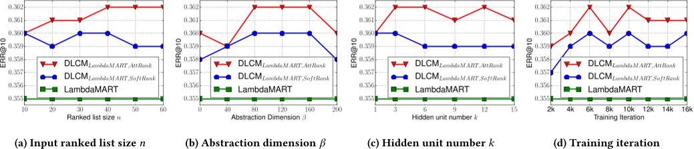

**1804.05936v2-Table1-1.png**

- Caption: Table 1: The characteristics of learning-to-rank datasets used in our experiments: number of queries, documents, relevance levels, features and year of release.
- Content type: table
- Figure type: N/A

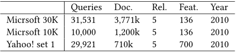

**1804.05936v2-Table2-1.png**

- Caption: Table 2: Comparison of baselines and the DLCMs onMicrsoft 30K. ∗, + and ‡ denotes significant improvements over the global ranking algorithm and the best corresponding re-ranking baseline (DNN) and LIDNN.
- Content type: table
- Figure type: N/A

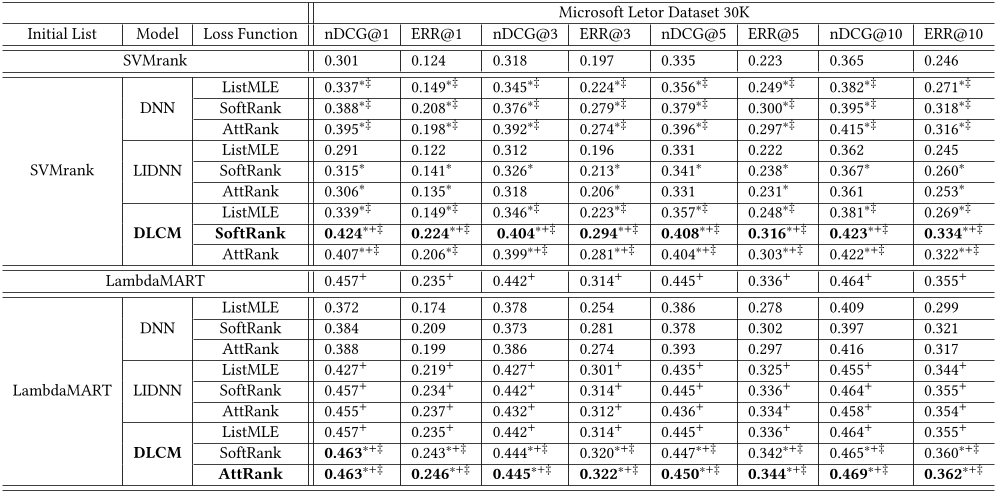

**1804.05936v2-Table3-1.png**

- Caption: Table 3: Comparison of baselines and the DLCMs onMicrsoft 10K. ∗, + and ‡ denotes significant improvements over the global ranking algorithm and the best corresponding re-ranking baseline (DNN) and LIDNN.
- Content type: table
- Figure type: N/A

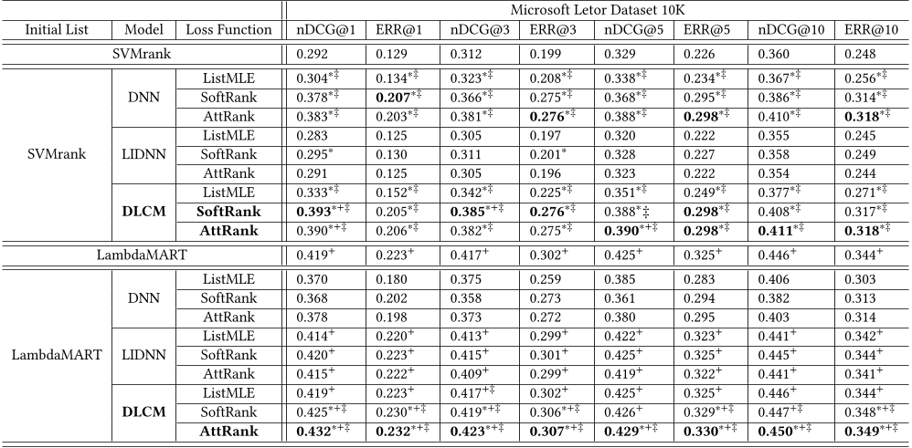

**1804.05936v2-Table4-1.png**

- Caption: Table 4: Comparison of baselines and the DLCMs on Yahoo! set 1. ∗, + and ‡ denotes significant improvements over the global ranking algorithm and the best corresponding re-ranking baseline (DNN) and LIDNN.
- Content type: table
- Figure type: N/A

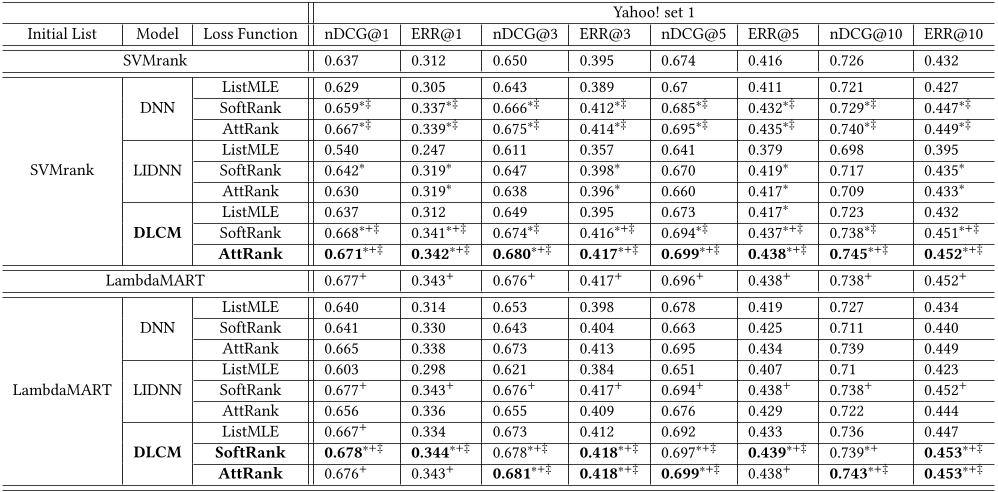

**1804.05936v2-Table5-1.png**

- Caption: Table 5: The statistics of the test fold used for pairwise ranking analysis in Microsoft 30k. Query denotes the number of queries containing documentswith the corresponding label.
- Content type: table
- Figure type: N/A

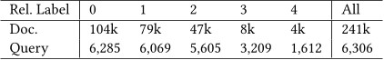

### QAs (6)
**QA 1**

- Question: Which relevance label category of documents received the most significant rank promotion according to the NegPair reduction metric?
- Answer: The perfect results received the largest promotions in rank.
- Rationale: Figure 0 shows that the average NegPair reduction for documents with the **perfect** relevance label is the highest among all categories, with a value of 1.88. This indicates that the positions of these documents have been effectively increased by nearly 2 in their ranked lists.
- References: 1804.05936v2-Figure2-1.png

Referenced images:

**QA 2**

- Question: What is the role of the GRU in the Deep Listwise Context Model (DLCM)?
- Answer: The GRU is used to process the ranked list of documents provided by a global ranking function.
- Rationale: The GRU takes the feature vector of each document in the ranked list as input and outputs a final network state and hidden outputs. These outputs are then used to compute the final ranking score of each document.
- References: 1804.05936v2-Figure1-1.png

Referenced images:

**QA 3**

- Question: How does the NegPair reduction vary with the number of perfect results in a query?
- Answer: The NegPair reduction generally increases as the number of perfect results in a query increases.
- Rationale: The figure shows that the average NegPair reduction is higher for queries with more perfect results. For example, the NegPair reduction is 0.99 for queries with one perfect result, but it is 2.64 for queries with four perfect results. This suggests that DLCMs are more effective at reducing the number of negative pairs for queries with more perfect results.
- References: 1804.05936v2-Figure3-1.png

Referenced images:

**QA 4**

- Question: Which dataset would be most suitable for training a learning-to-rank model with limited computational resources, and why?
- Answer: Microsoft 10k would be the most suitable dataset for training with limited computational resources.
- Rationale: The table shows that Microsoft 10k has the smallest number of queries and documents compared to the other two datasets. This implies that training a model on this dataset would require less memory and processing power, making it a better choice when computational resources are limited.
- References: 1804.05936v2-Table1-1.png

Referenced images:

**QA 5**

- Question: Which of the following methods has the best performance?
- Answer: LambdaMART
- Rationale: LambdaMART consistently has the lowest ERR@10 values in all the figures, regardless of the hyper-parameter being tested.
- References: 1804.05936v2-Figure4-1.png

Referenced images:

**QA 6**

- Question: Which combination of initial list, model, and loss function achieved the best overall performance on the Yahoo! set 1, as measured by nDCG@10 and ERR@10?
- Answer: LambdaMART initial list, DLCM model, and AttRank loss function achieved the best overall performance on the Yahoo! set 1, with an nDCG@10 of 0.743 and an ERR@10 of 0.453.
- Rationale: The table presents the performance of various combinations of initial list, model, and loss function on the Yahoo! set 1, measured by several metrics including nDCG@10 and ERR@10. By looking at the last two columns of the table, we can identify the combination with the highest values for both metrics. In this case, the combination of LambdaMART initial list, DLCM model, and AttRank loss function has the highest values for both nDCG@10 (0.743) and ERR@10 (0.453), indicating the best overall performance.
- References: 1804.05936v2-Table4-1.png

Referenced images:

---
## Paper: 1804.07849v4
Semantic Scholar ID: 1804.07849v4

### Figures/Tables (5)
**1804.07849v4-Figure1-1.png**

- Caption: Architecture illustrated on the example text “had these keys in my” with target Y = “keys”.
- Content type: figure
- Figure type: schematic

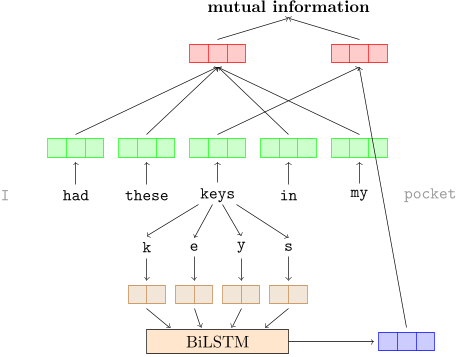

**1804.07849v4-Table1-1.png**

- Caption: Table 1: Many-to-one accuracy on the 45-tag Penn WSJ with the best hyperparameter configurations. The average accuracy over 10 random restarts is reported and the standard deviation is given in parentheses (except for deterministic methods).
- Content type: table
- Figure type: N/A

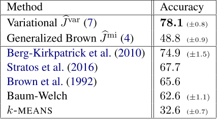

**1804.07849v4-Table2-1.png**

- Caption: Table 2: Ablation of the best model on Penn WSJ.
- Content type: table
- Figure type: N/A

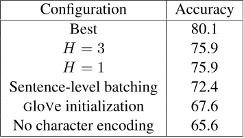

**1804.07849v4-Table3-1.png**

- Caption: Many-to-one accuracy on the 12-tag universal treebank dataset. We use the same setting in Table 1. All models use a fixed hyperparameter configuration optimized on the 45-tag Penn WSJ.
- Content type: table
- Figure type: table

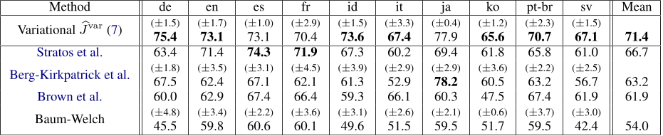

**1804.07849v4-Table4-1.png**

- Caption: Table 4: Comparison with the reported results with CRF autoencoders in many-to-one accuracy (M2O) and the V-measure (VM).
- Content type: table
- Figure type: N/A

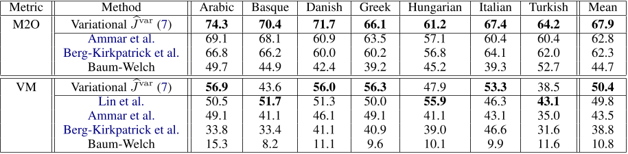

### QAs (5)
**QA 1**

- Question: Which method achieved the highest accuracy on the 45-tag Penn WSJ dataset, and how does its performance compare to the other methods?
- Answer: The Variational $\wh{J}^{\mathrm{var}}$ method achieved the highest accuracy of 78.1% on the 45-tag Penn WSJ dataset. This is significantly higher than all other methods listed in the table, with the next best performing method (Berg-Kirkpatrick et al., 2010) achieving an accuracy of 74.9%.
- Rationale: Table 1 shows the accuracy of different methods on the 45-tag Penn WSJ dataset. The caption clarifies that the table presents the average accuracy over 10 random restarts with the best hyperparameter configurations for each method. The standard deviation is also provided, allowing for an assessment of the methods' performance stability. By comparing the accuracy values in the table, we can determine that Variational $\wh{J}^{\mathrm{var}}$  outperforms all other methods, achieving the highest average accuracy with a relatively low standard deviation.
- References: 1804.07849v4-Table1-1.png

Referenced images:

**QA 2**

- Question: According to the ablation experiments, which factor contributes the most to the best model's performance compared to the baseline model?
- Answer: Morphological modeling with LSTMs contributes the most to the best model's performance compared to the baseline model.
- Rationale: The table shows that "No character encoding," which effectively removes the morphological modeling with LSTMs, results in the largest drop in accuracy (from 80.1% to 65.6%). This suggests that this feature is crucial for the model's performance. While other factors like context size and initialization also affect accuracy, their impact is smaller compared to the absence of morphological modeling.
- References: 1804.07849v4-Table2-1.png

Referenced images:

**QA 3**

- Question: Which method achieved the highest average V-measure (VM) across all languages, and how much higher was its average compared to the Baum-Welch method?
- Answer: The Variational $\wh{J}^{\mathrm{var}}$ method achieved the highest average VM score (50.4). Its average score is 39.6 points higher than the Baum-Welch method, which achieved an average VM score of 10.8.
- Rationale: The table shows the VM scores for different methods across various languages. By looking at the "Mean" column for the VM section, we can identify that Variational $\wh{J}^{\mathrm{var}}$ has the highest average score. The difference between the average scores of Variational $\wh{J}^{\mathrm{var}}$ and Baum-Welch can be calculated by simple subtraction (50.4 - 10.8 = 39.6).
- References: 1804.07849v4-Table4-1.png

Referenced images:

**QA 4**

- Question: Which method achieved the highest accuracy on the Italian language data set?
- Answer: Variational J^var (7)
- Rationale: The table shows the accuracy of different methods on different language data sets. The highest accuracy for the Italian data set is 77.4, which is achieved by the Variational J^var (7) method.
- References: 1804.07849v4-Table3-1.png

Referenced images:

**QA 5**

- Question: What is the role of the BiLSTM in the architecture?
- Answer: The BiLSTM takes as input the character-level representations of the words and outputs a word-level representation for each word.
- Rationale: The BiLSTM is shown at the bottom of the figure, taking as input the character-level representations of the words and outputting a word-level representation for each word.
- References: 1804.07849v4-Figure1-1.png

Referenced images:

---
## Paper: 1805.02349v2
Semantic Scholar ID: 1805.02349v2

### Figures/Tables (2)
**1805.02349v2-Figure1-1.png**

- Caption: A comparison of algorithms for recovery of the permutation in the correlated Erdös-Rényi model, when (G0,G1, π) ∼ Dstruct(n, p;γ).
- Content type: figure
- Figure type: table

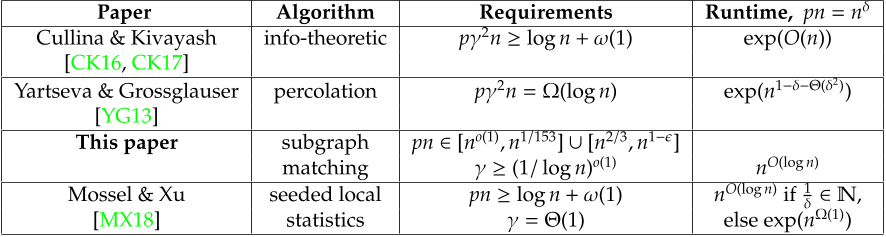

**1805.02349v2-Figure2-1.png**

- Caption: In this example, XH(G) = 2.
- Content type: figure
- Figure type: schematic

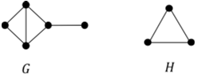

### QAs (1)
**QA 1**

- Question: Which algorithm has the fastest runtime?
- Answer: The algorithm proposed in this paper has the fastest runtime.
- Rationale: The table shows that the algorithm in this paper has a runtime of  while the other algorithms have runtimes of  or .
- References: 1805.02349v2-Figure1-1.png

Referenced images:

---
## Paper: 1805.06447v3
Semantic Scholar ID: 1805.06447v3

### Figures/Tables (13)
**1805.06447v3-Figure1-1.png**

- Caption: Figure 1. Illustration of the intuition of our ITN framework. ITN enhances the discriminator by generating additional pseudo-negative samples in the training step.
- Content type: figure
- Figure type: 

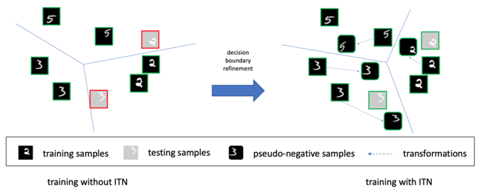

**1805.06447v3-Figure2-1.png**

- Caption: Images generated by ITN. Each row from top to bottom represents the images generated on MNIST, affNIST, SVHN and CIFAR-10.
- Content type: figure
- Figure type: photograph(s)

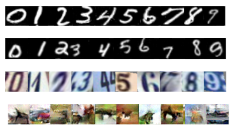

**1805.06447v3-Figure3-1.png**

- Caption: Figure 3. Testing errors of AC-GATN (B-CNN) and ITN (B-CNN) on the MNIST dataset.
- Content type: figure
- Figure type: photograph(s)

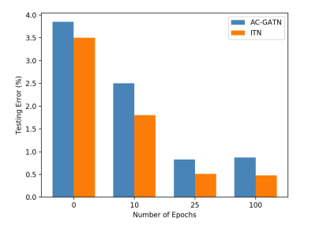

**1805.06447v3-Figure4-1.png**

- Caption: Figure 4. Samples generated by AC-GATN (B-CNN) and ITN (BCNN) on MNIST.
- Content type: figure
- Figure type: photograph(s)

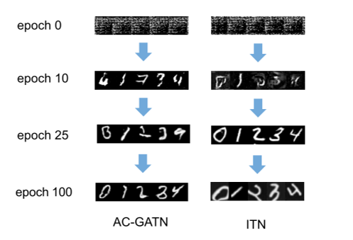

**1805.06447v3-Figure5-1.png**

- Caption: Figure 5. Samples generated by ITN with different thresholds Tu. The number below each sample represents the threshold.
- Content type: figure
- Figure type: photograph(s)

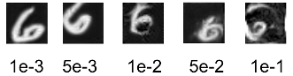

**1805.06447v3-Table1-1.png**

- Caption: Table 1. Testing errors of TMTA task.
- Content type: table
- Figure type: N/A

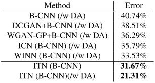

**1805.06447v3-Table2-1.png**

- Caption: Table 2. Testing errors of the classification results with limited training data, where 0.1% means the training data is randomly selected 0.1% of the MNIST training data while the testing data is the entire MNIST testing data.
- Content type: table
- Figure type: N/A

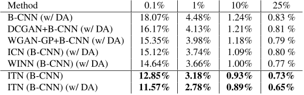

**1805.06447v3-Table3-1.png**

- Caption: Table 3. Testing errors of classification results under different testing data transformations. ITN-V1 represents ITN with DDT transformation function and ITN-V2 represents ITN with DDT and ST transformation functions together.
- Content type: table
- Figure type: N/A

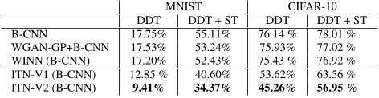

**1805.06447v3-Table4-1.png**

- Caption: Table 4. Testing errors on MNIST and affNIST, where /w DA represents the method is trained with standard data augmentation.
- Content type: table
- Figure type: N/A

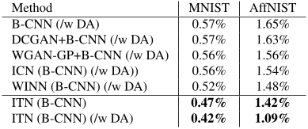

**1805.06447v3-Table5-1.png**

- Caption: Testing errors on SVHN and CIFAR-10.
- Content type: table
- Figure type: table

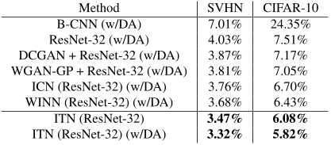

**1805.06447v3-Table6-1.png**

- Caption: Testing errors on the miniImageNet dataset.
- Content type: table
- Figure type: table

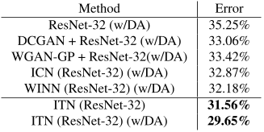

**1805.06447v3-Table7-1.png**

- Caption: Table 7. Testing errors of ITN (B-CNN) with various thresholds on MNIST.
- Content type: table
- Figure type: N/A

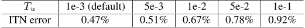

**1805.06447v3-Table8-1.png**

- Caption: Testing errors of ITN and ITN-NG on MNIST, affNIST, and TMTA task, where ITN-NG is the version of ITN without generating pseudo-negative samples.
- Content type: table
- Figure type: table

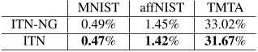

### QAs (11)
**QA 1**

- Question: How does the performance of ITN-V2 compare to other methods when both DDT and ST transformations are applied to the CIFAR-10 dataset?
- Answer: ITN-V2 achieves the lowest testing error (56.95%) among all methods listed when both DDT and ST transformations are applied to the CIFAR-10 dataset.
- Rationale: The table shows the testing errors of different methods on both MNIST and CIFAR-10 datasets, with and without DDT and ST transformations. Looking at the "CIFAR-10" column with "DDT + ST" header, we can compare the error rates of all methods under these specific transformations. ITN-V2 shows the lowest error rate, indicating the best performance in resisting both DDT and ST variations among the listed methods.
- References: 1805.06447v3-Table3-1.png

Referenced images:

**QA 2**

- Question: Which method performs the best when trained with only 1% of the MNIST training data, and how much does data augmentation improve its performance in this scenario?
- Answer: When trained with only 1% of the MNIST training data, ITN (B-CNN) (w/ DA) performs the best with a testing error of 2.78%. Data augmentation further improves its performance by 0.4%, bringing the testing error down to 2.78% from 3.18% achieved by ITN (B-CNN) without data augmentation.
- Rationale: The table presents the testing errors of different methods under various training data limitations. By looking at the row corresponding to 1% and comparing the values across different methods, we can identify the best performing model. The difference in testing error between ITN (B-CNN) with and without data augmentation (w/ DA) indicates the improvement achieved through data augmentation.
- References: 1805.06447v3-Table2-1.png

Referenced images:

**QA 3**

- Question: How does the ITN framework generate pseudo-negative samples?
- Answer: The ITN framework generates pseudo-negative samples by applying learned transformations to positive samples.
- Rationale: The figure shows that the ITN framework consists of a transformation module and a CNN classifier. The transformation module learns to transform positive samples in a way that maximizes their variation from the original training samples. These transformed positive samples are then used as pseudo-negative samples to train the CNN classifier.

**Figure type:** Schematic
- References: 1805.06447v3-Figure1-1.png

Referenced images:

**QA 4**

- Question: Which method performs best on the CIFAR-10 dataset?
- Answer: ITN (ResNet-32) with data augmentation performs best on the CIFAR-10 dataset with a testing error of 5.82%.
- Rationale: The table shows the testing errors for different methods on the SVHN and CIFAR-10 datasets. We can see that ITN (ResNet-32) with data augmentation has the lowest testing error for the CIFAR-10 dataset.
- References: 1805.06447v3-Table5-1.png

Referenced images:

**QA 5**

- Question: Which method achieved the lowest testing error on the miniImageNet dataset?
- Answer: ITTN (ResNet-32) (w/ DA) achieved the lowest testing error on the miniImageNet dataset with an error rate of 29.65%.
- Rationale: The table shows the testing errors of different methods on the miniImageNet dataset. The method with the lowest error rate is ITTN (ResNet-32) (w/ DA).
- References: 1805.06447v3-Table6-1.png

Referenced images:

**QA 6**

- Question: Which generative model generates more accurate and realistic samples on the MNIST dataset, AC-GATN or ITN?
- Answer: ITN generates more accurate and realistic samples on the MNIST dataset compared to AC-GATN.
- Rationale: Figure 2 shows the samples generated by AC-GATN and ITN on the MNIST dataset at different epochs. As the training progresses, the samples generated by ITN become increasingly clear and accurate, while some samples generated by AC-GATN remain misleading and inaccurate, even at epoch 100. This suggests that ITN is a better choice for generating realistic and accurate samples on the MNIST dataset.
- References: 1805.06447v3-Figure4-1.png

Referenced images:

**QA 7**

- Question: How does the quality of the generated samples change as the update threshold increases?
- Answer: The quality of the generated samples decreases as the update threshold increases.
- Rationale: Figure 5 shows samples generated by ITN with different update thresholds. The number below each sample represents the threshold. As the threshold increases, the samples become increasingly blurry and difficult to recognize.
- References: 1805.06447v3-Figure5-1.png

Referenced images:

**QA 8**

- Question: Describe the relationship between the update threshold (Tu) and the performance of ITN (B-CNN) on the MNIST dataset.
- Answer: The performance of ITN (B-CNN) on the MNIST dataset decreases as the update threshold (Tu) increases. This is evident from the increasing ITN error percentages as Tu goes from 1e-3 to 1e-1.
- Rationale: Table 1 explicitly shows the ITN error for various Tu values. As we move down the table, Tu increases, and correspondingly, the ITN error also increases. This trend indicates an inverse relationship between Tu and the performance of ITN. The passage further explains that this performance drop is due to the decrease in the quality of generated samples when the threshold is increased.
- References: 1805.06447v3-Table7-1.png

Referenced images:

**QA 9**

- Question: Which method has the lower testing error on the MNIST task?
- Answer: ITN
- Rationale: The table shows that ITN has a testing error of 0.47% on the MNIST task, while ITN-NG has a testing error of 0.49%.
- References: 1805.06447v3-Table8-1.png

Referenced images:

**QA 10**

- Question: Which generative model generates more accurate and realistic samples on the MNIST dataset, AC-GATN or ITN?
- Answer: ITN generates more accurate and realistic samples on the MNIST dataset compared to AC-GATN.
- Rationale: Figure 2 shows the samples generated by AC-GATN and ITN on the MNIST dataset at different epochs. As the training progresses, the samples generated by ITN become increasingly clear and accurate, while some samples generated by AC-GATN remain misleading and inaccurate, even at epoch 100. This suggests that ITN is a better choice for generating realistic and accurate samples on the MNIST dataset.
- References: 1805.06447v3-Figure3-1.png

Referenced images:

**QA 11**

- Question: Which method performs best on the TMTA task and how much does data augmentation contribute to its performance?
- Answer: The ITN (B-CNN) method with data augmentation (DA) performs best on the TMTA task, achieving a testing error of 21.31%. Data augmentation contributes significantly to its performance, as the ITN (B-CNN) method without DA has a higher testing error of 31.67%.
- Rationale: Table 1 presents the testing errors of different methods on the TMTA task. The method with the lowest error rate is considered the best performing. We can see that ITN (B-CNN) with DA has the lowest error rate (21.31%) among all methods. Additionally, comparing the performance of ITN (B-CNN) with and without DA reveals a substantial improvement in error rate when DA is used, indicating its significant contribution to the performance.
- References: 1805.06447v3-Table1-1.png

Referenced images:

---
## Paper: 1809.00263v5
Semantic Scholar ID: 1809.00263v5

### Figures/Tables (18)
**1809.00263v5-Figure1-1.png**

- Caption: Figure 1: Difference between video interpolation and video infilling. Camera 1 captures frames 1 to 19. Video interpolation aims to generate 5 frames between frame 7 and 8. A low frame rate camera 2 only captures frame 1, 7, 13 and 19. Video infilling focuses on generating a plausible intermediate dynamic sequence for camera 2 (a plausible sequence can be different from the frames 8 to 12).
- Content type: figure
- Figure type: schematic

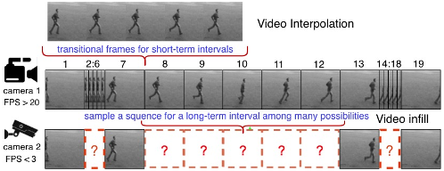

**1809.00263v5-Figure10-1.png**

- Caption: The arm in the best sequence follows the same movements in ground truth: first upward left then downward left. In another sampled sequence, the arm firstly goes straight up and then straight left, finally downward left.
- Content type: figure
- Figure type: photograph(s)

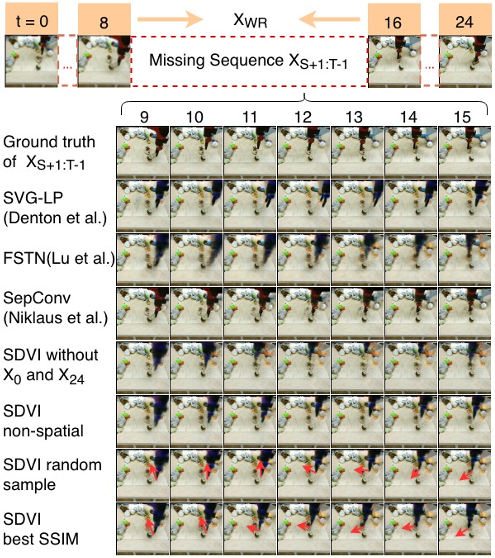

**1809.00263v5-Figure11-1.png**

- Caption: Figure 11: Best view in color. See Appendix E in the supplemental material for more comparisons on UCF101.
- Content type: figure
- Figure type: ** photograph(s)

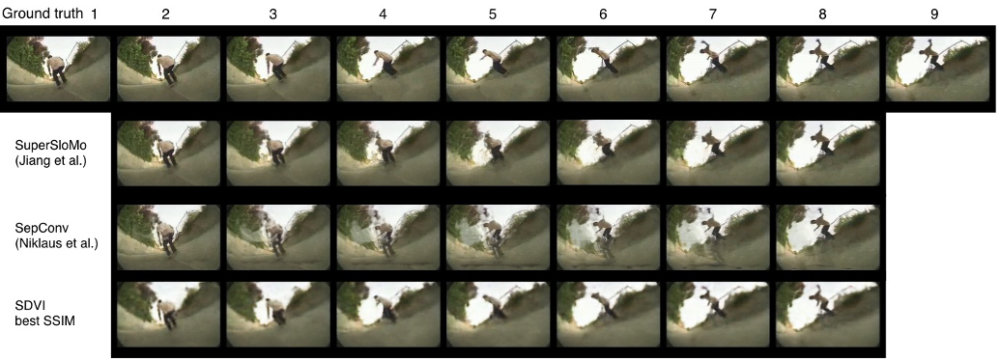

**1809.00263v5-Figure12-1.png**

- Caption: Our best-sampled sequence keeps the arm straight. In a randomly sampled sequence, the forearm bends first then stretches straight in the end.
- Content type: figure
- Figure type: photograph(s)

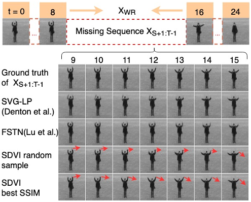

**1809.00263v5-Figure13-1.png**

- Caption: The sliding tendency of SepConv will cause motion errors and high LMS.
- Content type: figure
- Figure type: photograph(s)

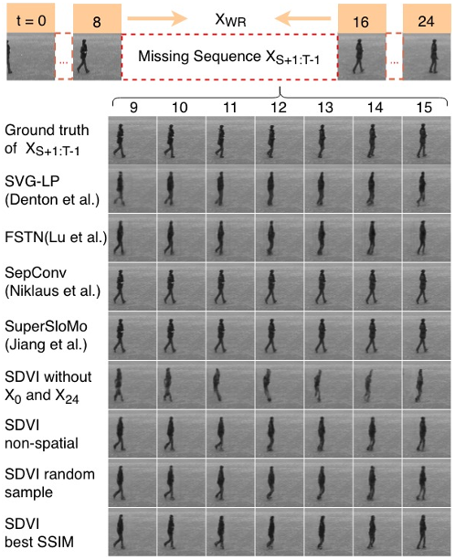

**1809.00263v5-Figure14-1.png**

- Caption: shows the full comparisons for he wave action.
- Content type: figure
- Figure type: photograph(s)

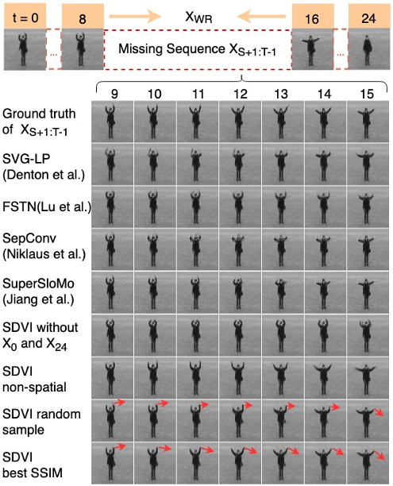

**1809.00263v5-Figure15-1.png**

- Caption: a snapshot of the gifs in the “video result.html”
- Content type: figure
- Figure type: photograph(s)

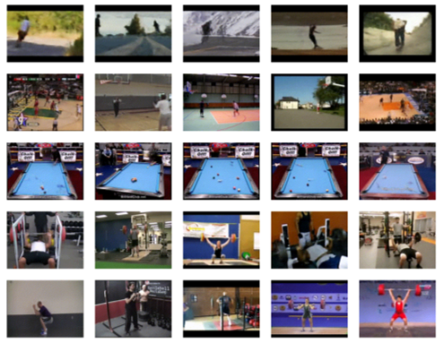

**1809.00263v5-Figure16-1.png**

- Caption: A more complicated UCF101 example: a real basketball video sequence involving multiple objects. Our method can model the dynamic correctly and generate better moving objects than SuperSloMo and SepConv.
- Content type: figure
- Figure type: photograph(s)

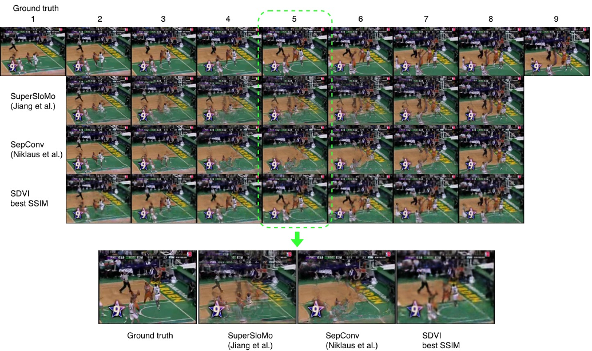

**1809.00263v5-Figure2-1.png**

- Caption: Figure 2: The difference of the randomness between shortterm and long-term intervals: The camera in scenario 1 can capture every other frame and the camera in scenario 2 captures 1 frame for every 4 frames. The red and the green trajectories indicate two possible motions in each scenario.
- Content type: figure
- Figure type: schematic

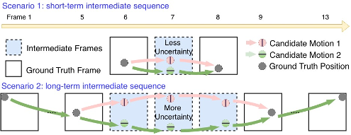

**1809.00263v5-Figure3-1.png**

- Caption: Training of SDVI: All Encoder (green) share the same weights. The blue and the yellow network are Extractor and Decoder. Reference module creates dynamic constraint ĥt at each step. At step t, Inference module takes Xt−1 and ĥt, while Posterior module takes Xt. Inference module and Posterior module will produce different zt and therefore different output frames X̃infr
- Content type: figure
- Figure type: schematic

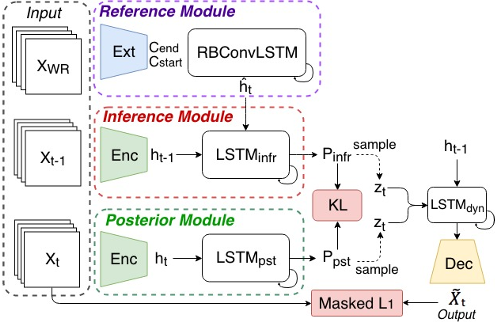

**1809.00263v5-Figure4-1.png**

- Caption: Figure 4: A two layers RBConvLSTM: The initial cell states of the first layer are assigned as Cstart and Cend. hS and hT are taken as inputs. Combined with the residuals (red arrows), each layer’s outputs (yellow arrows) would go through a convolution module and become the inputs (green arrows) to the next layer.
- Content type: figure
- Figure type: schematic

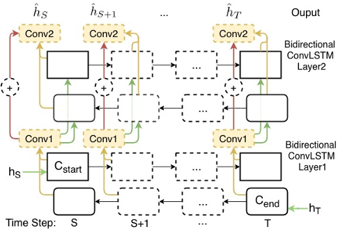

**1809.00263v5-Figure5-1.png**

- Caption: Inference of SDVI: Without ground truth frame Xt−1, the generated frame X̃t−1 serves as the input to Inference module on step t.
- Content type: figure
- Figure type: ** Schematic

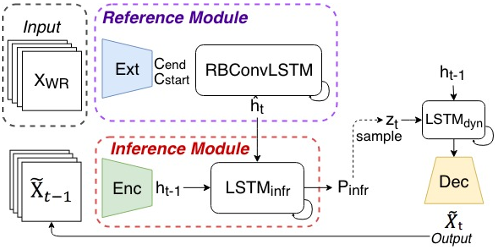

**1809.00263v5-Figure6-1.png**

- Caption: The sampled vector (in the middle) is applied on all locations.
- Content type: figure
- Figure type: schematic

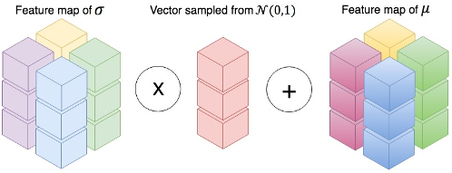

**1809.00263v5-Figure7-1.png**

- Caption: Average PSNR and SSIM at each step in test sets.
- Content type: figure
- Figure type: plot

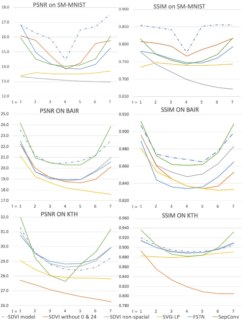

**1809.00263v5-Figure9-1.png**

- Caption: SDVI generates higher variances coincident to the ”wall bouncing” event, indicated by the two dash lines(e.g. first sequence: red lines mark the bounces of the digit 6 and blue ones mark the bounces of 7).
- Content type: figure
- Figure type: plot

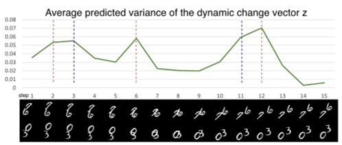

**1809.00263v5-Table1-1.png**

- Caption: Table 1: Metrics averaging over all 7 intermediate frames. We report the scores of the best-sampled sequences for SDVI.
- Content type: table
- Figure type: N/A

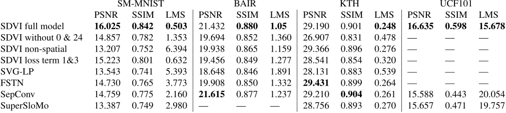

**1809.00263v5-Table2-1.png**

- Caption: The dimensionalities of different features
- Content type: table
- Figure type: table

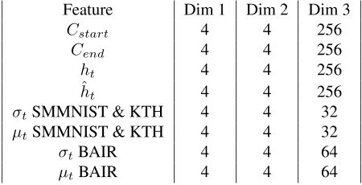

**1809.00263v5-Table3-1.png**

- Caption: Hyper parameters for training on different datasets
- Content type: table
- Figure type: table

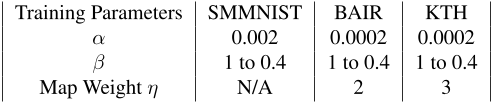

### QAs (9)
**QA 1**

- Question: What is the value of the learning rate α for the BAIR dataset?
- Answer: 0.0002
- Rationale: The table shows the values of the hyperparameters for training on different datasets. The value of α for the BAIR dataset is listed as 0.0002.
- References: 1809.00263v5-Table3-1.png

Referenced images:

**QA 2**

- Question: Which feature has the highest dimensionality in the first two dimensions?
- Answer: All features have the same dimensionality in the first two dimensions.
- Rationale: The table shows that all features have a dimensionality of 4 in both the first and second dimensions.
- References: 1809.00263v5-Table2-1.png

Referenced images:

**QA 3**

- Question: What is the relationship between the length of the interval and the uncertainty in the generated frames?
- Answer: The uncertainty in the generated frames increases with the length of the interval.
- Rationale: The figure shows two scenarios: one with a short-term interval and one with a long-term interval. In the short-term interval scenario, the camera captures every other frame, resulting in less uncertainty in the generated frames. In the long-term interval scenario, the camera captures 1 frame for every 4 frames, resulting in more uncertainty in the generated frames.
- References: 1809.00263v5-Figure2-1.png

Referenced images:

**QA 4**

- Question: Explain the likely reason why the "SDVI loss term 1&3" model performs worse than the full SDVI model in terms of PSNR and SSIM across all datasets.
- Answer: The "SDVI loss term 1&3" model only uses the pixel reconstruction loss and the inclusive KL divergence loss, while the full SDVI model additionally incorporates the pixel prediction loss and the exclusive KL divergence loss. According to the passage, the exclusive KL divergence term encourages the inference distribution to be more accurate, while the pixel prediction loss further improves video quality during inference. Therefore, the absence of these terms in the "SDVI loss term 1&3" model likely explains its inferior performance compared to the full SDVI model.
- Rationale: Table 1 shows that the full SDVI model consistently achieves higher PSNR and SSIM values than the "SDVI loss term 1\&3" model across all datasets. This observation suggests that the additional loss terms in the full model contribute to improved reconstruction quality and video quality during inference. The passage provides the theoretical justification for including these additional terms, specifically highlighting their roles in promoting accuracy and diversity in the inference distribution and enhancing video quality. By comparing the performance of the two models and referencing the detailed explanation of the loss function in the passage, we can understand how the different loss terms contribute to the overall performance of the SDVI model.
- References: 1809.00263v5-Table1-1.png

Referenced images:

**QA 5**

- Question: What is the difference between the Inference module and the Posterior module?
- Answer: The Inference module takes the previous frame (Xt-1) and the dynamic constraint (ĥt) as input, while the Posterior module takes the current frame (Xt) as input. This means that the Inference module is trying to predict the next frame based on the previous frame and the dynamic constraint, while the Posterior module is trying to reconstruct the current frame.
- Rationale: The figure shows that the Inference module and the Posterior module have different inputs. The Inference module takes Xt-1 and ĥt as input, while the Posterior module takes Xt as input.
- References: 1809.00263v5-Figure3-1.png

Referenced images:

**QA 6**

- Question: Which method generates the best moving objects?
- Answer: SDVI
- Rationale: The SDVI method is able to model the dynamic of the basketball video sequence correctly and generate better moving objects than SuperSloMo and SepConv. This can be seen in the figure, where the SDVI method is able to generate more realistic and accurate moving objects than the other two methods.
- References: 1809.00263v5-Figure16-1.png

Referenced images:

**QA 7**

- Question: What is the effect of the sliding tendency of SepConv on the generated images?
- Answer: The sliding tendency of SepConv will cause motion errors and high LMS.
- Rationale: The figure shows the ground truth of the missing sequence and the generated images by different methods. The generated images by SepConv have a sliding tendency, which causes the person in the images to appear to be moving faster than they actually are. This is evident in the high LMS values for SepConv.
- References: 1809.00263v5-Figure13-1.png

Referenced images:

**QA 8**

- Question: What is the role of the residual connections in the RBConvLSTM network?
- Answer: The residual connections add the output of the previous layer to the input of the next layer. This helps to improve the flow of information through the network and can help to prevent vanishing gradients.
- Rationale: The figure shows that the outputs of each layer (yellow arrows) are added to the inputs of the next layer (green arrows). This is indicated by the red arrows, which represent the residual connections.
- References: 1809.00263v5-Figure4-1.png

Referenced images:

**QA 9**

- Question: What is the relationship between the feature maps of $\sigma$ and $\mu$ and the sampled vector?
- Answer: The sampled vector is element-wise multiplied by the feature map of $\sigma$ and added to the feature map of $\mu$.
- Rationale: The figure shows the feature maps of $\sigma$ and $\mu$ on the left and right, respectively. The sampled vector is shown in the middle. The "$\times$" and "$+$" symbols indicate that the sampled vector is multiplied and added to the feature maps, respectively.
- References: 1809.00263v5-Figure6-1.png

Referenced images:

---
## Paper: 1809.02731v3
Semantic Scholar ID: 1809.02731v3

### Figures/Tables (5)
**1809.02731v3-Table1-1.png**

- Caption: Summary statistics of the two corpora used. For simplicity, the two corpora are referred to as B and U in the following tables respectively.
- Content type: table
- Figure type: table

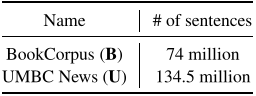

**1809.02731v3-Table2-1.png**

- Caption: The effect of the invertible constraint on the linear projection. The arrow and its associated value of a representation is the relative performance gain or loss compared to its comparison partner with the invertible constraint. As shown, the invertible constraint does help improve each representation, an ensures the ensemble of two encoding functions gives better performance. Better view in colour.
- Content type: table
- Figure type: table

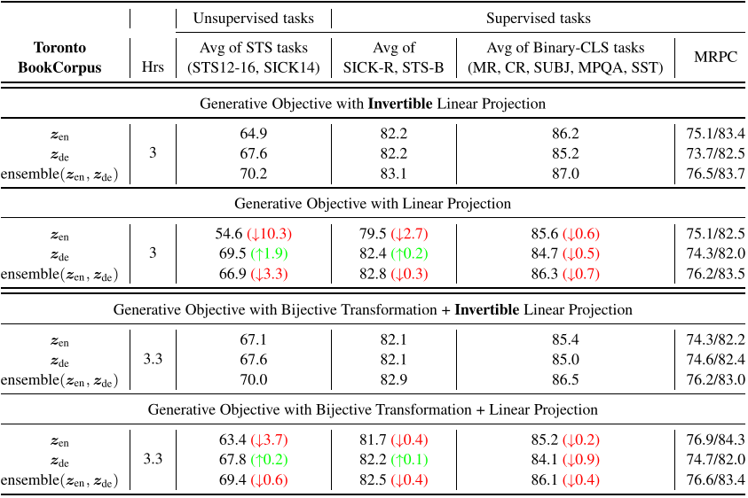

**1809.02731v3-Table3-1.png**

- Caption: Results on unsupervised evaluation tasks (Pearson’s r × 100) . Bold numbers are the best results among unsupervised transfer models, and underlined numbers are the best ones among all models. ‘WR’ refers to
- Content type: table
- Figure type: table

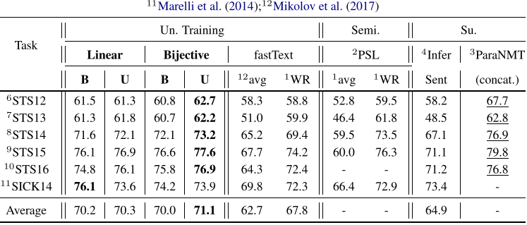

**1809.02731v3-Table4-1.png**

- Caption: Comparison of the learnt representations in our system with the same dimensionality as pretrained word vectors on unsupervised evaluation tasks. The encoding function that is learnt to compose a sentence representation from pretrained word vectors outperforms averaging word vectors, which supports our argument that learning helps to produce higher-quality sentence representations.
- Content type: table
- Figure type: table

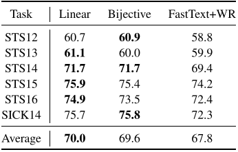

**1809.02731v3-Table5-1.png**

- Caption: Results on supervised evaluation tasks. Bold numbers are the best results among unsupervised transfer models with ordered sentences, and underlined numbers are the best ones among all models.
- Content type: table
- Figure type: table

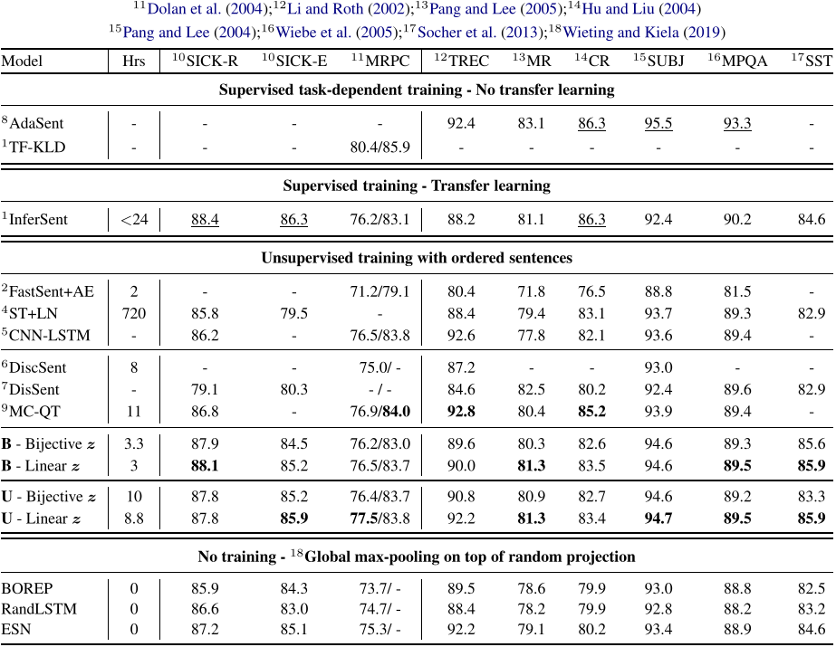

### QAs (3)
**QA 1**

- Question: Which model performed best on average across all tasks?
- Answer: The Linear model performed best on average with a score of 70.0.
- Rationale: The table shows the performance of three models on seven different tasks. The average performance is shown in the last row of the table.
- References: 1809.02731v3-Table4-1.png

Referenced images:

**QA 2**

- Question: Which corpus has more sentences, and by how much?
- Answer: The UMBC News corpus has more sentences, by approximately 60.5 million.
- Rationale: The table shows that the BookCorpus has 74 million sentences, while the UMBC News corpus has 134.5 million sentences.
- References: 1809.02731v3-Table1-1.png

Referenced images:

**QA 3**

- Question: Which model performs the best on the STS16 task with unsupervised training?
- Answer: The Bijective model performs the best on the STS16 task with unsupervised training.
- Rationale: The table shows the performance of different models on the STS16 task with unsupervised training. The Bijective model has the highest score of 75.8, which indicates that it performs the best.
- References: 1809.02731v3-Table3-1.png

Referenced images:

---
## Paper: 1809.04276v2
Semantic Scholar ID: 1809.04276v2

### Figures/Tables (7)
**1809.04276v2-Figure1-1.png**

- Caption: Figure 1: An overview of our proposed approach. The discriminator is enhanced by the N-best response candidates returned by a retrieval-based method. The discriminator takes as input a response and outputs the probability that the response is human-generated. The output is then regarded as a reward to guide the generator.
- Content type: figure
- Figure type: schematic

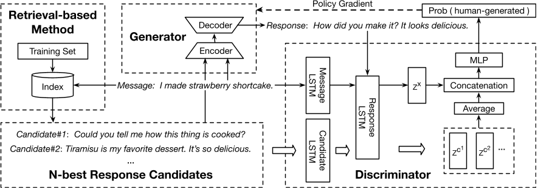

**1809.04276v2-Figure2-1.png**

- Caption: Figure 2: An example of a test message (MSG), candidates (C#1 and C#2), and responses from different models. The last column are their translations.
- Content type: figure
- Figure type: table

**1809.04276v2-Table1-1.png**

- Caption: Table 1: An example of a message (MSG), a groundtruth response (GT), a generated response (RSP) and N-best response candidates (C#1 and C#2) during the training process. Similar contents in the response and candidates are in boldface.
- Content type: table
- Figure type: N/A

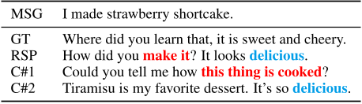

**1809.04276v2-Table2-1.png**

- Caption: Table 2: Some statistics of the datasets.
- Content type: table
- Figure type: N/A

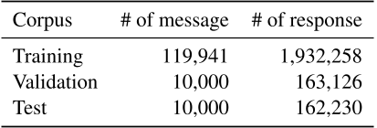

**1809.04276v2-Table3-1.png**

- Caption: Table 3: Human evaluation results of mean score, proportions of three levels (+2, +1, and 0), and the agreements measured by Fleiss’s Kappa in appropriateness, informativeness, and grammaticality.
- Content type: table
- Figure type: N/A

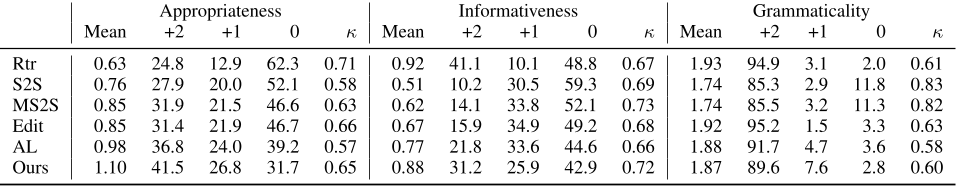

**1809.04276v2-Table4-1.png**

- Caption: Table 4: Classification accuracy of discriminators in AL and our approach.
- Content type: table
- Figure type: N/A

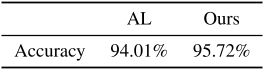

**1809.04276v2-Table5-1.png**

- Caption: Table 5: Automatic evaluation results of the number of distinct uni-grams (# of UNI) and bi-grams (# of BI), Dist-1, Dist-2 and Originality (Origin). D+ and G+ are two variants of our approach where candidates are only available for the discriminator and the generator, respectively.
- Content type: table
- Figure type: N/A

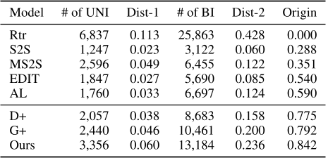

### QAs (4)
**QA 1**

- Question: Why is the model discouraged even though the generated response (RSP) incorporates relevant content from the N-best response candidates (C#1 and C#2)?
- Answer: The model is discouraged because it is trained using the Maximum Likelihood Estimation (MLE) objective, which prioritizes generating responses that are identical to the ground-truth (GT) response. Even though the RSP integrates relevant content from the candidates and seems appropriate in the context, it is penalized because it deviates from the exact wording of the GT.
- Rationale: Table 1 showcases the training process of a Seq2Seq model with N-best response candidates. The highlighted portions in the RSP, C#1, and C#2 indicate similar content. While the RSP successfully incorporates these relevant aspects, it still differs from the GT. This difference leads to the model being discouraged under the MLE objective, which solely focuses on matching the GT response and doesn't account for the semantic similarity or appropriateness of the generated response.
- References: 1809.04276v2-Table1-1.png

Referenced images:

**QA 2**

- Question: How does the performance of the discriminator in the proposed approach compare to the conventional discriminator in AL? What evidence suggests this difference in performance?
- Answer: The discriminator in the author's approach achieves higher accuracy (95.72%) compared to the conventional discriminator in AL (94.01%).
- Rationale: Table 1 explicitly shows the classification accuracy for both discriminators. The higher accuracy of the author's discriminator indicates its better ability to distinguish between human-generated and machine-generated responses. This supports the claim in the passage that the N-best response candidates used in the author's approach are helpful for the discriminator.
- References: 1809.04276v2-Table4-1.png

Referenced images:

**QA 3**

- Question: Can you explain the discrepancy between the number of messages and responses in each dataset?
- Answer: Number of responses is significantly higher than number of messages in each dataset (training, validation, and test). This is because each message can have multiple responses associated with it. The passage mentions that users on Sina Weibo can post messages and also comment on other users' messages. These comments are considered as responses in the context of the table. Therefore, one message can have several responses, leading to a higher total number of responses compared to messages.
- Rationale: The table presents the number of messages and their corresponding responses separately. By comparing these numbers, we can understand that the data includes messages with multiple associated responses, which is further supported by the information provided in the passage about the nature of user interactions on Sina Weibo.
- References: 1809.04276v2-Table2-1.png

Referenced images:

**QA 4**

- Question: How does the discriminator in the proposed REAT approach use the N-best response candidates?
- Answer: The discriminator takes as input a response and the N-best response candidates, and outputs the probability that the response is human-generated.
- Rationale: The figure shows that the discriminator receives both the response and the N-best response candidates as input. The passage explains that the candidates are provided as references to help the discriminator better distinguish between human-generated and machine-generated responses.
- References: 1809.04276v2-Figure1-1.png

Referenced images:

---
## Paper: 1811.07073v3
Semantic Scholar ID: 1811.07073v3

### Figures/Tables (9)
**1811.07073v3-Figure1-1.png**

- Caption: Figure 1: An overview of our segmentation framework consisting of three models: i) Primary segmentation model generates a semantic segmentation of objects given an image. This is the main model that is subject to the training and is used at test time. ii) Ancillary segmentation model outputs a segmentation given an image and bounding box. This model generates an initial segmentation for the weak set, which will aid training the primary model. iii) Self-correction module refines segmentations generated by the ancillary model and the current primary model for the weak set. The primary model is trained using the cross-entropy loss that matches its output to either ground-truth segmentation labels for the fully supervised examples or soft refined labels generated by the self-correction module for the weak set.
- Content type: figure
- Figure type: schematic

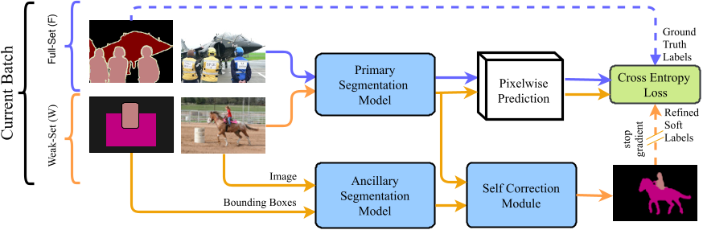

**1811.07073v3-Figure2-1.png**

- Caption: Figure 2: An overview of the ancillary segmentation model. We modify an existing encoder-decoder segmentation model by introducing a bounding box encoder that embeds the box information. The output of the bounding box encoder after passing through a sigmoid activation acts as an attention map. Feature maps at different scales from the encoder are fused (using element-wise-multiplication) with attention maps, then passed to the decoder.
- Content type: figure
- Figure type: schematic

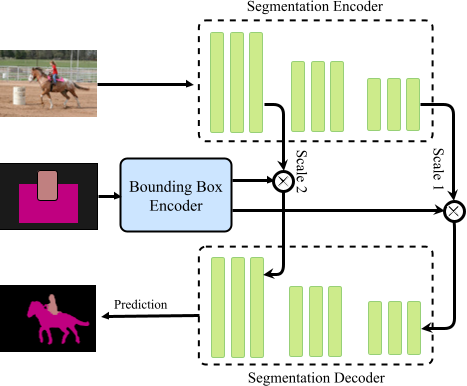

**1811.07073v3-Figure3-1.png**

- Caption: Figure 3: Convolutional self-correction model learns refining the input label distributions. The subnetwork receives logits from the primary and ancillary models, then concatenates and feeds the output to a two-layer CNN.
- Content type: figure
- Figure type: schematic

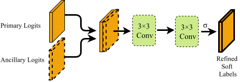

**1811.07073v3-Figure4-1.png**

- Caption: Qualitative results on the PASCAL VOC 2012 validation set. The last four columns represent the models in column 1464 of Table 1. The Conv. Self-correction model typically segments objects better than other models.
- Content type: figure
- Figure type: photograph(s)

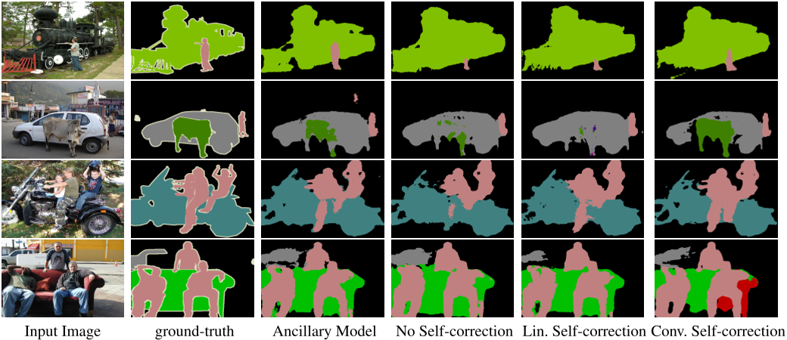

**1811.07073v3-Figure5-1.png**

- Caption: Qualitative results on the PASCAL VOC 2012 auxiliary (the weak set). The heatmap of a single class for the ancillary model is shown for several examples. The ancillary model can successfully correct the labels for missing or oversegmented objects in these images (marked by ellipses).
- Content type: figure
- Figure type: photograph(s)

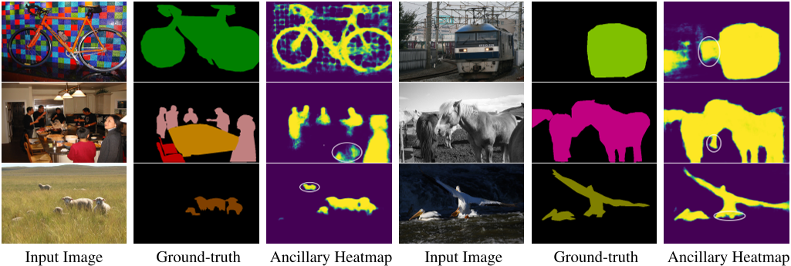

**1811.07073v3-Table1-1.png**

- Caption: Table 1: Ablation study of models on the PASCAL VOC 2012 validation set using mIOU for different sizes of F . For the last three rows, the remaining images in the training set is used as W , i.e. W + F = 10582.
- Content type: table
- Figure type: N/A

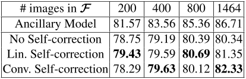

**1811.07073v3-Table2-1.png**

- Caption: Table 2: Results on PASCAL VOC 2012 validation and test sets. The last three rows report the performance of previous semi-supervised models with the same annotation.
- Content type: table
- Figure type: N/A

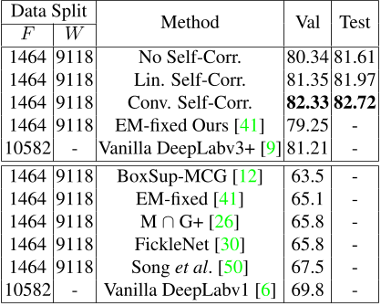

**1811.07073v3-Table3-1.png**

- Caption: Table 3: Ablation study of our models on Cityscapes validation set using mIOU for different sizes of F . For the last three rows, the remaining images in the training set are used as W , i.e., W + F = 2975.
- Content type: table
- Figure type: N/A

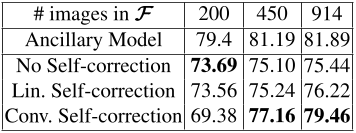

**1811.07073v3-Table4-1.png**

- Caption: Table 4: Results on Cityscapes validation set. 30% of the training examples is used as F , and the remaining as W .
- Content type: table
- Figure type: N/A

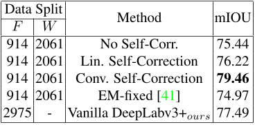

### QAs (7)
**QA 1**

- Question: How does the performance of the model with convolutional self-correction compare to the model with no self-correction as the number of images in set $\mathcal{F}$ increases?
- Answer: The model with convolutional self-correction consistently outperforms the model with no self-correction as the number of images in set $\mathcal{F}$ increases.
- Rationale: Looking at the last three rows of Table 1, we can compare the mIOU scores for different self-correction methods. For each value of images in $\mathcal{F}$ (200, 450, and 914), the convolutional self-correction model achieves a higher mIOU score than the model with no self-correction. This trend indicates that convolutional self-correction leads to better performance, especially as the size of set $\mathcal{F}$ increases. Additionally, the passage mentions that the same conclusions observed on the PASCAL dataset hold for the Cityscapes dataset, implying that the efficacy of self-correction is consistent across datasets.
- References: 1811.07073v3-Table3-1.png

Referenced images:

**QA 2**

- Question: Which method performed the best on the PASCAL VOC 2012 test set and how does it compare to the baseline model without self-correction?
- Answer: The Conv. Self-Corr. method achieved the highest performance on the PASCAL VOC 2012 test set with a score of 82.72. This is approximately 1.11 points higher than the baseline model ("No Self-Corr.") which achieved a score of 81.61.
- Rationale: The table shows the performance of different methods on the PASCAL VOC 2012 validation and test sets. The "Test" column provides the scores for the test set. By comparing the values in this column, we can identify the best performing method. The difference between the "Conv. Self-Corr." and "No Self-Corr." scores demonstrates the improvement gained by using the convolutional self-correction approach.
- References: 1811.07073v3-Table2-1.png

Referenced images:

**QA 3**

- Question: What is the input to the convolutional self-correction model?
- Answer: The input to the convolutional self-correction model is the logits generated by the primary and ancillary models.
- Rationale: The figure shows that the primary and ancillary logits are fed into the convolutional self-correction model.
- References: 1811.07073v3-Figure3-1.png

Referenced images:

**QA 4**

- Question: How does the performance of the "Conv. Self-Correction" method compare to other methods when using 30% of the training examples as $\F$ and the remaining as $\W$ on the Cityscapes validation set?
- Answer: The "Conv. Self-Correction" method achieves the highest mIOU score of 79.46 compared to other methods listed in the table under the same data split condition.
- Rationale: Table 1 presents the mIOU scores for various methods under different data split scenarios. When focusing on the rows where $F=914$ and $W=2061$ (representing the 30% split), we can directly compare the mIOU scores of all listed methods. The "Conv. Self-Correction" method clearly shows the highest score, indicating its superior performance in this specific setting.
- References: 1811.07073v3-Table4-1.png

Referenced images:

**QA 5**

- Question: How does the bounding box encoder network influence the segmentation process?
- Answer: The bounding box encoder network embeds bounding box information at different scales and outputs attention maps that are used to fuse with feature maps from the encoder before being passed to the decoder.
- Rationale: The figure shows the bounding box encoder network as a separate branch that receives the bounding box information as input. The output of this network is then used to modify the feature maps from the encoder before they are passed to the decoder.
- References: 1811.07073v3-Figure2-1.png

Referenced images:

**QA 6**

- Question: What is the role of the self-correction module in the segmentation framework?
- Answer: The self-correction module refines the segmentations generated by the ancillary and current primary model for the weak set.
- Rationale: The figure shows that the self-correction module takes as input the segmentations from the ancillary and primary models for the weak set and outputs refined soft labels. These refined labels are then used to train the primary model.
- References: 1811.07073v3-Figure1-1.png

Referenced images:

**QA 7**

- Question: What is the purpose of the ancillary heatmap shown in this paper?
- Answer: The ancillary heatmap is used to correct the labels for missing or oversegmented objects in the images.
- Rationale: The heatmap shows the areas of the image that the ancillary model predicts to belong to a particular class. The areas marked by ellipses are examples of where the ancillary model is able to correct the labels for missing or oversegmented objects.
- References: 1811.07073v3-Figure5-1.png

Referenced images:

---
## Paper: 1811.10673v1
Semantic Scholar ID: 1811.10673v1

### Figures/Tables (11)
**1811.10673v1-Figure10-1.png**

- Caption: Figure 10: Example of lower VQA scores on videos compressed by our model than those compressed using H.264, despite the apparent better subjective quality produced by our model. VQA scores taken above 7 frames are depicted at the right side (please see this video).
- Content type: figure
- Figure type: photograph(s)

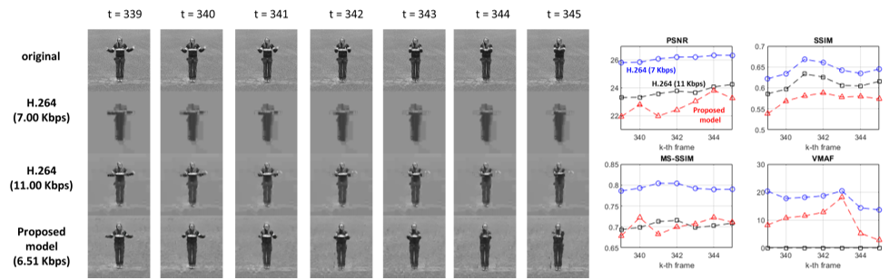

**1811.10673v1-Figure2-1.png**

- Caption: Figure 2: Proposed framework for adversarial video compression. Note that X consists of only one video to be compressed. The video X is partitioned into two sets containing different types of frames: XI and XG. XI is lightly compressed into xI using the standard H.264 encoder, while XG is highly compressed into xG, that contains only soft edge information at low resolution. The XI are used to train a generative model that we call the second-stage decoder D2. This generative model is trained at the receiver using x′I and X ′I using a discriminator DD. After training, D2 takes soft edges xG as input and produces reconstructed frames (see also Figure 6). Only xI and xG are required to reconstruct the decompressed video.
- Content type: figure
- Figure type: schematic

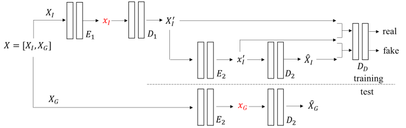

**1811.10673v1-Figure3-1.png**

- Caption: Figure 3: Overview of the second encoding stage (E2).
- Content type: figure
- Figure type: schematic

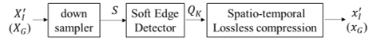

**1811.10673v1-Figure4-1.png**

- Caption: Figure 4: Outputs of soft edge detector. (a) The left-most frame is a 64 × 64 downsampled frame S(1) from a reconstructed frame XI (1)′ of one video [1]. The right four frames are outputs of the soft edge detector for different levels of quantization k (Qk). (b) Grayscale histograms of Qk. (c) Three dimensional scatter plots (normalized R/G/B axes) of S, where colors visually distinguish the clusters indexed by Qk.
- Content type: figure
- Figure type: photograph(s)

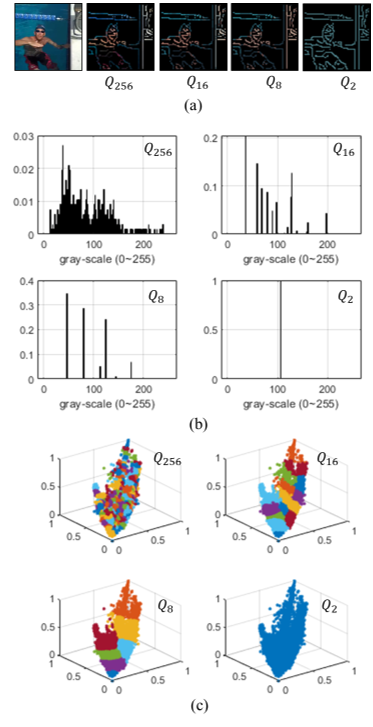

**1811.10673v1-Figure5-1.png**

- Caption: Figure 5: Efficiency in bits per pixel (BPP) achieved by different lossless compression schemes on a bi-level image.
- Content type: figure
- Figure type: photograph(s) and table

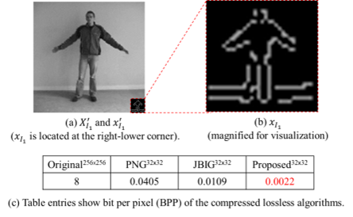

**1811.10673v1-Figure6-1.png**

- Caption: Figure 6: Performance of proposed framework against different downsampling levels: (a) original 256 × 256 frame, XG. Reconstructions at scales (b) 32 × 32, (c) 64 × 64, (d) and 256 × 256. As the resolution increases, the reconstructed frames become more recognizable.
- Content type: figure
- Figure type: photograph(s)

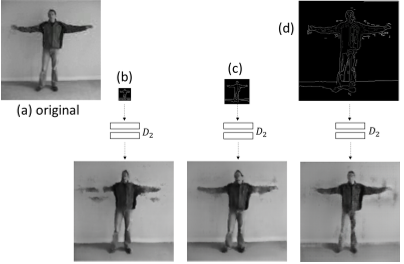

**1811.10673v1-Figure7-1.png**

- Caption: Figure 7: Performance of proposed framework against different quantization levels k of the soft edge detector (Qk). As the quantization level is increased (more clusters), the reconstructed representations become more precisely and similar to an original frames
- Content type: figure
- Figure type: photograph(s)

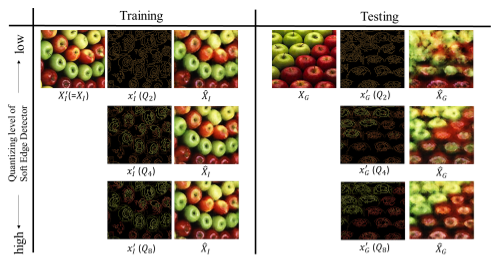

**1811.10673v1-Figure8-1.png**

- Caption: Figure 8: Rate-distortion curves (MS-SSIM) against bitrate for four semantic categories of 100 videos from the KTH dataset [8]. The red curves and dots correspond to our model while the blue curves and dots correspond to H.264. In the very low bitrate region (below 10Kbps), our scheme yielded higher MS-SSIM scores. Similar results were observed on PSNR, SSIM and VMAF (see supplementary material).
- Content type: figure
- Figure type: ** plot

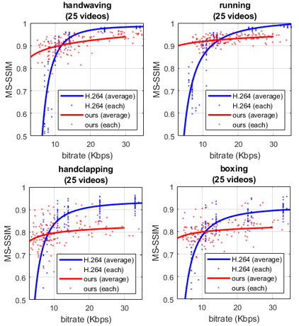

**1811.10673v1-Figure9-1.png**

- Caption: Figure 9: Two videos from (a) the KTH and (b) the YouTube dataset. Selected frames from original video and reconstructed videos using H.264 (low bitrate), H.264 (high bitrate), and the proposed model are aligned vertically along time. Our scheme demonstrated significantly better performance than the current standard codecs at low bitrates. The scores produced by several leading perceptual video quality metrics were depicted on the right side. Please refer to the supplementary for reconstructed videos and results on additional 129 videos.
- Content type: figure
- Figure type: photograph(s)

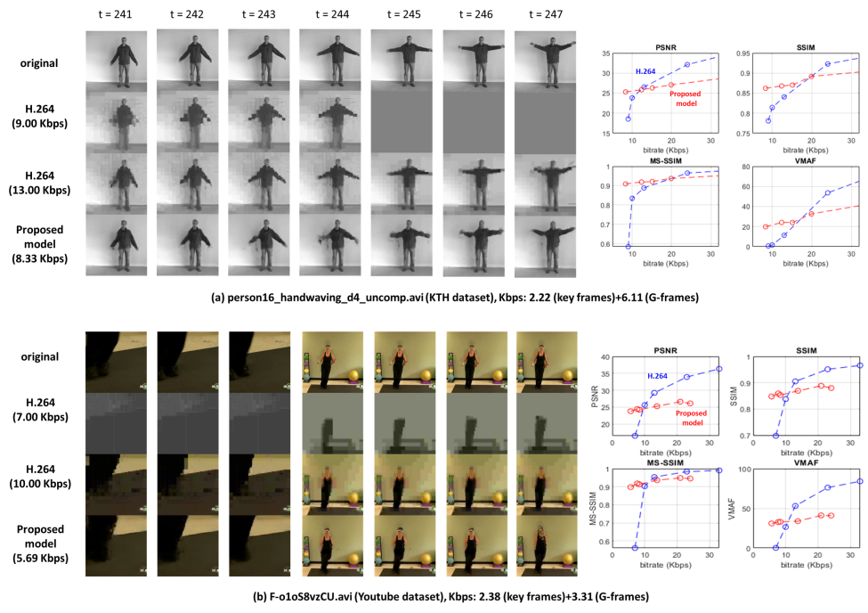

**1811.10673v1-Table1-1.png**

- Caption: Video quality assessment of reconstructed frames in Figure 6. As the resolutions increased, the quality scores of the reconstructed frame increase monotonical.
- Content type: table
- Figure type: table

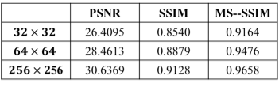

**1811.10673v1-Table2-1.png**

- Caption: Video quality assessment of reconstructed frames in Figure 7. As k is increased, the quality of the reconstructed frames becomes improve.
- Content type: table
- Figure type: table

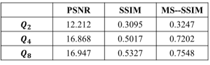

### QAs (10)
**QA 1**

- Question: What is the effect of downsampling on the quality of reconstructed frames?
- Answer: Downsampling reduces the quality of reconstructed frames.
- Rationale: Figure 1 shows the original frame and the reconstructed frames at different downsampling levels. As the downsampling level increases, the reconstructed frames become less recognizable. This is because downsampling reduces the amount of information in the image, which makes it more difficult to reconstruct the original image.
- References: 1811.10673v1-Figure6-1.png

Referenced images:

**QA 2**

- Question: How does the proposed method compare to H.264 in terms of MS-SSIM score at low bitrates?
- Answer: The proposed method achieves significantly higher MS-SSIM scores than H.264 at bitrates below 10 Kbps.
- Rationale: The figure shows the rate-distortion curves for both the proposed method (red) and H.264 (blue). At low bitrates, the red curves are higher than the blue curves, indicating that the proposed method achieves better MS-SSIM scores.
- References: 1811.10673v1-Figure8-1.png

Referenced images:

**QA 3**

- Question: What is the purpose of the second-stage decoder $D_2$?
- Answer: The second-stage decoder $D_2$ takes soft edges $x_G$ as input and produces reconstructed frames.
- Rationale: The figure shows that the second-stage decoder $D_2$ is trained on the reconstructed frames $X'_I$ and the soft edges $x_G$. After training, $D_2$ is able to generate reconstructed frames from the soft edges $x_G$.
- References: 1811.10673v1-Figure2-1.png

Referenced images:

**QA 4**

- Question: What are the steps involved in the second encoding stage ($E_2$)?
- Answer: The second encoding stage involves three steps: down-sampling, soft edge detection, and spatio-temporal edge map compression.
- Rationale: The figure shows a schematic of the second encoding stage, with the three steps clearly labeled.
- References: 1811.10673v1-Figure3-1.png

Referenced images:

**QA 5**

- Question: Which lossless compression scheme achieved the highest compression gain in the example shown in Figure 1?
- Answer: The proposed scheme achieved the highest compression gain.
- Rationale: Figure 1 shows the BPP (bits per pixel) for different lossless compression schemes applied to a bi-level image. The proposed scheme has the lowest BPP, indicating the highest compression gain.
- References: 1811.10673v1-Figure5-1.png

Referenced images:

**QA 6**

- Question: How does the proposed model compare to H.264 in terms of visual quality at low bitrates?
- Answer: The proposed model delivers significantly better visual quality at low bitrates than H.264.
- Rationale: The figure shows that the reconstructed video using the proposed model (4th row) has sharper edges and more detail than the reconstructed videos using H.264 at 9 Kbps (2nd row) and 13 Kbps (3rd row). This is especially evident in the details of the person's face and clothing.
- References: 1811.10673v1-Figure9-1.png

Referenced images:

**QA 7**

- Question: How does the level of quantization affect the output of the soft edge detector?
- Answer: As the quantization level $k$ is decreased, the cardinality of colors co-located with edges decreases.
- Rationale: The figure shows that as the quantization level is decreased, the number of colors in the output image decreases. This is because the quantization process reduces the number of possible colors that can be represented.
- References: 1811.10673v1-Figure4-1.png

Referenced images:

**QA 8**

- Question: How does the quality of the reconstructed frames change as the resolution increases?
- Answer: The quality of the reconstructed frames increases monotonically as the resolution increases.
- Rationale: The table in the figure shows the PSNR, SSIM, and MS-SSIM scores for the reconstructed frames at different resolutions. These scores are all higher for higher resolutions, indicating that the quality of the reconstructed frames is better at higher resolutions.
- References: 1811.10673v1-Table1-1.png

Referenced images:

**QA 9**

- Question: How does the quality of the reconstructed frames change as the quantization level of the soft edge detector increases?
- Answer: The quality of the reconstructed frames increases as the quantization level of the soft edge detector increases.
- Rationale: The figure shows that as the quantization level increases, the reconstructed frames become more similar to the original frames. This is because a higher quantization level means that there are more clusters, which allows the soft edge detector to more accurately represent the edges in the image.
- References: 1811.10673v1-Figure7-1.png

Referenced images:

**QA 10**

- Question: Which quality factor improves the most as k is increased?
- Answer: MS-SSIM
- Rationale: The table shows that the MS-SSIM values increase the most as k is increased.
- References: 1811.10673v1-Table2-1.png

Referenced images:

---
## Paper: 1812.10735v2
Semantic Scholar ID: 1812.10735v2

### Figures/Tables (10)
**1812.10735v2-Figure1-1.png**

- Caption: Figure 1: Example of a non-overlapping sentence. The attention weights of the aspect food are from the model ATAE-LSTM (Wang et al., 2016).
- Content type: figure
- Figure type: schematic

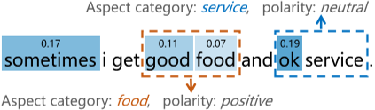

**1812.10735v2-Figure2-1.png**

- Caption: Figure 2: Network Architecture. The aspect categories are embedded as vectors. The model encodes the sentence using LSTM. Based on its hidden states, aspect-specific sentence representations for ALSC and ACD tasks are learned via constrained attention. Then aspect level sentiment prediction and aspect category detection are made.
- Content type: figure
- Figure type: schematic

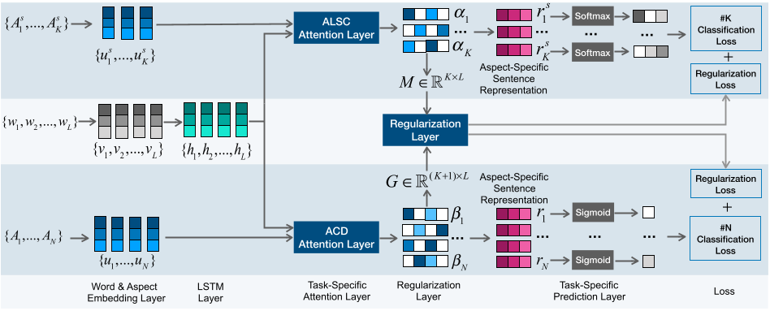

**1812.10735v2-Figure3-1.png**

- Caption: Visualization of attention weights of different aspects in the ALSC task. Three different models are compared.
- Content type: figure
- Figure type: plot

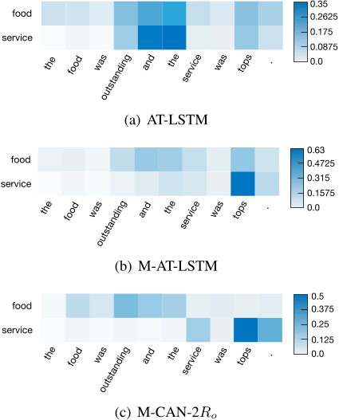

**1812.10735v2-Figure4-1.png**

- Caption: Figure 4: Visualization of attention weights of different aspects in the ACD task from M-CAN-2Ro. The a/m is short for anecdotes/miscellaneous.
- Content type: figure
- Figure type: table

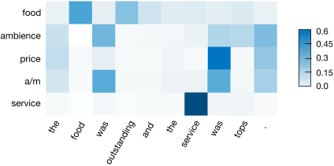

**1812.10735v2-Figure5-1.png**

- Caption: The regularization loss curves of Rs and Ro during the training of AT-CAN-Ro.
- Content type: figure
- Figure type: plot

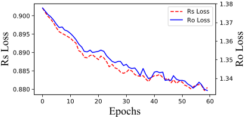

**1812.10735v2-Figure6-1.png**

- Caption: Figure 6: Examples of overlapping case and error case. The a/m is short for anecdotes/miscellaneous.
- Content type: figure
- Figure type: table

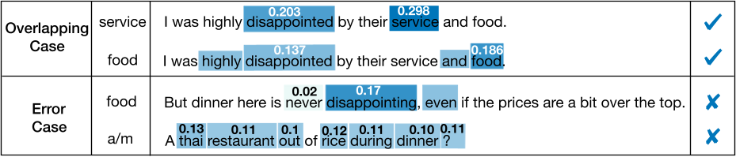

**1812.10735v2-Table1-1.png**

- Caption: Table 1: The numbers of single- and multi-aspect sentences. OL and NOL denote the overlapping and nonoverlapping multi-aspect sentences, respectively.
- Content type: table
- Figure type: N/A

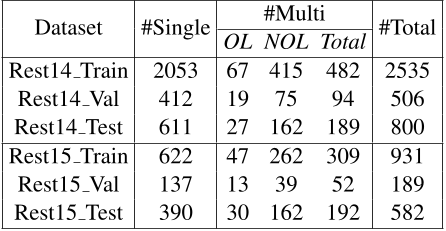

**1812.10735v2-Table2-1.png**

- Caption: Table 2: Results of the ALSC task in single-task settings in terms of accuracy (%) and Macro-F1 (%).
- Content type: table
- Figure type: N/A

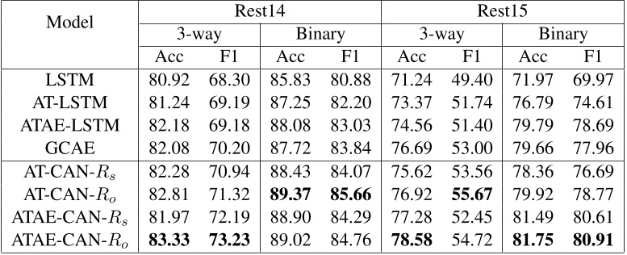

**1812.10735v2-Table3-1.png**

- Caption: Table 3: Results of the ALSC task in multi-task settings in terms of accuracy (%) and Macro-F1 (%).
- Content type: table
- Figure type: N/A

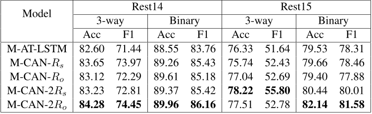

**1812.10735v2-Table4-1.png**

- Caption: Table 4: Results of the ACD task. Rest14 has 5 aspect categories while Rest15 has 13 ones.
- Content type: table
- Figure type: N/A

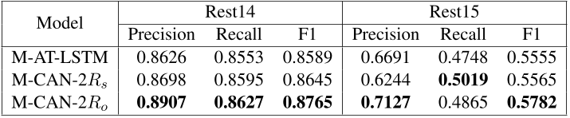

### QAs (5)
**QA 1**

- Question: What is the difference between an overlapping case and an error case?
- Answer: An overlapping case is when multiple aspects share the same opinion snippet, while an error case is when the model incorrectly identifies an aspect or opinion.
- Rationale: The figure shows two examples of each case. In the overlapping case, the sentence contains two aspects, "food" and "service," both described by the opinion snippet "highly disappointed." The model correctly identifies both aspects and the shared opinion words. In the error case, the model incorrectly identifies the aspect "a/m" and the opinion "disappointing."
- References: 1812.10735v2-Figure6-1.png

Referenced images:

**QA 2**

- Question: Which dataset has a higher proportion of sentences containing multiple aspects: Rest14 or Rest15?
- Answer: Rest14 has a higher proportion of sentences containing multiple aspects compared to Rest15.
- Rationale: While both datasets have a majority of single-aspect sentences, we can calculate the percentage of multi-aspect sentences in each dataset by dividing the total number of multi-aspect sentences by the total number of sentences. For Rest14, this is 482 (total multi-aspect) / 2535 (total sentences) = 19.01%. For Rest15, it is 309 (total multi-aspect) / 931 (total sentences) = 16.43%. Therefore, Rest14 has a slightly higher proportion of sentences with multiple aspects.
- References: 1812.10735v2-Table1-1.png

Referenced images:

**QA 3**

- Question: Why do you think the performance of all models is generally lower on Rest15 compared to Rest14?
- Answer: The performance of all models is generally lower on Rest15 because it has a larger number of aspect categories (13) compared to Rest14 (5). This increased complexity makes it more challenging for the models to accurately identify and classify the aspects.
- Rationale: The caption of Table 1 explicitly states the difference in the number of aspect categories between Rest14 and Rest15. Comparing the F1 scores across both datasets, we can observe a consistent decrease in performance for all models on Rest15. This suggests that the increased number of categories in Rest15 contributes to the overall decrease in performance.
- References: 1812.10735v2-Table4-1.png

Referenced images:

**QA 4**

- Question: Which model performed best on the Rest15 dataset for binary classification, and how does its performance compare to the best model for 3-way classification on the same dataset?
- Answer: For binary classification on the Rest15 dataset, M-CAN-2$R_o$ achieved the highest performance with an accuracy of 82.14% and Macro-F1 of 81.58%. In comparison, the best performing model for 3-way classification on Rest15 was M-CAN-2$R_s$, achieving an accuracy of 78.22% and Macro-F1 of 55.80%. This indicates that M-CAN-2$R_o$ performed better in both accuracy and Macro-F1 for binary classification compared to the best model for 3-way classification on the same dataset.
- Rationale: Table 1 provides the performance results of different models on both Rest14 and Rest15 datasets for both 3-way and binary classifications. By comparing the accuracy and Macro-F1 values for each model on the Rest15 dataset, we can identify the best performing models for each classification task. The table clearly shows the values for each model and allows for direct comparison of their performance.
- References: 1812.10735v2-Table3-1.png

Referenced images:

**QA 5**

- Question: What are the two main tasks that the CAN network is designed to perform?
- Answer: Aspect-level sentiment classification (ALSC) and aspect category detection (ACD).
- Rationale: The figure shows two separate paths for ALSC and ACD, each with its own attention layer and prediction layer. The ALSC path predicts the sentiment of each aspect, while the ACD path detects the categories of the aspects.
- References: 1812.10735v2-Figure2-1.png

Referenced images:

---
## Paper: 1906.10843v1
Semantic Scholar ID: 1906.10843v1

### Figures/Tables (13)
**1906.10843v1-Figure1-1.png**

- Caption: Figure 1: Sample UI based survey
- Content type: figure
- Figure type: other

**1906.10843v1-Figure2-1.png**

- Caption: Figure 2: Causal graph representing Assumption 1. X(T ) influences both user sentiment Y (T ) and propensity to respond ∆(T ). There is no other path between user sentiment and propensity to respond. Therefore, Y (T ) and ∆(T ) are independent conditioned on X(T ).
- Content type: figure
- Figure type: Schematic

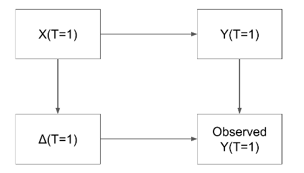

**1906.10843v1-Figure3-1.png**

- Caption: Figure 3: Causal graph representing Assumption 2. X influences both user sentiment under control Y (T = 0), and propensity to respond under both treatment and control conditions ∆(T = 0),∆(T = 1). There is no other path between user sentiment and propensity to respond. Therefore, Y (T = 0) and ∆(T = 0),∆(T = 1), are independent conditioned on X.
- Content type: figure
- Figure type: Schematic

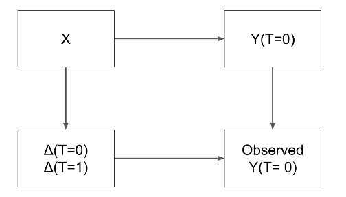

**1906.10843v1-Figure4-1.png**

- Caption: Figure 4: Causal graph representing our data generation process. Latent variables (X = [X1, X2]) generate both individual sentiment Y and response behavior under the treatment and control conditions ∆(1),∆(0).
- Content type: figure
- Figure type: schematic

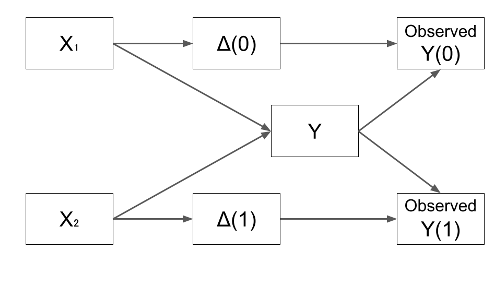

**1906.10843v1-Figure5-1.png**

- Caption: Figure 5: Performance of different ATE estimators when true confounders are fully observed. DR and AB has the highest variance.
- Content type: figure
- Figure type: ** plot

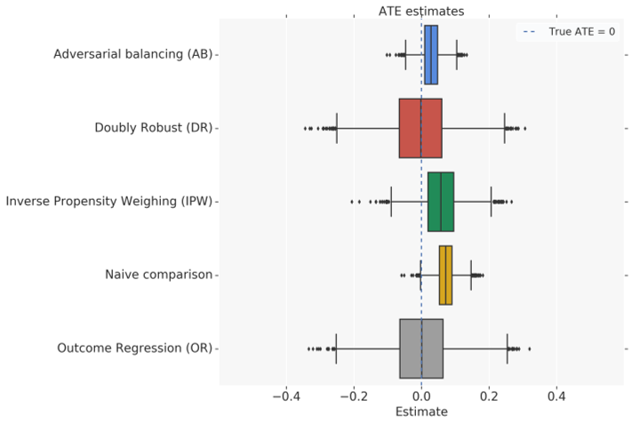

**1906.10843v1-Figure6-1.png**

- Caption: Figure 6: Performance of different ATE estimators when noisy confounders are observed. Increase in variances of OR and DR, AB retains performance characteristics.
- Content type: figure
- Figure type: plot

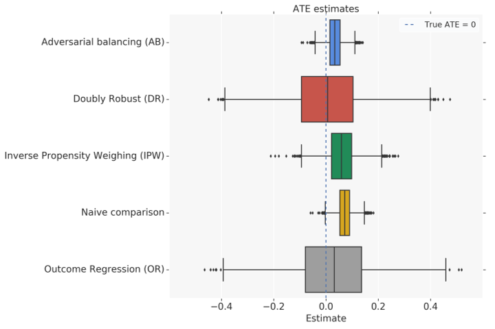

**1906.10843v1-Figure7-1.png**

- Caption: Figure 7: Performance of different ATETR estimators when true confounders are fully observed. CC and EB outperforms AB in contrast to ATE.
- Content type: figure
- Figure type: ** plot

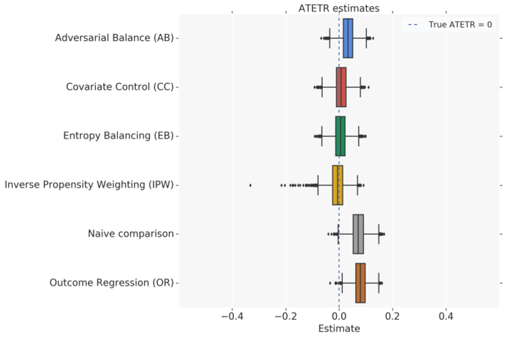

**1906.10843v1-Figure8-1.png**

- Caption: Figure 8: Performance of different ATETR estimators when noisy confounders are observed. Estimators are Adversarial Balancing (AB), Covariate Control (CC), Entrophy Balancing (EB), Inverse Propensity Weighing (IPW), Naive mean comparison and Outcome Regression (OR). Similar to the results in Table 4, EB and CC outperform across all measures. IPW suffers from large variance, OR performs worse than naive estimator.
- Content type: table
- Figure type: N/A

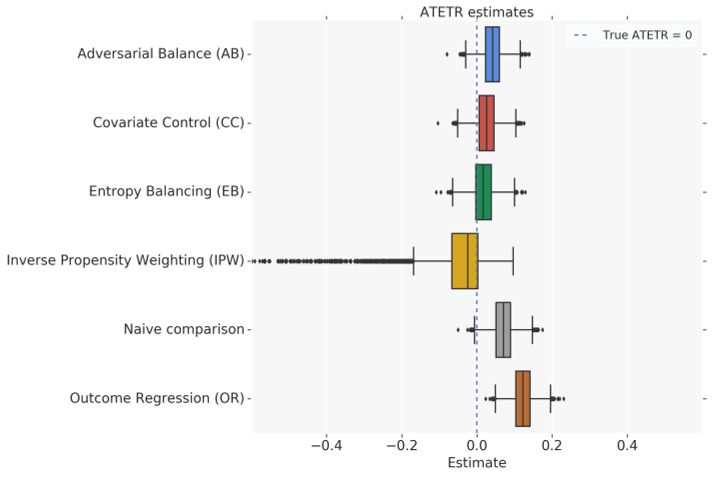

**1906.10843v1-Table1-1.png**

- Caption: Table 1: Population level statistics based on GDP in Appendix B.
- Content type: table
- Figure type: N/A

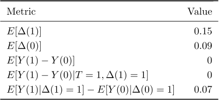

**1906.10843v1-Table2-1.png**

- Caption: Table 2: Performance of different ATE estimators when true confounders are fully observed. Estimators are Adversarial Balancing (AB), Doubly Robust (DR), Inverse Propensity Weighing (IPW), Naive mean comparison and Outcome Regression (OR). The naive estimator has the largest bias while AB estimator has the best MSE performance.
- Content type: figure
- Figure type: plot

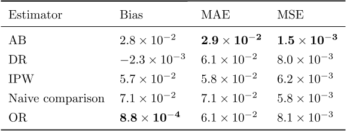

**1906.10843v1-Table3-1.png**

- Caption: Table 3: Performance of different ATE estimators when noisy confounders are observed. Estimators are Adversarial Balancing (AB), Doubly Robust (DR), Inverse Propensity Weighing (IPW), Naive mean comparison and Outcome Regression (OR). In contrast to Table 2, the performance of OR drops significantly while AB continues to provide a balance between variance and bias.
- Content type: table
- Figure type: N/A

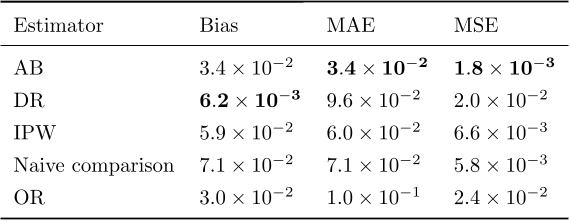

**1906.10843v1-Table4-1.png**

- Caption: Table 4: Performance of different ATETR estimators when true confounders are fully observed. Estimators are Adversarial Balancing (AB), Covariate Control (CC), Entrophy Balancing (EB), Inverse Propensity Weighing (IPW), Naive mean comparison and Outcome Regression (OR). EB has the best performance followed by simple CC estimator.
- Content type: table
- Figure type: N/A

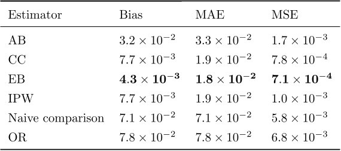

**1906.10843v1-Table5-1.png**

- Caption: Table 5: Performance of different ATETR estimators when noisy confounders are observed. Estimators are Adversarial Balancing (AB), Covariate Control (CC), Entrophy Balancing (EB), Inverse Propensity Weighing (IPW), Naive mean comparison and Outcome Regression (OR). Similar to the results in Table 4, EB outperforms across all measures. Similar to Table 4, simple CC estimator provides a comparable performance to EB.
- Content type: table
- Figure type: N/A

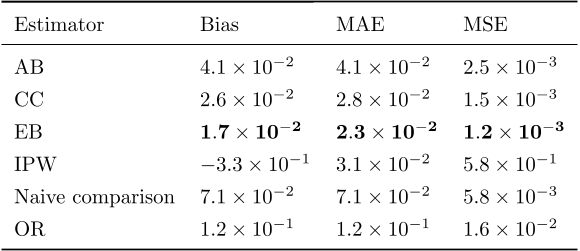

### QAs (3)
**QA 1**

- Question: Which estimator performs best in the presence of noisy confounders and how does it compare to the Covariate Control (CC) estimator?
- Answer: The Entropy Balancing (EB) estimator performs best across all measures (Bias, MAE, and MSE) when confounders are noisy. While the CC estimator also performs well, it exhibits slightly higher bias and MAE compared to EB.
- Rationale: The table presents the performance of different ATETR estimators under the condition of noisy confounders. The performance is evaluated based on three metrics: Bias, Mean Absolute Error (MAE), and Mean Squared Error (MSE). By comparing the values in the table, we can see that EB has the lowest values for all three metrics, indicating its superior performance. Although CC also shows good performance, its metrics are slightly higher than those of EB, suggesting a slightly lower accuracy in this scenario.
- References: 1906.10843v1-Table5-1.png

Referenced images:

**QA 2**

- Question: Which ATE estimator is most affected by the presence of noisy confounders?
- Answer: Outcome Regression (OR)
- Rationale: The boxplot for OR shows the largest increase in variance compared to the other estimators. This indicates that OR is more sensitive to the presence of noisy confounders.
- References: 1906.10843v1-Figure6-1.png

Referenced images:

**QA 3**

- Question: Which estimator has the smallest bias and best MSE performance in the case of fully observed confounders?
- Answer: The Entropy Balancing (EB) and Covariate Control (CC) estimators.
- Rationale: The boxplots in Figure~\ref{figure_sim_ATETR_1} show the distribution of ATETR estimates for different estimators. The EB and CC estimators have boxplots that are centered close to the true ATETR value of 0, indicating that they have small biases. Additionally, the passage states that the EB and CC estimators have the best MSE performance across all estimators.
- References: 1906.10843v1-Figure7-1.png

Referenced images:

