# SPIQA test-A (Part 3 of 4)
Papers in this part: 29

---
## Paper: 1605.07496v3
Semantic Scholar ID: 1605.07496v3

### Figures/Tables (13)
**1605.07496v3-Figure1-1.png**

- Caption: ALOQ models the return f as a function of (π, θ); (a) the predicted mean based on some observed data; (b) the predicted return of π = 1.5 for different θ, together with the uncertainty associated with them, given p(θ); (c) ALOQ marginalises out θ and computes f̄(π) and its associated uncertainty, which is used to actively select π.
- Content type: figure
- Figure type: Plot

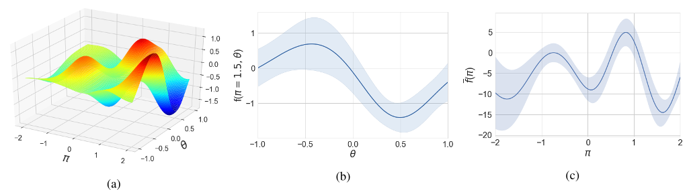

**1605.07496v3-Figure10-1.png**

- Caption: Comparison of performance of all methods on the F-SRE test functions (higher is better) .
- Content type: figure
- Figure type: plot

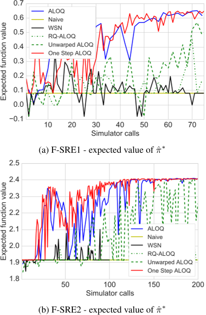

**1605.07496v3-Figure11-1.png**

- Caption: Comparison of runtime of all methods on the FSRE test functions.
- Content type: figure
- Figure type: plot

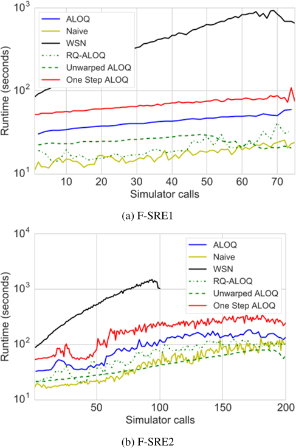

**1605.07496v3-Figure2-1.png**

- Caption: Performance and learned configurations on the robotic arm collision avoidance task.
- Content type: figure
- Figure type: plot

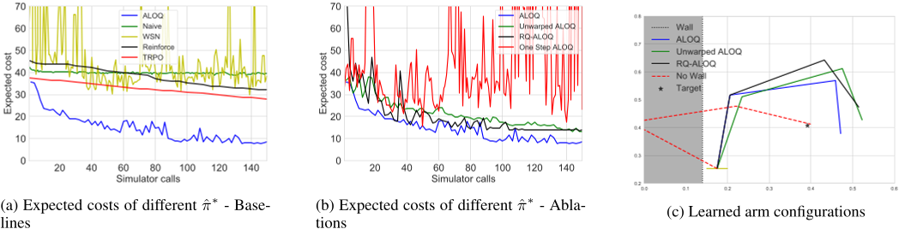

**1605.07496v3-Figure3-1.png**

- Caption: Performance and learned configurations on the robotic arm joint breakage task.
- Content type: figure
- Figure type: plot

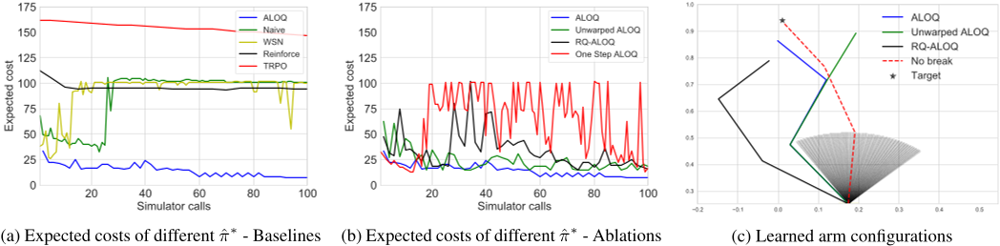

**1605.07496v3-Figure4-1.png**

- Caption: Performance of Reinforce and TRPO on the Robotic Arm Simulator experiments.
- Content type: figure
- Figure type: plot

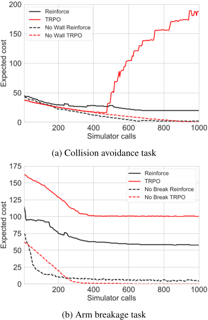

**1605.07496v3-Figure6-1.png**

- Caption: Per-step runtime for each method on the Robotic Arm Simulator experiments
- Content type: figure
- Figure type: plot

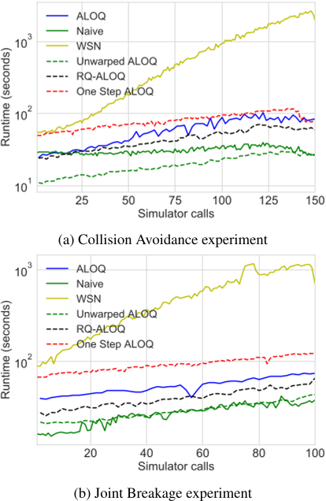

**1605.07496v3-Figure7-1.png**

- Caption: Comparison of performance of all methods on the modified Branin and Hartmann 6 test functions used by Williams, Santner, and Notz.
- Content type: figure
- Figure type: plot

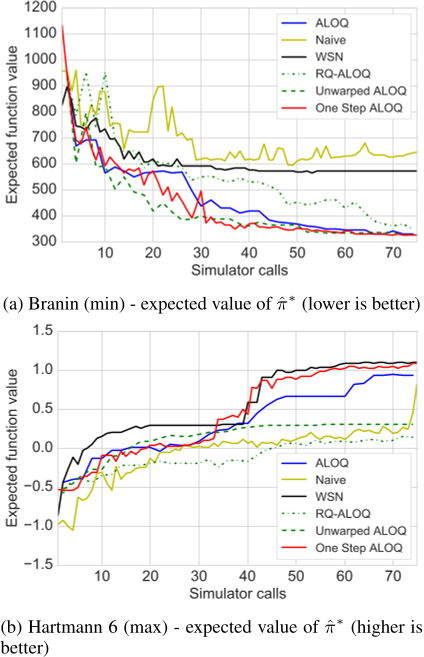

**1605.07496v3-Figure8-1.png**

- Caption: Comparison of runtime of all methods on the modified Branin and Hartmann 6 test function used by Williams, Santner, and Notz.
- Content type: figure
- Figure type: plot

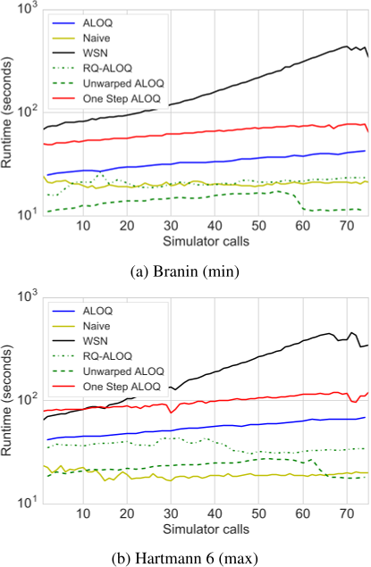

**1605.07496v3-Figure9-1.png**

- Caption: Contour plot of F-SRE1 and F-SRE2 (values in SRE region have been reduced by a factor of 10).
- Content type: figure
- Figure type: plot

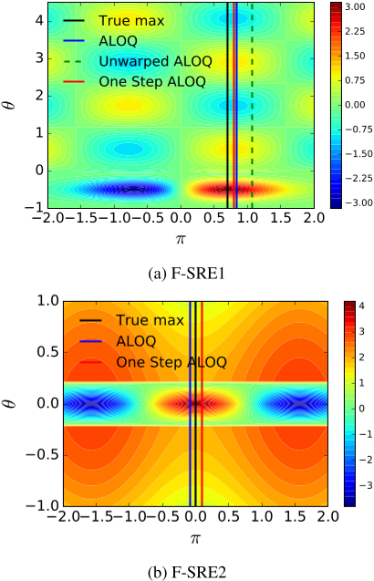

**1605.07496v3-Table1-1.png**

- Caption: Comparison of the performance of ALOQ, MAP and RQ-ALOQ policies when p(θ) must be estimated
- Content type: table
- Figure type: table

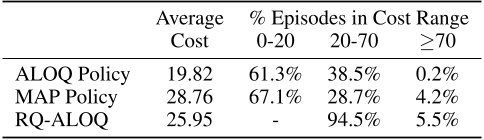

**1605.07496v3-Table2-1.png**

- Caption: Quartiles of the expected cost of the final π̂∗ estimated by each algorithm across 20 independent runs for the Robotic Arm Simulator experiments.
- Content type: table
- Figure type: table

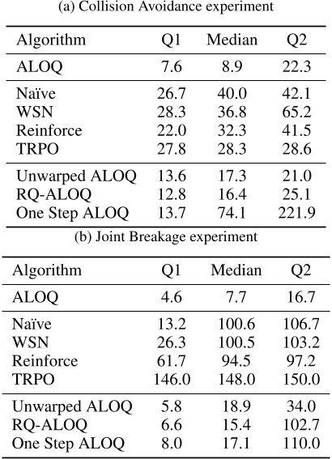

**1605.07496v3-Table3-1.png**

- Caption: Quartiles of the expected function value of the final π̂∗ estimated by each algorithm across 20 independent runs for each of the four artificial test functions.
- Content type: table
- Figure type: table

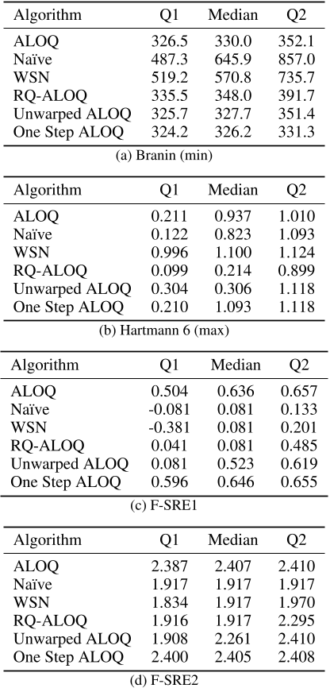

### QAs (9)
**QA 1**

- Question: Which policy resulted in the highest average cost?
- Answer: MAP Policy
- Rationale: The table shows the average cost for each policy. The MAP Policy has the highest average cost of 28.76.
- References: 1605.07496v3-Table1-1.png

Referenced images:

**QA 2**

- Question: Which of the algorithms performs the best on the robotic arm joint breakage task?
- Answer: ALOQ.
- Rationale: Figure (a) shows that ALOQ has the lowest expected cost compared to the other algorithms.
- References: 1605.07496v3-Figure3-1.png

Referenced images:

**QA 3**

- Question: Which algorithm performs the best in the Joint Breakage experiment?
- Answer: ALOQ
- Rationale: The table shows the quartiles of the expected cost of the final π̂∗ estimated by each algorithm across 20 independent runs for the Robotic Arm Simulator experiments. The lower the cost, the better the performance. In the Joint Breakage experiment, ALOQ has the lowest Q1, median, and Q2 values.
- References: 1605.07496v3-Table2-1.png

Referenced images:

**QA 4**

- Question: Which algorithm performed better on the arm breakage task?
- Answer: Both TRPO and Reinforce performed similarly on the arm breakage task.
- Rationale: The figure shows that the expected cost for both algorithms decreases to a similar level after around 400 simulator calls.
- References: 1605.07496v3-Figure4-1.png

Referenced images:

**QA 5**

- Question: Between WSN and ALOQ, which method is the most efficient in terms of runtime for both F-SRE1 and F-SRE2?
- Answer: ALOQ is significantly more efficient than WSN.
- Rationale: The figure shows that the One Step ALOQ method has the lowest runtime for both F-SRE1 and F-SRE2.
- References: 1605.07496v3-Figure11-1.png

Referenced images:

**QA 6**

- Question: Which method performs the best on the F-SRE1 test function?
- Answer: ALOQ
- Rationale: The figure shows that ALOQ has the highest expected function value for the F-SRE1 test function.
- References: 1605.07496v3-Figure10-1.png

Referenced images:

**QA 7**

- Question: How does the predicted return change as a function of θ for a fixed value of π = 1.5?
- Answer: The predicted return decreases as θ increases, with a minimum at around θ = 0.5.
- Rationale: Figure (b) shows the predicted return for different values of θ when π = 1.5. The blue line represents the mean predicted return, and the shaded area represents the uncertainty associated with the prediction. As θ increases, the mean predicted return decreases, and the uncertainty increases.
- References: 1605.07496v3-Figure1-1.png

Referenced images:

**QA 8**

- Question: What is the difference between the "True max" and the "ALOQ" curves?
- Answer: The "True max" curve is the true maximum of the function, while the "ALOQ" curve is an approximation of the maximum. The "ALOQ" curve is lower than the "True max" curve, indicating that it underestimates the maximum value of the function.
- Rationale: The figure shows that the "True max" curve is higher than the "ALOQ" curve at all points. This indicates that the "ALOQ" curve is an underestimate of the true maximum.
- References: 1605.07496v3-Figure9-1.png

Referenced images:

**QA 9**

- Question: Which method performs the best on the Branin function?
- Answer: One Step ALOQ
- Rationale: The One Step ALOQ method has the lowest expected function value for the Branin function, which is indicated by the red line in Figure (a).
- References: 1605.07496v3-Figure7-1.png

Referenced images:

---
## Paper: 1611.03780v2
Semantic Scholar ID: 1611.03780v2

### Figures/Tables (10)
**1611.03780v2-Figure1-1.png**

- Caption: Hilbert space-filling curves are constructed recursively up to any desired resolution.
- Content type: figure
- Figure type: Schematic

**1611.03780v2-Figure2-1.png**

- Caption: Diagram of the bipartite user-region graph and the resulting “folded” interference graph between regions. The edge weights of the folded graph correspond to the unnormalized weights qkk (cf. Equation 1).
- Content type: figure
- Figure type: ** Schematic

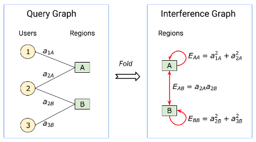

**1611.03780v2-Figure3-1.png**

- Caption: Figure 3: The graph built by the GeoCUTS algorithm, with nodes shown on corresponding locations of the US. White represents large edge weights (high traffic areas), while black represents low edge weights. Larger edge weights often do not match larger vertex weights, showing the difference between GeoCUTS and an algorithm simply measuring population density. Gaps in the colored regions represent locations for which no search data is available. For example, in regions such as deserts, Search queries come disproportionately from narrow strips corresponding to major roads.
- Content type: figure
- Figure type: ** schematic

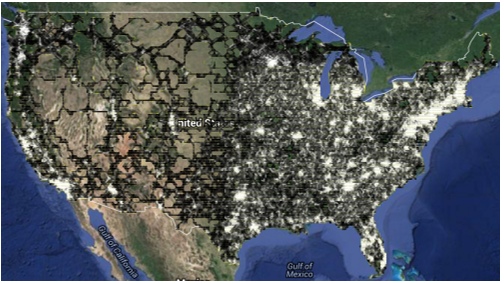

**1611.03780v2-Figure4-1.png**

- Caption: Figure 4: The GeoCUTS algorithm applied to user queries from the United States. The algorithm automatically identifies metropolitan areas, correctly predicting, for example, that the Bay Area includes San Francisco, Berkeley, and Palo Alto, but not Sacramento.
- Content type: figure
- Figure type: Map

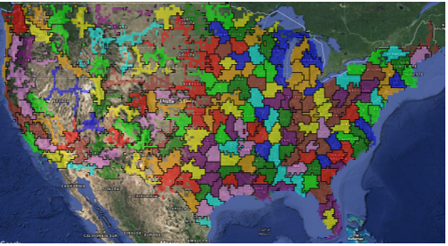

**1611.03780v2-Figure5-1.png**

- Caption: Figure 5: The GeoCUTS algorithm applied to user queries from France. It correctly identifies metropolitan areas such as Paris, Bordeaux, and Lyon, and regions such as Alsace and Normandy.
- Content type: figure
- Figure type: Map.

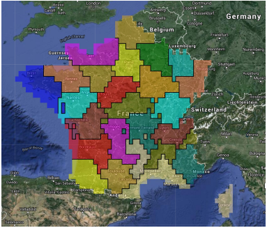

**1611.03780v2-Table1-1.png**

- Caption: (a) Average and query-weighted average (Query-w. avg) of Q-metric, (b) Percentage of queries from clusters with a Q-metric of at least x%. ∼ 200 clusters were used for the US and ∼ 50 for France. For both highly active and highly mobile graphs, GeoCUTS performs comparably to DMAs and outperforms the baseline grid clustering.
- Content type: table
- Figure type: Table

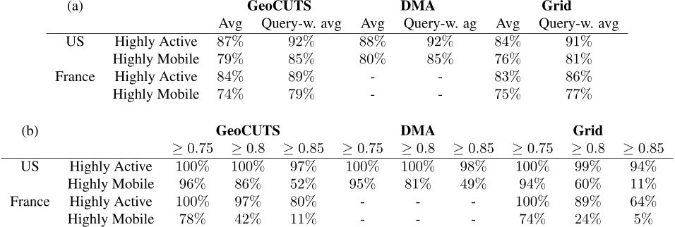

**1611.03780v2-Table2-1.png**

- Caption: B-metrics across clusterings, reported with a multiplicative constant of 100. We see that GeoCUTS performs comparably to other clusterings for highly active users, and somewhat better for highly mobile users.
- Content type: table
- Figure type: table

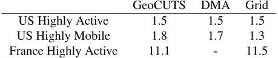

**1611.03780v2-Table3-1.png**

- Caption: Table 3: Cut size comparison against different clustering algorithms for highly active (HA) and highly mobile (HM) users within the US. “Grid” denotes the grid partition, “LE” denotes the Linear Embedding algorithm [4], and “Hilbert” denotes partitions along a Hilbert curve [21]. We see that GeoCUTS and Linear Embedding give the best cut size.
- Content type: table
- Figure type: N/A

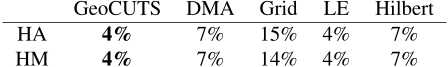

**1611.03780v2-Table4-1.png**

- Caption: Table 4: Percentage of queries from clusters with a Q-metric ≥ x% for different numbers of clusters in France.
- Content type: table
- Figure type: N/A

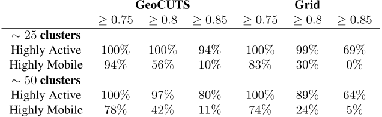

**1611.03780v2-Table5-1.png**

- Caption: Table 5: Comparison of weighted average Q-metrics and B-metrics for GeoCUTS applied to US query data across (a) varying normalizations, (b) varying coarsenesses of location discretization. The B-metrics are reported with a multiplicative factor of 100.
- Content type: table
- Figure type: N/A

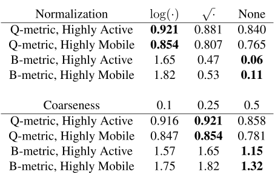

### QAs (8)
**QA 1**

- Question: How does GeoCUTS perform compared to other clusterings for highly active users?
- Answer: GeoCUTS performs comparably to other clusterings for highly active users.
- Rationale: The table shows that the B-metrics for GeoCUTS are similar to the B-metrics for DMA and Grid for highly active users in the US and France.
- References: 1611.03780v2-Table2-1.png

Referenced images:

**QA 2**

- Question: How is the Hilbert space-filling curve constructed?
- Answer: The Hilbert space-filling curve is constructed recursively. The curve starts with a simple square, and then at each subsequent iteration, the curve is subdivided into four smaller squares. The curve is then drawn through each of these squares in a specific order.
- Rationale: The figure shows the first four iterations of the Hilbert space-filling curve. Each iteration is shown in a different color. The curve starts with a simple square (shown in red), and then at each subsequent iteration, the curve is subdivided into four smaller squares. The curve is then drawn through each of these squares in a specific order.
- References: 1611.03780v2-Figure1-1.png

Referenced images:

**QA 3**

- Question: How does the performance of GeoCUTS compare to the Grid method in identifying highly mobile clusters when the number of clusters is increased from approximately 25 to 50?
- Answer: GeoCUTS consistently outperforms the Grid method in identifying highly mobile clusters, regardless of the number of clusters. However, the performance of both methods decreases as the number of clusters increases.
- Rationale: Table 1 shows the percentage of queries from highly mobile clusters identified by each method for different Q-metric thresholds and cluster numbers. In both the "$\sim25$ clusters" and "$\sim50$ clusters" scenarios, GeoCUTS identifies a higher percentage of highly mobile clusters than the Grid method across all Q-metric thresholds. For example, with approximately 25 clusters and a Q-metric threshold of 0.8, GeoCUTS identifies 56% of highly mobile clusters, while the Grid method only identifies 30%. This trend holds true even when the number of clusters increases to approximately 50. 

The passage also emphasizes that GeoCUTS significantly outperforms the Grid method regardless of the number of clusters, supporting the conclusion drawn from the table.
- References: 1611.03780v2-Table4-1.png

Referenced images:

**QA 4**

- Question: What is the relationship between the query graph and the interference graph?
- Answer: The interference graph is a folded version of the query graph. The nodes in the interference graph represent regions, and the edges represent the interference between regions. The edge weights in the interference graph are calculated from the edge weights in the query graph.
- Rationale: The figure shows how the query graph is folded to create the interference graph. The nodes in the query graph represent users and regions, and the edges represent the relationships between them. The folding process involves combining the user nodes into a single node for each region. The edge weights in the interference graph are then calculated by summing the weights of the edges between the corresponding user nodes in the query graph.
- References: 1611.03780v2-Figure2-1.png

Referenced images:

**QA 5**

- Question: Which metropolitan area is predicted by the GeoCUTS algorithm to include San Francisco, Berkeley, and Palo Alto, but not Sacramento?
- Answer: The Bay Area.
- Rationale: The figure shows the clusters generated by the GeoCUTS algorithm for data from the United States. The Bay Area is shown as a single cluster that includes San Francisco, Berkeley, and Palo Alto, but not Sacramento.
- References: 1611.03780v2-Figure4-1.png

Referenced images:

**QA 6**

- Question: Which metropolitan areas are correctly identified by the GeoCUTS algorithm in France?
- Answer: Paris, Bordeaux, and Lyon.
- Rationale: The figure shows the clusters generated by the GeoCUTS algorithm for data from France. The clusters corresponding to Paris, Bordeaux, and Lyon are clearly visible.
- References: 1611.03780v2-Figure5-1.png

Referenced images:

**QA 7**

- Question: Which clustering algorithm produced the smallest cut size for highly active users in the US dataset, and how much smaller was it compared to the cut size produced by grid partitioning?
- Answer: Both GeoCUTS and Linear Embedding produced the smallest cut size for highly active users, with a cut size of 4%. This is 11% smaller than the cut size produced by grid partitioning, which had a cut size of 15%.
- Rationale: The table shows the cut size percentages for different clustering algorithms applied to highly active (HA) and highly mobile (HM) users. The "HA" row shows that GeoCUTS and LE have the lowest percentage (4%), while Grid has a significantly higher percentage (15%). The difference between these percentages (15% - 4% = 11%) indicates how much smaller the cut size is for GeoCUTS and LE compared to Grid partitioning.
- References: 1611.03780v2-Table3-1.png

Referenced images:

**QA 8**

- Question: Which method performs best for highly active users in the US?
- Answer: Both GeoCUTS and DMA perform equally well for highly active users in the US.
- Rationale: In Figure (b), for highly active users in the US, both GeoCUTS and DMA have 100% of queries from clusters with a Q-metric of at least 0.75 and 0.8.
- References: 1611.03780v2-Table1-1.png

Referenced images:

---
## Paper: 1611.07718v2
Semantic Scholar ID: 1611.07718v2

### Figures/Tables (12)
**1611.07718v2-Figure1-1.png**

- Caption: Illustrating the building blocks: (a) Two residual blocks; (b) An inception-like block; (c) A merge-and-run block. (a) corresponds to two blocks in ResNets and assembles two residual branches sequentially while (b) and (c) both assemble the same two residual branches in parallel. (b) and (c) adopt two different skip connections: identity mappings and our proposed merge-andrun mappings. The dot circle denotes the average operation, and the solid circle denotes the sum operation.
- Content type: figure
- Figure type: schematic

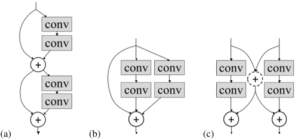

**1611.07718v2-Figure2-1.png**

- Caption: (a) a deep residual network; (b) a network built by stacking inception-like blocks; (c) our deep merge-and-run neural network built by stacking merge-and-run blocks. The trapezoid shape indicates that down-sampling occurs in the corresponding layer, and the dashed line denotes a projection shortcut as in [7].
- Content type: figure
- Figure type: Schematic

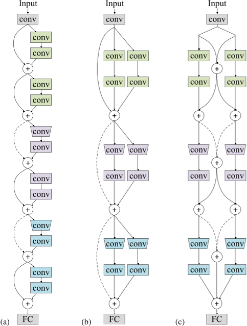

**1611.07718v2-Figure3-1.png**

- Caption: Comparing the distributions of the path lengths for three networks. Different networks: (avg length ± std). Left: L = 9. Right: L = 24.
- Content type: figure
- Figure type: plot

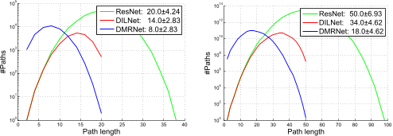

**1611.07718v2-Figure4-1.png**

- Caption: Illustrating the two residual branches shown in (a) are transformed to a single residual branch shown in (b). (a) All 4 convolutions are (16, 3 × 3, 16). (b) The 2 convolutions are (16, 3×3, 32) and (32, 3×3, 16), from narrow (16) to wide (32), and then from wide (32) back to narrow (16).
- Content type: figure
- Figure type: schematic

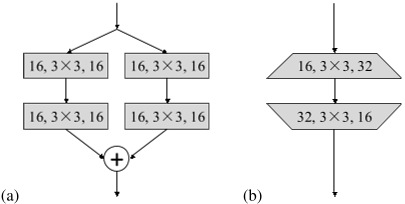

**1611.07718v2-Figure5-1.png**

- Caption: Transform the merge-and-run block shown in (a) to a two-branch block shown in (b). (b) The 2 convolutions are group convolutions. A group convolution contains two (G = 2) convolutions of (16, 3× 3, 16): each receives a different 16-channel input and the two outputs are concatenated as the final output with 32 channels. The width is greater than 16. The skip connection (dot line) is a linear transformation, where the transformation matrix of size 32× 32 is idempotent.
- Content type: figure
- Figure type: schematic

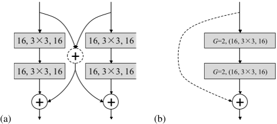

**1611.07718v2-Figure6-1.png**

- Caption: Illustrating how the testing errors of residual networks change as the average path length increases. The results are reported on CIFAR-10.
- Content type: figure
- Figure type: plot

**1611.07718v2-Figure7-1.png**

- Caption: Comparing the optimization of ResNets and the DMRNets with the same number of layers/parameters. The vertical axis corresponds to training losses and testing errors, and the horizontal axis corresponds to #epochs.
- Content type: figure
- Figure type: plot

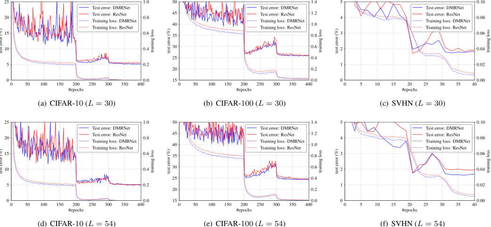

**1611.07718v2-Figure8-1.png**

- Caption: Training error and validation error curves of ResNet-101 (44.5M) and DFN-MR (43.3M) with the same optimization setting on ImageNet. We report the (top-1 error) results for training and single-crop validation. It can be observed that our approach performs better for both training errors and validation errors.
- Content type: figure
- Figure type: plot

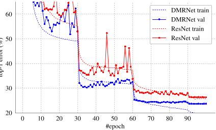

**1611.07718v2-Table2-1.png**

- Caption: Empirical comparison of DILNets, DMRNets, and ResNets. The average classification error from 5 runs and the standard deviation (mean ± std.) are reported. Refer to Table 1 for network structure descriptions.
- Content type: table
- Figure type: table

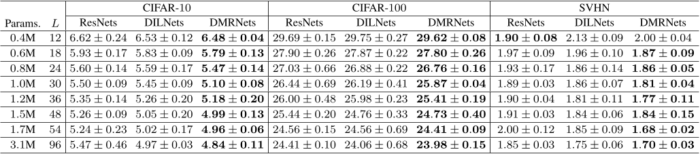

**1611.07718v2-Table3-1.png**

- Caption: Classification error comparison with state-of-the-arts. The results of DenseNets are based on the networks without bottlenecks. The DMRNet-Wide is the wide version of a DMRNet, 4× wider, i.e., the widths of the threes stages are 64, 128, and 256, respectively.
- Content type: table
- Figure type: table

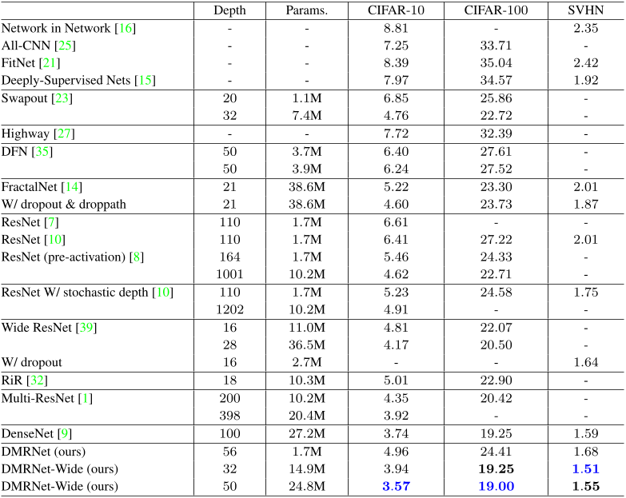

**1611.07718v2-Table4-1.png**

- Caption: The validation (single 224×224 center crop) and training errors (%) of ResNet-101 (44.5M) and our DMRNet (43.3M) on ImageNet.
- Content type: table
- Figure type: table

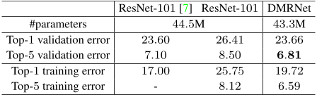

**1611.07718v2-Table5-1.png**

- Caption: Comparison between merge-and-run mappings and identity mappings. Sharing = share the first conv. and the last FC.
- Content type: table
- Figure type: table

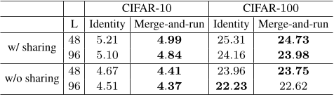

### QAs (8)
**QA 1**

- Question: Which network architecture has the highest accuracy on the CIFAR-10 dataset?
- Answer: DMRNet-Wide
- Rationale: The table shows the classification error rates for different network architectures on the CIFAR-10 dataset. The network with the lowest error rate is DMRNet-Wide (ours), which has an error rate of 19.00%.
- References: 1611.07718v2-Table3-1.png

Referenced images:

**QA 2**

- Question: What is the difference between a deep residual network and a network built by stacking inception-like blocks?
- Answer: Deep residual networks have skip connections that allow the gradient to flow directly from one layer to another, while networks built by stacking inception-like blocks do not.
- Rationale: The figure shows that deep residual networks have dashed lines connecting layers, which represent skip connections. Networks built by stacking inception-like blocks do not have these dashed lines.
- References: 1611.07718v2-Figure2-1.png

Referenced images:

**QA 3**

- Question: What is the difference between the residual block and the merge-and-run block?
- Answer: The residual block assembles two residual branches sequentially, while the merge-and-run block assembles the same two residual branches in parallel.
- Rationale: The figure shows the different building blocks of a convolutional neural network. The residual block (a) has two residual branches that are connected sequentially, while the merge-and-run block (c) has two residual branches that are connected in parallel.
- References: 1611.07718v2-Figure1-1.png

Referenced images:

**QA 4**

- Question: How does the training loss of DMRNet compare to that of ResNet on the CIFAR-10 dataset with L = 30?
- Answer: The training loss of DMRNet is lower than that of ResNet on the CIFAR-10 dataset with L = 30.
- Rationale: The plot in Figure (a) shows that the training loss of DMRNet (dashed red line) is consistently lower than that of ResNet (dashed blue line) throughout the training process.
- References: 1611.07718v2-Figure7-1.png

Referenced images:

**QA 5**

- Question: Which network has the shortest average path length when L = 9?
- Answer: DMRNet
- Rationale: The figure shows the distribution of path lengths for three networks. The average path length for each network is shown in the legend. When L = 9, DMRNet has the shortest average path length (8.0 ± 2.83).
- References: 1611.07718v2-Figure3-1.png

Referenced images:

**QA 6**

- Question: Which model has the lowest Top-1 validation error on ImageNet?
- Answer: ResNet-101 from the reference paper reports top-1 validation error of 23.60 which is lower than ResNet-101 reevaluated (26.41) and DMRNet (23.66)
- Rationale: The table shows that DMRNet has a Top-1 validation error of 23.66%, which is lower than the 26.41% error of ResNet-101.
- References: 1611.07718v2-Table4-1.png

Referenced images:

**QA 7**

- Question: Does sharing the first convolutional layer and the last fully connected layer improve the accuracy of the merge-and-run mapping?
- Answer: Yes.
- Rationale: The table shows that the accuracy of the merge-and-run mapping is higher when the first convolutional layer and the last fully connected layer are shared. For example, on CIFAR-10, the accuracy of the merge-and-run mapping is 4.99% with sharing and 4.41% without sharing.
- References: 1611.07718v2-Table5-1.png

Referenced images:

**QA 8**

- Question: How does the classification error of a residual network change as the average path length increases?
- Answer: The classification error of a residual network generally increases as the average path length increases.
- Rationale: The figure shows two lines, one for a residual network with 3 residual blocks and one for a residual network with 6 residual blocks. Both lines show an overall increase in classification error as the average path length increases. This suggests that as the network becomes deeper, it becomes more difficult for it to learn the underlying patterns in the data.
- References: 1611.07718v2-Figure6-1.png

Referenced images:

---
## Paper: 1702.03584v3
Semantic Scholar ID: 1702.03584v3

### Figures/Tables (3)
**1702.03584v3-Figure1-1.png**

- Caption: Figure 1: Two error rates as a function of CPU time on UCR Non-Invasive Fetal ECG Thorax1 dataset
- Content type: figure
- Figure type: plot

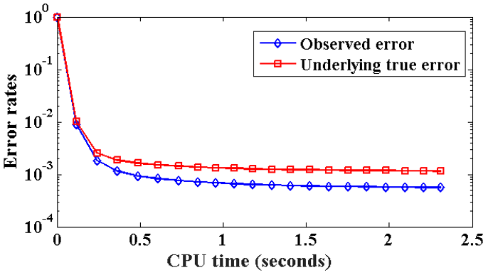

**1702.03584v3-Figure2-1.png**

- Caption: Comparison of our method with existing clustering algorithms over all the 85 UCR time series datasets. Top two: comparison between our method SPIRAL-DTW-kMeans with two state-of-the-art methods k-Shape, and CLDS. Bottom two: comparisons between MSM based methods, our method SPIRAL-MSM-kMeans with Laplace-MSM-kMeans and kMedoids-MSM. Circles below the diagonal indicate datasets over which our method yields better clustering performance in terms of NMI.
- Content type: figure
- Figure type: plot

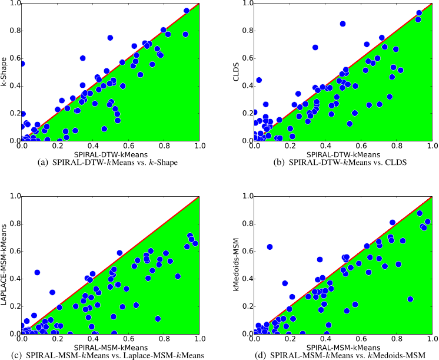

**1702.03584v3-Table1-1.png**

- Caption: The overall clustering performance of all the proposed and baseline methods. The notation < denotes the number (percentage in parenthesis) of datasets over which the baseline methods perform worse than our method SPIRAL-MSM-kMeans.
- Content type: table
- Figure type: table

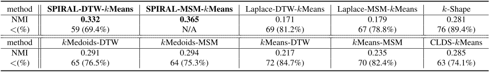

### QAs (3)
**QA 1**

- Question: How does the observed error compare to the underlying true error as CPU time increases?
- Answer: The observed error is initially higher than the underlying true error, but it quickly decreases and converges to the true error as CPU time increases.
- Rationale: The figure shows two lines, one representing the observed error and the other representing the underlying true error. Both lines decrease as CPU time increases, but the observed error line decreases more quickly and eventually converges to the true error line.
- References: 1702.03584v3-Figure1-1.png

Referenced images:

**QA 2**

- Question: How does the performance of SPIRAL-DTW-kMeans compare to k-Shape and CLDS?
- Answer: SPIRAL-DTW-kMeans performs better than k-Shape and CLDS on most datasets.
- Rationale: In Figure (a) and (b), the circles below the diagonal line indicate datasets where SPIRAL-DTW-kMeans yields better clustering performance in terms of NMI than k-Shape and CLDS, respectively.
- References: 1702.03584v3-Figure2-1.png

Referenced images:

**QA 3**

- Question: Which method performs the best in terms of NMI and what percentage of datasets does it outperform the other methods on?
- Answer: The SPIRAL-MSM-kMeans method performs the best in terms of NMI with a score of 0.365. It outperforms the other methods on 89.4% of the datasets.
- Rationale: The table shows the NMI scores and the percentage of datasets on which each method outperforms the other methods. The SPIRAL-MSM-kMeans method has the highest NMI score and the highest percentage of datasets on which it outperforms the other methods.
- References: 1702.03584v3-Table1-1.png

Referenced images:

---
## Paper: 1703.02507v3
Semantic Scholar ID: 1703.02507v3

### Figures/Tables (9)
**1703.02507v3-Figure1-1.png**

- Caption: Figure 1: Left figure: the profile of the word vector L2norms as a function of log(fw) for each vocabulary word w, as learnt by our unigram model trained on Toronto books. Right figure: down-weighting scheme proposed by Arora et al. (2017): weight(w) = a a+fw .
- Content type: figure
- Figure type: plot

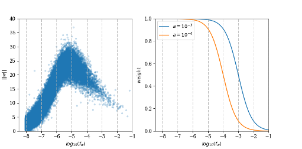

**1703.02507v3-Table1-1.png**

- Caption: Comparison of the performance of different models on different supervised evaluation tasks. An underline indicates the best performance for the dataset. Top 3 performances in each data category are shown in bold. The average is calculated as the average of accuracy for each category (For MSRP, we take the accuracy). )
- Content type: table
- Figure type: table

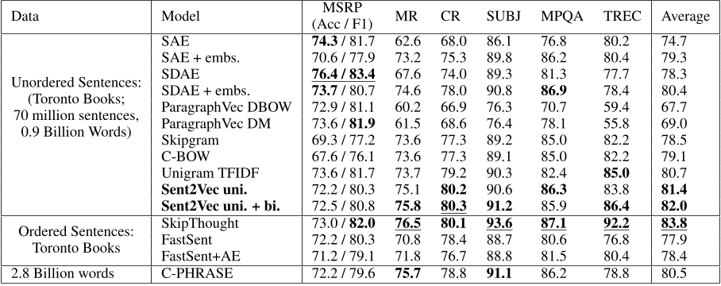

**1703.02507v3-Table2-1.png**

- Caption: Unsupervised Evaluation Tasks: Comparison of the performance of different models on Spearman/Pearson correlation measures. An underline indicates the best performance for the dataset. Top 3 performances in each data category are shown in bold. The average is calculated as the average of entries for each correlation measure.
- Content type: table
- Figure type: table

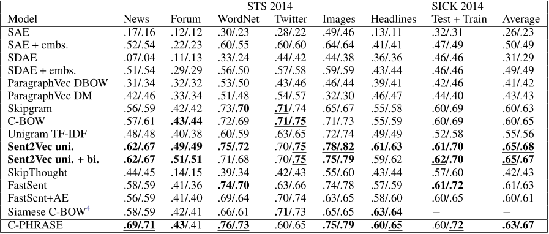

**1703.02507v3-Table3-1.png**

- Caption: Best unsupervised and semi-supervised methods ranked by macro average along with their training times. ** indicates trained on GPU. * indicates trained on a single node using 30 threads. Training times for non-Sent2Vec models are due to Hill et al. (2016a). For CPU based competing methods, we were able to reproduce all published timings (+-10%) using our same hardware as for training Sent2Vec.
- Content type: table
- Figure type: table

**1703.02507v3-Table4-1.png**

- Caption: Comparison of the performance of the unsupervised and semi-supervised sentence embeddings by (Arora et al., 2017) with our models. Unsupervised comparisons are in terms of Pearson’s correlation, while comparisons on supervised tasks are stating the average described in Table 1.
- Content type: table
- Figure type: table

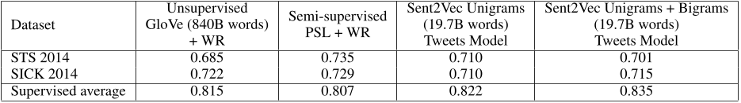

**1703.02507v3-Table5-1.png**

- Caption: Training parameters for the Sent2Vec models
- Content type: table
- Figure type: ** Table

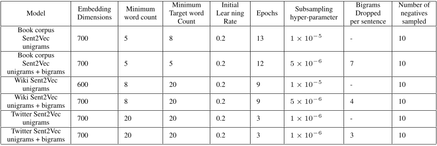

**1703.02507v3-Table6-1.png**

- Caption: Comparison of the performance of different Sent2Vec models with different semisupervised/supervised models on different downstream supervised evaluation tasks. An underline indicates the best performance for the dataset and Sent2Vec model performances are bold if they perform as well or better than all other non-Sent2Vec models, including those presented in Table 1.
- Content type: table
- Figure type: table

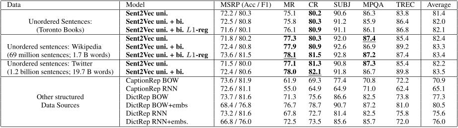

**1703.02507v3-Table7-1.png**

- Caption: Unsupervised Evaluation: Comparison of the performance of different Sent2Vec models with semi-supervised/supervised models on Spearman/Pearson correlation measures. An underline indicates the best performance for the dataset and Sent2Vec model performances are bold if they perform as well or better than all other non-Sent2Vec models, including those presented in Table 2.
- Content type: table
- Figure type: table

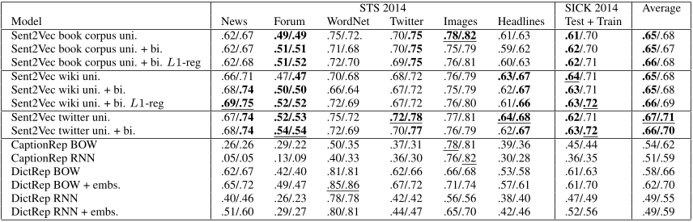

**1703.02507v3-Table8-1.png**

- Caption: Average sentence lengths for the datasets used in the comparison.
- Content type: table
- Figure type: table.

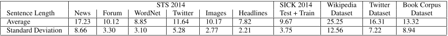

### QAs (5)
**QA 1**

- Question: Which model performed the best on the MSRP task for the Ordered Sentences dataset?
- Answer: SkipThought
- Rationale: The table shows the performance of different models on different supervised evaluation tasks. For the Ordered Sentences dataset, the model with the highest accuracy for the MSRP task is SkipThought, with an accuracy of 83.0.
- References: 1703.02507v3-Table1-1.png

Referenced images:

**QA 2**

- Question: Which model performs best on the SICK 2014 dataset in terms of average Spearman and Pearson correlation?
- Answer: C-PHRASE
- Rationale: The table shows the performance of different models on the SICK 2014 dataset in terms of Spearman and Pearson correlation. The C-PHRASE model has the highest average score of 63.67.
- References: 1703.02507v3-Table2-1.png

Referenced images:

**QA 3**

- Question: What is the relationship between the $L_2$-norm of a word vector and its frequency?
- Answer: The $L_2$-norm of a word vector is inversely proportional to its frequency.
- Rationale: The left figure in Figure 1 shows that the $L_2$-norm of a word vector decreases as the frequency of the word increases. This is consistent with Luhn's hypothesis, which states that mid-rank terms are the most significant to discriminate content.
- References: 1703.02507v3-Figure1-1.png

Referenced images:

**QA 4**

- Question: Which dataset has the shortest average sentence length?
- Answer: Headlines.
- Rationale: The table shows the average sentence lengths for the different datasets. The Headlines dataset has the lowest average sentence length of 7.82.
- References: 1703.02507v3-Table8-1.png

Referenced images:

**QA 5**

- Question: Which model performed the best on the MSRP task for the Twitter dataset?
- Answer: The Sent2Vec uni. + bi. model performed the best on the MSRP task for the Twitter dataset.
- Rationale: The table shows the performance of different models on different downstream supervised evaluation tasks. The MSRP task is one of these tasks, and the Twitter dataset is one of the datasets used. The Sent2Vec uni. + bi. model achieved the highest score (72.4 / 80.6) on the MSRP task for the Twitter dataset.
- References: 1703.02507v3-Table6-1.png

Referenced images:

---
## Paper: 1704.00774v3
Semantic Scholar ID: 1704.00774v3

### Figures/Tables (2)
**1704.00774v3-Figure1-1.png**

- Caption: PTB test PPL as K varies from 1 to 10000 (100 for gated networks). At K = 100, the r-RNTN with f mapping already closely approximates the much bigger RNTN, with little gain for bigger K , showing that dedicated matrices should be reserved for frequent words as hypothesized.
- Content type: figure
- Figure type: plot

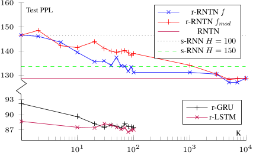

**1704.00774v3-Table1-1.png**

- Caption: Table 1: Comparison of validation and test set perplexity for r-RNTNs with f mapping (K = 100 for PTB, K = 376 for text8) versus s-RNNs and m-RNN. r-RNTNs with the same H as corresponding s-RNNs significantly increase model capacity and performance with no computational cost. The RNTN was not run on text8 due to the number of parameters required.
- Content type: table
- Figure type: N/A

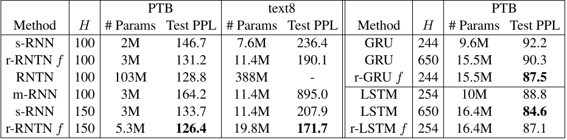

### QAs (1)
**QA 1**

- Question: What is the effect of increasing K on the test PPL of the different models?
- Answer: The test PPL of all the models decreases as K increases.
- Rationale: The figure shows that the test PPL of all the models decreases as K increases. This is because increasing K allows the models to store more information about the input sequence, which leads to better predictions.
- References: 1704.00774v3-Figure1-1.png

Referenced images:

---
## Paper: 1704.07121v2
Semantic Scholar ID: 1704.07121v2

### Figures/Tables (20)
**1704.07121v2-Figure1-1.png**

- Caption: Figure 1: An illustration of how the shortcuts in the Visual7W dataset (Zhu et al., 2016) should be remedied. In the original dataset, the correct answer “A train” is easily selected by a machine as it is far often used as the correct answer than the other decoy (negative) answers. (The numbers in the brackets are probability scores computed using eq. (2)). Our two procedures — QoU and IoU (cf. Sect. 4) — create alternative decoys such that both the correct answer and the decoys are highly likely by examining either the image or the question alone. In these cases, machines make mistakes unless they consider all information together. Thus, the alternative decoys suggested our procedures are better designed to gauge how well a learning algorithm can understand all information equally well.
- Content type: figure
- Figure type: 

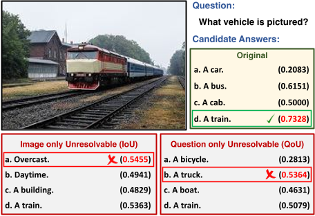

**1704.07121v2-Figure2-1.png**

- Caption: Figure 2: Example image-question-target triplets from Visual7W, VQA, and VG, together with our IoU-decoys (A, B, C.) and QoU-decoys (D, E, F). G is the target. Machine’s selections are denoted by green ticks (correct) or red crosses (wrong).
- Content type: figure
- Figure type: photograph(s)

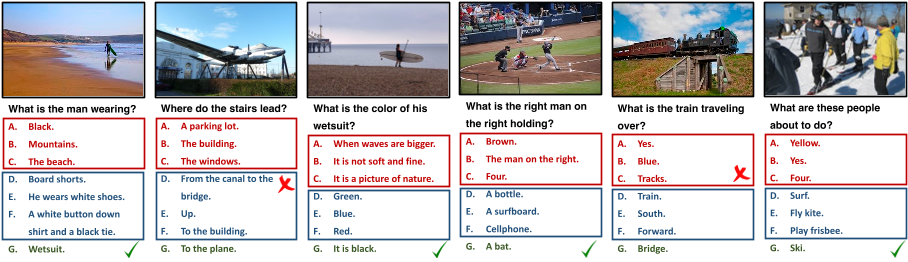

**1704.07121v2-Figure3-1.png**

- Caption: Figure 3: Ambiguous examples by our IoU-decoys (A, B, C) and QoU-decoys (D, E, F). G is the target. Ambiguous decoys F are marked.
- Content type: figure
- Figure type: photograph(s)

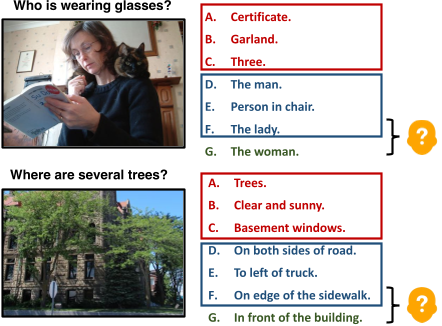

**1704.07121v2-Figure4-1.png**

- Caption: Illustration of MLP-based models.
- Content type: figure
- Figure type: schematic

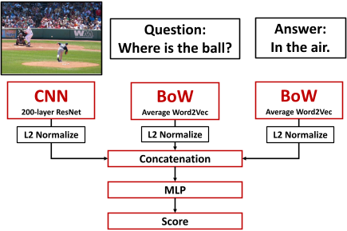

**1704.07121v2-Figure5-1.png**

- Caption: Illustration of attention-based Visual QA models.
- Content type: figure
- Figure type: schematic

**1704.07121v2-Figure6-1.png**

- Caption: User interface for human evaluation on Visual7W (IoU-decoys+QoU-decoys).
- Content type: figure
- Figure type: photograph(s)

**1704.07121v2-Figure7-1.png**

- Caption: User interface for human evaluation on Visual7W (Orig decoys), where questions are blocked.
- Content type: figure
- Figure type: photograph

**1704.07121v2-Figure8-1.png**

- Caption: User interface for human evaluation on Visual7W (Orig decoys), where images are not blocked.
- Content type: figure
- Figure type: photograph

**1704.07121v2-Table1-1.png**

- Caption: Table 1: Accuracy of selecting the right answers out of 4 choices (%) on the Visual QA task on Visual7W.
- Content type: table
- Figure type: N/A

**1704.07121v2-Table10-1.png**

- Caption: Table 10: Test accuracy (%) on VQA2−-2017val, which contains 134,813 triplets.
- Content type: table
- Figure type: N/A

**1704.07121v2-Table11-1.png**

- Caption: Table 11: Test accuracy (%) on Visual7W, comparing different embeddings for questions and answers. The results are reported for the IoU +QoU-decoys.
- Content type: table
- Figure type: N/A

**1704.07121v2-Table12-1.png**

- Caption: Table 12: Test accuracy (%) on Visual7W, comparing different random decoy strategies to our methods: (A) Orig + uniformly random decoys from unique correct answers, (B) Orig + weighted random decoys w.r.t. their frequencies, and All (Orig+IoU +QoU).
- Content type: table
- Figure type: N/A

**1704.07121v2-Table2-1.png**

- Caption: Table 2: Summary of Visual QA datasets.
- Content type: table
- Figure type: N/A

**1704.07121v2-Table3-1.png**

- Caption: Table 3: Test accuracy (%) on Visual7W.
- Content type: table
- Figure type: N/A

**1704.07121v2-Table4-1.png**

- Caption: Table 4: Accuracy (%) on the validation set in VQA.
- Content type: table
- Figure type: N/A

**1704.07121v2-Table5-1.png**

- Caption: Table 5: Test accuracy (%) on qaVG.
- Content type: table
- Figure type: N/A

**1704.07121v2-Table6-1.png**

- Caption: Table 6: Using models trained on qaVG to improve Visual7W and VQA (Accuracy in %).
- Content type: table
- Figure type: N/A

**1704.07121v2-Table7-1.png**

- Caption: Table 7: Accuracy (%) on VQA−-2014val, which contains 76,034 triplets.
- Content type: table
- Figure type: N/A

**1704.07121v2-Table8-1.png**

- Caption: Table 8: Test accuracy (%) on COCOQA.
- Content type: table
- Figure type: N/A

**1704.07121v2-Table9-1.png**

- Caption: Table 9: Test accuracy (%) on VQA2-2017val.
- Content type: table
- Figure type: N/A

### QAs (8)
**QA 1**

- Question: Which model performed best on the "All" category of Visual7W, and how did its performance compare to human performance?
- Answer: The MLP-IQA model achieved the highest accuracy in the "All" category of Visual7W, with a score of 45.1%. However, this performance still falls significantly short of human performance, which stands at 84.1% for the same category.
- Rationale: The table displays the test accuracy of various models and humans on different categories of the Visual7W dataset. The "All" category likely refers to the combined performance across all question types. By looking at the final column of the table, we can identify that MLP-IQA achieved the highest accuracy among the models. Comparing this value to the human performance shown in the same column reveals the performance gap between the best model and humans.
- References: 1704.07121v2-Table3-1.png

Referenced images:

**QA 2**

- Question: Which method performs best overall on VQA-2014val, and how does its performance compare to human performance on the same dataset?
- Answer: MLP-IQA achieves the highest overall accuracy (46.5%) among the machine learning methods tested on VQA-2014val. However, this performance still falls short of human performance, which reaches an accuracy of 85.5% on the same dataset.
- Rationale: The table shows the accuracy of different methods on VQA$^-$-2014val, a dataset containing visual question-answering triplets. The "All" column presents the overall accuracy for each method. Comparing the values in this column reveals that MLP-IQA outperforms other methods like MLP-A, MLP-IA, and MLP-QA. However, when compared to the "Human-IQA" row, it becomes evident that even the best performing machine learning method still has a significant gap in accuracy compared to human performance.
- References: 1704.07121v2-Table7-1.png

Referenced images:

**QA 3**

- Question: Which model performs the best on qaVG when considering both image understanding (IU) and question understanding (QU) individually, and how does its performance compare to humans?
- Answer: MLP-QA performs the best when considering both IU and QU individually, achieving 89.3% accuracy on IU and 45.6% accuracy on QU. However, its combined performance (IU+QU) of 43.9% is still significantly lower than human performance, which stands at 82.5%.
- Rationale: The table shows the performance of different models on qaVG for IU, QU, and their combined performance (IU+QU). By looking at the individual scores for IU and QU, we can identify MLP-QA as the top performer in both aspects. However, the table also reveals a substantial gap between the best model and human performance, indicating that there is still room for improvement in developing models that can understand both images and questions as effectively as humans.
- References: 1704.07121v2-Table5-1.png

Referenced images:

**QA 4**

- Question: How can the shortcuts in the Visual7W dataset be remedied?
- Answer: The shortcuts in the Visual7W dataset can be remedied by creating alternative decoys that are more likely to be correct, based on either the image or the question alone. This forces the machine to consider all of the information together in order to select the correct answer.
- Rationale: The figure shows an example of how the shortcuts in the Visual7W dataset can be remedied. In the original dataset, the correct answer "A train" is much more likely to be chosen than the other decoy answers. However, by using the QU and IU procedures, alternative decoys can be created that are just as likely to be correct as the original answer. This forces the machine to consider all of the information together in order to select the correct answer. 

Figure type: Schematic
- References: 1704.07121v2-Figure1-1.png

Referenced images:

**QA 5**

- Question: Which dataset presents the biggest challenge for a model trying to distinguish true triplets from decoys, and why?
- Answer: The VQA dataset presents the biggest challenge.
- Rationale: The table shows that VQA has the highest number of decoys per triplet (17), compared to Visual7W (3) and VG (-). This means that for each real triplet in VQA, there are 17 other plausible, but incorrect, triplets created as decoys. This makes it significantly harder for a model to accurately identify the true triplet among the many similar options.
- References: 1704.07121v2-Table2-1.png

Referenced images:

**QA 6**

- Question: Which embedding method performed the best overall across all model architectures on the Visual7W dataset with IoU + QoU decoys? Was there a significant difference in performance compared to the other methods?
- Answer: The MLP-IQA model achieved the highest accuracy across all embedding methods, reaching 52.5% with GloVe, 51.4% with Translation embeddings, and 52.0% with word2vec. However, the passage notes that there was no significant difference in performance between the different embedding methods.
- Rationale: The table displays the test accuracy for various combinations of model architectures and embedding methods. By comparing the values in the table, we can identify the best performing method for each model and overall. The passage further clarifies that although MLP-IQA with GloVe achieved the highest accuracy, the difference compared to other methods is not statistically significant. This suggests that the choice of embedding method might not be a crucial factor for performance on this specific dataset and with these models.
- References: 1704.07121v2-Table11-1.png

Referenced images:

**QA 7**

- Question: Which model performs the best on COCOQA dataset when considering the combined accuracy of identifying irrelevant image-question pairs (IU) and irrelevant question-answer pairs (QU)? How does this compare to the performance of the model that only observes answers?
- Answer: The MLP-IQA model performs the best when considering the combined accuracy of identifying irrelevant image-question and question-answer pairs, achieving an accuracy of 75.9%. This is significantly higher than the MLP-A model, which only observes answers and achieves a combined accuracy of 26.6%, close to random performance.
- Rationale: Table 1 shows the test accuracy on COCOQA for different models with varying access to information. The "IU+QU" column represents the combined accuracy of identifying irrelevant pairs. By comparing the values in this column for different models, we can determine which model performs best in this task. The significant difference in performance between MLP-IQA and MLP-A highlights the importance of incorporating information from images and questions, in addition to answers, for effectively identifying irrelevant pairs.
- References: 1704.07121v2-Table8-1.png

Referenced images:

**QA 8**

- Question: On the VQAv2-2017 validation set, which model performs best when considering all three sources of information (images, questions, and answers) and how does its performance compare to the model that only uses answers?
- Answer: The model that performs best on VQAv2-2017 val when considering all three sources of information is MLP-IQA. It achieves an accuracy of 61.1% on the \IU+\QU -decoys metric, significantly outperforming the model that only uses answers (MLP-A) which achieves only 27.7% on the same metric. This demonstrates the importance of incorporating all available information for accurate prediction.
- Rationale: Table 1 presents the test accuracy of different models on the VQA2-2017val dataset. The \IU+\QU -decoys column represents the scenario where both incorrect image-question pairs and incorrect question-answer pairs are used as decoys. Comparing the performance of MLP-IQA (which uses images, questions, and answers) to MLP-A (which only uses answers) in this column reveals a significant difference in accuracy, highlighting the benefit of utilizing all information sources.
- References: 1704.07121v2-Table9-1.png

Referenced images:

---
## Paper: 1705.02946v3
Semantic Scholar ID: 1705.02946v3

### Figures/Tables (10)
**1705.02946v3-Figure1-1.png**

- Caption: Figure 1: Construction for perfect. Player 1 has uniform density everywhere; y = x + 0.5, 0 < a, d ≤ 0.1, x, b, c, e > 0, x+ a+ b = 0.5 and c+ 2d+ e = 0.5.
- Content type: figure
- Figure type: ** Table

**1705.02946v3-Figure2-1.png**

- Caption: Figure 2: Construction for equitable lower bound. The distance from a connected equitable and proportional allocation is b− a, where 0 < a < b < 0.5 and 0 < x < y < 1.
- Content type: figure
- Figure type: Table

**1705.02946v3-Figure3-1.png**

- Caption: Case 1 of the simulation.
- Content type: figure
- Figure type: schematic

**1705.02946v3-Figure4-1.png**

- Caption: Case 2 of the simulation.
- Content type: figure
- Figure type: Schematic

**1705.02946v3-Figure5-1.png**

- Caption: Figure 5: Partial rigid measure system for α ∈ (`1, `1 + 2k/3]. The break points are m = x+ 2k/3, n = x + 2k/3 + 0.01k, p = y + 1.03k/3, q = y + 1.03k/3 + 0.01k. The densities are uniform on [m,n], [p, q].
- Content type: figure
- Figure type: table

**1705.02946v3-Figure6-1.png**

- Caption: Figure 6: Partial rigid measure system for α ∈ (`1 + 2k/3, `1 + k). The break points are m = x+ 2k/3− 0.01k, n = x+ 2k/3, p = y+ 0.97k/3, q = y+k/3; uniform densities on [m,n] and [p, q].
- Content type: figure
- Figure type: table

**1705.02946v3-Figure7-1.png**

- Caption: Approximate computation of ε-perfect partition. Maintain two points z and w, such that the rightmost cut must be situated in the interval [z, w]
- Content type: figure
- Figure type: schematic

**1705.02946v3-Figure8-1.png**

- Caption: Figure 8: Construction for perfect. Player 1 has uniform density everywhere; y = x + 0.5, 0 < a, d ≤ 0.1, x, b, c, e > 0, x+ a+ b = 0.5 and c+ 2d+ e = 0.5.
- Content type: figure
- Figure type: ** Table

**1705.02946v3-Table1-1.png**

- Caption: Query complexity in cake cutting in the standard query model. Our results are marked with (∗). The lower bounds for finding ε-perfect and ε-equitable allocations for n ≥ 3 players hold for any number of cuts [PW17]. The bounds for exact envy-free and proportional allocations hold for any number of cuts, except the upper bound for proportional works for connected pieces.
- Content type: table
- Figure type: table

**1705.02946v3-Table2-1.png**

- Caption: Initial configuration for envy-free lower bound.
- Content type: table
- Figure type: table

### QAs (3)
**QA 1**

- Question: What is the initial value of V2 in the interval [0.35, 0.67]?
- Answer: 0.35
- Rationale: The table shows the initial values of V1, V2, and V3 in different intervals. The value of V2 in the interval [0.35, 0.67] is shown in the second row and fourth column of the table.
- References: 1705.02946v3-Table2-1.png

Referenced images:

**QA 2**

- Question: What is the distance from equitability for the allocation that can be obtained by cutting at $x$ with the player order $(1,2)$?
- Answer: The distance from equitability is $b-a$.
- Rationale: The figure shows that for the allocation that can be obtained by cutting at $x$ with the player order $(1,2)$, player 1 gets $V_1(0,x) = 0.5+a$ and player 2 gets $V_2(x,1) = 0.5+b$. The distance from equitability is the absolute value of the difference between these two values, which is $|V_1(0,x) - V_2(x,1)| = |(0.5+a) - (0.5+b)| = b-a$.
- References: 1705.02946v3-Figure2-1.png

Referenced images:

**QA 3**

- Question: What is the upper bound on the query complexity for finding an ε-perfect allocation with minimum cuts for 3 or more players?
- Answer: O(n^3 / ε)
- Rationale: The upper bound for ε-perfect allocations with minimum cuts is shown in the third row of the table. For n ≥ 3 players, the upper bound is O(n^3 / ε).
- References: 1705.02946v3-Table1-1.png

Referenced images:

---
## Paper: 1705.09296v2
Semantic Scholar ID: 1705.09296v2

### Figures/Tables (9)
**1705.09296v2-Figure1-1.png**

- Caption: Figure 1a presents the generative story of our model. Figure 1b illustrates the inference network using the reparametrization trick to perform variational inference on our model. Shaded nodes are observed; double circles indicate deterministic transformations of parent nodes.
- Content type: figure
- Figure type: schematic

**1705.09296v2-Figure2-1.png**

- Caption: Figure 2: Topics inferred by a joint model of words and tone, and the corresponding probability of proimmigration tone for each topic. A topic is represented by the top words sorted by word probability throughout the paper.
- Content type: figure
- Figure type: ** plot

**1705.09296v2-Figure3-1.png**

- Caption: Figure 3: Learned embeddings of year-ofpublication (treated as a covariate) from combined model of news articles about immigration.
- Content type: figure
- Figure type: plot

**1705.09296v2-Table1-1.png**

- Caption: Table 1: Performance of our various models in an unsupervised setting (i.e., without labels or covariates) on the IMDB dataset using a 5,000-word vocabulary and 50 topics. The supplementary materials contain additional results for 20 newsgroups and Yahoo answers.
- Content type: table
- Figure type: N/A

**1705.09296v2-Table2-1.png**

- Caption: Table 2: Accuracy of various models on three datasets with categorical labels.
- Content type: table
- Figure type: N/A

**1705.09296v2-Table3-1.png**

- Caption: Table 3: Top words for topics (left) and the corresponding anti-immigration (middle) and pro-immigration (right) variations when treating tone as a covariate, with interactions.
- Content type: table
- Figure type: N/A

**1705.09296v2-Table4-1.png**

- Caption: Performance of various models on the 20 newsgroups dataset with 20 topics and a 2,000- word vocabulary.
- Content type: table
- Figure type: table

**1705.09296v2-Table5-1.png**

- Caption: Table 5: Performance of various models on the Yahoo answers dataset with 250 topics and a 5,000- word vocabulary. SAGE did not finish in 72 hours so we omit it from this table.
- Content type: table
- Figure type: N/A

**1705.09296v2-Table6-1.png**

- Caption: Topics from the unsupervised SCHOLAR on the 20 newsgroups dataset, and the corresponding internal coherence values.
- Content type: table
- Figure type: table

### QAs (7)
**QA 1**

- Question: Which year is most associated with the terms "sept", "hijackers", and "attacks"?
- Answer: 2001
- Rationale: The figure shows that the year 2001 is located highest on the vertical axis, which is associated with the terms "sept", "hijackers", and "attacks". This suggests that these terms are most prevalent in articles published in 2001.
- References: 1705.09296v2-Figure3-1.png

Referenced images:

**QA 2**

- Question: Which node in the generative model represents the latent variable?
- Answer: The node labeled η represents the latent variable.
- Rationale: Latent variables are not directly observed, but are inferred from the observed data. In the generative model,  η  is not shaded, indicating that it is not observed.
- References: 1705.09296v2-Figure1-1.png

Referenced images:

**QA 3**

- Question: Which model achieves the best NPMI scores (both internal and external) in the unsupervised setting, and what trade-off does this model exhibit compared to other models?
- Answer: The Scholar + w.v. model achieves the best NPMI scores (both internal and external) in the unsupervised setting. However, this model also has the highest number of people parameters, indicating a trade-off between topic coherence and model complexity.
- Rationale: Table 1 shows the performance of various topic models on the IMDB dataset in an unsupervised setting. The NPMI scores (both internal and external) measure the coherence of the topics generated by each model, with higher scores indicating more coherent topics. The "Ppl." column indicates the number of people parameters in each model, which reflects its complexity. By comparing the NPMI scores and the number of people parameters across the models, we can identify the trade-offs between topic coherence and model complexity. In this case, Scholar + w.v. achieves the best coherence but also requires the most parameters.
- References: 1705.09296v2-Table1-1.png

Referenced images:

**QA 4**

- Question: Which topic has the highest internal coherence value?
- Answer: The topic with the highest internal coherence value is "turks armenian armenia turkish roads escape soviet muslim mountain soul".
- Rationale: The table shows the internal coherence values for each topic. The topic with the highest value is listed at the top of the table.
- References: 1705.09296v2-Table6-1.png

Referenced images:

**QA 5**

- Question: Which model performed best on the IMDB dataset for classifying documents with categorical labels, and how much better did it perform compared to the SLDA model?
- Answer: Both the SCHOLAR (covariates) and Logistic Regression models achieved the highest accuracy of 0.87 on the IMDB dataset. This represents a 0.23 improvement over the SLDA model, which achieved an accuracy of 0.64.
- Rationale: Table 1 displays the accuracy of different models on three datasets, including IMDB. By comparing the accuracy values in the IMDB column, we can identify the best performing model(s). The difference in accuracy between the top model(s) and SLDA can be calculated by subtracting the SLDA accuracy from the highest accuracy value.
- References: 1705.09296v2-Table2-1.png

Referenced images:

**QA 6**

- Question: Which topic is most likely to be associated with a pro-immigration stance?
- Answer: "english language city spanish community"
- Rationale: The figure shows the probability of pro-immigration tone for each topic, and "english language city spanish community" has the highest probability (close to 1). This suggests that articles that discuss topics related to English language, city, Spanish community are more likely to have a pro-immigration stance.
- References: 1705.09296v2-Figure2-1.png

Referenced images:

**QA 7**

- Question: How does the model capture different perspectives on immigration when considering tone as a covariate?
- Answer: The model captures different perspectives on immigration by highlighting contrasting words associated with the same topic, depending on whether the tone is anti-immigration or pro-immigration.
- Rationale: Table 1 displays several base topics related to immigration. For each topic, the table shows the most significant words associated with the anti-immigration and pro-immigration interactions. These words often represent opposing viewpoints on the same issue. For example, the topic "ice customs agency enforcement homeland" has contrasting words like "criminal" and "detainees" for anti-immigration and pro-immigration perspectives, respectively. This pattern suggests that the model can differentiate between different stances on immigration by considering the interaction between tone and topic.
- References: 1705.09296v2-Table3-1.png

Referenced images:

---
## Paper: 1706.00633v4
Semantic Scholar ID: 1706.00633v4

### Figures/Tables (13)
**1706.00633v4-Figure1-1.png**

- Caption: Figure 1: a, The three black solid lines are the decision boundary of the classifier, and each black line (both solid and dashed parts) is the decision boundary between two classes. The blue dot-dashed lines are the isolines of non-ME = t. b, t-SNE visualization of the final hidden vectors on CIFAR-10. The model is Resnet-32. The training procedure is CE. c, The training procedure is RCE. d, Practical attacks on the trained networks. Blue regions are of the original classes for normal examples, and red regions are of the target classes for adversarial ones.
- Content type: figure
- Figure type: ** Schematic

**1706.00633v4-Figure2-1.png**

- Caption: Robustness with the thresholding test strategy disabled. The model of target networks is Resnet-32.
- Content type: figure
- Figure type: plot

**1706.00633v4-Figure3-1.png**

- Caption: The normal test images are termed as Normal, and adversarial examples generated on Resnet-32 (CE) and Resnet-32 (RCE) are separately termed as CE / RCE. Adversarial examples are generated by C&W-wb with minimal distortions.
- Content type: figure
- Figure type: ** photograph(s)

**1706.00633v4-Figure4-1.png**

- Caption: Classification error rates on CIFAR-10. Two panels separately show the results when the networks are trained via the CE and RCE. The models is Resnet-32.
- Content type: figure
- Figure type: plot

**1706.00633v4-Figure5-1.png**

- Caption: Number of images w.r.t. K-density. The target networks are trained by the CE.
- Content type: figure
- Figure type: plot

**1706.00633v4-Figure6-1.png**

- Caption: Number of images w.r.t. K-density. The target networks are trained by the RCE.
- Content type: figure
- Figure type: plot

**1706.00633v4-Figure7-1.png**

- Caption: The network is Resnet-32, the dataset is CIFAR-10.
- Content type: figure
- Figure type: plot

**1706.00633v4-Table1-1.png**

- Caption: Classification error rates (%) on test sets.
- Content type: table
- Figure type: table

**1706.00633v4-Table2-1.png**

- Caption: Table 2: AUC-scores (10−2) of adversarial examples. The model of target networks is Resnet-32. Values are calculated on the examples which are correctly classified as normal examples and then misclassified as adversarial counterparts. Bandwidths used when calculating K-density are σ2 CE = 1/0.26 and σ2 RCE = 0.1/0.26. Here (-) indicates the strong baseline, and (*) indicates our defense method.
- Content type: table
- Figure type: N/A

**1706.00633v4-Table3-1.png**

- Caption: The ratios of f2(x∗) > 0 and minimal distortions of the adversarial examples crafted by C&W-wb. Model is Resnet-32.
- Content type: table
- Figure type: table

**1706.00633v4-Table4-1.png**

- Caption: AUC-scores (10−2) on CIFAR-10. Resnet-32 is the substitute model and Resnet-56 is the target model.
- Content type: table
- Figure type: table

**1706.00633v4-Table5-1.png**

- Caption: Table 5: The average time costs (s) on crafting each adversarial example via different attacks. The values are also the average values between MNIST and CIFAR-10. The models is Resnet-32.
- Content type: table
- Figure type: N/A

**1706.00633v4-Table6-1.png**

- Caption: Table 6: The ratios (%) of f2(x∗) > 0 of the adversarial examples crafted by the high-confidence version of C&W-wb on MNIST and CIFAR-10. The model is Resnet-32 and the metric is K-density.
- Content type: table
- Figure type: N/A

### QAs (9)
**QA 1**

- Question: Which method performed better on the MNIST dataset, ResNet-32 (CE) or ResNet-56 (RCE)?
- Answer: ResNet-56 (RCE) performed better on the MNIST dataset with a classification error rate of 0.32% compared to ResNet-32 (CE) which had a classification error rate of 0.38%.
- Rationale: The table shows the classification error rates for different methods on the MNIST and CIFAR-10 datasets. We can compare the error rates for the two methods on the MNIST dataset to see which one performed better.
- References: 1706.00633v4-Table1-1.png

Referenced images:

**QA 2**

- Question: Which combination of training procedure and thresholding metric consistently performs the best across both MNIST and CIFAR-10 datasets for all attack types?
- Answer: RCE training combined with the K-density metric consistently performs the best across both MNIST and CIFAR-10 datasets for all attack types.
- Rationale: Table 2 presents the AUC-scores of different combinations of training procedures (CE and RCE) and thresholding metrics (Confidence, non-ME, and K-density) for various attack types. By comparing the scores across rows and columns, we can identify the best performing combination. In this case, the entries marked with (*) represent the RCE training and K-density metric combination, and they consistently show the highest or near-highest AUC-scores for all attack types on both datasets.
- References: 1706.00633v4-Table2-1.png

Referenced images:

**QA 3**

- Question: Which attack method is the most effective at reducing the accuracy of the Resnet-32 model on the MNIST dataset?
- Answer: The most effective attack method at reducing the accuracy of the Resnet-32 model on the MNIST dataset is BIM/CE.
- Rationale: The figure shows the classification accuracy of the Resnet-32 model on the MNIST dataset under different attack methods. BIM/CE achieves the lowest accuracy of all the methods, indicating that it is the most effective at reducing the accuracy of the model.
- References: 1706.00633v4-Figure2-1.png

Referenced images:

**QA 4**

- Question: Which of the following algorithms performs the best when trained via the CE?
- Answer: C&W-hc
- Rationale: The figure shows the error rates for different algorithms when trained via the CE and RCE. The C&W-hc algorithm has the lowest error rate when trained via the CE.
- References: 1706.00633v4-Figure4-1.png

Referenced images:

**QA 5**

- Question: How does the accuracy of the model change as the value of c increases?
- Answer: The accuracy of the model decreases as the value of c increases.
- Rationale: The figure shows that the accuracy of the model is highest when c is small and decreases as c increases.
- References: 1706.00633v4-Figure7-1.png

Referenced images:

**QA 6**

- Question: Which objective function resulted in a higher ratio of f2(x∗) > 0 for the MNIST dataset?
- Answer: RCE
- Rationale: The table shows that the ratio of f2(x∗) > 0 for RCE is 0.77, while the ratio for CE is 0.01.
- References: 1706.00633v4-Table3-1.png

Referenced images:

**QA 7**

- Question: Which type of adversarial example generation method results in images that are visually more similar to the original images?
- Answer: The CE method results in images that are visually more similar to the original images than the RCE method.
- Rationale: The figure shows that the CE images have less distortion than the RCE images. This is evident in the MNIST and CIFAR-10 datasets, where the CE images are visually very similar to the original images, while the RCE images have more noticeable distortions.
- References: 1706.00633v4-Figure3-1.png

Referenced images:

**QA 8**

- Question: How does the proposed metric of non-ME help detect adversarial examples?
- Answer: The non-ME metric measures the entropy of the normalized non-maximal elements in the final hidden vector of the classifier. Adversarial examples often have low non-ME values, indicating that they are close to the decision boundary and have high confidence in the incorrect class.
- Rationale: Figure 1a shows that the isolines of non-ME=t (blue dot-dashed lines) are close to the decision boundary (black solid lines). Adversarial examples that successfully fool the detector (red dots in Figure 1d) tend to fall near the decision boundary, where the non-ME value is low. In contrast, normal examples (blue dots in Figure 1d) and adversarial examples that fail to fool the detector (open circles in Figure 1d) have higher non-ME values.
- References: 1706.00633v4-Figure1-1.png

Referenced images:

**QA 9**

- Question: Based on the table, which attack method is the most efficient in terms of time taken to craft an adversarial example, and how much faster is it compared to the slowest method for the same objective function?
- Answer: The FGSM attack is the most efficient, requiring approximately 1.9 milliseconds to craft an adversarial example with the CE objective function. This is roughly **55,000 times faster** than the slowest method, C&W-wb, which takes about 700 seconds for the same objective function.
- Rationale: The table presents the average time costs for different attack methods on both MNIST and CIFAR-10 datasets with the ResNet-32 model. By comparing the values in the "Time" column, we can identify the fastest and slowest methods. The table also specifies the objective function used (CE or RCE), allowing us to compare methods under the same conditions.
- References: 1706.00633v4-Table5-1.png

Referenced images:

---
## Paper: 1706.04284v3
Semantic Scholar ID: 1706.04284v3

### Figures/Tables (8)
**1706.04284v3-Figure1-1.png**

- Caption: (a) Upper: conventional semantic segmentation pipeline; lower: our proposed framework for joint image denoising and semantic segmentation. (b) Zoom-in regions of a noisy input, its denoised estimates using CBM3D and our proposed method, as well as its ground truth.
- Content type: figure
- Figure type: schematic

**1706.04284v3-Figure2-1.png**

- Caption: (a) Overview of our proposed denoising network. (b) Architecture of the feature encoding module. (c) Architecture of the feature decoding module.
- Content type: figure
- Figure type: schematic

**1706.04284v3-Figure3-1.png**

- Caption: Overview of our proposed cascaded network.
- Content type: figure
- Figure type: schematic

**1706.04284v3-Figure4-1.png**

- Caption: (a) Two image denoising examples from Kodak dataset. We show (I) the ground truth image and the zoom-in regions of: (II) the denoised image by CBM3D; (III) the denoised image by DnCNN; the denoising result of our proposed model (IV) without the guidance of high-level vision information; (V) with the guidance of high-level vision information and (VI) the ground truth.
- Content type: figure
- Figure type: photograph(s)

**1706.04284v3-Figure5-1.png**

- Caption: Two semantic segmentation examples from Pascal VOC 2012 validation set. From left to right: (a) the ground truth image, the denoised image using (b) the separately trained denoiser, (c) the denoiser trained with the reconstruction and segmentation joint loss, and (d) the denoiser trained with the classification network and evaluated for semantic segmentation. Their corresponding segmentation label maps are shown below. The zoom-in region which generates inaccurate segmentation in (b) is displayed in the red box.
- Content type: figure
- Figure type: ** photograph(s)

**1706.04284v3-Table1-1.png**

- Caption: Table 1: Color image denoising results (PSNR) of different methods on Kodak dataset. The best result is shown in bold.
- Content type: table
- Figure type: N/A

**1706.04284v3-Table2-1.png**

- Caption: Table 2: Classification accuracy after denoising noisy image input, averaged over ILSVRC2012 validation dataset. Red is the best and blue is the second best results.
- Content type: table
- Figure type: N/A

**1706.04284v3-Table3-1.png**

- Caption: Table 3: Segmentation results (mIoU) after denoising noisy image input, averaged over Pascal VOC 2012 validation dataset. Red is the best and blue is the second best results.
- Content type: table
- Figure type: N/A

### QAs (4)
**QA 1**

- Question: What is the difference between the conventional semantic segmentation pipeline and the proposed framework for joint image denoising and semantic segmentation?
- Answer: The conventional semantic segmentation pipeline performs semantic segmentation directly on the noisy input image, while the proposed framework first denoises the image before performing semantic segmentation.
- Rationale: This can be seen in Figure (a), which shows the two pipelines side-by-side. The conventional pipeline has a single step, where the noisy input image is fed into a semantic segmentation network. The proposed framework has two steps: first, the noisy input image is denoised using a denoising network, and then the denoised image is fed into a semantic segmentation network.
- References: 1706.04284v3-Figure1-1.png

Referenced images:

**QA 2**

- Question: Which denoiser performs the best on the sheep image, and how can you tell?
- Answer: The denoiser trained with the classification network and evaluated for semantic segmentation performs the best on the sheep image. This is because the segmentation label map for this denoiser is the most accurate, and it correctly identifies the sheep's body and legs.
- Rationale: The figure shows the ground truth image and the denoised images using different denoisers. The segmentation label maps below each image show how well each denoiser performs. The denoiser trained with the classification network and evaluated for semantic segmentation has the most accurate segmentation label map, indicating that it performs the best.
- References: 1706.04284v3-Figure5-1.png

Referenced images:

**QA 3**

- Question: What is the purpose of the skip connections in the proposed denoising network?
- Answer: The skip connections are used to combine the features from the encoding and decoding modules at each scale. This helps to preserve the spatial information that is lost during the downsampling and upsampling operations.
- Rationale: The figure shows that the skip connections connect the output of the feature encoding module at each scale to the input of the feature decoding module at the same scale. This allows the decoding module to access the features from the encoding module, which helps to improve the reconstruction of the image.
- References: 1706.04284v3-Figure2-1.png

Referenced images:

**QA 4**

- Question: Which denoising method performs the best on average across all noise levels tested on the Kodak dataset?
- Answer: The proposed method performs the best on average across all noise levels tested on the Kodak dataset.
- Rationale: The last row of Table 1 shows the average PSNR for each method across all images in the Kodak dataset. For each noise level (σ = 25, 35, and 50), the proposed method achieves the highest average PSNR compared to the other methods listed. This indicates that, on average, the proposed method performs the best in terms of denoising images from the Kodak dataset for the tested noise levels.
- References: 1706.04284v3-Table1-1.png

Referenced images:

---
## Paper: 1707.01917v2
Semantic Scholar ID: 1707.01917v2

### Figures/Tables (7)
**1707.01917v2-Figure1-1.png**

- Caption: Overview of Step 1 of TFBA. Rather than factorizing the higher-order tensor X , TFBA performs joint Tucker decomposition of multiple 3-mode tensors, X 1, X 2, and X 3, derived out of X . This joint factorization is performed using shared latent factors A, B, and C. This results in binary schemata, each of which is stored as a cell in one of the core tensors G1, G2, and G3. Please see Section 3.2.1 for details.
- Content type: figure
- Figure type: schematic

**1707.01917v2-Figure2-1.png**

- Caption: Overview of Step 2 of TFBA. Induction of higher-order schemata from the tri-partite graph formed from the columns of matrices A, B, and C. Triangles in this graph (solid) represent a 3-ary schema, n-ary schemata for n > 3 can be induced from the 3-ary schemata. Please refer to Section 3.2.2 for details.
- Content type: figure
- Figure type: Schematic

**1707.01917v2-Table1-1.png**

- Caption: Notations used in the paper.
- Content type: table
- Figure type: table

**1707.01917v2-Table2-1.png**

- Caption: Details of dimensions of tensors constructed for each dataset used in the experiments.
- Content type: table
- Figure type: table

**1707.01917v2-Table3-1.png**

- Caption: Details of hyper-parameters set for different datasets.
- Content type: table
- Figure type: table

**1707.01917v2-Table4-1.png**

- Caption: Examples of schemata induced by TFBA. Please note that some of them are 3-ary while others are 4-ary. For details about schema induction, please refer to Section 3.2.
- Content type: table
- Figure type: table

**1707.01917v2-Table5-1.png**

- Caption: Higher-order RSI accuracies of various methods on the three datasets. Induced schemata for each dataset and method are evaluated by three human evaluators, E1, E2, and E3. TFBA performs better than HardClust for Shootings and NYT Sports datasets. Even though HardClust achieves better accuracy on MUC dataset, it has several limitations, see Section 4 for more details. Chambers-13 solves a slightly different problem called event schema induction, for more details about the comparison with Chambers-13 see Section 4.1.
- Content type: table
- Figure type: table

### QAs (6)
**QA 1**

- Question: What does the induced schema Win <A4, B3, C2> represent?
- Answer: The induced schema Win <A4, B3, C2> represents the fact that player A4 won tournament C2, defeating player B3.
- Rationale: The induced schema is shown in the bottom right corner of the figure. It is derived from the tri-partite graph, which shows the relationships between players (A), opponents (B), and tournaments (C). The schema Win <A4, B3, C2> indicates that there is a connection between player A4, opponent B3, and tournament C2, and that this connection represents a win for player A4.
- References: 1707.01917v2-Figure2-1.png

Referenced images:

**QA 2**

- Question: Which dataset has the highest value for the hyperparameter  λa?
- Answer: The NYT Sports dataset has the highest value for λa (0.9).
- Rationale: The table shows the values of the hyperparameters for each dataset. The NYT Sports dataset has the highest value for λa.
- References: 1707.01917v2-Table3-1.png

Referenced images:

**QA 3**

- Question: What is the shape of the tensor $x^1$ for the Shootings dataset?
- Answer: The shape of the tensor $x^1$ for the Shootings dataset is 3365 x 1295 x 50.
- Rationale: The table in the image shows the dimensions of the tensors constructed for each dataset used in the experiments. The first column of the table lists the datasets, and the second column lists the shapes of the corresponding $x^1$ tensors. The shape of the tensor $x^1$ for the Shootings dataset is given in the second row of the table as 3365 x 1295 x 50.
- References: 1707.01917v2-Table2-1.png

Referenced images:

**QA 4**

- Question: What is the definition of a non-negative tensor?
- Answer: A non-negative tensor is a tensor whose elements are all non-negative real numbers.
- Rationale: The figure defines a non-negative tensor as an element of the set of non-negative real numbers raised to the power of the tensor's order.
- References: 1707.01917v2-Table1-1.png

Referenced images:

**QA 5**

- Question: What is the role of OpenIE in Step 1 of TFBA?
- Answer: OpenIE is used to extract tuples from the unlabeled text corpus. These tuples are then used to create the 3-mode tensors X1, X2, and X3.
- Rationale: The figure shows that OpenIE is used to process the unlabeled text corpus and produce tuples. These tuples are then used as input to the joint Tucker decomposition process, which produces the binary schemata.
- References: 1707.01917v2-Figure1-1.png

Referenced images:

**QA 6**

- Question: Which method achieves the highest accuracy on the Shootings dataset?
- Answer: TFBA
- Rationale: The table shows the accuracy of different methods on different datasets. For the Shootings dataset, TFBA has the highest average accuracy of 0.76.
- References: 1707.01917v2-Table5-1.png

Referenced images:

---
## Paper: 1708.00160v2
Semantic Scholar ID: 1708.00160v2

### Figures/Tables (12)
**1708.00160v2-Figure1-1.png**

- Caption: Left to right: (partial) constructed FP-Tree after adding each of the three given samples. The right-most tree is the final FP-Tree that represents all input samples.
- Content type: figure
- Figure type: schematic

**1708.00160v2-Figure2-1.png**

- Caption: FP-Tree with corresponding support values of the nodes.
- Content type: figure
- Figure type: schematic

**1708.00160v2-Figure3-1.png**

- Caption: Conditional FP-Tree for the p = {head=F} pattern.
- Content type: figure
- Figure type: schematic

**1708.00160v2-Figure4-1.png**

- Caption: Conditional FP-Tree for the p = {head=F, ant=NAM} pattern.
- Content type: figure
- Figure type: schematic

**1708.00160v2-Figure5-1.png**

- Caption: A sample decision tree and the list of all extracted feature conjunctions based on Fernandes et al.’s (2012) approach.
- Content type: figure
- Figure type: schematic

**1708.00160v2-Table1-1.png**

- Caption: Table 1: Impact of linguistic features on deep-coref models on the CoNLL development set.
- Content type: table
- Figure type: N/A

**1708.00160v2-Table2-1.png**

- Caption: Out-of-domain evaluation of deep-coref models on the WikiCoref dataset.
- Content type: table
- Figure type: table

**1708.00160v2-Table3-1.png**

- Caption: Evaluating the informativeness of DDPMine, MPP and EPM patterns on standard datasets.
- Content type: table
- Figure type: table

**1708.00160v2-Table4-1.png**

- Caption: Table 4: Comparisons on the CoNLL test set. The F1 gains that are statistically significant: (1) “+EPM” compared to “toppairs”, “ranking” and “JIM”, (2) “+EPM” compared to “reinforce” based on MUC, B3 and LEA, (3) “single” compared to “+EPM” based on MUC and B3, and (4) “ensemble” compared to other systems. Significance is measured based on the approximate randomization test (p < 0.05) (Noreen, 1989).
- Content type: table
- Figure type: N/A

**1708.00160v2-Table5-1.png**

- Caption: Table 5: Impact of different EPM feature groups on the CoNLL development set.
- Content type: table
- Figure type: N/A

**1708.00160v2-Table6-1.png**

- Caption: Table 6: Out-of-domain evaluation on the WikiCoref dataset. The highest F1 scores are boldfaced.
- Content type: table
- Figure type: N/A

**1708.00160v2-Table7-1.png**

- Caption: Table 7: In-domain and out-of-domain evaluations for the pt and wb genres of the CoNLL test set. The highest scores are boldfaced.
- Content type: table
- Figure type: N/A

### QAs (4)
**QA 1**

- Question: What is the probability of finding the pattern {head=F, ant=NAM} in the data?
- Answer: 1
- Rationale: The figure shows the conditional FP-Tree for the pattern {head=F, ant=NAM}. The numbers in parentheses next to each node represent the support of the itemset represented by the path from the root to that node. The support of the pattern {head=F, ant=NAM} is 1.0, which means that the pattern appears in all of the transactions in the data.
- References: 1708.00160v2-Figure4-1.png

Referenced images:

**QA 2**

- Question: What is the support value of the node "ana=NAM"?
- Answer: 2
- Rationale: The support value of a node is the number of transactions that contain the itemset represented by the node. In this case, the node "ana=NAM" has a support value of 2, which means that there are 2 transactions that contain the itemset "ana=NAM".
- References: 1708.00160v2-Figure2-1.png

Referenced images:

**QA 3**

- Question: Which coreference model performs best on the CoNLL test set according to the F$_1$ score? Is this performance statistically significant compared to all other models in the table?
- Answer: The "ensemble" model of e2ef achieves the highest F$_1$ score of 68.83 on the CoNLL test set. Yes, this performance is statistically significant compared to all other models listed in the table, as indicated by the caption and footnote referencing the approximate randomization test.
- Rationale: The table presents the performance of different coreference models on the CoNLL test set using various metrics, including F$_1$ score. By looking at the "CoNLL" column and comparing the F$_1$ values, we can identify the "ensemble" model of e2e-coref as having the highest score. The caption further clarifies which performance differences are statistically significant, confirming that the "ensemble" model's superior performance is statistically meaningful.
- References: 1708.00160v2-Table4-1.png

Referenced images:

**QA 4**

- Question: Which deep-coref model performed best on the WikiCoref dataset, according to the table?
- Answer: The CoNLL model performed best on the WikiCoref dataset, with an F1 score of 53.40 when using the +linguistic evaluation metric.
- Rationale: The table shows the performance of several deep-coref models on the WikiCoref dataset, measured using three different evaluation metrics: ranking, top-pairs, and +linguistic. The CoNLL model achieved the highest F1 score for all three metrics.
- References: 1708.00160v2-Table2-1.png

Referenced images:

---
## Paper: 1708.05239v3
Semantic Scholar ID: 1708.05239v3

### Figures/Tables (10)
**1708.05239v3-Figure1-1.png**

- Caption: Figure 1: Original target density π(x) (left) and extended target (right) with N = 2.
- Content type: figure
- Figure type: plot

**1708.05239v3-Figure10-1.png**

- Caption: Log-predictive density on held-out test data (random 20% of full data) for the prostate cancer dataset comparing the HMC and pseudo-extended HMC samplers, with N = 2 and N = 5. For the case of fixed β = [0.25, 0.5, 0.75], the number of pseudo-samples N = 2.
- Content type: figure
- Figure type: plot

**1708.05239v3-Figure2-1.png**

- Caption: Figure 2: 10,000 samples drawn from the the target under scenario (a) (left) and scenario (b) (right) using the HMC and pseudo-extended HMC samplers.
- Content type: figure
- Figure type: ** plot

**1708.05239v3-Figure3-1.png**

- Caption: Figure 3: Two-dimensional projection of 10, 000 samples drawn from the target using each of the proposed methods, where the first plot gives the ground-truth sampled directly from the Boltzmann machine relaxation distribution. A temperature ladder of length 1,000 was used for both simulated tempering and annealed importance sampling.
- Content type: figure
- Figure type: plot

**1708.05239v3-Figure4-1.png**

- Caption: Figure 4: Root mean squared error (log scale) of the first and second moment of the target taken over 10 independent simulations and calculated for each of the proposed methods. Results labeled [0.1-0.9] correspond to pseudo-extended MCMC with fixed β = [0.1− 0.9].
- Content type: figure
- Figure type: plot

**1708.05239v3-Figure5-1.png**

- Caption: Log-predictive densities on held-out test data (random 20% of full data) for two cancer datasets comparing the HMC and pseudo-extended HMC samplers, with N = 2 and N = 5. For the case of fixed β = [0.25, 0.5, 0.75], the number of pseudo-samples N = 2.
- Content type: figure
- Figure type: plot

**1708.05239v3-Figure6-1.png**

- Caption: Figure 6: 10,000 samples from the target (left) and extended target (right) using HMC sampler
- Content type: figure
- Figure type: plot

**1708.05239v3-Figure7-1.png**

- Caption: Figure 7: Average mean squared error (MSE) (given on the log scale) of the first and second moments taken over 20 independent simulations for varying number of pseudo-samples N , where MSE is scaled by computational time (CT) and plotted as MSE× CT.
- Content type: figure
- Figure type: plot

**1708.05239v3-Figure8-1.png**

- Caption: Figure 8: Average mean squared error (MSE) (given on the log scale) taken over 10 independent simulations with varying number of pseudo-samples N , where the MSE is scaled by computational time as MSE× CT
- Content type: figure
- Figure type: plot

**1708.05239v3-Figure9-1.png**

- Caption: Plots of marginal posterior densities for a random subsample of variables. Each column represents a different variable and each row is a different MCMC sampler, HMC, PE-HMC (N=2) and PE-HMC (N=5), respectively
- Content type: figure
- Figure type: plot

### QAs (2)
**QA 1**

- Question: Which MCMC sampler appears to have the most consistent performance across the different variables?
- Answer: PE-HMC (N=5)
- Rationale: The marginal posterior densities for PE-HMC (N=5) are all relatively similar in shape and spread, suggesting that this sampler is able to effectively explore the posterior distribution for all of the variables. In contrast, the other two samplers show more variability in their performance across the different variables.
- References: 1708.05239v3-Figure9-1.png

Referenced images:

**QA 2**

- Question: How does the performance of the PE-N=5 sampler compare to the HMC sampler?
- Answer: The PE-N=5 sampler performs better than the HMC sampler.
- Rationale: The box plot for the PE-N=5 sampler is higher than the box plot for the HMC sampler, indicating that the PE-N=5 sampler has a higher log-predictive density on held-out test data.
- References: 1708.05239v3-Figure10-1.png

Referenced images:

---
## Paper: 1709.02755v5
Semantic Scholar ID: 1709.02755v5

### Figures/Tables (8)
**1709.02755v5-Figure1-1.png**

- Caption: Figure 1: Average processing time in milliseconds of a batch of 32 samples using cuDNN LSTM, wordlevel convolution conv2d (with filter width k = 2 and k = 3), and the proposed SRU. We vary the number of tokens per sequence (l) and feature dimension (d).
- Content type: figure
- Figure type: plot

**1709.02755v5-Figure2-1.png**

- Caption: Figure 2: Training curves of SRU on classification. The x-axis is the number of training steps and the y-axis is the training loss. Scaling correction improves the training progress, especially for deeper models with many stacked layers.
- Content type: figure
- Figure type: plot

**1709.02755v5-Figure3-1.png**

- Caption: Figure 3: Mean validation accuracies (y-axis) and standard deviations of the CNN, 2-layer LSTM and 2-layer SRU models. We plot the curves of the first 100 epochs. X-axis is the training time used (in seconds). Timings are performed on NVIDIA GeForce GTX 1070 GPU, Intel Core i7-7700K Processor and cuDNN 7003.
- Content type: figure
- Figure type: plot

**1709.02755v5-Figure6-1.png**

- Caption: Figure 6: Empirical estimation of the variance ratio Var[ct]/Var[xt] at each layer in a randomly initialized SRU model. We use the pre-trained word2vec embeddings as input, resulting an initial ratio slightly higher than 1/3. As expected, the ratio increases to 1 in deep layers.
- Content type: figure
- Figure type: plot

**1709.02755v5-Table1-1.png**

- Caption: Table 1: Test accuracies on classification benchmarks (Section 4.1). The first block presents best reported results of various methods. The second block compares SRU and other baselines given the same setup. For the SST dataset, we report average results of 5 runs. For other datasets, we perform 3 independent trials of 10-fold cross validation (3×10 runs). The last column compares the wall clock time (in seconds) to finish 100 epochs on the SST dataset.
- Content type: table
- Figure type: N/A

**1709.02755v5-Table2-1.png**

- Caption: Table 2: Exact match (EM) and F1 scores of various models on SQuAD (Section 4.2). We also report the total processing time per epoch and the time spent in RNN computations. SRU outperforms other models, and is more than five times faster than cuDNN LSTM.
- Content type: table
- Figure type: N/A

**1709.02755v5-Table4-1.png**

- Caption: Table 4: Validation and test BPCs of different recurrent models on Enwik8 dataset. The last column presents the training time per epoch. For SRU with projection, we set the projection dimension to 512.
- Content type: table
- Figure type: N/A

**1709.02755v5-Table6-1.png**

- Caption: Table 6: Translation training configuration.
- Content type: table
- Figure type: N/A

### QAs (7)
**QA 1**

- Question: How does the validation accuracy of the SRU model compare to that of the cuDNN LSTM and CNN models?
- Answer: The SRU model achieves comparable or slightly higher validation accuracy than the cuDNN LSTM and CNN models on all six benchmarks.
- Rationale: Figure 2 shows the mean validation accuracies of the three models on the six benchmarks. The SRU model's curve is generally above or close to the curves of the other two models, indicating that it achieves comparable or slightly higher accuracy.
- References: 1709.02755v5-Figure3-1.png

Referenced images:

**QA 2**

- Question: How does the processing time of SRU compare to that of cuDNN LSTM and word-level convolution with filter widths k=2 and k=3?
- Answer: The processing time of SRU is significantly faster than that of cuDNN LSTM and word-level convolution with filter widths k=2 and k=3.
- Rationale: The figure shows the average processing time of a batch of 32 samples using different architectures. The x-axis shows the number of tokens per sequence (l) and feature dimension (d), and the y-axis shows the processing time in milliseconds. The figure shows that SRU has a lower processing time than the other architectures across all values of l and d.
- References: 1709.02755v5-Figure1-1.png

Referenced images:

**QA 3**

- Question: According to Table 1 and the passage, how does the performance of the SRU model compare to the LSTM model in terms of both accuracy and training speed on the SQuAD dataset?
- Answer: The SRU model outperforms the LSTM model in both accuracy and training speed on the SQuAD dataset.
- Rationale: Table 1 shows that the SRU model achieves higher EM and F1 scores compared to the LSTM model. Additionally, the passage states that SRU exhibits over 5x speed-up over LSTM and 53-63% reduction in total training time. This indicates that SRU not only achieves better accuracy but also trains significantly faster than the LSTM model.
- References: 1709.02755v5-Table2-1.png

Referenced images:

**QA 4**

- Question: Based on the table, how does the training process handle large vocabulary sizes?
- Answer: The training process uses several techniques to handle large vocabulary sizes. These include:

1. **Token-based batching:** Instead of grouping sentences of similar lengths together, the training process batches together a fixed number of tokens (5120 tokens per batch). This approach ensures that the model sees a consistent amount of vocabulary regardless of sentence length variation.
2. **Shared embedding:** This technique maps both source and target words to the same embedding space, effectively reducing the memory footprint needed to store word representations. 
3. **Positional encoding:** This method injects information about the position of words in a sentence into the model, helping it better understand long-range dependencies within the text.
- Rationale: The table provides various hyperparameters used for training the translation model. By analyzing specific parameters like `batch_type`, `share_embedding`, and `position_encoding`, we can understand how the model is designed to cope with large vocabularies. These specific settings enable efficient processing and representation of large vocabulary sizes within the model's memory and architecture.
- References: 1709.02755v5-Table6-1.png

Referenced images:

**QA 5**

- Question: How does the variance of the hidden state $h_t$ compare to the variance of the input $x_t$ in deep layers of the SRU model?
- Answer: According to the passage, the variance of the hidden state is approximately equal to the variance of the input in deep layers.
- Rationale: The figure shows that the ratio of the variance of the cell state to the variance of the input increases to 1 in deep layers. This implies that the variance of the hidden state is approximately equal to the variance of the input.
- References: 1709.02755v5-Figure6-1.png

Referenced images:

**QA 6**

- Question: How does scaling correction affect the training of SRU models?
- Answer: Scaling correction improves the training progress of SRU models, especially for deeper models with many stacked layers.
- Rationale: The figure shows the training curves of SRU models with and without scaling correction. The x-axis is the number of training steps and the y-axis is the training loss. The curves with scaling correction (red) have a lower loss and converge faster than the curves without scaling correction (black). This is especially noticeable for the 20-layer model.
- References: 1709.02755v5-Figure2-1.png

Referenced images:

**QA 7**

- Question: How does the performance of SRU with 8 layers compare to the best reported results on the SUBJ dataset, and how does its training time compare to the other models in the "Our setup" section?
- Answer: While SRU with 8 layers achieves high test accuracy within the "Our setup" section on the SUBJ dataset (93.7%), it falls slightly short of the best reported result of 95.5% achieved by Zhao et al. (2015). However, SRU's training time of 879 seconds for 100 epochs on the SST dataset is faster than the LSTM model (2409 seconds) but slower than the CNN model (417 seconds) and the QRNN models (345 and 371 seconds).
- Rationale: The table shows the test accuracies for different models on various datasets, including SUBJ. Comparing the values in the corresponding columns allows us to assess the relative performance of SRU with 8 layers against other models. Additionally, the last column provides training time information for the SST dataset, enabling comparison of training efficiency between SRU and the other models in the "Our setup" section.
- References: 1709.02755v5-Table1-1.png

Referenced images:

---
## Paper: 1710.06177v2
Semantic Scholar ID: 1710.06177v2

### Figures/Tables (8)
**1710.06177v2-Figure1-1.png**

- Caption: The framework of learning to learn image classifiers. Training Base Classes with VAGER: By training base classes with VAGER, we derive the embeddings of each base class and the common mapping function from embeddings to classification parameters. Generalization to a New Class: Given a new class with only a few samples, we can infer its embedding through out-of-sample inference, and then transform the embedding into transferred classification parameters by the mapping function learned by VAGER. After training the classifier with new class samples and getting the model classification parameters, we fuse the two kinds of parameters to form the final classifier.
- Content type: figure
- Figure type: schematic

**1710.06177v2-Figure2-1.png**

- Caption: The change of performance as the number of shots increases in binary classification.
- Content type: figure
- Figure type: plot

**1710.06177v2-Figure3-1.png**

- Caption: Linear regression of AUC improvement on Similarity Ratio for all novel classes
- Content type: figure
- Figure type: plot

**1710.06177v2-Figure4-1.png**

- Caption: Top-3 most similar base classes to novel class on embedding layer in 5-shot setting.
- Content type: figure
- Figure type: photograph(s)

**1710.06177v2-Figure5-1.png**

- Caption: Change of performance as shot number increases in 10 classes 1-shot multi-class classification problem.
- Content type: figure
- Figure type: plot

**1710.06177v2-Table1-1.png**

- Caption: Table 1. Performance of different algorithms for k-shot binary classification problem
- Content type: table
- Figure type: N/A

**1710.06177v2-Table2-1.png**

- Caption: Table 2. Comparison of VAGER and LR over novel classes with 1-shot binary classification setting
- Content type: table
- Figure type: N/A

**1710.06177v2-Table3-1.png**

- Caption: Top-1 Accuracy for m classes 1-shot problem
- Content type: table
- Figure type: table

### QAs (6)
**QA 1**

- Question: How does the performance of VAGER+Voting compare to other VAGER variants in the 1-shot and 20-shot settings?
- Answer: VAGER+Voting consistently outperforms all other VAGER variants in both 1-shot and 20-shot settings, achieving the highest AUC and F1 scores.
- Rationale: Looking at the table, we can compare the bolded values for VAGER+Voting with the corresponding values for other VAGER variants. In both the 1-shot and 20-shot columns, VAGER+Voting has the highest AUC and F1 scores, demonstrating its superior performance compared to other variants. This suggests that the Voting strategy effectively combines the strengths of different components within the VAGER framework.
- References: 1710.06177v2-Table1-1.png

Referenced images:

**QA 2**

- Question: Can you explain why the performance of VAGER is worse than LR for the "Bubble" class in the 1-shot binary classification setting, while it performs better for the other nine classes?
- Answer: VAGER leverages transfer learning, while LR does not. This means VAGER attempts to apply knowledge from other classes to improve its performance on new classes. For nine out of the ten novel classes, this strategy seems to be successful, as VAGER consistently outperforms LR. However, for the "Bubble" class, the transfer learning approach seems to have a negative impact, causing VAGER to perform worse than LR.
- Rationale: Table 1 directly compares the performance of VAGER and LR for each class. While VAGER shows higher accuracy for most classes, the "Bubble" class is a clear exception, with LR achieving a higher accuracy. This observation, combined with the passage's information about VAGER's use of transfer learning, suggests that the transferred knowledge might be detrimental for classifying "Bubble" images in this specific scenario.
- References: 1710.06177v2-Table2-1.png

Referenced images:

**QA 3**

- Question: What is the relationship between the Similarity Ratio and AUC Increasing?
- Answer: There is a positive linear relationship between the Similarity Ratio and AUC Increasing.
- Rationale: The plot shows that as the Similarity Ratio increases, the AUC Increasing also increases. This is evident from the upward trend of the data points and the positive slope of the linear regression line.
- References: 1710.06177v2-Figure3-1.png

Referenced images:

**QA 4**

- Question: Which method performs best in the 10 classes 1-shot multi-class classification problem?
- Answer: VAGER + Voting
- Rationale: The figure shows the Top-1 Accuracy of different methods as the number of shots increases. VAGER + Voting has the highest Top-1 Accuracy for all numbers of shots.
- References: 1710.06177v2-Figure5-1.png

Referenced images:

**QA 5**

- Question: What is the relationship between the novel class and the top-3 most similar base classes?
- Answer: The top-3 most similar base classes are the three classes that are most similar to the novel class, based on the embedding layer in a 5-shot setting.
- Rationale: The figure shows a table of images, with each row representing a different class. The first row shows the novel class, and the second row shows the top-3 most similar base classes. The images in the second row are similar to the images in the first row, which suggests that the top-3 most similar base classes are indeed similar to the novel class.
- References: 1710.06177v2-Figure4-1.png

Referenced images:

**QA 6**

- Question: Which method performs the best when the number of shots is 50?
- Answer: VAGER+Voting
- Rationale: The blue line, which represents VAGER+Voting, has the highest AUC value when the number of shots is 50.
- References: 1710.06177v2-Figure2-1.png

Referenced images:

---
## Paper: 1803.01128v3
Semantic Scholar ID: 1803.01128v3

### Figures/Tables (9)
**1803.01128v3-Table1-1.png**

- Caption: Table 1: Summary of existing works that are designed to attack RNN models. “BINARY” indicates the attack is for binary classifications, and there is no difference between untargeted and targeted attack in this case. “CLASS” means targeted attack to a specific class. “KEYWORD” means targeted attack to a specific keyword. Here we omit follow-up works based on Seq2Sick.
- Content type: table
- Figure type: N/A

**1803.01128v3-Table2-1.png**

- Caption: Table 2: Statistics of the datasets. “# Samples” is the number of test examples we used for robustness evaluations
- Content type: table
- Figure type: N/A

**1803.01128v3-Table3-1.png**

- Caption: Table 3: Results of non-overlapping attack in text summarization. # changed is how many words are changed in the input sentence. The high BLEU scores and low average number of changed words indicate that the crafted adversarial inputs are very similar to their originals, and we achieve high success rates to generate a summarization that differs with the original at every position for all three datasets.
- Content type: table
- Figure type: N/A

**1803.01128v3-Table4-1.png**

- Caption: Table 4: Results of targeted keywords attack in text summarization. |K| is the number of keywords. We found that our method can make the summarization include 1 or 2 target keywords with a high success rate, while the changes made to the input sentences are relatively small, as indicated by the high BLEU scores and low average number of changed words. When |K| = 3, this task becomes more challenging, but our algorithm can still find many adversarial examples.
- Content type: table
- Figure type: N/A

**1803.01128v3-Table5-1.png**

- Caption: Results of non-overlapping method and targeted keywords method in machine translation.
- Content type: table
- Figure type: table

**1803.01128v3-Table6-1.png**

- Caption: Table 6: Perplexity score for adversarial example
- Content type: table
- Figure type: N/A

**1803.01128v3-Table7-1.png**

- Caption: Machine translation adversarial examples. Upper 4 lines: non-overlap; Bottom 4 lines: targeted keyword ”Hund sitzt”
- Content type: table
- Figure type: table

**1803.01128v3-Table8-1.png**

- Caption: Table 8: Text summarization adversarial examples using non-overlapping method. Surprisingly, it is possible to make the output sequence completely different by changing only one word in the input sequence.
- Content type: table
- Figure type: N/A

**1803.01128v3-Table9-1.png**

- Caption: Table 9: Text summarization examples with targeted keywords “police arrest ”
- Content type: table
- Figure type: N/A

### QAs (5)
**QA 1**

- Question: What are the key differences between Seq2Sick and existing attack methods on RNN-based models?
- Answer: Seq2Sick differs from existing attack methods in two key aspects:

1. Search Strategy: While previous methods primarily rely on greedy search, which becomes increasingly inefficient for longer sequences, Seq2Sick employs group lasso regularization and projected gradient descent with gradient regularization. This allows for simultaneous searching of all replacement positions, leading to improved efficiency.

2. Targeted Attack Type: Existing methods focus on targeting specific classes or binary classifications, while Seq2Sick introduces a novel "keyword" target type, allowing attacks to be directed towards specific keywords within the generated sequence.
- Rationale: Table 1 provides a comparative overview of different attack methods, highlighting their characteristics in terms of gradient-based approach, word-level RNN usage, sequential output, and targeted attack type. By analyzing this information in conjunction with the passage's emphasis on Seq2Sick's unique search strategy and keyword targeting capability, we can identify the key differences between this method and existing approaches.
- References: 1803.01128v3-Table1-1.png

Referenced images:

**QA 2**

- Question: What is the relationship between the success rate of the non-overlapping attack and the number of words changed in the input sentence?
- Answer: There is a negative correlation between the success rate of the non-overlapping attack and the number of words changed in the input sentence. In other words, the fewer words that are changed, the higher the success rate of the attack.
- Rationale: This can be observed by comparing the "Success%" and "# changed" columns in the table. For example, the Gigaword dataset has the highest success rate (86.0%) and the lowest average number of changed words (2.17). Conversely, the DUC2004 dataset has the lowest success rate (84.2%) and a higher average number of changed words (2.50). This suggests that the attack is more effective when it can achieve its goal (generating a completely different summarization) with minimal changes to the original sentence.
- References: 1803.01128v3-Table3-1.png

Referenced images:

**QA 3**

- Question: How does the difficulty of performing a successful targeted keywords attack change as the number of targeted keywords increases?
- Answer: The difficulty of performing a successful targeted keywords attack increases as the number of targeted keywords increases.
- Rationale: The table shows that the success rate of the attack drops significantly when the number of targeted keywords ($|K|$) goes from 2 to 3, for all datasets. When $|K|=1$ or $|K|=2$, the success rate is very high (above 87%). However, when $|K|=3$, the success rate falls to around 40%. This indicates that it is much harder to manipulate the summarization process to include three specific keywords compared to one or two.
- References: 1803.01128v3-Table4-1.png

Referenced images:

**QA 4**

- Question: Which method resulted in the highest BLEU score?
- Answer: The 1-keyword method resulted in the highest BLEU score of 0.705.
- Rationale: The table shows the BLEU score for each method. The 1-keyword method has the highest BLEU score.
- References: 1803.01128v3-Table5-1.png

Referenced images:

**QA 5**

- Question: Do adversarial examples generated with the 2-keyword constraint maintain a similar syntactic structure to the original sentences?
- Answer: No, adversarial examples generated with the 2-keyword constraint deviate significantly from the original syntactic structure.
- Rationale: The table shows the perplexity scores of different types of adversarial examples. Perplexity measures how well a language model predicts a given text, with lower perplexity indicating better prediction and thus a more natural and expected syntactic structure. While the original sentences and those with non-overlap or 1-keyword constraints have relatively low perplexity scores, the 2-keyword examples show a dramatic increase in perplexity. This suggests that these examples deviate significantly from the original syntactic structure and are less predictable by the language model.
- References: 1803.01128v3-Table6-1.png

Referenced images:

---
## Paper: 1803.04572v2
Semantic Scholar ID: 1803.04572v2

### Figures/Tables (15)
**1803.04572v2-Figure1-1.png**

- Caption: An illustration of the constraints imposed by COPA on PARAFAC2 model factors, targeting temporal phenotyping via EHR data.
- Content type: figure
- Figure type: Schematic

**1803.04572v2-Figure2-1.png**

- Caption: 7 Basis functions for a patient with sickle cell anemia. Figure 2a shows the basis functions that COPA used for incorporating the smoothness that considers the gap between two visits while figure 2b related to basis functions for Helwig which divide the range [0,80] based on a equal distance.
- Content type: figure
- Figure type: plot

**1803.04572v2-Figure3-1.png**

- Caption: Figure 3: Comparison of FIT for different approaches with various constraints on two target ranks R = 15 and R = 40 on real world datasets. Overall, COPA achieves comparable fit to SPARTan while supporting more constraints. The missing purple bar in the forth column is out of memory failure for Helwig method.
- Content type: figure
- Figure type: plot

**1803.04572v2-Figure4-1.png**

- Caption: The Total Running Time comparison (average and standard deviation) in seconds for different versions of COPA and SPARTan for 5 different random initializations. Note that even with smooth constraint COPA performs just slightly slower than SPARTan, which does not support such smooth constraints.
- Content type: figure
- Figure type: plot

**1803.04572v2-Figure5-1.png**

- Caption: The best Convergence of COPA and SPARTan out of 5 different random initializations with non-negativity constraint on H, {Sk}, and V on CHOA data set for different target ranks (two cases considered: R={15,40}).
- Content type: figure
- Figure type: plot

**1803.04572v2-Figure6-1.png**

- Caption: The best convergence of COPA and SPARTan out of 5 different random initializations with non-negativity constraint on H, {Sk}, and V on CMS data with K=843,162, J=284 and maximum number of observations are 1500. Algorithms tested on different target ranks (two cases considered: R={15,40}).
- Content type: figure
- Figure type: plot

**1803.04572v2-Figure7-1.png**

- Caption: Time in seconds for one iteration (as an average of 5 different random initializations) for different values of R. The left figure is the comparison on CHOA and the right figure shows the comparison on CMS. For R=40 COPA achieves 32× over the Helwig approach on CHOA while for CMS dataset, execution in Helwig failed due to the excessive amount of memory request and COPA finished an iteration with the average of 224.21 seconds.
- Content type: figure
- Figure type: plot

**1803.04572v2-Figure8-1.png**

- Caption: The temporal patterns extracted for two patients by COPA , Helwig, and SPARTan. The first row is associated with a patient who has sickle cell anemia while the second row is for a patient with Leukemia.
- Content type: figure
- Figure type: plot

**1803.04572v2-Table1-1.png**

- Caption: Table 1: Comparison of PARAFAC2 models and constrained tensor factorization applied to phenotyping
- Content type: table
- Figure type: N/A

**1803.04572v2-Table2-1.png**

- Caption: Table 2: Symbols and notations used throughout the paper.
- Content type: table
- Figure type: N/A

**1803.04572v2-Table3-1.png**

- Caption: Summary statistics of real datasets that we used in the experiments. K denotes the number of patients, J is the number of medical features and Ik denotes the number of clinical visits for kth patient.
- Content type: table
- Figure type: table

**1803.04572v2-Table4-1.png**

- Caption: Table 4: Values of parameters (l, µ) for different data sets and various target ranks for COPA.
- Content type: table
- Figure type: N/A

**1803.04572v2-Table5-1.png**

- Caption: Table 5: The average and standard deviation of sparsity metric (fraction of zero elements divided by the matrix size) comparison for the factor matrix V on CHOA and CMS using two different target ranks for 5 different random initializations.
- Content type: table
- Figure type: N/A

**1803.04572v2-Table6-1.png**

- Caption: Table 6: Speedups (running time of SPARTan divided by running time of COPA for various constraint configurations) and corresponding p-values. COPA is faster (up to 2.5×) on the majority of constraint configurations as compared to the baseline SPARTan approach which can only handle non-negativity constraints.
- Content type: table
- Figure type: N/A

**1803.04572v2-Table7-1.png**

- Caption: Table 7: Phenotypes discovered by COPA . The red color corresponds to diagnosis and blue color corresponds to medication. The meaningfulness of phenotypes endorsed by a medical expert. No additional post-processing was performed on these results.
- Content type: table
- Figure type: N/A

### QAs (7)
**QA 1**

- Question: Which constraint has the most significant impact on the FIT values for the CMS data set when the target rank is 15?
- Answer: The smoothness constraint on $\M{U_k}$ has the most significant impact on the FIT values for the CMS data set when the target rank is 15.
- Rationale: From Figure 0, we can see that the FIT value for COPA (Smoothness on $\M{U_k}$) is the highest among all the versions of COPA for the CMS data set when the target rank is 15. This indicates that the smoothness constraint on $\M{U_k}$ has the most significant impact on the FIT values.
- References: 1803.04572v2-Figure3-1.png

Referenced images:

**QA 2**

- Question: What are some common medications used to treat Sickle Cell Anemia?
- Answer: According to the table, some common medications used to treat Sickle Cell Anemia include:

Beta-adrenergic agents
Analgesics (narcotics and non-narcotics)
NSAIDs (cyclooxygenase inhibitor - type)
Potassium replacement
Sodium/saline preparations
General inhalation agents
Laxatives and cathartics
IV solutions (dextrose-saline)
Antiemetic/antivertigo agents
Sedative-hypnotics (non-barbiturate)
Glucocorticoids (orally inhaled)
Folic acid preparations
Analgesic narcotic anesthetic adjunct agents
- Rationale: The table presents various phenotypes discovered by the mentioned method, including Sickle Cell Anemia. Under each phenotype, the associated diagnoses and medications are listed. Therefore, by looking at the medications listed under the "Sickle Cell Anemia" phenotype, we can identify the common medications used for its treatment.
- References: 1803.04572v2-Table7-1.png

Referenced images:

**QA 3**

- Question: What are the three constraints imposed by COPA on PARAFAC2 model factors?
- Answer: Non-negativity, smoothness, and sparsity.
- Rationale: The figure shows how COPA imposes three constraints on PARAFAC2 model factors: non-negativity, smoothness, and sparsity. The non-negativity constraint ensures that all factor values are non-negative. The smoothness constraint ensures that the factor values change smoothly over time. The sparsity constraint ensures that only a small number of factor values are non-zero.
- References: 1803.04572v2-Figure1-1.png

Referenced images:

**QA 4**

- Question: How do the temporal patterns of phenotype magnitude differ between sickle cell anemia and leukemia patients?
- Answer: The temporal patterns of phenotype magnitude differ between sickle cell anemia and leukemia patients in terms of both shape and magnitude. For sickle cell anemia patients, the patterns are generally smoother and more periodic, with lower overall magnitude. For leukemia patients, the patterns are more erratic and have higher overall magnitude.
- Rationale: The figure shows the temporal patterns of phenotype magnitude for two patients, one with sickle cell anemia and one with leukemia. The patterns for the sickle cell anemia patient are smoother and more periodic, with lower overall magnitude, while the patterns for the leukemia patient are more erratic and have higher overall magnitude.
- References: 1803.04572v2-Figure8-1.png

Referenced images:

**QA 5**

- Question: Which algorithm converged faster in both cases of target rank?
- Answer: SPARTan converged faster in both cases of target rank.
- Rationale: The figure shows that the SPARTan curve reaches a higher F-measure value in a shorter amount of time than the COPA curve in both cases of target rank.
- References: 1803.04572v2-Figure6-1.png

Referenced images:

**QA 6**

- Question: Which method is faster, COPA or Helwig?
- Answer: COPA is faster than Helwig.
- Rationale: The figure shows that COPA has a lower time than Helwig for all values of R on both the CHOA and CMS data sets.
- References: 1803.04572v2-Figure7-1.png

Referenced images:

**QA 7**

- Question: Which dataset has the largest number of clinical visits per patient?
- Answer: CMS
- Rationale: The table shows that the maximum number of clinical visits for the CMS dataset is 1500, which is larger than the maximum number of clinical visits for the CHOA dataset (857).
- References: 1803.04572v2-Table3-1.png

Referenced images:

---
## Paper: 1804.01429v3
Semantic Scholar ID: 1804.01429v3

### Figures/Tables (11)
**1804.01429v3-Figure1-1.png**

- Caption: Figure 1. Example agent-in-place actions and segmentation maps. Different colors represent different places. We zoom in to the agents performing the actions for clarity. An agent-in-place action is represented as <agent, action, place>. Same colors indicate same place types (e.g., green for lawn, blue for walkway, etc.).
- Content type: figure
- Figure type: photograph(s)

**1804.01429v3-Figure10-1.png**

- Caption: Figure 10. Process of Automatically Generating Segmentation Maps. (a) is the input camera image. (b) is the output of normalized cut method. (d) is the set of all videos captured by this camera. (e) shows the heatmaps we obtained by analyzing the patterns of moving objects from the videos. (c) is the generated segmentation map. (f) is the ground truth map.
- Content type: figure
- Figure type: photograph(s)

**1804.01429v3-Figure2-1.png**

- Caption: Figure 2. Framework of LIVR. Given the segmentation map, we decompose the semantic features into different places and extract place-based feature descriptions individually, then dynamically aggregate them at inference time according to the topology of the scene. denotes the masking operation for spatial decomposition. "NN" stands for neural network.
- Content type: figure
- Figure type: schematic

**1804.01429v3-Figure3-1.png**

- Caption: (a) illustrates distance-based place discretization. We segment the bit mask representing a given semantic class based on the distance transform of a second class, to explicitly represent the spatial-temporal order of moving agents which captures the moving direction w.r.t. that place. For example, this figure shows the partition of the walkway map into components that are "far," "middle" and "near" to the porch class. We use move toward (home) action as an example: we first observe the person on the part of far and middle (distance), and after some time, the person appears in the part of near. We use orange ellipses to highlight person parts. (b) illustrates the motivation behind topological feature aggregation. We seek a representation that covers the entire body of the person, which can be accomplished by aggregating the masked images from places that are connected to walkway.
- Content type: figure
- Figure type: Schematic

**1804.01429v3-Figure4-1.png**

- Caption: Figure 4. Layout-induced Video Representation Network: The dashed blue box indicates a shared 3D ConvNet to extract lowlevel features. We utilize the segmentation maps to decompose features into different places, and the solid blue boxes indicate that we train place-based models to extract place-based feature descriptions. When relevant to the activities of interest, we conduct distance-based place discretization to model moving directions; finally, we leverage the connectivity of places to aggregate the place-based feature descriptions at inference level.
- Content type: figure
- Figure type: schematic

**1804.01429v3-Figure5-1.png**

- Caption: The process of distance-based place discretization.
- Content type: figure
- Figure type: schematic

**1804.01429v3-Figure6-1.png**

- Caption: Topological feature aggregation which utilizes the connectivities between different places in a scene to guide the connections between the extracted place-based feature descriptions and the prediction labels. For clear visualization, we use the source places as porch in (b) with h = 1. The X indicates we aggregate features from a certain place to infer the probability of an action.
- Content type: figure
- Figure type: Schematic

**1804.01429v3-Figure7-1.png**

- Caption: Figure 7. Per-category average precision of the baseline 3 and our methods on unseen scenes. The blue dashed box highlights actions which require modeling moving directions. We observe that the proposed place-based feature descriptions (PD), distance-based place discretization (DD) and topological feature aggregation (Topo-Agg) significantly improve the average precision on almost all action categories. FC-Agg stands for using a FC layer to aggregate place descriptions.
- Content type: figure
- Figure type: plot

**1804.01429v3-Figure8-1.png**

- Caption: Figure 8. Qualitative examples: The predicted confidences of groundtruth actions using different methods. We use 3 frames to visualize a motion and orange ellipses to highlight moving agents.
- Content type: figure
- Figure type: photograph(s)

**1804.01429v3-Figure9-1.png**

- Caption: Evaluation: (a) The effect of extracting place-based feature descriptions (PD) at different levels using different variants of our proposed model. (b) Different strategies for distance-based place discretization. (c) Different feature aggregation approaches on unseen scenes. (d) Performance of LIVR using groundtruth (GT) and automatically generated (Auto) segmentation map.
- Content type: figure
- Figure type: plot

**1804.01429v3-Table1-1.png**

- Caption: The Path from Traditional 3D ConvNets to our Methods. B/L1 and B/L2 are baseline models with raw pixels and and ConcateMap as input, respectively. For our proposed models: V1 uses segmentation maps to extract place-based feature descriptions only. V3 applies distance-based place discretization for some places. Both V1 and V3 use a FC layer to aggregate place features; V2 and V4 uses topological feature aggregation. H and FPS2 indicates using higher resolutions and FPS, and MF means using more filters per conv layer. Besides our baselines, we also compare LIVR with two state-of-the-art action recognition methods: [50, 43].
- Content type: table
- Figure type: table

### QAs (6)
**QA 1**

- Question: What is the difference between an "agent-in-place" action and a generic action category?
- Answer: An agent-in-place action is an action that is performed by an agent in a specific place, while a generic action category is a more general category of action that does not specify the place where the action is performed.
- Rationale: The figure shows examples of agent-in-place actions, such as "vehicle, move away (home), driveway" and "person, move along, sidewalk." These actions are specific to the places where they are performed. In contrast, a generic action category, such as "walking" or "running," does not specify the place where the action is performed.
- References: 1804.01429v3-Figure1-1.png

Referenced images:

**QA 2**

- Question: What are the different types of features used by the Layout-induced Video Representation Network?
- Answer: The Layout-induced Video Representation Network uses three types of features: place-based features, distance-based features, and topological features.
- Rationale: The figure shows the different types of features used by the network. Place-based features are extracted by place-based models (NN-sidewalk, NN-street, NN-porch) and describe the activities occurring in different places. Distance-based features are extracted by distance-based place discretization and model the moving directions of agents. Topological features are extracted by topological feature aggregation and capture the connectivity of places.
- References: 1804.01429v3-Figure4-1.png

Referenced images:

**QA 3**

- Question: What is the role of the 3D ConvNet in the distance-based place discretization process?
- Answer: The 3D ConvNet is used to extract features from the input images. These features are then used to generate place-based feature descriptions.
- Rationale: The figure shows that the 3D ConvNet is applied to the input images to extract features. These features are then concatenated and fed into another 3D ConvNet to generate place-based feature descriptions.
- References: 1804.01429v3-Figure5-1.png

Referenced images:

**QA 4**

- Question: How does the LIVR framework decompose semantic features into different places?
- Answer: The LIVR framework decomposes semantic features into different places by utilizing bitmaps encoded with the semantic labels of places. This decomposition encourages the network to learn features of generic place-based motion patterns that are independent of scene layouts.
- Rationale: The figure shows how the semantic features are decomposed into different places using bitmaps. The bitmaps are used to mask the video representations, which results in place-based feature descriptions.
- References: 1804.01429v3-Figure2-1.png

Referenced images:

**QA 5**

- Question: Why does the proposed method outperform the baselines for the action "<person, move toward (home), walkway>"?
- Answer: The proposed method outperforms the baselines for the action "<person, move toward (home), walkway>" because it is better at modeling moving directions.
- Rationale: The figure shows that the proposed method has a higher predicted probability for the groundtruth action than the baselines. This suggests that the proposed method is better at understanding the direction of movement of the person in the video.
- References: 1804.01429v3-Figure8-1.png

Referenced images:

**QA 6**

- Question: Which actions are most challenging for the network to recognize, and how do the proposed methods improve the performance on these actions?
- Answer: The actions that are most challenging for the network to recognize are those that include moving directions, such as "person, move toward (home)", "person, move away (home)", and "vehicle, move toward (person)". The proposed methods, distance-based place discretization (DD) and topological feature aggregation (Topo-Agg), significantly improve the average precision on almost all action categories, especially those that are more challenging and are associated with moving directions.
- Rationale: The figure shows the average precision for each action category, and the blue dashed box highlights the actions that include moving directions. The bars corresponding to the proposed methods (PD+FC-Agg, PD+Topo-Agg, and PD+DD+Topo-Agg) are consistently higher than the baseline method (B/L2) for these actions. This suggests that the proposed methods are more effective at recognizing actions that involve moving directions.
- References: 1804.01429v3-Figure7-1.png

Referenced images:

---
## Paper: 1804.05938v2
Semantic Scholar ID: 1804.05938v2

### Figures/Tables (6)
**1804.05938v2-Figure1-1.png**

- Caption: The performance of DNN trained with different bias corrections with respect to the value of η.
- Content type: figure
- Figure type: plot

**1804.05938v2-Figure2-1.png**

- Caption: The MSE between the true click propensity and those estimated by DLA and RandList with respect to η.
- Content type: figure
- Figure type: plot

**1804.05938v2-Table1-1.png**

- Caption: Table 1: A summary of notations used in this paper.
- Content type: table
- Figure type: N/A

**1804.05938v2-Table2-1.png**

- Caption: Table 2: A summary of the ranking features extracted for our real-world experiments.
- Content type: table
- Figure type: N/A

**1804.05938v2-Table3-1.png**

- Caption: Table 3: Comparison of different unbiased learning-to-rankmodels on Yahoo! LETOR set 1. Significant improvements or degradations with respect to the DNN with DLA are indicated with +/−.
- Content type: table
- Figure type: N/A

**1804.05938v2-Table4-1.png**

- Caption: Table 4: Comparison of DNN trained with DLA and relevance signals extracted by click models. Significant improvements or degradations with respect to DLA are indicated with +/−.
- Content type: table
- Figure type: N/A

### QAs (3)
**QA 1**

- Question: Which correction method resulted in the best performance in terms of nDCG@10 and ERR@10, and how does it compare to not using any correction method?
- Answer: The DNN trained with DLA achieved the best performance in terms of both nDCG@10 (0.421) and ERR@10 (0.582). Compared to not using any correction method (NoCorrect), DLA shows a significant improvement in both metrics, with nDCG@10 being higher by 0.063 and ERR@10 being higher by 0.082.
- Rationale: Table 1 presents the performance of different correction methods for DNN models trained on real click data. The nDCG@10 and ERR@10 columns specifically show the performance at a cutoff of 10, meaning they measure how well the models rank the top 10 most relevant items. By comparing the values in these columns across different methods, we can identify which method performs best. In this case, DLA shows the highest values for both metrics, indicating superior performance compared to other methods, including no correction at all.
- References: 1804.05938v2-Table4-1.png

Referenced images:

**QA 2**

- Question: Which method performs better in terms of mean square error?
- Answer: DLA performs better than RandList in terms of mean square error.
- Rationale: The plot shows the mean square error (MSE) between the true click propensity and those estimated by DLA and RandList with respect to η. The MSE for DLA is consistently lower than that of RandList for all values of η.
- References: 1804.05938v2-Figure2-1.png

Referenced images:

**QA 3**

- Question: Explain the difference between the features "TF-IDF" and "BM25".
- Answer: Both TF-IDF and BM25 are features used to estimate the relevance of a document to a query. However, they differ in their underlying calculations.

TF-IDF: This feature represents the average product of term frequency (TF) and inverse document frequency (IDF) for each query term within different document sections (URL, title, content, and whole document). TF measures how often a term appears in a specific document section, while IDF measures how important that term is across the entire document collection.

BM25: This feature utilizes the BM25 ranking function, which is a probabilistic model that considers term frequency, document length, and average document length to estimate relevance. While it also considers term frequency like TF-IDF, it incorporates additional factors to improve the weighting scheme.
- Rationale: Table 1 provides a summary of the ranking features extracted for the experiments. It explicitly mentions that TF-IDF is based on the average TF*IDF value, while BM25 utilizes the BM25 ranking function. This distinction highlights the different approaches used by each feature to assess document relevance.
- References: 1804.05938v2-Table2-1.png

Referenced images:

---
## Paper: 1804.07931v2
Semantic Scholar ID: 1804.07931v2

### Figures/Tables (5)
**1804.07931v2-Figure1-1.png**

- Caption: Illustration of sample selection bias problem in conventional CVRmodeling. Training space is composed of samples with clicked impressions. It is only part of the inference space which is composed of all impressions.
- Content type: figure
- Figure type: schematic

**1804.07931v2-Figure2-1.png**

- Caption: Figure 2: Architecture overview of ESMM for CVR modeling. In ESMM, two auxiliary tasks of CTR and CTCVR are introduced which: i) help to model CVR over entire input space, ii) provide feature representation transfer learning. ESMM mainly consists of two sub-networks: CVR network illustrated in the left part of this figure and CTR network in the right part. Embedding parameters of CTR and CVR network are shared. CTCVR takes the product of outputs from CTR and CVR network as the output.
- Content type: figure
- Figure type: ** Schematic

**1804.07931v2-Figure3-1.png**

- Caption: Figure 3: Comparison of different models w.r.t. different sampling rates on Product Dataset.
- Content type: figure
- Figure type: plot

**1804.07931v2-Table1-1.png**

- Caption: Table 1: Statistics of experimental datasets.
- Content type: table
- Figure type: N/A

**1804.07931v2-Table2-1.png**

- Caption: Table 2: Comparison of different models on Public Dataset.
- Content type: table
- Figure type: N/A

### QAs (5)
**QA 1**

- Question: What are the two auxiliary tasks that are used in the ESMM architecture for CVR modeling?
- Answer: The two auxiliary tasks are CTR and CTCVR.
- Rationale: The figure shows that the ESMM architecture consists of two sub-networks: a CVR network and a CTR network. The CTR network is used to predict the click-through rate, while the CVR network is used to predict the conversion rate. The CTCVR task takes the product of the outputs from the CTR and CVR networks as its output.
- References: 1804.07931v2-Figure2-1.png

Referenced images:

**QA 2**

- Question: What is the relationship between clicks and impressions?
- Answer: Clicks are a subset of impressions.
- Rationale: The figure shows that the set of clicks is completely contained within the set of impressions. This means that every click is also an impression, but not every impression is a click.
- References: 1804.07931v2-Figure1-1.png

Referenced images:

**QA 3**

- Question: How much more prevalent are click events compared to conversion events in the Product Dataset?
- Answer: Click events are roughly 184 times more prevalent than conversion events in the Product Dataset.
- Rationale: Table 1 shows that the Product Dataset has 324 million clicks and 1.774 million conversions. Dividing the number of clicks by the number of conversions (324M / 1.774M) gives us approximately 184. This demonstrates the data sparsity issue mentioned in the passage, where conversion events are significantly rarer than click events.
- References: 1804.07931v2-Table1-1.png

Referenced images:

**QA 4**

- Question: Which model performs best overall on both the CVR and CTCVR tasks?
- Answer: The ESMM model performs the best overall on both the CVR and CTCVR tasks.
- Rationale: Table 1 shows the AUC (Area Under the Curve) values for different models on both the CVR and CTCVR tasks. The higher the AUC value, the better the model performs. We can see that ESMM has the highest AUC values for both tasks (68.56 ± 0.37 for CVR and 65.32 ± 0.49 for CTCVR), indicating superior performance compared to other models.
- References: 1804.07931v2-Table2-1.png

Referenced images:

**QA 5**

- Question: How does the performance of ESMM compare to other models on the CVR task and CTCVR task with different training set sizes?
- Answer: ESMM-NS and ESMM outperform all other models consistently across different training set sizes on both the CVR and CTCVR tasks.
- Rationale: The figure shows the AUC of different models on the CVR and CTCVR tasks with different training set sizes. The lines for ESMM-NS and ESMM are consistently above the lines for the other models, indicating that they have higher AUC values.
- References: 1804.07931v2-Figure3-1.png

Referenced images:

---
## Paper: 1805.04609v3
Semantic Scholar ID: 1805.04609v3

### Figures/Tables (3)
**1805.04609v3-Figure1-1.png**

- Caption: Modification operators for a sentence in the hate-speech detection task
- Content type: figure
- Figure type: schematic

**1805.04609v3-Figure2-1.png**

- Caption: Figure 2: Comparison of accuracy achieved by the different methods
- Content type: figure
- Figure type: plot

**1805.04609v3-Figure3-1.png**

- Caption: Figure 3: The effect of the synthesis algorithm on the number of changed labels
- Content type: figure
- Figure type: plot

### QAs (2)
**QA 1**

- Question: Which algorithm has the highest percentage of switched instances?
- Answer: US-HC-MQ
- Rationale: Figure \ref{fig:effect_of_alg_on_label_switch} shows that US-HC-MQ has the highest percentage of switched instances for all five datasets.
- References: 1805.04609v3-Figure3-1.png

Referenced images:

**QA 2**

- Question: How does the accuracy of the US-BS-MQ method compare to that of the S-MQ method when adding SST examples?
- Answer: The US-BS-MQ method achieves higher accuracy than the S-MQ method when adding SST examples.
- Rationale: The figure shows that the red line (US-BS-MQ) is consistently above the blue line (S-MQ) for the SST dataset.
- References: 1805.04609v3-Figure2-1.png

Referenced images:

---
## Paper: 1805.07567v2
Semantic Scholar ID: 1805.07567v2

### Figures/Tables (11)
**1805.07567v2-Figure1-1.png**

- Caption: Surface plot of different loss functions in a 2-point 2-class classification circumstance. Columns from left to right: F-measure loss defined in Eq. 6, log F-measure loss defined in Eq. 8 and cross-entropy loss in Eq. 10. In top row the ground-truth is [0, 1] and in bottom row the ground-truth is [1, 1]. Compared with cross-entropy loss and Log-FLoss, FLoss holds considerable gradient even in the saturated area, which will force to produce polarized predictions.
- Content type: figure
- Figure type: plot

**1805.07567v2-Figure2-1.png**

- Caption: Example saliency maps by FLoss (bottom) and LogFLoss (middle). Our proposed FLoss method produces highcontrast saliency maps.
- Content type: figure
- Figure type: photograph(s)

**1805.07567v2-Figure3-1.png**

- Caption: Salient object detection examples on several popular datasets. F-DHS, F-Amulet and F-DSS indicate the original architectures trained with our proposed FLoss. FLoss leads to sharp salient confidence, especially on the object boundaries.
- Content type: figure
- Figure type: photograph(s)

**1805.07567v2-Figure4-1.png**

- Caption: (a) F-measures under different thresholds on the ECSSD dataset. (b) The mean and variance of optimal threshold to. FLoss-based methods hold stable to across different datasets (lower to variances) and different backbone architectures (F-DHS, F-Amulet and F-DSS hold very close mean to).
- Content type: figure
- Figure type: plot

**1805.07567v2-Figure5-1.png**

- Caption: Precision, Recall, F-measure and Maximal F-measure (•) of DSS (- - -) and F-DSS (—) under different thresholds. DSS tends to predict unknown pixels as the majority class–the background, resulting in high precision but low recall. FLoss is able to find a better compromise between precision and recall.
- Content type: figure
- Figure type: plot

**1805.07567v2-Figure6-1.png**

- Caption: Precision, Recall, F-measure of model trained under different β2 (Eq. 1). The precision decreases with the growing of β2 whereas recall increases. This characteristic gives us much flexibility to adjust the balance between recall and precision: use larger β2 in a recall-first application and lower β2 otherwise.
- Content type: figure
- Figure type: ** 

Plot.

**1805.07567v2-Figure7-1.png**

- Caption: Performance versus training iterations. Our method presents faster convergence and higher converged performance.
- Content type: figure
- Figure type: plot

**1805.07567v2-Table1-1.png**

- Caption: Table 1. Statistics of SOD datasets. ‘#Images’ indicates the number of images in a dataset and ‘contrast’ represents the general contrast between foreground/background. The lower the contrast, the more challenging the dataset is.
- Content type: table
- Figure type: N/A

**1805.07567v2-Table2-1.png**

- Caption: Table 2. Performance comparison of Log-FLoss (Eq. 8) and FLoss (Eq. 6). FLoss performs better than Log-FLoss on most datasets in terms of MaxF, MeanF and MAE. Specifically FLoss enjoys a large improvement in terms of MeanF because of its high-contrast predictions.
- Content type: table
- Figure type: N/A

**1805.07567v2-Table3-1.png**

- Caption: Table 3. Quantitative comparison of different methods on 6 popular datasets. Our proposed FLoss consistently improves performance in terms of both MAE (the smaller the better) and F-measure (the larger the better). Especially in terms of Mean F-measure, we outperform the state-of-the-art with very clear margins, because our method is able to produce high-contrast predictions that can achieve high F-measure under a wide range of thresholds.
- Content type: table
- Figure type: N/A

**1805.07567v2-Table4-1.png**

- Caption: Table 4. Performance comparisons across the original cross-entropy loss (Eq. 10), balanced cross-entropy loss (Eq. 15) and our proposed FLoss (Eq. 6). Original cross-entropy learns a biased prior towards the major class (the background). This is evidenced by the low recall: many positive points are mis-predicted as negative because of biased prior. By assigning loss weights on foreground/background samples, the balanced cross-entropy loss can alleviate the unbalancing problem. Our proposed method performs better than the balanced cross-entropy loss, because the F-measure criterion can automatically adjust data unbalance.
- Content type: table
- Figure type: N/A

### QAs (7)
**QA 1**

- Question: Which method has the fastest convergence and highest converged performance?
- Answer: F-DSS
- Rationale: The F-DSS line (red dashed line) reaches the highest F-measure value first and also has the highest F-measure value at the end of the training process.
- References: 1805.07567v2-Figure7-1.png

Referenced images:

**QA 2**

- Question: Which dataset would you expect to be the most challenging for a model trained on MSRA-B to perform well on, and why?
- Answer: The DUT-OMRON dataset is likely the most challenging for a model trained on MSRA-B.
- Rationale: The passage states that the lower the contrast between foreground and background, the more challenging the dataset. According to the table, DUT-OMRON has the lowest contrast among all the listed datasets, suggesting it presents a greater challenge for models trained on the high-contrast MSRA-B dataset. 

Additionally, DUT-OMRON has a much larger number of images compared to MSRA-B, which could potentially introduce more diverse and complex scenarios for the model to handle. 

While other factors like object complexity and size variance also contribute to difficulty, based on the information provided, the low contrast and larger size of DUT-OMRON make it a strong candidate for being the most challenging for a model trained on MSRA-B.
- References: 1805.07567v2-Table1-1.png

Referenced images:

**QA 3**

- Question: Which model performs best in terms of Mean F-measure on the DUT-OMRON dataset when trained on the MB dataset? How does the FLoss variant of this model compare to its base version?
- Answer: The DSS+FLoss model performs best in terms of Mean F-measure on the DUT-OMRON dataset when trained on the MB dataset, achieving a score of 0.755.

The FLoss variant of the DSS model shows a clear improvement over the base DSS model, with a Mean F-measure increase from 0.738 to 0.755.
- Rationale: The table provides the Mean F-measure scores for different models on various datasets, including DUT-OMRON, when trained on the MB dataset. By comparing the scores within the DUT-OMRON column and focusing on the MB training data rows, we can identify DSS+FLoss as the top performer. Additionally, comparing DSS+FLoss to DSS within the same dataset and training data conditions shows the positive impact of the FLoss variant.
- References: 1805.07567v2-Table3-1.png

Referenced images:

**QA 4**

- Question: Which algorithm achieves a better balance between precision and recall?
- Answer: F-DSS.
- Rationale: The plot shows that F-DSS has a higher F-measure than DSS for all thresholds. The F-measure is a harmonic mean of precision and recall, so a higher F-measure indicates a better balance between the two.
- References: 1805.07567v2-Figure5-1.png

Referenced images:

**QA 5**

- Question: Why does the proposed FLoss method perform better than the balanced cross-entropy loss, even though both methods aim to address the data imbalance problem in salient object detection?
- Answer: The FLoss method performs better than the balanced cross-entropy loss because it can automatically adjust to data imbalance using the F-measure criterion, while the balanced cross-entropy loss relies on pre-defined weights for positive and negative samples.
- Rationale: Table 1 shows the performance of three methods: DSS with original cross-entropy loss, DSS with balanced cross-entropy loss, and DSS with FLoss. The FLoss method consistently achieves the highest scores across all datasets in terms of MaxF, MeanF, and MAE. 

The passage explains that both the balanced cross-entropy loss and FLoss attempt to address the data imbalance problem. However, the balanced cross-entropy loss requires manually setting weights for positive and negative samples based on their proportion in a mini-batch. This approach might not be optimal for all cases. 

In contrast, FLoss utilizes the F-measure, which inherently balances precision and recall, allowing it to automatically adapt to the data imbalance without requiring predefined weights. This adaptability likely contributes to FLoss's superior performance compared to the balanced cross-entropy loss.
- References: 1805.07567v2-Table4-1.png

Referenced images:

**QA 6**

- Question: What is the effect of increasing the value of β2 on the precision and recall of the model?
- Answer: Increasing the value of β2 decreases the precision and increases the recall of the model.
- Rationale: The figure shows that the precision curve (red) slopes downward as β2 increases, while the recall curve (green) slopes upward. This indicates that increasing β2 leads to a decrease in precision and an increase in recall.
- References: 1805.07567v2-Figure6-1.png

Referenced images:

**QA 7**

- Question: Which method produces higher contrast saliency maps, FLoss or Log-FLoss?
- Answer: FLoss
- Rationale: The figure shows example saliency maps produced by FLoss and Log-FLoss. The FLoss maps have higher contrast than the Log-FLoss maps, as can be seen by the sharper edges and more distinct foreground objects.
- References: 1805.07567v2-Figure2-1.png

Referenced images:

---
## Paper: 1809.00458v1
Semantic Scholar ID: 1809.00458v1

### Figures/Tables (21)
**1809.00458v1-Figure1-1.png**

- Caption: A four-record dataset and a query Q; C(Q,Xi) is the containment similarity of Q in Xi
- Content type: figure
- Figure type: table

**1809.00458v1-Figure10-1.png**

- Caption: Accuracy versus Space on NETFLIX
- Content type: figure
- Figure type: plot

**1809.00458v1-Figure11-1.png**

- Caption: Accuracy versus Space on REUTERS
- Content type: figure
- Figure type: plot

**1809.00458v1-Figure12-1.png**

- Caption: Accuracy versus Space on WEBSPAM
- Content type: figure
- Figure type: plot

**1809.00458v1-Figure13-1.png**

- Caption: Accuracy versus Space on WDC
- Content type: figure
- Figure type: plot

**1809.00458v1-Figure14-1.png**

- Caption: The distribution of Accuracy
- Content type: figure
- Figure type: plot

**1809.00458v1-Figure15-1.png**

- Caption: Accuracy versus Similarity threshold
- Content type: figure
- Figure type: plot

**1809.00458v1-Figure16-1.png**

- Caption: EleFreq z-value varying from 0.4 to 1.2 with recSize z-value 1.0; recSize z-value varying from 0.8 to 1.4 with eleFreq z-value 0.8
- Content type: figure
- Figure type: plot

**1809.00458v1-Figure17-1.png**

- Caption: Time versus Accuracy
- Content type: figure
- Figure type: plot

**1809.00458v1-Figure18-1.png**

- Caption: Sketch Construction Time
- Content type: figure
- Figure type: plot

**1809.00458v1-Figure19-1.png**

- Caption: Supplementary experiments
- Content type: figure
- Figure type: plot

**1809.00458v1-Figure2-1.png**

- Caption: The KMV sketch of the dataset in Example 1, each signature consists of element-hash value pairs. ki is the signature size of Xi
- Content type: figure
- Figure type: table

**1809.00458v1-Figure3-1.png**

- Caption: The G-KMV sketch of the dataset in Example 1 with hash value threshold τ = 0.5
- Content type: figure
- Figure type: table

**1809.00458v1-Figure4-1.png**

- Caption: The GB-KMV sketch of dataset in Example 1
- Content type: figure
- Figure type: table

**1809.00458v1-Figure5-1.png**

- Caption: Effect of Buffer Size Approximate Algorithms. In the experiments, the approximate algorithms evaluated are as follows.
- Content type: figure
- Figure type: plot

**1809.00458v1-Figure7-1.png**

- Caption: Accuracy versus Space on COD
- Content type: figure
- Figure type: plot

**1809.00458v1-Figure8-1.png**

- Caption: Accuracy versus Space on DELIC
- Content type: figure
- Figure type: plot

**1809.00458v1-Figure9-1.png**

- Caption: Accuracy versus Space on ENRON
- Content type: figure
- Figure type: plot

**1809.00458v1-TableI-1.png**

- Caption: TABLE I. THE SUMMARY OF NOTATIONS
- Content type: table
- Figure type: table

**1809.00458v1-TableII-1.png**

- Caption: TABLE II. CHARACTERISTICS OF DATASETS
- Content type: table
- Figure type: table

**1809.00458v1-TableIII-1.png**

- Caption: TABLE III. THE SPACE USAGE(%)
- Content type: table
- Figure type: table

### QAs (15)
**QA 1**

- Question: Which dataset shows a higher variance in F1 score with increasing buffer size?
- Answer: ENRON
- Rationale: The plot for ENRON shows a larger change in F1 score as the buffer size increases, indicating higher variance. This can be seen by comparing the slopes of the lines connecting the data points in the two plots.
- References: 1809.00458v1-Figure5-1.png

Referenced images:

**QA 2**

- Question: Which algorithm performs best on the ENRON dataset?
- Answer: GB-KMV
- Rationale: The figure shows the F1 score for different algorithms on different datasets. The GB-KMV algorithm has the highest F1 score on the ENRON dataset.
- References: 1809.00458v1-Figure15-1.png

Referenced images:

**QA 3**

- Question: Which of the two algorithms (GB-KMV or LSH-E) is the fastest on average across all datasets?
- Answer: LSH-E
- Rationale: The figure shows the time taken by each algorithm for different F-1 scores. The LSH-E line is consistently below the other two lines, indicating that it is the fastest on average.
- References: 1809.00458v1-Figure14-1.png

Referenced images:

**QA 4**

- Question: Which method performs better, GB-KMV or LSH-E, and how does the performance change with different values of eleFreq and recSize?
- Answer: GB-KMV generally performs better than LSH-E, as indicated by the higher F1 scores across the range of eleFreq and recSize values. For both methods, the F1 score tends to decrease as recSize increases, while the impact of eleFreq varies depending on the method.
- Rationale: The figure shows the F1 scores for GB-KMV and LSH-E at different values of eleFreq and recSize. The F1 score is a measure of performance that combines precision and recall. A higher F1 score indicates better performance.
- References: 1809.00458v1-Figure16-1.png

Referenced images:

**QA 5**

- Question: What is the difference between the Jaccard similarity and the containment similarity?
- Answer: The Jaccard similarity measures the overlap between two sets, while the containment similarity measures how much one set is contained within another set.
- Rationale: The table defines the Jaccard similarity as J(Q, X) = |Q ∩ X| / |Q ∪ X|, which measures the ratio of the number of elements in the intersection of Q and X to the number of elements in the union of Q and X. The containment similarity is defined as C(Q, X) = |Q ∩ X| / |Q|, which measures the ratio of the number of elements in the intersection of Q and X to the number of elements in Q.
- References: 1809.00458v1-TableI-1.png

Referenced images:

**QA 6**

- Question: Which dataset requires the most storage space when using the LSH-E method?
- Answer: REUTERS
- Rationale: The table shows the space usage (%) for each dataset and method. For the LSH-E method, the REUTERS dataset has the highest space usage of 329%.
- References: 1809.00458v1-TableIII-1.png

Referenced images:

**QA 7**

- Question: Which algorithm performs better in terms of F1 score and precision when the space used is 5%?
- Answer: GB-KMV performs better in terms of F1 score and precision when the space used is 5%.
- Rationale: The plot on the left shows the F1 score for both algorithms, and the plot on the right shows the precision for both algorithms. At 5% space used, the GB-KMV line is higher than the LSH-E line in both plots, indicating that GB-KMV performs better in terms of both F1 score and precision.
- References: 1809.00458v1-Figure12-1.png

Referenced images:

**QA 8**

- Question: Which method has the highest F-1 score when space used is 10%?
- Answer: GB-KMV
- Rationale: The figure shows the F-1 score for both methods at 5% and 10% space used. At 10% space used, the F-1 score for GB-KMV is slightly higher than that of LSH-E.
- References: 1809.00458v1-Figure13-1.png

Referenced images:

**QA 9**

- Question: Which dataset has the highest average record length?
- Answer: CaOpenData
- Rationale: The table shows the average record length for each dataset. The highest average record length is 6284, which is for the CaOpenData dataset.
- References: 1809.00458v1-TableII-1.png

Referenced images:

**QA 10**

- Question: What is the relationship between the element-hash value pairs and the signature size?
- Answer: The element-hash value pairs are the elements of the signature, and the signature size is the number of element-hash value pairs in the signature.
- Rationale: The table shows that each signature consists of a set of element-hash value pairs. The number of element-hash value pairs in each signature is given by the corresponding value in the  column.
- References: 1809.00458v1-Figure2-1.png

Referenced images:

**QA 11**

- Question: How does the running time of GB-KM vary with the F-1 score?
- Answer: The running time of GB-KM increases as the F-1 score increases.
- Rationale: In Figure (a), the GB-KM curve shows an upward trend as the F-1 score increases. This indicates that as the accuracy of the algorithm increases, the running time also increases.
- References: 1809.00458v1-Figure19-1.png

Referenced images:

**QA 12**

- Question: Which method has a lower running time for all datasets - GB-KMV or LSH-E?
- Answer: GB-KMV
- Rationale: The figure shows the running time of two methods, GB-KMV and LSH-E, for different datasets. The bars for GB-KMV are consistently lower than the bars for LSH-E, indicating that GB-KMV has a lower running time for all datasets.
- References: 1809.00458v1-Figure18-1.png

Referenced images:

**QA 13**

- Question: What is the containment similarity of Q in X1?
- Answer: 0.67
- Rationale: The containment similarity of Q in X1 is shown in the table under the column C'(Q, Xi).
- References: 1809.00458v1-Figure1-1.png

Referenced images:

**QA 14**

- Question: Which method is more efficient at utilizing space while maintaining high accuracy?
- Answer: GB-KMV is more efficient at utilizing space while maintaining high accuracy.
- Rationale: The plot on the left shows that GB-KMV achieves higher accuracy than LSH-E while using less space.
- References: 1809.00458v1-Figure7-1.png

Referenced images:

**QA 15**

- Question: Which algorithm performs better in terms of F1 Score and Precision on ENRON?
- Answer: GB-KMV performs better than LSH-E in terms of F1 Score and Precision.
- Rationale: The figure shows that the F1 Score and Precision of GB-KMV are consistently higher than those of LSH-E across different SpaceUsed values.
- References: 1809.00458v1-Figure9-1.png

Referenced images:

---
## Paper: 1809.03149v2
Semantic Scholar ID: 1809.03149v2

### Figures/Tables (12)
**1809.03149v2-Figure1-1.png**

- Caption: Advertising with Adaptive Exposure and Our System Structure.
- Content type: figure
- Figure type: schematic

**1809.03149v2-Figure2-1.png**

- Caption: The Framework Structure.
- Content type: figure
- Figure type: schematic

**1809.03149v2-Figure3-1.png**

- Caption: Learning Curves: DDPG with CHER Compared with DDPG without CHER.
- Content type: figure
- Figure type: ** plot

**1809.03149v2-Figure4-1.png**

- Caption: The relationship between ratio and the value of advertising products. (a): The relationship between ratio and commodity ecpm, price. (b): The relationship between ratio and commodity ecpm
- Content type: figure
- Figure type: plot

**1809.03149v2-Figure5-1.png**

- Caption: Learning Curves Compared with Policy π1.
- Content type: figure
- Figure type: plot

**1809.03149v2-Figure6-1.png**

- Caption: Learning Curves Compared with Policy π2.
- Content type: figure
- Figure type: plot

**1809.03149v2-Figure7-1.png**

- Caption: Learning Curves Compared with Policy π3.
- Content type: figure
- Figure type: plot

**1809.03149v2-Figure8-1.png**

- Caption: The changing curves of per-hour advertising rates with one day. Fix: The proportion of ads exposed on each request is fixed and set to 0.35; Oracle: After one day, we could figure out the best dynamical advertising rate available for each hour under conditions that satisfy the daily constraint: PVR = 0.35 through data analysis.
- Content type: figure
- Figure type: plot

**1809.03149v2-Figure9-1.png**

- Caption: The impact of different positions on CTR.
- Content type: figure
- Figure type: ** Plot

**1809.03149v2-Table1-1.png**

- Caption: List of notations.
- Content type: table
- Figure type: table

**1809.03149v2-Table2-1.png**

- Caption: Table 2: The Performance of Our Approach in One Day.
- Content type: table
- Figure type: N/A

**1809.03149v2-Table3-1.png**

- Caption: Table 3: The Performance of Our Approach for each Hour.
- Content type: table
- Figure type: N/A

### QAs (5)
**QA 1**

- Question: What is the relationship between position and click-through rate (CTR)?
- Answer: The relationship between position and CTR is complex and non-linear. In general, CTR decreases as position increases, but there are also local peaks and valleys in the CTR curve. This suggests that there are other factors besides position that affect CTR.
- Rationale: The figure shows the real data and a curve fitting for CTR as a function of position. The real data shows a general downward trend, but there are also local peaks and valleys. The curve fitting captures the general trend of the data, but it does not capture all of the local variation. This suggests that there are other factors besides position that affect CTR.
- References: 1809.03149v2-Figure9-1.png

Referenced images:

**QA 2**

- Question: How does the advertising rate for the "Fix" curve compare to the "Oracle" curve at hour 14?
- Answer: The advertising rate for the "Fix" curve is lower than the "Oracle" curve at hour 14.
- Rationale: The "Fix" curve is shown in blue, and the "Oracle" curve is shown in red. At hour 14, the red curve is higher than the blue curve, indicating that the advertising rate for the "Oracle" curve is higher.
- References: 1809.03149v2-Figure8-1.png

Referenced images:

**QA 3**

- Question: What is the role of the Higher Level Policy in the framework?
- Answer: The Higher Level Policy sets constraints for the next sub-trajectory and provides information about the previous stage to the Lower Level Policy.
- Rationale: The figure shows that the Higher Level Policy is located above the Lower Level Policy and provides input to it. The text in the figure also states that the Higher Level Policy sets constraints for the next sub-trajectory.
- References: 1809.03149v2-Figure2-1.png

Referenced images:

**QA 4**

- Question: How does the advertising system select the best items to show to the user?
- Answer: The advertising system selects the best items to show to the user by first generating a candidate set of items from the recommender system. This candidate set is then shuffled and sorted by their score, which is determined by the network. The network takes into account the features of the items and the scoring factors, which are likely based on the user's past behavior and preferences.
- Rationale: The figure shows the overall structure of the advertising system. It shows how the candidate set of items is generated, how the items are scored, and how the final set of items is selected.
- References: 1809.03149v2-Figure1-1.png

Referenced images:

**QA 5**

- Question: What is the effect of using CHER on the percentage of ads displayed for each user?
- Answer: The percentage of ads displayed for each user is higher when CHER is used.
- Rationale: The figure shows that the blue line (CHER) is consistently higher than the orange line (without CHER) across all user numbers. This indicates that CHER leads to a higher percentage of ads being displayed.
- References: 1809.03149v2-Figure3-1.png

Referenced images:

---
## Paper: 1811.02553v4
Semantic Scholar ID: 1811.02553v4

### Figures/Tables (21)
**1811.02553v4-Figure1-1.png**

- Caption: Empirical variance of the estimated gradient (c.f. (1)) as a function of the number of stateaction pairs used in estimation in the MuJoCo Humanoid task. We measure the average pairwise cosine similarity between ten repeated gradient measurements taken from the same policy, with the 95% confidence intervals (shaded). For each algorithm, we perform multiple trials with the same hyperparameter configurations but different random seeds, shown as repeated lines in the figure. The vertical line (at x = 2K) indicates the sample regime used for gradient estimation in standard implementations of policy gradient methods. In general, it seems that obtaining tightly concentrated gradient estimates would require significantly more samples than are used in practice, particularly after the first few timesteps. For other tasks – such as Walker2d-v2 and Hopper-v2 – the plots (seen in Appendix Figure 9) have similar trends, except that gradient variance is slightly lower. Confidence intervals calculated with 500 sample bootstrapping.
- Content type: figure
- Figure type: plot

**1811.02553v4-Figure10-1.png**

- Caption: Convergence of gradient estimates to the “true” expected gradient (c.f. (1)). We measure the cosine similarity between the true gradient (approximated using around 1M samples) and gradient estimates, as a function of number of state-action pairs used to obtain the later. For a particular policy and state-action pair count, we obtain multiple estimates of this cosine similarity and then report the average, along with the 95% confidence intervals (shaded). Each of the colored lines (for a specific algorithm) represents a particular trained agent (we perform multiple trials with the same hyperparameter configurations but different random seeds). The dotted vertical black line (at 2K) indicates the sample regime used for gradient estimation in standard practical implementations of policy gradient methods.
- Content type: figure
- Figure type: plot

**1811.02553v4-Figure11-1.png**

- Caption: Quality of value prediction in terms of mean relative error (MRE) on train state-action pairs for agents trained to solve the MuJoCo tasks. We see in that the agents do indeed succeed at solving the supervised learning task they are trained for – the train MRE on the GAE-based value loss (Vold+AGAE)2 (c.f. (4)) is small (left column). We observe that the returns MRE is quite small as well (right column).
- Content type: figure
- Figure type: plot

**1811.02553v4-Figure12-1.png**

- Caption: Quality of value prediction in terms of mean relative error (MRE) on heldout state-action pairs for agents trained to solve MuJoCo tasks. We see in that the agents do indeed succeed at solving the supervised learning task they are trained for – the validation MRE on the GAE-based value loss (Vold + AGAE) 2 (c.f. (4)) is small (left column). On the other hand, we see that the returns MRE is still quite high – the learned value function is off by about 50% with respect to the underlying true value function (right column).
- Content type: figure
- Figure type: plot

**1811.02553v4-Figure13-1.png**

- Caption: Humanoid-v2 – PPO reward landscapes.
- Content type: figure
- Figure type: Plot

**1811.02553v4-Figure14-1.png**

- Caption: Humanoid-v2 – TRPO reward landscapes.
- Content type: figure
- Figure type: plot

**1811.02553v4-Figure15-1.png**

- Caption: Walker2d-v2 – PPO reward landscapes.
- Content type: figure
- Figure type: plot

**1811.02553v4-Figure16-1.png**

- Caption: Walker2d-v2 – TRPO reward landscapes.
- Content type: figure
- Figure type: plot

**1811.02553v4-Figure17-1.png**

- Caption: Hopper-v2 – PPO reward landscapes.
- Content type: figure
- Figure type: plot

**1811.02553v4-Figure18-1.png**

- Caption: Hopper-v2 – TRPO reward landscapes.
- Content type: figure
- Figure type: plot

**1811.02553v4-Figure19-1.png**

- Caption: Humanoid-v2 TRPO landscape concentration (see Figure 5 for a description).
- Content type: figure
- Figure type: plot

**1811.02553v4-Figure2-1.png**

- Caption: Convergence of gradient estimates (c.f. (1)) to the “true” expected gradient in the MuJoCo Humanoid task. We measure the mean cosine similarity between the “true” gradient approximated using ten million state-action pairs, and ten gradient estimates which use increasing numbers of state-action pairs (with 95% confidence intervals). For each algorithm, we perform multiple trials with the same hyperparameter configurations but different random seeds. The vertical line (at x = 2K) indicates the sample regime used for gradient estimation in standard implementations of policy gradient methods. Observe that although it is possible to empirically estimate the true gradient, this requires several-fold more samples than are used commonly in practical applications of these algorithms. See additionally that the estimation task becomes more difficult further into training. For other tasks – such as Walker2d-v2 and Hopper-v2 – the plots (seen in Appendix Figure 10) have similar trends, except that gradient estimation is slightly better. Confidence intervals calculated with 500 sample bootstrapping.
- Content type: figure
- Figure type: plot

**1811.02553v4-Figure20-1.png**

- Caption: Humanoid-v2 PPO landscape concentration (see Figure 5 for a description).
- Content type: figure
- Figure type: plot

**1811.02553v4-Figure3-1.png**

- Caption: Quality of value prediction in terms of mean relative error (MRE) on heldout state-action pairs for agents trained to solve the MuJoCo Walker2d-v2 task. We observe in (left) that the agents do indeed succeed at solving the supervised learning task they are trained for—the MRE on the GAE-based value loss (Vold + AGAE) 2 (c.f. (4)) is small. On the other hand, in (right) we see that the returns MRE is still quite high—the learned value function is off by about 50% with respect to the underlying true value function. Similar plots for other MuJoCo tasks are in Appendix A.5.
- Content type: figure
- Figure type: plot

**1811.02553v4-Figure4-1.png**

- Caption: Efficacy of the value network as a variance reducing baseline for Walker2d-v2 (top) and Hopper-v2 (bottom) agents. We measure the empirical variance of the gradient (c.f. (1)) as a function of the number of state-action pairs used in estimation, for different choices of baseline functions: the value network (used by the agent in training), the “true” value function (fit to the returns using 5 · 106 state-action pairs sampled from the current policy) and the “zero” value function (i.e. replacing advantages with returns). We observe that using the true value function leads to a significantly lower-variance estimate of the gradient compared to the value network. In turn, employing the value network yields a noticeable variance reduction compared to the zero baseline function, even though this difference may appear rather small in the small-sample regime (2K). Confidence intervals calculated with 10 sample bootstrapping.
- Content type: figure
- Figure type: plot

**1811.02553v4-Figure5-1.png**

- Caption: True reward landscape concentration for TRPO on Humanoid-v2. We visualize the landscape at a training iteration 150 while varying the number of trajectories used in reward estimation (each subplot), both in the direction of the step taken and a random direction. Moving one unit along the “step direction” axis corresponds to moving one full step in parameter space. In the random direction one unit corresponds to moving along a random norm 2 Gaussian vector in the parameter space. In practice, the norm of the step is typically an order of magnitude lower than the random direction. While the landscape is very noisy in the low-sample regime, large numbers of samples reveal a well-behaved underlying landscape. See Figures 20, 19 of the Appendix for additional plots.
- Content type: figure
- Figure type: plot

**1811.02553v4-Figure6-1.png**

- Caption: True reward and surrogate objective landscapes for TRPO on the Humanoid-v2 MuJoCo task. We visualize the landscapes in the direction of the update step and a random direction (as in Figure 5). The surrogate objective corresponds to the actual function optimized by the algorithm at each step. We estimate true reward with 106 state-action pairs per point. We compare the landscapes at different points in training and with varying numbers of state-action pairs used in the update step. Early in training the true and surrogate landscapes align fairly well in both sample regimes, but later become misaligned in the low-sample regime. More landscapes in Appendix Figures 13-18.
- Content type: figure
- Figure type: plot

**1811.02553v4-Figure7-1.png**

- Caption: True reward and surrogate objective landscapes for PPO on the Humanoid-v2 MuJoCo task. See Figure 6 for a description. We observe that early in training the true and surrogate landscapes align well. However, later increasing the surrogate objective leads to lower true reward.
- Content type: figure
- Figure type: plot

**1811.02553v4-Figure8-1.png**

- Caption: Mean reward for the studied policy gradient algorithms on standard MuJoCo benchmark tasks. For each algorithm, we perform 24 random trials using the best performing hyperparameter configuration, with 10 of the random agents shown here.
- Content type: figure
- Figure type: plot

**1811.02553v4-Figure9-1.png**

- Caption: Empirical variance of the gradient (c.f. (1)) as a function of the number of state-action pairs used in estimation for policy gradient methods. We obtain multiple gradient estimates using a given number of state-action pairs from the policy at a particular iteration. We then measure the average pairwise cosine similarity between these repeated gradient measurements, along with the 95% confidence intervals (shaded). Each of the colored lines (for a specific algorithm) represents a particular trained agent (we perform multiple trials with the same hyperparameter configurations but different random seeds). The dotted vertical black line (at 2K) indicates the sample regime used for gradient estimation in standard practical implementations of policy gradient methods.
- Content type: figure
- Figure type: plot

**1811.02553v4-Table1-1.png**

- Caption: Hyperparameters for PPO and TRPO algorithms.
- Content type: table
- Figure type: table

### QAs (5)
**QA 1**

- Question: How does the number of state-action pairs affect the reward landscape for the surrogate and true reward functions?
- Answer: As the number of state-action pairs increases, the reward landscape for both the surrogate and true reward functions becomes smoother and more accurate.
- Rationale: The figure shows that the reward landscape for both the surrogate and true reward functions is more jagged and less accurate when there are fewer state-action pairs. This is because the surrogate function is not able to learn the true reward function as well when there is less data. As the number of state-action pairs increases, the surrogate function is able to learn the true reward function more accurately, and the reward landscape becomes smoother and more accurate.
- References: 1811.02553v4-Figure17-1.png

Referenced images:

**QA 2**

- Question: How does the number of state-action pairs affect the optimization landscape for the PPO algorithm?
- Answer: As the number of state-action pairs increases, the optimization landscape becomes more complex and has more local optima. This makes it more difficult for the PPO algorithm to find the global optimum.
- Rationale: The figure shows the optimization landscape for the PPO algorithm with different numbers of state-action pairs. The surrogate and true reward landscapes are shown for both few and many state-action pairs. When there are few state-action pairs, the landscape is relatively smooth and has fewer local optima. However, when there are many state-action pairs, the landscape becomes more complex and has more local optima. This is because there are more possible state-action pairs that the algorithm can explore, which leads to a more complex optimization landscape.
- References: 1811.02553v4-Figure13-1.png

Referenced images:

**QA 3**

- Question: How do TRPO and PPO compare in terms of convergence to the true gradient?
- Answer: TRPO generally converges faster to the true gradient than PPO.
- Rationale: The figure shows that the cosine similarity between the true gradient and the gradient estimates for TRPO is generally higher than that for PPO, for a given number of state-action pairs. This indicates that TRPO is able to more accurately estimate the true gradient with fewer samples.
- References: 1811.02553v4-Figure10-1.png

Referenced images:

**QA 4**

- Question: How does the landscape concentration of the humanoid-v2 PPO policy change with respect to the number of state-action pairs?
- Answer: The landscape concentration increases with the number of state-action pairs.
- Rationale: The figure shows the landscape concentration of the humanoid-v2 PPO policy at different numbers of state-action pairs. As the number of state-action pairs increases, the landscape concentration becomes more focused, indicating that the policy is becoming more confident in its predictions.
- References: 1811.02553v4-Figure20-1.png

Referenced images:

**QA 5**

- Question: How does the quality of gradient estimation change as the number of state-action pairs used in estimation increases?
- Answer: The quality of gradient estimation increases as the number of state-action pairs used in estimation increases.
- Rationale: The figure shows that the average pairwise cosine similarity between repeated gradient measurements increases as the number of state-action pairs used in estimation increases. This means that the gradient estimates become more consistent and accurate as more data is used.
- References: 1811.02553v4-Figure9-1.png

Referenced images:

---
## Paper: 1811.08257v1
Semantic Scholar ID: 1811.08257v1

### Figures/Tables (10)
**1811.08257v1-Figure1-1.png**

- Caption: An example of convolutional neural networks.
- Content type: figure
- Figure type: schematic

**1811.08257v1-Figure2-1.png**

- Caption: Convolution operation.
- Content type: figure
- Figure type: Schematic

**1811.08257v1-Figure3-1.png**

- Caption: The convolution operations for multiple channels in plaintext.
- Content type: figure
- Figure type: Schematic

**1811.08257v1-Figure4-1.png**

- Caption: Boolean circuits for data preprocessing.
- Content type: figure
- Figure type: "other"

**1811.08257v1-Figure5-1.png**

- Caption: Original ReLU and Max Pooling v.s. Our Max Pooling and ReLU.
- Content type: figure
- Figure type: "other"

**1811.08257v1-Table2-1.png**

- Caption: Benchmarks and Comparisons for Conv and FC.
- Content type: table
- Figure type: table

**1811.08257v1-Table3-1.png**

- Caption: Benchmarks for ReLU and Max Pooling.
- Content type: table
- Figure type: table

**1811.08257v1-Table4-1.png**

- Caption: Benchmarks for the Softmax.
- Content type: table
- Figure type: table

**1811.08257v1-Table5-1.png**

- Caption: Performance Comparison on MNIST and CIFAR10.
- Content type: table
- Figure type: table

**1811.08257v1-Table6-1.png**

- Caption: Prediction Accuracy on MNIST and CIFAR-10.
- Content type: table
- Figure type: table

### QAs (9)
**QA 1**

- Question: How is convolution represented in the frequency domain?
- Answer: In the frequency domain, convolution is represented by element-wise multiplication.
- Rationale: The figure shows how convolution is performed in the frequency domain. First, the FFT (Fast Fourier Transform) is applied to the filter kernel f and the input signal x. Then, the two resulting frequency domain representations F(f) and F(x) are multiplied element-wise. Finally, the IFFT (Inverse Fast Fourier Transform) is applied to the result to obtain the convolution output in the spatial domain.
- References: 1811.08257v1-Figure3-1.png

Referenced images:

**QA 2**

- Question: How does the number of classes affect the setup and online time for the Softmax?
- Answer: The setup and online time for the Softmax increases as the number of classes increases.
- Rationale: The table shows that the setup and online time for the Softmax increases as the number of classes increases. For example, when the number of classes is 10, the setup time is 8.56 ms and the online time is 3.89 ms. When the number of classes is 1000, the setup time is 574.8 ms and the online time is 254.6 ms. This is because the Softmax needs to compute the probability of each class, and the more classes there are, the more computations are needed.
- References: 1811.08257v1-Table4-1.png

Referenced images:

**QA 3**

- Question: Which framework has the lowest total communication cost for MNIST?
- Answer: FALCON
- Rationale: The table shows that FALCON has the lowest total communication cost for MNIST, with a total of 92.5 MB.
- References: 1811.08257v1-Table5-1.png

Referenced images:

**QA 4**

- Question: What is the function of the DataPreprocessing function?
- Answer: The DataPreprocessing function performs Yao Sharing, which is a cryptographic technique for securely sharing data between multiple parties.
- Rationale: The code in the image shows that the DataPreprocessing function takes three inputs: x_C, x_S, and P. It then performs a series of operations using the ADDGate, GTGate, SUBGate, and MUXGate functions. These operations are used to implement Yao Sharing.
- References: 1811.08257v1-Figure4-1.png

Referenced images:

**QA 5**

- Question: Which framework is faster for setting up and running the FC layer?
- Answer: FALCON is faster for both setting up and running the FC layer.
- Rationale: The table shows that FALCON has a setup time of 1.2 ms and an online time of 0.1 ms for the FC layer, while GAZELLE has a setup time of 16.2 ms and an online time of 8.0 ms.
- References: 1811.08257v1-Table2-1.png

Referenced images:

**QA 6**

- Question: What is the purpose of the `SubsetGate` function in the MaxPooling function?
- Answer: The `SubsetGate` function is used to split the input `x` into `k` pieces.
- Rationale: The code snippet in the figure shows that the `SubsetGate` function is called with the input `x` as an argument. The comment above the function call states that this is done to split `x` into `k` pieces.
- References: 1811.08257v1-Figure5-1.png

Referenced images:

**QA 7**

- Question: What is the purpose of the activation layer in a convolutional neural network?
- Answer: The activation layer applies a non-linear function to the output of the convolution layer. This allows the network to learn more complex features from the data.
- Rationale: The activation layer is shown in the figure as a box with the label "ReLU". The ReLU function is a common activation function that sets all negative values to zero and keeps all positive values the same. This non-linearity allows the network to learn more complex features than if it only used linear functions.
- References: 1811.08257v1-Figure1-1.png

Referenced images:

**QA 8**

- Question: What is the role of the filter in the convolution operation?
- Answer: The filter is used to extract features from the input image. It is a small matrix that is applied to each pixel in the image, and the result is a new pixel value.
- Rationale: The figure shows the filter as a small blue box with the label "fh * fw". The filter is applied to the input image (the large orange box) and the result is a new image (the smaller orange box). The red lines show the path of the filter as it is applied to the image.
- References: 1811.08257v1-Figure2-1.png

Referenced images:

**QA 9**

- Question: Which operation has the lowest online time?
- Answer: ReLU
- Rationale: The online time for ReLU is 4.20 ms, which is the lowest value in the "online" column of the table.
- References: 1811.08257v1-Table3-1.png

Referenced images:

---
## Paper: 1812.00108v4
Semantic Scholar ID: 1812.00108v4

### Figures/Tables (5)
**1812.00108v4-Figure1-1.png**

- Caption: Several views are recorded independently and intermittently overlap their fields-of-view. Our approach dynamically accounts for inter- and intra-view dependencies, providing a comprehensive summary of all views.
- Content type: figure
- Figure type: schematic

**1812.00108v4-Figure2-1.png**

- Caption: Figure 2: Multi-DPP is applied to increase diversity within the selected time-steps. When view labels are available, we also use cross-entropy to learn representative view(s) at each time-step.
- Content type: figure
- Figure type: Schematic

**1812.00108v4-Table1-1.png**

- Caption: MultiEgo benchmarking for two-view and three-view settings. Ours consistently outperforms the baselines on all the measures. We also run an ablation study to show the effect of optimizing the supervised Multi-DPP measure as compared to using only Cross-Entropy.
- Content type: table
- Figure type: table

**1812.00108v4-Table2-1.png**

- Caption: Fixed-cameras multi-view f1-scores. We train our supervised model on Multi-Ego and test it on three datasets.
- Content type: table
- Figure type: table

**1812.00108v4-Table3-1.png**

- Caption: Scalability Analysis: Our framework can be trained and tested on data of different number-of-views.
- Content type: table
- Figure type: table

### QAs (3)
**QA 1**

- Question: How does the Multi-DPP module increase diversity within the selected time-steps?
- Answer: The Multi-DPP module increases diversity within the selected time-steps by using a determinantal point process (DPP) to select a subset of diverse time-steps from the input sequence.
- Rationale: The figure shows that the Multi-DPP module takes as input the feature vectors of all frames at each view and outputs a subset of diverse time-steps. This is done by using a DPP to select a subset of time-steps that are maximally dissimilar to each other.
- References: 1812.00108v4-Figure2-1.png

Referenced images:

**QA 2**

- Question: How does the performance of the model change as the number of views increases?
- Answer: The performance of the model generally improves as the number of views increases. For example, when the model is trained and tested on two-view data, the F1-score is 29.67. However, when the model is trained and tested on three-view data, the F1-score increases to 30.2. This suggests that the model is able to learn more effectively from data with more views.
- Rationale: The table in the figure shows the precision, recall, and F1-score of the model for different numbers of views. The F1-score is a measure of the overall performance of the model, and it is calculated as the harmonic mean of precision and recall.
- References: 1812.00108v4-Table3-1.png

Referenced images:

**QA 3**

- Question: Which method achieved the highest F1 score on the Lobby dataset?
- Answer: Ours-supervised achieved the highest F1 score on the Lobby dataset with a score of 93.4.
- Rationale: The table shows the F1 scores for different methods on three datasets: Office, Campus, and Lobby. The highest F1 score for the Lobby dataset is 93.4, which is achieved by the Ours-supervised method.
- References: 1812.00108v4-Table2-1.png

Referenced images:

---
## Paper: 1901.00056v2
Semantic Scholar ID: 1901.00056v2

### Figures/Tables (9)
**1901.00056v2-Figure1-1.png**

- Caption: Overview of the proposed model SYNONYMNET. The diamonds are entities. Each circle is associated with a piece of context in which an entity appears. SYNONYMNET learns to minimize the loss calculated using multiple pieces of contexts via bilateral matching with leaky units.
- Content type: figure
- Figure type: schematic

**1901.00056v2-Figure2-1.png**

- Caption: Figure 2: Synonym discovery during the inference phase with SYNONYMNET.
- Content type: figure
- Figure type: ** schematic

**1901.00056v2-Figure3-1.png**

- Caption: Sensitivity analysis.
- Content type: figure
- Figure type: plot

**1901.00056v2-Table1-1.png**

- Caption: Dataset Statistics.
- Content type: table
- Figure type: table

**1901.00056v2-Table2-1.png**

- Caption: Table 2: Test performance in AUC and MAP on three datasets. † indicates the significant improvement over all baselines (p < 0.05).
- Content type: table
- Figure type: N/A

**1901.00056v2-Table3-1.png**

- Caption: Candidate entities retrieved using nearest neighbors on Word2vec (upper) and the discovered synonym entities using SYNONYMNET for UNGA (lower).
- Content type: table
- Figure type: table

**1901.00056v2-Table4-1.png**

- Caption: Table 4: Performance on Synonym Discovery.
- Content type: table
- Figure type: N/A

**1901.00056v2-Table5-1.png**

- Caption: Hyperparameter settings.
- Content type: table
- Figure type: table

**1901.00056v2-Table6-1.png**

- Caption: Hyperparameters.
- Content type: table
- Figure type: table

### QAs (7)
**QA 1**

- Question: What is the range of values for the context number hyperparameter?
- Answer: The range of values for the context number hyperparameter is from 1 to 20.
- Rationale: The table shows the hyperparameter settings, and the context number hyperparameter is listed with a range of values from 1 to 20.
- References: 1901.00056v2-Table5-1.png

Referenced images:

**QA 2**

- Question: What is the effect of increasing the margin on the AUC and MAP values?
- Answer: The AUC and MAP values initially increase with increasing margin, but then decrease after a certain point.
- Rationale: The figure shows that the AUC and MAP values for both metrics generally increase with increasing margin, but then decrease after a certain point. This suggests that there is an optimal margin value for maximizing the performance of the model.
- References: 1901.00056v2-Figure3-1.png

Referenced images:

**QA 3**

- Question: Which model and training objective combination performs best on the PubMed + UMLS dataset, and how does it compare to the DPE baseline?
- Answer: The SYNONYMNET(Pairwise) model with Leaky Unit performs best on the PubMed + UMLS dataset, achieving an AUC of 0.9838 and a MAP of 0.9872. This is a statistically significant improvement over the DPE baseline, which achieved an AUC of 0.9513 and a MAP of 0.9623.
- Rationale: The table shows the performance of different models and training objectives on three datasets, including PubMed + UMLS. We can identify the best performing model and training objective combination for this dataset by looking at the highest AUC and MAP values in the corresponding column. The table also indicates statistically significant improvements with the symbol †, confirming that \modelname (Pairwise) with Leaky Unit significantly outperforms DPE on this dataset.
- References: 1901.00056v2-Table2-1.png

Referenced images:

**QA 4**

- Question: Which dataset has the most entities?
- Answer: MedBook + MKG
- Rationale: The table shows that the MedBook + MKG dataset has 32,002 entities, which is more than any other dataset.
- References: 1901.00056v2-Table1-1.png

Referenced images:

**QA 5**

- Question: What are the four steps involved in the synonym discovery process using {\modelname}?
- Answer: The four steps involved in the synonym discovery process are: 

1. **Entity representation learning:** Learn entity representations from the corpus using WEMBED.
2. **NN search:** Perform a nearest neighbor search to find candidate entities for the query entity.
3. **Synonym score calculation:** Calculate the synonym score between the query entity and each candidate entity using SYNONYM NET.
4. **Synonym entity discovery:** Select the candidate entities with the highest synonym scores as the discovered synonym entities.
- Rationale: The figure shows the four steps involved in the synonym discovery process using {\modelname}. The figure shows how the query entity is first embedded into a vector space, and then how this vector is used to find candidate entities. The figure also shows how the SYNONYM NET is used to calculate the synonym score between the query entity and each candidate entity. Finally, the figure shows how the candidate entities with the highest synonym scores are selected as the discovered synonym entities.
- References: 1901.00056v2-Figure2-1.png

Referenced images:

**QA 6**

- Question: What is the role of the Leaky Unit in the SYNONYMNET model?
- Answer: The Leaky Unit helps to aggregate the context information from different sources and allows the model to learn the relationships between entities and their contexts.
- Rationale: The Leaky Unit is shown in the figure as a white circle with arrows pointing to it from the Context Encoder and the Context Retriever. The arrows indicate that the Leaky Unit receives information from both of these sources. The Leaky Unit then outputs a single representation of the context information, which is used by the Bilateral Matching unit to learn the relationships between entities and their contexts.
- References: 1901.00056v2-Figure1-1.png

Referenced images:

**QA 7**

- Question: Which dataset and evaluation metric combination shows the largest performance gap between the best performing model and the baseline model DPE?
- Answer: The largest performance gap is observed in the PubMed + UMLS dataset using the F1@K metric with K=1.
- Rationale: Table 2 presents the performance of different models on synonym discovery for three datasets and three K values for the P@K, R@K, and F1@K metrics. To find the largest performance gap between the best model and DPE, we need to compare their F1@K scores for each dataset and K value. 

On PubMed + UMLS, the best model achieves an F1@1 score of 0.2915, while DPE achieves a score of 0.1253 (not shown in the table but mentioned in the passage). This difference of **0.1662** is the largest observed gap across all datasets and K values. 
 
While other datasets and metrics might show larger absolute differences in F1@K scores, the relative difference in this case is more significant, highlighting a substantial performance advantage of the best model over DPE on this specific dataset and metric.
- References: 1901.00056v2-Table4-1.png

Referenced images:

