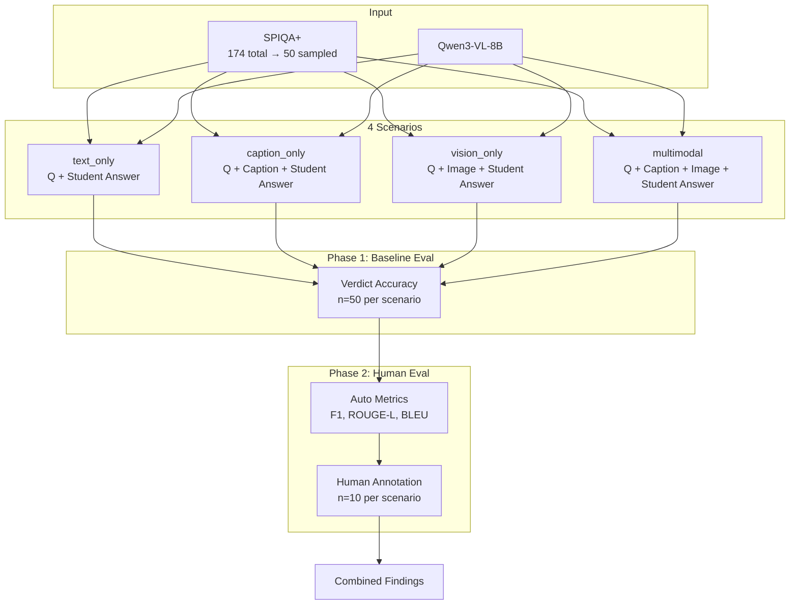

# Study Coach: Pipeline Diagrams

## Mermaid Diagrams

Render these at https://mermaid.live or in any Markdown viewer that supports Mermaid.

### Dataset Construction Pipeline

```mermaid
flowchart LR
    subgraph Phase1["Phase 1: Prepare"]
        A[SPIQA Test-A<br/>666 QA pairs] --> B[Filter figure-grounded QAs]
        B --> C[Annotate figure types<br/>Plot/Table/Schematic]
    end

    subgraph Phase2["Phase 2: Generate"]
        C --> D[Hand-curate ICL seed<br/>18 exemplars]
        D --> E[ICL synthetic generation<br/>GPT-4.1]
        E --> F[Generate student answers<br/>Correct/Partial/Incorrect]
    end

    subgraph Phase3["Phase 3: Validate SPIQA+"]
        F --> H[Human spot-check<br/>~50-100 samples]
        H --> I[Analyze error distribution]
        I --> J[Quality gate<br/>≥90% agreement]
    end

    J --> K[SPIQA+<br/>174 validated examples]
```



### Evaluation Pipeline



---

## SPIQA+ 4-Tuple Structure

Each example in the augmented dataset:

```
┌─────────────────────────────────────────────────────────┐
│                    SPIQA+ 4-TUPLE                       │
├─────────────────────────────────────────────────────────┤
│  1. Context     │  Figure image + caption               │
│  2. Question    │  Figure-grounded question from SPIQA  │
│  3. Student     │  Synthetic answer (correct/partial/   │
│     Answer      │  incorrect)                           │
│  4. Ground      │  Verdict + Error Category + Feedback  │
│     Truth       │                                       │
└─────────────────────────────────────────────────────────┘
```

---

## ICL Exemplars Breakdown (18 total)

The 18 hand-curated exemplars in `src/icl.py` cover all combinations:

| Figure Type | Verdict | Error Types | Count |
|-------------|---------|-------------|-------|
| Plot | Incorrect | Factual, Omission, Conceptual | 3 |
| Plot | Partially Correct | Factual, Omission, Conceptual | 3 |
| Table | Incorrect | Factual, Omission, Conceptual | 3 |
| Table | Partially Correct | Factual, Omission, Conceptual | 3 |
| Figure/Schematic | Incorrect | Factual, Omission, Conceptual | 3 |
| Figure/Schematic | Partially Correct | Factual, Omission, Conceptual | 3 |
| | | **Total** | **18** |

**Formula:** 3 figure types × 2 verdicts × 3 error types = 18 exemplars

Each exemplar includes:
- User prompt (caption + question + student answer)
- Assistant response (verdict + error category + feedback)
- Image path (for multimodal ICL)

---

## Dataset Quality: Error Distribution

**Problem:** Initial generation defaulted to factual errors (63%), missing realistic student mistakes.

**Solution:** Refined ICL exemplars to balance error types.

| Error Type | Before | After | Change |
|------------|--------|-------|--------|
| Factual    | 63%    | 48%   | ↓ 15pp |
| Conceptual | 19%    | 38%   | ↑ 19pp |
| Omission   | 19%    | 14%   | ↓ 5pp  |

**Result:** More diverse, realistic student mistakes — conceptual errors nearly doubled.

**Why error types matter for visual grounding:**

| Error Type | Example | Visual Grounding Needed |
|------------|---------|------------------------|
| **Factual** | Student says "BERT achieves 89%" but figure shows 84.6% | **High** — must see figure to verify the number |
| **Conceptual** | Student says "loss decreases throughout" but figure shows it plateaus | **Medium** — must see pattern being misinterpreted |
| **Omission** | Student mentions only one result but figure shows four | **Low** — can sometimes detect incompleteness from text alone |

**Impact:** With only 48% factual errors, multimodal has fewer chances to demonstrate classification advantage. The 8pp gap (text-only 56% vs multimodal 48%) might shrink if tested on factual errors only.

*Note: 174 total examples → 50 stratified samples used for evaluation.*

---

## Key Finding Visualization

```
                    VERDICT ACCURACY              FEEDBACK QUALITY
                    (Classification)              (Explanation)

    text_only       ████████████████ 56%         ████████ 40%        (Soft: 90%)
    vision_only     ██████████████ 50%           ████████████ 60%    (Soft: 80%)
    caption_only    █████████████ 48%            ██████████ 50%      (Soft: 90%)
    multimodal      █████████████ 48%            ████████████████ 80% (Soft: 100%)

                         WINNER: text_only            WINNER: multimodal

    ─────────────────────────────────────────────────────────────────────

    Soft Match = Match + Partial (feedback at least partially useful)

    INSIGHT: The model classifies better WITHOUT images
             but explains better WITH them.
```

---

## Note: Why No-Answer Condition?

We focused on scenarios where the **reference answer was withheld** from the model. Including reference answers reduced variation across modalities and lowered alignment with human judgment — the task shifted from reasoning-based evaluation to textual similarity matching. The no-answer condition better reflects a realistic coaching scenario where the model must reason from the figure itself.
