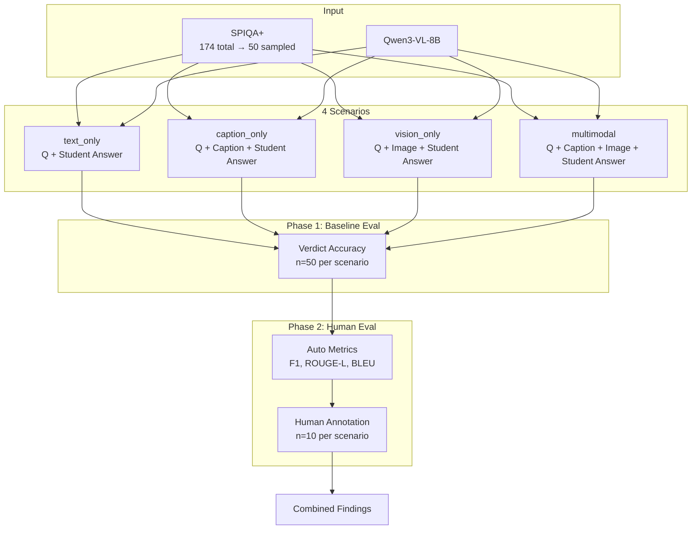

# Study Coach: Presentation Outline

## Rubric Mapping

| Criteria | Points | Slide |
|----------|--------|-------|
| Problem Definition | 1 | Slide 1 |
| 1-2 Hypotheses | 2 | Slide 2 |
| Surprising Finding | 2 | Slide 6 |
| Description of a baseline | 1 | Slide 4 |
| Where the baseline might fail | 1 | Slide 7 |
| A pressing question | 1 | Slide 8 |
| Overall clarity | 2 | All slides |

---

## Slide 1: Problem Definition (1 pt)

**Title:** Can AI Coach Students on Scientific Figure Interpretation?

**Task:** **Incongruence detection** between student (textual) explanations and visual content in scientific figures.

**Three capabilities needed:**

| # | Capability | Example |
|---|------------|---------|
| 1 | **Detect mismatch** — verdict: Correct / Partially Correct / Incorrect | "Is this explanation right?" |
| 2 | **Categorize error type** — Factual / Conceptual / Omission | "What kind of mistake?" |
| 3 | **Provide coaching feedback** — localize the mismatch and explain | "Here's what you missed..." |

**Why fundamentally multimodal?** (Not VQA or captioning — we evaluate *someone else's* text-image alignment)

| Reason | Example |
|--------|---------|
| **Visual grounding essential** | To evaluate "BERT achieves 89%" as incorrect, model must read actual bar height (84.6%) from figure |
| **Language understanding essential** | Must parse claims like "outperforms" or "plateaus" to know what visual evidence to seek |
| **Cross-modal reasoning required** | Wrong conclusion errors (e.g., "loss decreases throughout" when it plateaus) require mapping textual interpretations onto visual patterns |

---

## Slide 2: Hypotheses (2 pts)

**Tested with 8B Baseline:**

**H1 (Multimodal Advantage):** Multimodal models can classify above random baseline, and visual input specifically improves performance over text-only.

**H2 (Metric Alignment):** Verdict accuracy and feedback quality will be correlated — models that classify correctly will also explain well.

---

**To Evaluate with Competitive Baseline (72B+):**

| # | Hypothesis | Next Step |
|---|------------|-----------|
| H3 | Factual errors (visually-obvious) will be detected more reliably than conceptual errors, and paper context will help more with the latter | Filter to Factual errors; Add C5 context condition (optional) |
| H4 | Detection accuracy varies by figure type: tables easiest (structured), diagrams hardest (spatial reasoning) | Analyze by figure type |

---

## Slide 3: Methodology

### Dataset Construction Pipeline

```mermaid
flowchart LR
    subgraph Phase1["Phase 1: Prepare"]
        A[SPIQA Test-A<br/>666 QA pairs] --> B[Filter figure-grounded QAs]
        B --> C[Annotate figure types<br/>Plot/Table/Schematic]
    end

    subgraph Phase2["Phase 2: Generate"]
        C --> D[Hand-curate ICL seed<br/>18 exemplars]
        D --> E[ICL synthetic generation<br/>GPT-5.1]
        E --> F[Generate student answers<br/>Correct/Partial/Incorrect]
    end

    subgraph Phase3["Phase 3: Validate SPIQA+"]
        F --> H[Human spot-check<br/>~50-100 samples]
        H --> I[Analyze error distribution]
        I --> J[Quality gate<br/>≥90% agreement]
    end

    J --> K[SPIQA+<br/>174 validated examples]
```



### Evaluation Pipeline



---

## Slide 4: Baseline Description (1 pt)

| Parameter | Value |
|-----------|-------|
| Model | Qwen3-VL-8B-Instruct (Together.ai) |
| Dataset | SPIQA+ (174 augmented QA pairs from Test-A) |
| Eval sample | 50 examples (stratified by verdict × error type) |
| Condition | No-answer (reference answer withheld — realistic coaching scenario) |

**Why No-Answer?** Including reference answers reduced modality differences and lowered alignment with human judgment — the task shifted from reasoning to textual similarity. No-answer better reflects realistic coaching.

**4 Scenarios Tested:**

| Scenario | Caption | Image |
|----------|:-------:|:-----:|
| text_only | - | - |
| caption_only | Yes | - |
| vision_only | - | Yes |
| multimodal | Yes | Yes |

---

## Slide 5: Baseline Results Summary

**Phase 1: Baseline Verdict Accuracy (Automated)**

| Scenario | Accuracy |
|----------|----------|
| text_only | **56%** |
| vision_only | 50% |
| caption_only | 48% |
| multimodal | 48% |

**Phase 2: Feedback Quality (Human Evaluation, n=10)**

| Scenario | Human Match % | Soft Match % |
|----------|---------------|--------------|
| multimodal | **80%** | 100% |
| vision_only | 60% | 80% |
| caption_only | 50% | 90% |
| text_only | 40% | 90% |

*Soft Match = Match + Partial (feedback at least partially useful)*

---

## Slide 6: Surprising Finding (2 pts)

**Both hypotheses were WRONG.**

| Metric | Winner | Loser |
|--------|--------|-------|
| Verdict Accuracy | text_only (56%) | multimodal (48%) |
| Feedback Quality | multimodal (80%) | text_only (40%) |

**The Surprise:** Adding images HURTS classification but HELPS explanation.

> "The model classifies better without images but explains better with them."

**Why text-only "wins" (but for the wrong reasons):**
- Text-only has no figure, no caption — just question + student answer
- Model does **plausibility checking** based on pre-trained knowledge, not **verification against the figure**
- It can't confirm "BERT achieves 84.6%" — it just judges if the claim *sounds* reasonable
- Multimodal classifies worse but explains better because it *actually uses* the figure

**Bonus surprise:** Auto metrics (F1, ROUGE-L, BLEU) showed ~0.30 across ALL scenarios — they completely missed the 2x difference in feedback quality that human evaluation revealed.

---

## Slide 7: Where Baseline Might Fail (1 pt)

| Failure Mode | Evidence |
|--------------|----------|
| **Model scale too small** | 8B parameters can't reliably ground visual details for classification |
| **Partially Correct is hard** | Model collapses "Partially Correct" into "Incorrect" |
| **Vision adds noise** | Visual input distracts the classifier even while helping the explainer |
| **Sample size limits** | n=50 (baseline) means <5pp differences are noise; n=10 (human eval) means each example = 10pp shift |
| **Dataset composition** | Only 48% factual errors — fewer cases where vision is essential (see below) |

**Error types and visual grounding:**

| Error Type | Example | Visual Grounding |
|------------|---------|------------------|
| Factual (48%) | "BERT achieves 89%" but figure shows 84.6% | **High** — must see figure |
| Conceptual (38%) | "loss decreases throughout" but it plateaus | **Medium** — must see pattern |
| Omission (14%) | Mentions one result, figure shows four | **Low** — detectable from text |

**Implication:** The 8pp gap favoring text-only might shrink if we tested on factual errors only.

---

## Slide 8: A Pressing Question (1 pt)

> **At what model scale does visual input start helping classification — not just explanation?**

| Priority | Next Experiment |
|----------|-----------------|
| High | Test 72B+ model (Qwen2.5-VL-72B or GPT-4o) |
| High | Filter to factual errors (where visual grounding matters most) |
| Medium | Chain-of-thought: Force model to describe figure before judging |
| Medium | Larger eval sample (200+) to detect smaller differences reliably |

**The bet:** A stronger model will show visual input helps BOTH metrics.

---

## Slide 9: Summary (Clarity)

```
1. Problem: Can AI evaluate + coach students on scientific figures?

2. Hypotheses: Visual input helps. Verdict accuracy = feedback quality.

3. Baseline: Qwen3-VL-8B, 4 scenarios, 50 examples

4. Surprising finding:
   - Text-only classifies best (56%)
   - Multimodal explains best (80%)
   - Verdict accuracy ≠ feedback quality

5. Baseline fails: 8B scale too weak for visual classification

6. Pressing question: Does scaling fix this?
```

---

## Source Materials

- `results/combined_findings.md` — Full evaluation results
- `reports/report1/StudyCoach_Report1.pdf` — Dataset proposal and analysis
